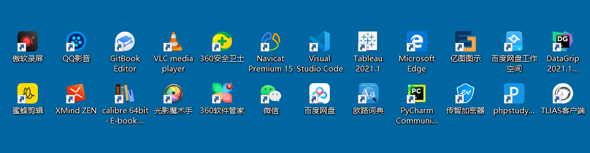

---
tags:
  - Linux
  - 基础知识
date: 2026-05-01
updated: 2026-08-02
---

# 01. 计算机与 Linux 简介

#### 1.计算机初识

* 概述

  * 全称叫电子计算机, 俗称叫: 电脑, Computer, PC, 就是由**硬件**和**软件**组成的设备.

* 组成

  * 硬件

    > 看得见, 摸得着.

    * CPU(运算器 + 控制器)
    * 存储器
      * 内存: 内存条，例如 DDR4、DDR5
      * 外存: SSD（固态硬盘）、SSHD（混合硬盘）、HDD（机械硬盘）
    * 输入设备
      * 键鼠组合
    * 输出设备
      * 音响
      * 显示器
      * 打印机
      * ....

  * 软件

    > 看不见, 摸不着, 但是可以直接使用的.

    * 系统软件
      * 桌面端: Windows、Linux、macOS
      * 移动端: Android、iOS、HarmonyOS
    * 用户软件

* 记忆(理解)

  * **操作系统是用户和计算机硬件之间的桥梁, 用户通过操作 操作系统, 控制硬件干活.**
  * 没有操作系统的电脑称之为: 裸机.

#### 2.Linux系统简介

* 概述
  * Linux 是服务器、云计算、容器和嵌入式系统的重要操作系统家族，适合长期稳定运行，但可靠性仍取决于硬件、配置、监控和运维流程.
* Linux之父
  * 林纳斯·托瓦兹
* 吉祥物
  * 企鹅
* Linux的发行版:
  * Linux的发行版 = Linux内核 + 系统库 + 系统软件.
  * Linux的内核下载地址: https://mirrors.edge.kernel.org/pub/linux/kernel/
  * 常用的发行版:
    * Red Hat Enterprise Linux（RHEL）：Red Hat 的商业企业发行版.
    * CentOS Stream：位于 Fedora 与下一版 RHEL 之间的持续交付发行版.
    * Ubuntu：常见的桌面与服务器发行版，LTS 版本提供较长维护周期.
    * Rocky Linux、AlmaLinux：常见的 RHEL 兼容社区发行版.
    * openEuler、麒麟软件等：国内常见 Linux 发行版或生态.
  * 原课程环境使用 CentOS Linux 7。该版本已于 2024-06-30 结束生命周期，只适合复现旧课程；联网和生产环境应选择仍受支持的发行版.

## 源课件补充图解

下面的图片来自配套课件，用来补充硬件、操作系统和 Linux 发行版的直观认识。发行版截图反映的是课程制作时的生态，具体版本支持状态仍以正文说明为准。

### 计算机与操作系统

### Linux 起源与发行版

---
相关笔记：
- [下一步：02.环境搭建](02.环境搭建.md)
- [返回 Linux 总索引](关于Linux.md)
