---
tags:
  - Linux
  - 基础知识
date: 2026-05-01
updated: 2026-08-02
---

# 02. 环境搭建

#### 3.虚拟机和宿主机关系图

* 虚拟机介绍

  * 通过软件, 模拟计算机硬件, 并给其安装真实的操作系统, 称之为: 虚拟机.

* 虚拟化软件介绍:

  * Vmware WorkStation
  * Virtual BoX
  * ....

* 关系图如下:

  

#### 4.Vmware软件安装

* 下载

  * 官网: https://www.vmware.com/

* 安装

  1. 安装路径要合法, 不要出现中文, 空格, 特殊符号等.
  2. 最好不要直接安装到盘符目录下, 否则以后盘符下的内容会越来越多.

* 检查是否安装成功, 即: 查看本机是否有 VMNet1 和 VMNet8两个网卡即可, 具体如下:

  

  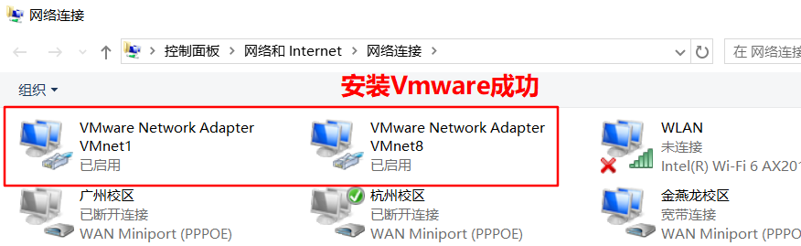

* 如果没有上述的两个网卡信息, 解决方案如下:

  1. 卸载重装Vmware软件.

  2. 可以在Vmware软件中, 重置网卡信息.

     

#### 5.VMware安装虚拟机(了解)

* 详见安装文档.

#### 6.VMware挂载虚拟机(掌握)

* **方式1:** 双击 *.vmx 挂载即可.

  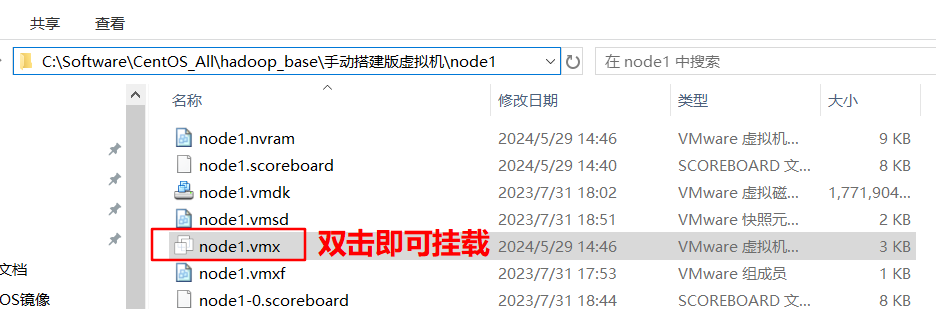

* **方式2:** 在VMware软件中直接打开.

  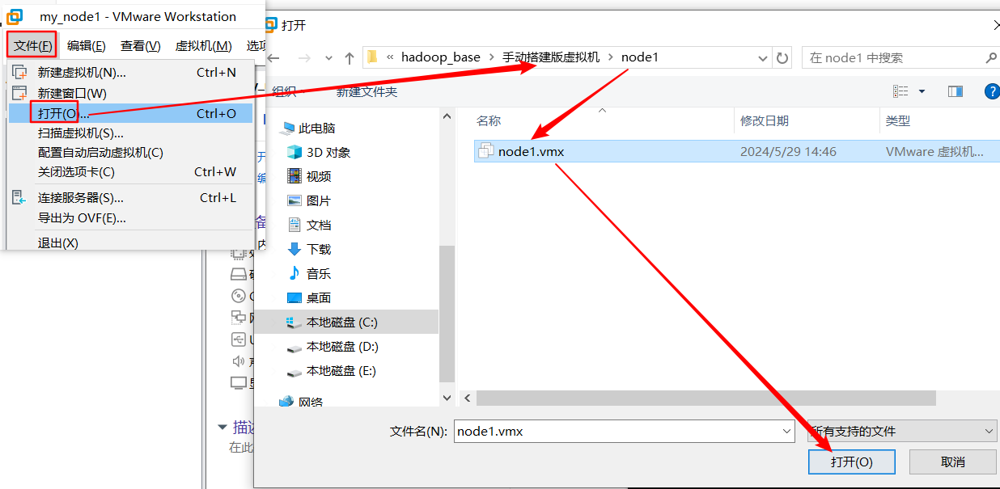

  > 细节: 首次运行, 弹框选择"**我已移动...**"

#### 7. FinalShell连接Linux虚拟机

* 安装FinalShell

  * 略, 详见安装文档.

* FinalShell连接Linux虚拟机的流图:

  

* 具体修改如下:

  * 修改VMware的信息

    

  * 修改本机VMNet8网卡信息

    

  * 修改FinalShell的连接信息.

    

    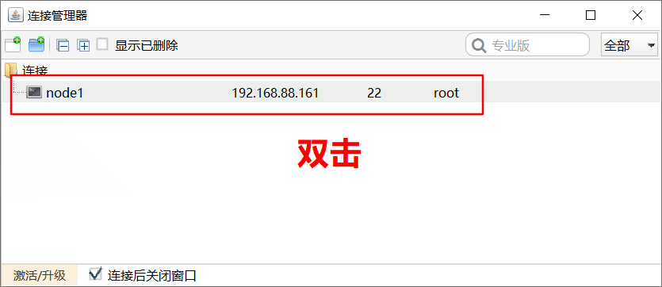

    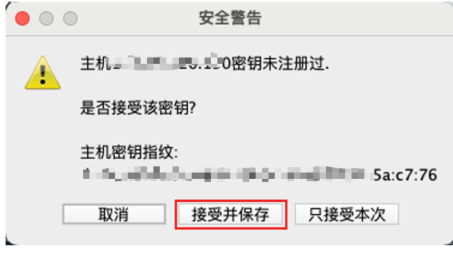

* 验证连接成功:

  

#### 8.Linux虚拟机-快照管理

* **拍摄快照, 目的:**

  * 提高容错率.

* 操作步骤:

  

## 源课件环境搭建图解

> 以下截图来自课程使用的 Windows、VMware 16 和 CentOS 7 环境。界面、版本与当前软件可能不同，但“准备虚拟机 → 配置 NAT → 获取地址 → 测试连通 → 建立 SSH 会话”的排查顺序仍然适用。

### 虚拟机软件与课程环境

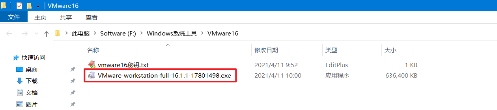

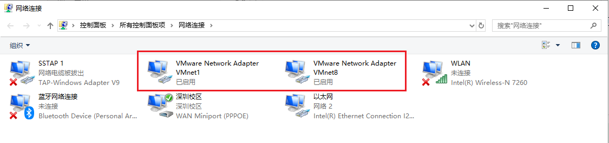

### 导入并启动课程虚拟机

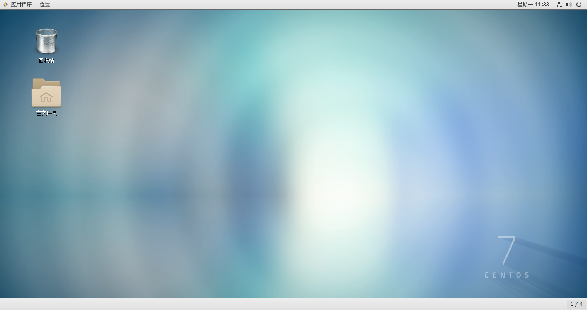

### NAT 网络与地址检查

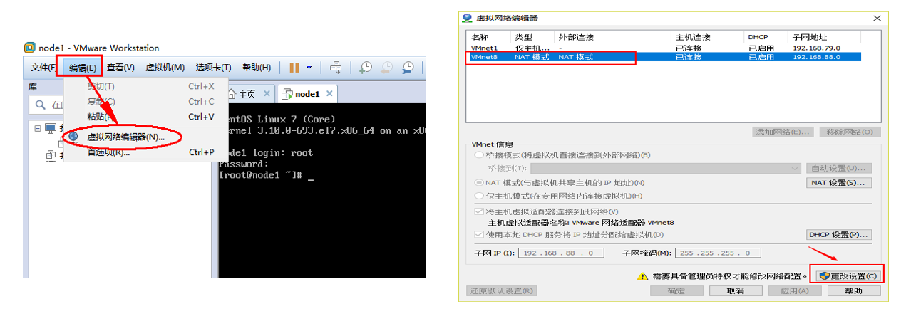

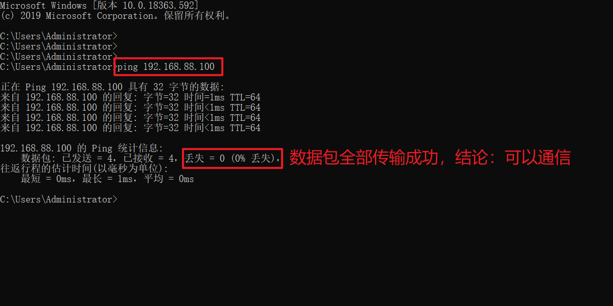

### SSH 客户端示例

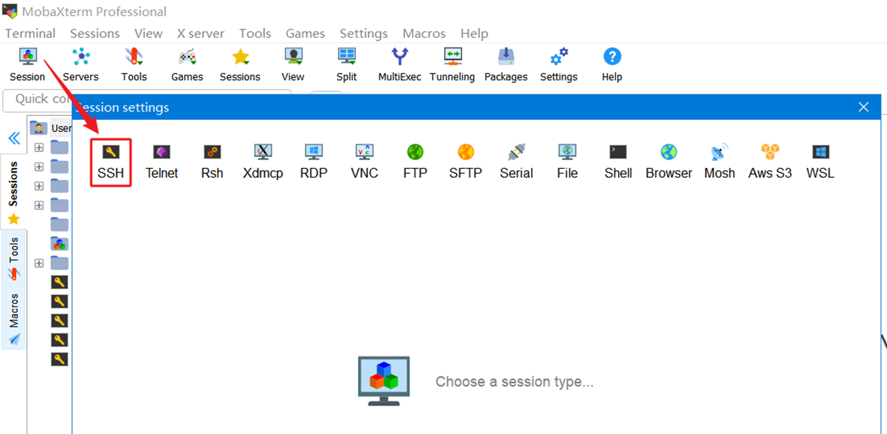

---
- [上一步：01.计算机与Linux简介](01.计算机与Linux简介.md)
- [下一步：03.Linux目录结构](03.Linux目录结构.md)
- [返回 Linux 总索引](关于Linux.md)
