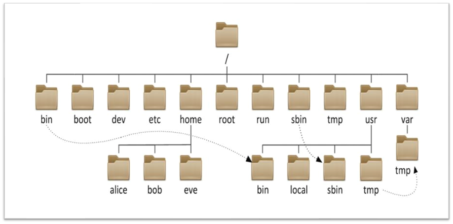

---
tags:
  - Linux
  - 基础知识
date: 2026-05-01
updated: 2026-08-02
---

# 03. Linux 目录结构

#### 9.Linux的目录结构介绍

## 源课件目录树

> Linux 只有一棵从 `/` 开始的目录树；图中的虚线用于示意常见关联，不代表符号链接的固定配置。

---
- [上一步：02.环境搭建](02.环境搭建.md)
- [下一步：04.基础命令](04.基础命令.md)
- [返回 Linux 总索引](关于Linux.md)
