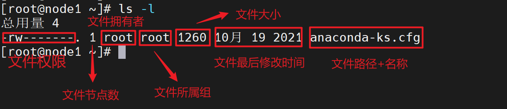
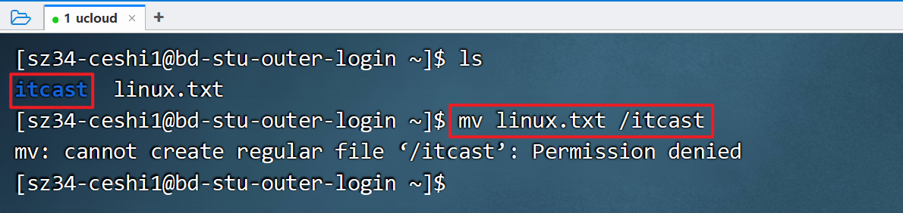

---
tags:
  - Linux
  - 基础知识
date: 2026-05-01
updated: 2026-08-02
---

# 04. 基础命令

#### 10.Linux-基础命令

* Linux命令的格式

  ```sh
  # Linux命令格式, 如下的中括号表示: 可选. 
  command [-options] [parameter]		# 命令名 [-选项] [参数]
  ```


* ls命令

  ```shell
  # 来源于 list 单词, 列表的意思, 即: 查看某个路径下所有的子级(不包括子级的子级)
  # 选项介绍: all(所有),  line(行),  human(人性化)
  
  ls			# 查看当前目录的子级(不包括隐藏的), 等价于: ls ./
  ls -a		# 查看当前目录的子级(包括隐藏的)
  ls -al		# 以行的方式, 查看当前目录的子级(包括隐藏的), 无意义, 因为要结合-h一起使用.
  ls -alh		# 以行, 人性化的方式, 查看当前目录的子级(包括隐藏的)
  
  ls /		# 查看根目录下的所有子级(不包括隐藏)
  ls -l /		# 以行的方式, 查看根目录下的所有子级(不包括隐藏)
  ll /		# 许多发行版将 ll 配成 ls -l 的别名；并非所有环境都默认提供
  ```

* cd命令

  ```sh
  # 来源于 change directory, 改变目录.
  cd			# 回家, 即: root账号的家目录是 /root, 其它账号的家目录是: /home
  cd /etc		# 切换到etc目录.
  
  # 几个特殊的路径.
  # 绝对路径: 以 / 开头的, 固定的, 写死的路径, 例如:  /root/aa/bb/cc
  # 相对路径: 即以当前路径来讲的, 不以/开头, 例如:  1.txt 
  ..			# 代表上1级路径.
  ../			# 效果同上.
  
  ../..		# 代表: 上上级路径.
  ./			# 代表: 当前路径.
  ~			# 代表: 家目录, 即:  cd ~  等价于 cd 命令
  -			# 代表: 在最近操作过的两个路径之间做切换. 
  ```

* pwd命令

  ```sh
  #来源于 print work directory, 打印工作目录
  pwd			# 当前在哪个目录, 就打印什么路径.
  ```

* mkdir命令

  ```sh
  # 来源于 Make Directory, 创建文件夹.
  # 格式: mkdir [-p] 目录路径		-p表示创建多级目录.
  
  # 创建 单级 目录
  mkdir ./aa			# 在当前目录下创建 aa文件夹.
  mkdir ./1.txt		# 在当前目录下创建 1.txt文件夹.
  
  mkdir aa/bb/cc		# 创建多级目录, 如果aa/bb目录不存在, 则: 报错.
  
  
  # 创建 多级 目录.
  mkdir -p aa/bb/cc	# -p表示多级目录.
  ```

* 文件相关的命令

  ```sh
  # touch, 创建文件.
  # 例如
  touch 1.txt 2.mp3 abc.jpg		# 同时创建多个文件.
  
  # cat, 来源于 catch(捕获), 查看文件中所有的内容, 如果内容较多, 则: 只显示最后1页.
  cat 文件路径
  
  # more, 可以分页查看数据. 
  more 文件路径		# d(down), 往下翻页.  b(back): 往上翻页, q(quit): 退出
  
  # cp, 来源于: copy, 拷贝文件 或者 文件夹的.
  cp 1.txt /aa			# 拷贝1.txt 到 /aa目录下.
  cp 1.txt /aa/2.txt		# 拷贝1.txt 到 /aa目录下, 并改名为 2.txt
  
  cp -r aa test			# 拷贝 aa文件夹到 test文件夹下, -r递归拷贝.
  
  # mv, 来源于: move, 剪切, 也可以改名.
  mv 1.txt 2.txt			# 改名
  
  # rm, 来源于: remove, 删除的意思, 一般结合两个参数: -r(recursive: 递归),  -f(force: 强制)
  rm -rf 1.txt		# 删除(当前目录下的)1.txt文件
  rm -rf *.txt		# 删除(当前目录下的)所有的.txt文件
  
  rm -rf aa			# 删除aa文件夹.
  
  # 高风险提醒：不要对 /、/*、未展开或未核对的变量使用 rm -rf。
  # rm 是直接删除文件，不是“格式化”；错误目标可能造成系统或数据不可恢复。
  
  ```

* 查找命令相关

  ```sh
  # which命令, 查看命令所在的路径.
  which ls	# /usr/bin/
  which cd	# /usr/bin
  
  which ip        # 定位现代网络管理命令 ip
  
  # find命令, 查找 符合条件的文件的.
  # 格式: find 路径 -name '文件名'		# 根据文件名进行查找
  find / -name 'abc*'		# 去 根目录下查找, 所有以abc开头的文件
  
  # 格式: find 路径 -size +|-数字单位	   # 根据文件大小进行查找.
  find / -size +100M		# 去 根目录下查找, 文件大小 在100MB以上的文件. 
  
  ```

* echo命令 和 重定向命令

  ```sh
  # echo命令, 类似于Python的print(), 就是打印内容到 控制台.
  echo 'hello world'
  
  # 重定向, > 是覆盖,  >> 是追加.
  echo 'hello' > 1.txt		# 把 hello 字符串, 覆盖写入到 1.txt文件中. 
  
  echo 'hello' >> 1.txt		# 把 hello 字符串, 追加写入到 1.txt文件中. 
  ```

## 源课件命令图解





> `rm -r`、`rm -f` 及其组合会造成不可恢复的删除。执行前先用 `pwd`、`ls` 和明确的目标路径核对范围，不要把课件截图中的示例直接用于重要目录。



---
- [上一步：03.Linux目录结构](03.Linux目录结构.md)
- [下一步：05.管道过滤与统计](05.管道过滤与统计.md)
- [返回 Linux 总索引](关于Linux.md)
