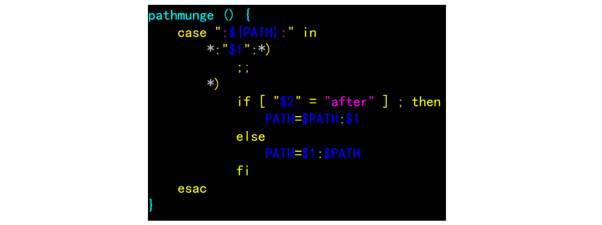
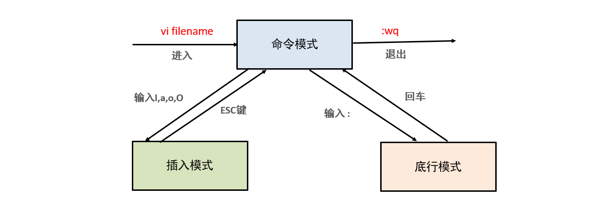

---
tags:
  - Linux
  - 基础知识
date: 2026-05-01
updated: 2026-08-02
---

# 06. vi 编辑器

#### 3.vi命令详解

* vi解释
  * 全称叫: Visual Interface, 类似于windows的记事本, 就是用来编辑文本内容的.
  * vim是vi的升级版, 针对于文件内容(关键字), 会高亮显示.
  * 它们(vim, vi)用法都一样, 推荐使用: vim

* 入门操作**(重点)**

  

  ```sh
  # 1. 进入到 命令模式.
  vim 1.txt
  
  # 2. 进入到输入模式, 按字母 i 
  
  # 3. 正常的编辑内容.
  
  # 4. 按 esc 退出输入模式, 进入到 命令模式.
  
  # 5. 输入冒号, 进入到 底线模式.
  # 6. 输入wq, 保存退出即可.		write quit
  
  
  # 扩展: 如何修改虚拟机的IP地址.
  vim /etc/sysconfig/network-scripts/ifcfg-ens33	  # 进入修改即可.
  
  # 改完之后, 记得保存, 然后重启网卡即可.
  systemctl restart network
  ```

* 进阶操作-图解

  


#### 4.扩展_查看命令手册

* 关于我们学习的命令, 不需要每个都去背诵和记忆, 只要做好记录, 用到的时候能快速查到即可.

* 涉及到的某个命令,  如果不会了, 可以参考下手册, 命令如下:

  ```sh
  # 查看帮助文档.
  # 格式: 命令名 --help
  # 例如
  ls --help
  
  # 查看帮助手册
  # 格式: man 命令名
  # 例如
  man ls
  ```


## 源课件 vi 图解






> 遇到 E325 时，先确认没有其他编辑会话仍在运行，再决定恢复内容、只读打开或删除陈旧的 `.swp` 文件；不要看到提示就直接删除。

---
- [上一步：05.管道过滤与统计](05.管道过滤与统计.md)
- [下一步：07.用户与权限管理](07.用户与权限管理.md)
- [返回 Linux 总索引](关于Linux.md)
