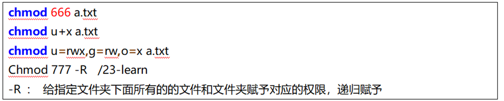

---
tags:
  - Linux
  - 基础知识
date: 2026-05-01
updated: 2026-08-02
---

# 07. 用户与权限管理

#### 5.用户和用户组相关(了解)

* 用户组相关命令

  ```sh
  # 查看所有的用户组
  getent group
  
  # 创建用户组
  groupadd 组名
  
  # 删除用户组
  groupdel 组名
  ```

* 用户相关命令

  ```sh
  # 查看所有用户.
  getent passwd
  
  # 创建用户, -g是指定用户所在的组. 不写则默认会创建1个和该用户名一模一样的组, 然后添加用户到该组中.
  useradd [-g] [用户组] 用户名
  
  # 设置密码
  passwd 用户名
  
  # 删除用户, -r: 删除用户的同时, /home目录下 该用户的目录也同步删除.
  userdel [-r] 用户名
  
  # 查看用户信息
  id 用户名
  
  # 改变用户所在的组.
  usermod -aG 组名 用户名		# append group: 追加组
  ```

* 切换用户, "临时"借调权限相关命令

  ```sh
  su 用户名		# 切换用户, 来源于: switch user, 
  			  # root -> 其它, 无需密码,  否则: 需要密码.
  			  
  sudo Linux命令	# 临时借调权限, Linux会检查 /etc/sudoerrs文件, 
  				 # 如果没有权限, 则会记录该行为到日志.  如果有权限, 则可以执行执行该命令.
  				 # 临时借调权限, 默认持续时间: 5分钟.
  ```


#### 6.权限管理

* 图解

  

* 代码实操

  ```sh
  # 修改(属主, 属组, 其它用户) 权限, 来源于: change model
  # 格式: chmod [-R] 权限 文件或者文件夹      -R: 递归, 只针对于文件夹有效. 
  
  # 例如, 了解, 实际开发不写这个. 
  chmod u=rwx,g=rx,o=x 1.txt		# 属主权限:rwx, 属组权限:r-x, 其它用户权限: --x
  chmod -x 1.txt					# 属主, 属组, 其它权限都去掉 x 权限
  chmod u+x,g-r,o=rw 1.txt		# 属主+x权限, 属组-r权限, 其它权限为: rw-
  
  
  # 为了更好的表示权限, 引入了 数字权限的概念, 我们发现权限无外乎四种, r, w, x, -
  # 分别用数字: 4 -> r,  2 -> w,  1 -> x,  0 -> - 表示
  # 它们能组合的情况如下:
  数字		对应的权限
  0			---
  1			--x
  2			-w-
  3			-wx
  4			r--
  5			r-x
  6			rw-
  7			rwx
  
  # 实际开发写法, 遇到权限问题, 犹豫不决, 直接 777 
  chmod 777 1.txt		# 俗称: 满权限.
  
  
  
  # 改变用户 和 用户组, 来源于: change owner
  # 格式:  chown [-R] [用户][:][用户组] 文件或者文件夹路径     -R: 递归, 只针对于文件夹有效. 
  chown zhangsan 1.txt	# 改变: 属主
  chown :itcast 1.txt		# 改变: 属组
  
  chown lisi:itheima 1.txt # 改变: 属主 和 属组
  chown -R zhangsan aa	# 改变: 属主, 包括子级
  
  ```


#### 7.Linux的常用快捷键

```sh
ctrl + c		# 强制结束(执行)
ctrl + L		# 清屏, 等价于: clear


ctrl + d		# 强制登出
ctrl + a		# 跳转到命令 行首
ctrl + e		# 跳转到命令 行尾
ctrl + ←		# 上一个单词
ctrl + →		# 后一个单词
history			# 查看历史命令
!命令名		  # 倒序匹配第一个能匹配上的命令, 并执行.
ctrl + r		# 搜索命令, 并执行.
```


## 源课件权限图解




> 递归修改权限前应先缩小目录范围并确认目标。通常不要用 `chmod -R 777` 代替正确的属主、属组和最小权限设计。

---
- [上一步：06.vi编辑器](06.vi编辑器.md)
- [下一步：08.软件安装与系统服务](08.软件安装与系统服务.md)
- [返回 Linux 总索引](关于Linux.md)
