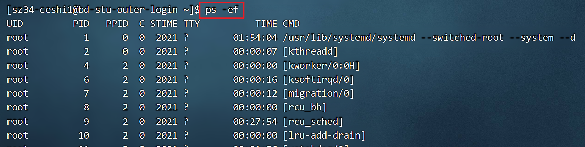

---
tags:
  - Linux
  - 基础知识
date: 2026-05-01
updated: 2026-08-02
---

# 10. 网络与进程管理

## 网络相关命令

```bash
ip address                            # 查看网卡与 IP（现代 Linux）
ip route                              # 查看路由表
ping [-c 次数] 地址                    # 测试网络连通性
wget URL地址                           # 下载资源
curl -I URL地址                        # 查看 HTTP 响应头
ss -lntup                             # 查看监听中的 TCP/UDP 端口和进程
ss -lntp 'sport = :3306'              # 查看本机 3306 监听端口
```

> **端口号**：与 IP 地址和传输层协议共同定位网络端点，范围 0～65535。端口 0 常用于请求系统自动分配；1～1023 是知名端口，在类 Unix 系统监听它们通常需要额外权限。

## 进程管理

```bash
ps -ef                        # 查看所有进程
pgrep -a mysql                # 按名称查找进程并显示命令行
kill PID                      # 先发送 SIGTERM，请进程正常退出
kill -KILL PID                # 仅在进程无法正常退出时强制终止
```

> `SIGKILL` 不能被进程捕获或执行清理，可能造成未写完的数据、锁或临时状态残留，不应作为默认停止方式。由 systemd 管理的服务优先使用 `systemctl stop 服务名`。

## 源课件进程图解



---

相关笔记：
- [上一步：09.软硬链接](09.软硬链接.md)
- [下一步：11.压缩与解压缩](11.压缩与解压缩.md)
- [返回 Linux 总索引](关于Linux.md)
