---
tags:
  - MOC
  - Linux
  - 基础知识
date: 2026-05-01
updated: 2026-07-31
---

# 关于 Linux

> 本文是原始完整笔记，已拆分为 11 篇子笔记方便查阅。点击下方链接跳转。

## 📑 子笔记导航

| # | 笔记 | 内容 |
|---|------|------|
| 01 | [01.计算机与Linux简介](01.计算机与Linux简介.md) | 计算机组成、Linux 发行版 |
| 02 | [02.环境搭建](02.环境搭建.md) | 虚拟机、VMware、FinalShell、快照 |
| 03 | [03.Linux目录结构](03.Linux目录结构.md) | Linux 目录结构图解 |
| 04 | [04.基础命令](04.基础命令.md) | ls/cd/pwd/mkdir/touch/cat/cp/mv/rm/which/find/echo/重定向 |
| 05 | [05.管道过滤与统计](05.管道过滤与统计.md) | grep/wc/管道符/tail |
| 06 | [06.vi编辑器](06.vi编辑器.md) | vi 三种模式、快捷操作 |
| 07 | [07.用户与权限管理](07.用户与权限管理.md) | 用户/用户组管理、chmod/chown、快捷键 |
| 08 | [08.软件安装与系统服务](08.软件安装与系统服务.md) | DNF/YUM、systemctl |
| 09 | [09.软硬链接](09.软硬链接.md) | 软链接 vs 硬链接 |
| 10 | [10.网络与进程管理](10.网络与进程管理.md) | ip/ping/ss/ps/kill |
| 11 | [11.压缩与解压缩](11.压缩与解压缩.md) | tar 压缩与解压 |

---

> 以下为原始完整笔记，保留作为参考。

# Linux 基础命令总结

> 本文是对 Linux 基础课程两天笔记的系统总结，涵盖环境搭建、基础命令、用户权限、系统管理等方面。

---

## 1. 计算机与 Linux 简介

### 1.1 计算机组成

- **硬件**：CPU（运算器 + 控制器）、存储器（内存 / 外存）、输入设备、输出设备
- **软件**：系统软件（Windows、Linux、Mac）和用户软件
- **操作系统**是用户和计算机硬件之间的桥梁，没有操作系统的电脑称为**裸机**

### 1.2 Linux 简介

- 服务器端使用最多的操作系统，支持 **7×24 小时**高性能服务
- **Linux 之父**：林纳斯·托瓦兹，吉祥物：企鹅
- **发行版** = Linux 内核 + 系统库 + 系统软件
- 常用发行版：
  - **Red Hat Enterprise Linux（RHEL）**：面向企业、提供商业支持
  - **CentOS Stream**：位于 Fedora 与下一版 RHEL 之间的持续交付发行版
  - **Rocky Linux / AlmaLinux**：常见的 RHEL 兼容发行版
  - **Ubuntu**：Debian 系发行版，桌面与服务器场景均常见
  - **openEuler / 麒麟软件等**：国产 Linux 生态中的常见选择

> 课程旧截图若使用 CentOS Linux 7，只适合复现历史环境；该版本已于 2024-06-30 结束维护，不应直接部署到生产环境。

---

## 2. 环境搭建

### 2.1 虚拟机

- 通过软件模拟计算机硬件并安装真实操作系统
- 虚拟化软件：VMware WorkStation、VirtualBox 等

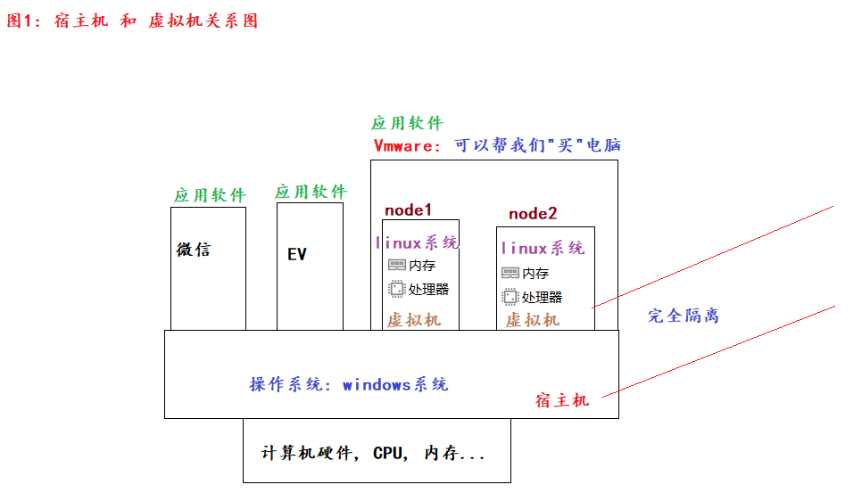

### 2.2 VMware 安装

- 安装后检查是否有 **VMNet1** 和 **VMNet8** 两个网卡

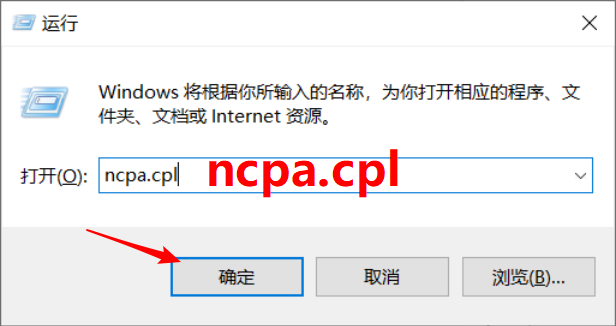

- 如缺少网卡，可在 VMware 中重置网卡信息

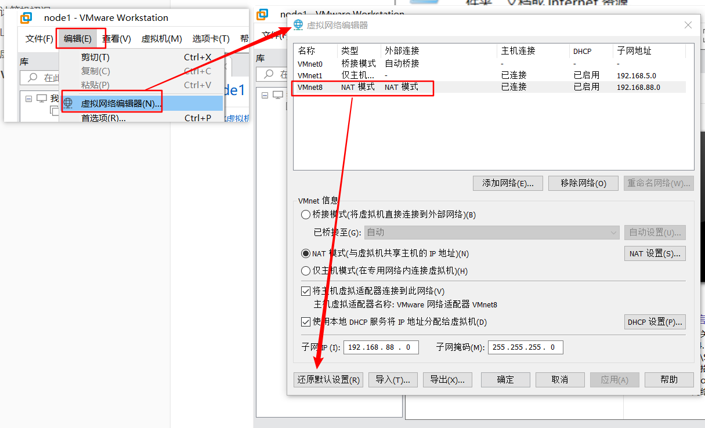

### 2.3 挂载虚拟机

- **方式 1**：双击 `.vmx` 文件直接挂载
- **方式 2**：在 VMware 中打开
- 首次运行选择"**我已移动**"

### 2.4 FinalShell 连接 Linux

连接流程：

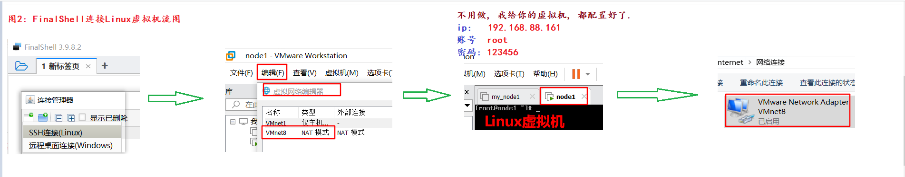

需修改三处配置：

1. **VMware 网络信息**

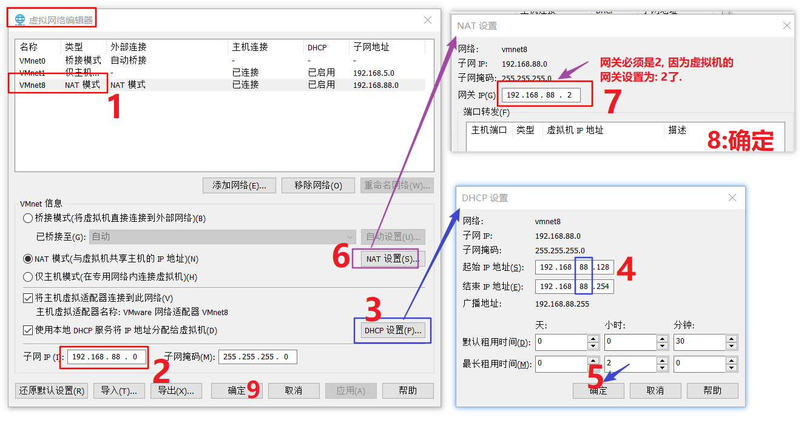

2. **本机 VMNet8 网卡信息**

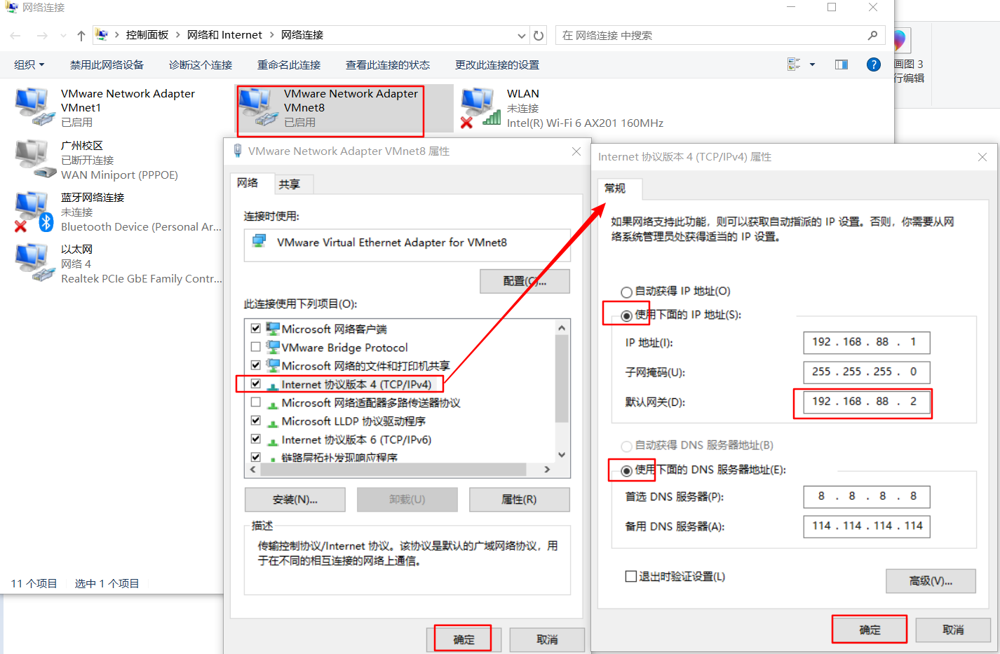

3. **FinalShell 连接信息**

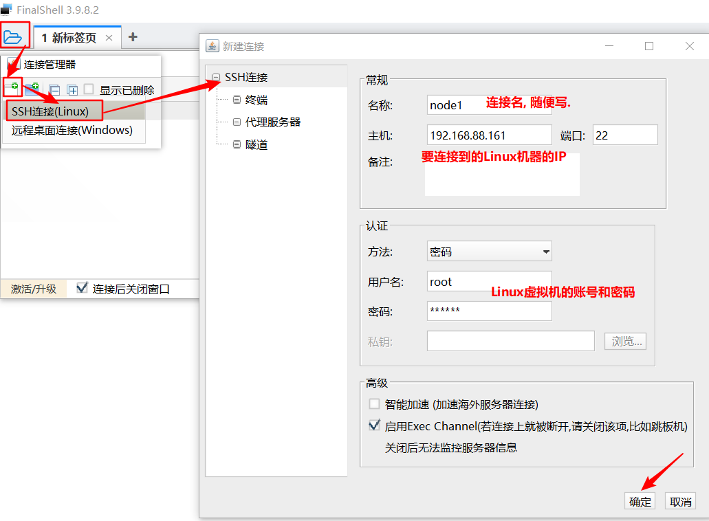

验证连接成功：

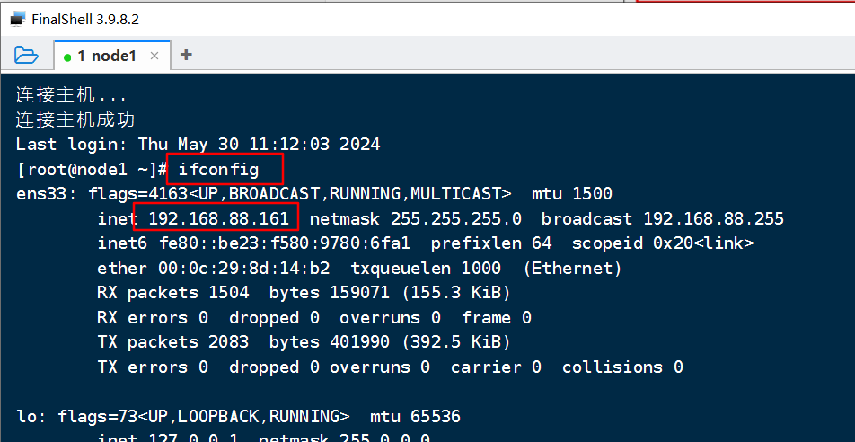

### 2.5 快照管理

- 拍摄快照可提高容错率

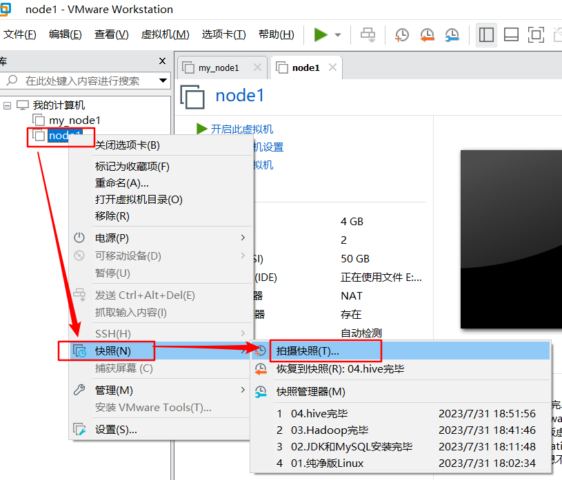

---

## 3. Linux 目录结构

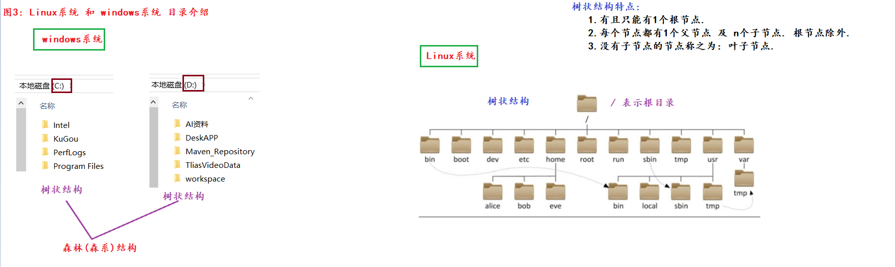

---

## 4. 基础命令

### 4.1 命令格式

```bash
command [-options] [parameter]   # 命令名 [-选项] [参数]
```

### 4.2 目录操作命令

| 命令 | 说明 | 示例 |
|------|------|------|
| `ls` | 列出目录内容 | `ls -alh`（含隐藏、行格式、人性化） |
| `ll` | 常见的 `ls -l` 别名（不保证默认存在） | `type ll` |
| `cd` | 切换目录 | `cd /etc`，`cd ~`（回家），`cd -`（来回切换） |
| `pwd` | 打印当前工作目录 | `pwd` |
| `mkdir` | 创建目录 | `mkdir -p aa/bb/cc`（多级目录） |

**路径概念**：

- **绝对路径**：以 `/` 开头，固定路径，如 `/root/aa/bb/cc`
- **相对路径**：基于当前路径，不以 `/` 开头

**特殊路径符号**：

| 符号 | 含义 |
|------|------|
| `.` | 当前目录 |
| `..` | 上一级目录 |
| `~` | 家目录 |
| `-` | 最近两个路径之间切换 |

### 4.3 文件操作命令

| 命令 | 说明 | 示例 |
|------|------|------|
| `touch` | 创建文件 | `touch 1.txt 2.mp3` |
| `cat` | 查看文件全部内容 | `cat 1.txt` |
| `more` | 分页查看 | `more 1.txt`（d 下翻，b 上翻，q 退出） |
| `cp` | 复制文件/目录 | `cp -r aa test`（递归复制目录） |
| `mv` | 移动/重命名 | `mv 1.txt 2.txt` |
| `rm` | 删除文件/目录 | `rm -rf aa`（递归 + 强制） |

> **警告**：不要对 `/`、`/*` 或未核对的变量使用 `rm -rf`。它不是“格式化”，但错误目标可能递归删除大量系统与用户数据。

### 4.4 查找命令

```bash
# which - 查看命令所在路径
which ls          # /usr/bin/

# find - 按名称查找
find / -name 'abc*'     # 根目录下查找以 abc 开头的文件

# find - 按大小查找
find / -size +100M      # 查找大于 100MB 的文件
```

### 4.5 输出与重定向

```bash
echo 'hello world'          # 输出到控制台
echo `pwd`                  # 反引号：执行命令并输出结果
echo 'hello' > 1.txt        # 覆盖写入
echo 'hello' >> 1.txt       # 追加写入
```

---

## 5. 管道、过滤与统计

```bash
# grep - 筛选内容（-n 显示行号）
grep -n 'keyword' 1.txt

# wc - 统计（-l 行数, -w 单词数, -c 字节数）
wc -lwc 1.txt

# 管道符 | - 将前一个命令的输出作为后一个命令的输入
cat 1.txt | grep 'world' | wc -w
```

### tail 命令

```bash
tail 3.txt           # 查看末尾 10 行（默认）
tail -5 3.txt        # 查看末尾 5 行
tail -100f log.txt   # 动态追踪末尾 100 行（常用于日志）
```

---

## 6. vi / vim 编辑器

### 6.1 三种模式

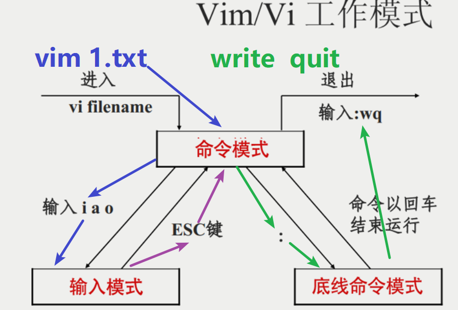

| 模式 | 作用 | 进入方式 |
|------|------|----------|
| **命令模式** | 默认模式，可复制、删除、粘贴 | 打开文件即进入 |
| **输入模式** | 编辑文本内容 | 按 `i` |
| **底线模式** | 保存、退出等操作 | 按 `:` |

### 6.2 基本操作流程

```bash
vim 1.txt    # 打开文件 -> 命令模式
# 按 i       -> 输入模式 -> 编辑内容
# 按 Esc     -> 回到命令模式
# 输入 :wq   -> 底线模式 -> 保存退出
```

### 6.3 常用快捷操作

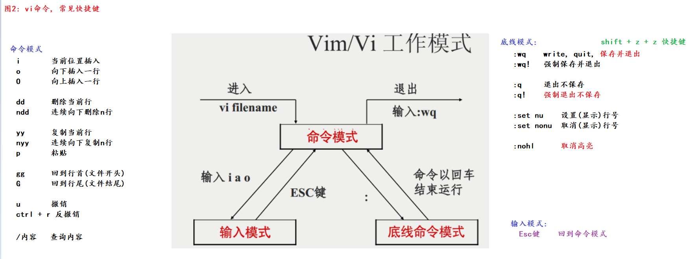

### 6.4 查看命令帮助

```bash
ls --help      # 查看帮助文档
man ls         # 查看帮助手册
```

---

## 7. 用户与用户组管理

### 7.1 用户组命令

```bash
getent group          # 查看所有用户组
groupadd 组名         # 创建用户组
groupdel 组名         # 删除用户组
```

### 7.2 用户命令

```bash
getent passwd                        # 查看所有用户
useradd [-g 组名] 用户名             # 创建用户
passwd 用户名                        # 设置密码
userdel [-r] 用户名                  # 删除用户（-r 同时删 home 目录）
id 用户名                            # 查看用户信息
usermod -aG 组名 用户名              # 追加用户到组
```

### 7.3 切换与权限借调

```bash
su 用户名          # 切换用户（root -> 其它无需密码）
sudo Linux命令     # 临时借调权限（默认 5 分钟）
```

---

## 8. 权限管理

### 8.1 权限图解

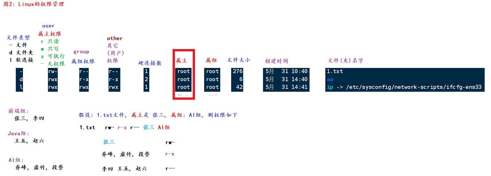

### 8.2 chmod - 修改权限

```bash
# 字符方式
chmod u=rwx,g=rx,o=x 1.txt

# 数字方式（推荐）
# r=4, w=2, x=1, -=0
chmod 777 1.txt    # 满权限 rwxrwxrwx
chmod 755 1.txt    # rwxr-xr-x
```

**数字权限对照表**：

| 数字 | 权限 | 数字 | 权限 |
|------|------|------|------|
| 0 | `---` | 4 | `r--` |
| 1 | `--x` | 5 | `r-x` |
| 2 | `-w-` | 6 | `rw-` |
| 3 | `-wx` | 7 | `rwx` |

### 8.3 chown - 修改属主/属组

```bash
chown zhangsan 1.txt         # 修改属主
chown :itcast 1.txt          # 修改属组
chown lisi:itheima 1.txt     # 同时修改属主和属组
chown -R zhangsan aa         # 递归修改目录
```

---

## 9. 常用快捷键

| 快捷键 | 功能 |
|--------|------|
| `Ctrl + C` | 强制结束当前命令 |
| `Ctrl + L` | 清屏（等价于 `clear`） |
| `Ctrl + D` | 强制登出 |
| `Ctrl + A` | 跳转到行首 |
| `Ctrl + E` | 跳转到行尾 |
| `Ctrl + ←/→` | 按单词跳转 |
| `Ctrl + R` | 搜索历史命令 |
| `history` | 查看历史命令 |
| `!命令名` | 倒序匹配并执行历史命令 |

---

## 10. 软件安装 - DNF/YUM

类似应用商店，直接查找并安装软件：

```bash
dnf [install | search | remove | upgrade | info] 包名

# 示例
sudo dnf install wget   # 安装 wget；先检查事务摘要再确认
wget URL地址             # 联网下载资源
```

---

## 11. 系统服务管理 - systemctl

```bash
systemctl [start | stop | status | disable | enable | restart] 服务名

# 常用服务
NetworkManager    # 网络连接管理
firewalld         # 动态防火墙
sshd              # OpenSSH 服务端
```

网络异常时应先诊断，不要直接停用网络服务：

```bash
ip address
ip route
nmcli device status
nmcli connection show
systemctl status NetworkManager
journalctl -u NetworkManager --since today
```

`127.0.0.1` 是 IPv4 回环地址，不是物理网卡地址。远程修改网络配置前应准备控制台或其他恢复通道。

---

## 12. 软链接与硬链接

```bash
# 软链接（类似快捷方式）
ln -s /etc/sysconfig/network-scripts/ifcfg-ens33 ip

# 硬链接（同一文件数据的另一个目录项，不是独立备份）
ln a.txt c.txt
```

| 特性 | 软链接 | 硬链接 |
|------|--------|--------|
| 本质 | 快捷方式 | 同一 inode 的别名 |
| 删除原文件 | 链接失效 | 不受影响 |
| 跨文件系统 | 可以 | 不可以 |

> 硬链接与原文件共享同一 inode 和数据块，不能替代具有独立副本、版本和恢复验证的备份。

---

## 13. 网络相关命令

```bash
ip address                            # 查看本机地址
ip route                              # 查看路由
ping [-c 次数] 地址                    # 测试网络连通性
wget URL地址                           # 下载资源
curl URL地址                           # 模拟浏览器请求
ss -lntup                             # 查看监听套接字及进程
ss -lntup | grep ':3306'              # 粗略筛选 3306 端口
```

> **端口号**：传输层协议端点的一部分，取值 0～65535。TCP 与 UDP 各有独立端口空间；通常需要用协议、IP 地址和端口共同标识一个端点。0～1023 属于知名端口范围，在类 Unix 系统上绑定低端口通常需要额外权限。

---

## 14. 进程管理

```bash
ps -ef                        # 查看所有进程
ps -ef | grep mysql           # 查看指定进程
kill PID                      # 先发送 SIGTERM，请求进程正常退出
kill -KILL PID                # 仅在无法正常退出时最后使用
```

---

## 15. 压缩与解压缩

### tar 命令（tarball + gzip）

```bash
# 压缩
tar -zcvf 压缩包名.tar.gz 文件1 文件2 ...
# z:gzip协议  c:创建  v:显示过程  f:文件

# 解压
tar -zxvf 压缩包名.tar.gz [-C 目标路径]
# x:解压缩  -C:指定解压路径
```

### 示例

```bash
tar -zcvf my.tar.gz 1.txt 2.txt 3.txt      # 压缩
tar -zxvf my.tar.gz -C aa                   # 解压到 aa 目录
```
