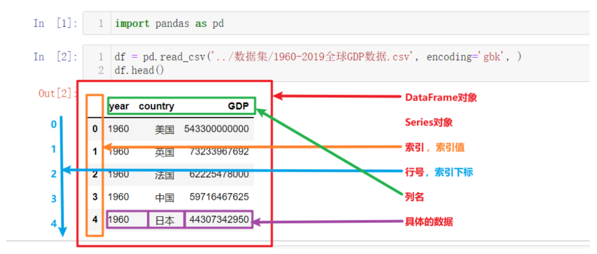
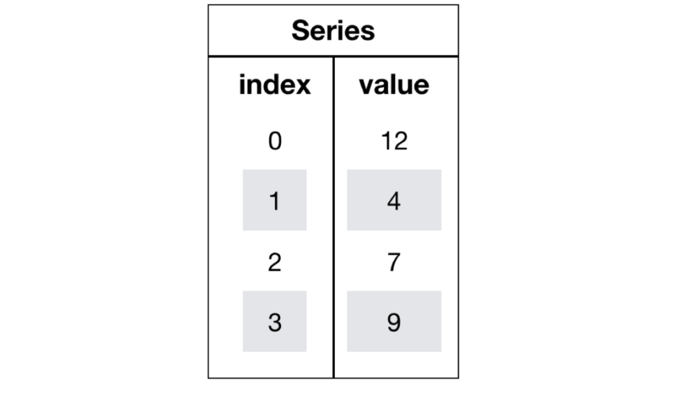
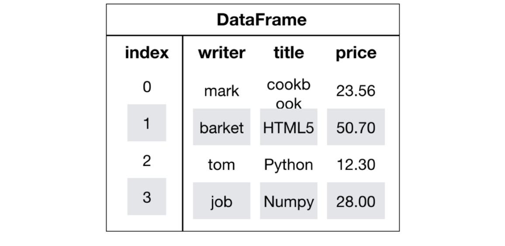

---
tags:
  - Python
  - Pandas
  - 数据分析
date: 2026-05-23
updated: 2026-07-31
---

# 二、Pandas数据结构与数据类型

## 学习目标

- 知道什么是DataFrame对象、什么是Seires对象
- 对Series和DataFrame的常用API有印象、能找到、能看懂
- 了解Pandas中常用数据类型
- 知道Series以及DataFrame的运算规则
- 知道numpy.where()函数的用法

## 1、Pandas数据结构和数据类型



上图为上一节中读取并展示出来的数据，以此为例我们来讲解Pandas的核心概念，以及这些概念的层级关系：

- DataFrame
  - Series
    - 索引列
      - 索引名、索引值
      - 索引下标、行号
    - 数据列
      - 列名
      - 列值，具体的数据

其中最核心的就是Pandas中的两个数据结构：DataFrame和Series

## 2、Series对象

Series也是Pandas中的最基本的数据结构对象，下文中简称s对象；是DataFrame的列对象，series本身也具有索引。

Series是一种类似于一维数组的对象，由下面两个部分组成：



- values：一组数据（numpy.ndarray类型）
- index：相关的数据索引标签；如果没有为数据指定索引，于是会自动创建一个0到N-1(N为数据的长度)的整数型索引。

### 2.1 创建Series对象

* 1- 导入pandas 

```python
import pandas as pd
```

* 2- 通过list列表来创建

```python
# pd.Series(data, index=None)：创建 Series 对象；data 可以是列表、字典、元组等
# 使用默认自增索引
s2 = pd.Series([1, 2, 3])
print(s2)
# 自定义索引
s3 = pd.Series([1, 2, 3], index=['A', 'B', 'C'])
s3
```

结果为：

```text
0    1
1    2
2    3
dtype: int64
A    1
B    2
C    3
dtype: int64
```

* 3- 使用字典或元组创建series对象

```python
#使用元组
tst = (1,2,3,4,5,6)
pd.Series(tst)

#使用字典：
dst = {'A':1,'B':2,'C':3,'D':4,'E':5,'F':6}
pd.Series(dst)
```

* 4- 使用numpy创建series对象

```python
# np.arange(n)：生成 0 到 n-1 的等差数组
pd.Series(np.arange(10))
```

运行结果：

```text
0    0
1    1
2    2
3    3
4    4
5    5
6    6
7    7
8    8
9    9
dtype: int64
```

### 2.2 Series对象属性

构造一个series对象

```python
s4 = pd.Series([i for i in range(6)], index=[i for i in 'ABCDEF'])
s4
```

返回结果：

```text
A    0
B    1
C    2
D    3
E    4
F    5
dtype: int64
```

* 1- series对象常用属性

```python
# .index：获取 Series 的索引对象
s4.index
```

* 2- values

```python
# .values：获取 Series 中的数据，返回 numpy 数组
s4.values
```

* 3- 也可以通过索引来获取数据

```python
s4['A']
```

## 3、DataFrame

### 3.1 创建DataFrame对象

DataFrame是一个类似于二维数组或表格(如excel)的对象，既有行索引，又有列索引

- 行索引，表明不同行，横向索引，叫index，0轴，axis=0
- 列索引，表名不同列，纵向索引，叫columns，1轴，axis=1



DataFrame的创建有很多种方式

读取文件数据返回df：在之前的学习中我们使用了`pd.read_csv('csv格式数据文件路径')`的方式获取了df对象

使用字典、列表、元组创建df：接下来就展示如何使用字典、列表+元组、numpy创建df对象

---

* 1- 使用字典加列表创建df，使默认自增索引

```python
df1_data = {
    '日期': ['2021-08-21', '2021-08-22', '2021-08-23'],
    '温度': [25, 26, 50],
    '湿度': [81, 50, 56] 
}
# pd.DataFrame(data)：创建 DataFrame 对象；data 可以是字典、列表、元组等
df1 = pd.DataFrame(data=df1_data)
df1
```

返回结果：

```text
        日期    温度    湿度
0    2021-08-21    25    81
1    2021-08-22    26    50
2    2021-08-23    50    56
```

- 2- 使用列表加元组创建df，并自定义索引

```python
df2_data = [
    ('2021-08-21', 25, 81),
    ('2021-08-22', 26, 50),
    ('2021-08-23', 27, 56)
]

df2 = pd.DataFrame(
    data=df2_data, 
    columns=['日期', '温度', '湿度'],
    index = ['row_1','row_2','row_3'] # 手动指定索引
)
df2
```

返回结果：

```text
            日期    温度    湿度
row_1    2021-08-21    25    81
row_2    2021-08-22    26    50
row_3    2021-08-23    27    56
```

* 3- 使用numpy创建df

通过已有数据创建

```python
# np.random.randn(m, n)：生成 m 行 n 列的标准正态分布随机数
pd.DataFrame(np.random.randn(2,3))  # 2行3列
```

创建学生成绩表

```python
# np.random.randint(low, high, size)：生成指定范围的随机整数数组
# 生成10名同学，5门功课的数据
score = np.random.randint(40, 100, (10, 5))

# 结果
array([[92, 55, 78, 50, 50],
       [71, 76, 50, 48, 96],
       [45, 84, 78, 51, 68],
       [81, 91, 56, 54, 76],
       [86, 66, 77, 67, 95],
       [46, 86, 56, 61, 99],
       [46, 95, 44, 46, 56],
       [80, 50, 45, 65, 57],
       [41, 93, 90, 41, 97],
       [65, 83, 57, 57, 40]])
```

但是这样的数据形式很难看到存储的是什么的样的数据，可读性比较差!

问题：如何让数据更有意义的显示？

```python
# 使用Pandas中的数据结构
score_df = pd.DataFrame(score)
```


给分数数据增加行列索引,显示效果更佳

效果：


增加行、列索引

```python
# 构造行索引序列
subjects = ["语文", "数学", "英语", "政治", "体育"]

# 构造列索引序列
stu = ['同学' + str(i) for i in range(score_df.shape[0])]

# 添加行索引
data = pd.DataFrame(score, columns=subjects, index=stu)
```

### 3.2 DataFrame对象属性

* 1- shape属性

```python
# .shape：返回 DataFrame 的形状，格式为 (行数, 列数)
data.shape

# 结果
(10, 5)
```

* 2- index属性

DataFrame的行索引列表

```python
# .index：返回 DataFrame 的行索引对象
data.index

# 结果
Index(['同学0', '同学1', '同学2', '同学3', '同学4', '同学5', '同学6', '同学7', '同学8', '同学9'], dtype='object')
```

* 3- columns

```python
# .columns：返回 DataFrame 的列索引对象
data.columns

# 结果
Index(['语文', '数学', '英语', '政治', '体育'], dtype='object')
```

* 4- values

直接获取其中array的值

```python
# .values：获取 DataFrame 中的数据，返回二维 numpy 数组
data.values

array([[92, 55, 78, 50, 50],
       [71, 76, 50, 48, 96],
       [45, 84, 78, 51, 68],
       [81, 91, 56, 54, 76],
       [86, 66, 77, 67, 95],
       [46, 86, 56, 61, 99],
       [46, 95, 44, 46, 56],
       [80, 50, 45, 65, 57],
       [41, 93, 90, 41, 97],
       [65, 83, 57, 57, 40]])
```

* 5- T

转置

```python
# .T：转置，行列互换
data.T
```

结果


### 3.3 DataFrame对象方法

1- head(n)

显示前n行内容

```python
# head(n)：返回前 n 行，默认前 5 行
data.head(5)
```


2- tail(n)

显示后n行内容

如果不补充参数，默认5行。填入参数n则显示后n行

```python
# tail(n)：返回后 n 行，默认后 5 行
data.tail(5)
```

### 3.4 DatatFrame索引的设置

需求：


* 1- 修改行列索引值

```python
stu = ["学生_" + str(i) for i in range(score_df.shape[0])]

# 必须整体全部修改
data.index = stu
```

注意：以下修改方式是错误的

```python
# 错误修改方式
data.index[3] = '学生_3'
```

* 2- 重设索引
  - reset_index(drop=False)
    - 设置新的下标索引
    - drop:默认为False，不删除原来索引，如果为True,删除原来的索引值

```python
# reset_index(drop=False)：重置索引为默认整数索引；drop=False 保留原索引作为数据列
data.reset_index()
```


```python
# 重置索引,drop=True
data.reset_index(drop=True)
```

* 3- 以某列值设置为新的索引
  - set_index(keys, drop=True)
    - **keys** : 列索引名成或者列索引名称的列表
    - **drop** : boolean, default True.当做新的索引，删除原来的列

设置新索引案例

第一步：创建

```python
df = pd.DataFrame({'month': [1, 4, 7, 10],
                    'year': [2012, 2014, 2013, 2014],
                    'sale':[55, 40, 84, 31]})
df
```

```text
   month  sale  year
0  1      55    2012
1  4      40    2014
2  7      84    2013
3  10     31    2014
```

第二步：以月份设置新的索引

```python
# set_index(keys)：将指定列设为行索引
df.set_index('month')
```

```text
       sale  year
month
1      55    2012
4      40    2014
7      84    2013
10     31    2014
```

第三步：设置多个索引，以年和月份

```python
df = df.set_index(['year', 'month'])
df
```

```text
            sale
year  month
2012  1     55
2014  4     40
2013  7     84
2014  10    31
```


## 4、Pandas的数据类型

df或s对象中具体每一个值的数据类型有很多，如下表所示

| Pandas数据类型 | 说明         | 对应的Python类型            |
| -------------- | ------------ | --------------------------- |
| Object         | 字符串类型   | string                      |
| int            | 整数类型     | int                         |
| float          | 浮点数类型   | float                       |
| datetime       | 日期时间类型 | datetime包中的datetime类型  |
| timedelta      | 时间差类型   | datetime包中的timedelta类型 |
| category       | 分类类型     | 无原生类型，可以自定义      |
| bool           | 布尔类型     | bool（True,False）          |
| nan            | 空值类型     | None                        |

- 可以通过下列API查看s对象或df对象中数据的类型

```python
# .dtypes：返回各列的数据类型
s1.dtypes
df1.dtypes
# .info()：打印 DataFrame 的摘要信息（行数、列名、非空计数、数据类型等）
df1.info() # s对象没有info()方法
```

* 几个特殊类型演示

  * datetime类型

  ```python
  import pandas as pd
  
  # pd.to_datetime(arg)：将字符串或列表转换为 datetime 类型
  # 创建一个datetime类型的Series
  dates = pd.to_datetime(['2024-09-01', '2024-09-02', '2024-09-03'])
  print(dates)
  ```

  * timedelta类型

  ```python
  import pandas as pd
  
  # 计算两个日期之间的差值
  start_date = pd.to_datetime('2024-09-01')
  end_date = pd.to_datetime('2024-09-05')
  delta = end_date - start_date
  print(delta)
  ```

  * category类型

  类型用于表示分类数据，通常用于有限集合中的数据类型，例如性别、颜色、产品类型等。这种类型的优点在于占用更少的内存，并且对分类数据的操作更快。

  ```python
  import pandas as pd
  
  # 创建一个category类型的Series
  categories = pd.Series(['apple', 'banana', 'apple', 'orange'], dtype='category')
  print(categories)
  ```

## 本章函数速查

| 函数/方法 | 语法 | 作用 | 常用参数 |
|-----------|------|------|----------|
| `pd.Series()` | `pd.Series(data, index=None)` | 创建 Series 对象 | `data`：列表/字典/元组；`index`：自定义索引 |
| `np.arange()` | `np.arange(n)` | 生成 0 到 n-1 的等差数组 | `n`：数组长度 |
| `.index` | `s.index` / `df.index` | 获取索引对象 | 无 |
| `.values` | `s.values` / `df.values` | 获取数据值，返回 numpy 数组 | 无 |
| `pd.DataFrame()` | `pd.DataFrame(data, index, columns)` | 创建 DataFrame 对象 | `data`：字典/列表/元组；`columns`：列名；`index`：行索引 |
| `np.random.randn()` | `np.random.randn(m, n)` | 生成标准正态分布随机数 | `m, n`：行数和列数 |
| `np.random.randint()` | `np.random.randint(low, high, size)` | 生成指定范围的随机整数 | `low, high`：范围；`size`：形状元组 |
| `.shape` | `df.shape` | 返回 DataFrame 的形状 (行数, 列数) | 无 |
| `.columns` | `df.columns` | 返回列索引对象 | 无 |
| `.T` | `df.T` | 转置，行列互换 | 无 |
| `.head()` | `df.head(n=5)` | 返回前 n 行 | `n`：行数，默认 5 |
| `.tail()` | `df.tail(n=5)` | 返回后 n 行 | `n`：行数，默认 5 |
| `.reset_index()` | `df.reset_index(drop=False)` | 重置为默认整数索引 | `drop`：是否丢弃原索引，默认 False |
| `.set_index()` | `df.set_index(keys, drop=True)` | 将指定列设为行索引 | `keys`：列名或列表；`drop`：是否删除原列 |
| `.dtypes` | `df.dtypes` | 返回各列的数据类型 | 无 |
| `.info()` | `df.info()` | 打印 DataFrame 摘要信息 | 无 |
| `pd.to_datetime()` | `pd.to_datetime(arg)` | 将字符串/列表转为 datetime 类型 | `arg`：日期字符串或列表 |

## 小结

- series【知道】
  - 创建
    - pd.Series([], index=[])
    - pd.Series({})
  - 属性
    - 对象.index
    - 对象.values
- DataFrame【掌握】
  - 创建
    - pd.DataFrame(data=None, index=None, columns=None)
  - 属性
    - shape -- 形状
    - index -- 行索引
    - columns -- 列索引
    - values -- 查看值
    - T -- 转置
    - head() -- 查看头部内容
    - tail() -- 查看尾部内容
  - DataFrame索引
    - 修改的时候,需要进行全局修改
    - 对象.reset_index()
    - 对象.set_index(keys)


---
[上一步：01.Pandas框架概述](01.Pandas框架概述.md) [下一步：03.Pandas基本操作](03.Pandas基本操作.md) [返回总索引](关于Pandas.md)
