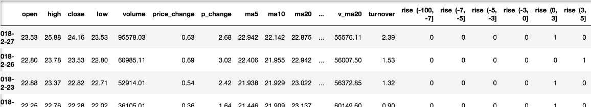
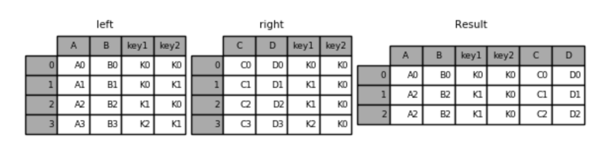
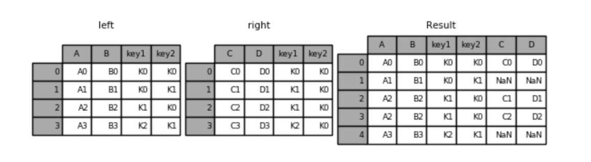
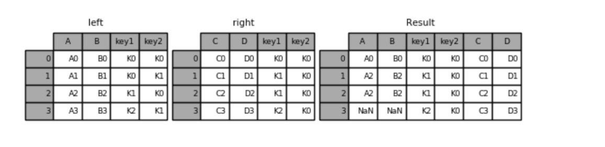
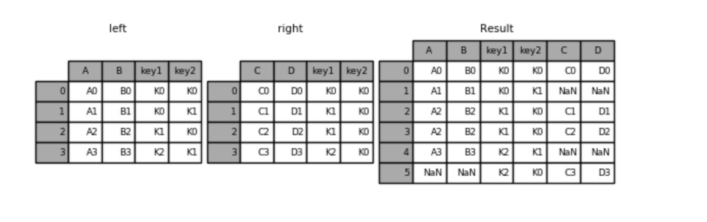

---
tags:
  - Python
  - Pandas
  - 数据分析
date: 2026-06-04
---

# 八、高级处理-数据合并

## 学习目标

- 应用pd.concat实现数据的合并 => union
- 应用pd.merge实现数据的合并 => join

## 1、pd.concat实现数据合并

- pd.concat([data1, data2], axis=1)
  - 按照行或列进行合并，axis=0 沿行方向上下拼接（行变多），axis=1 沿列方向左右拼接（列变多）

axis=0 是最常用的场景：把结构相同的多张表上下拼成一张大表。

```python
# axis=0：上下拼接（行方向），适合结构相同的表合并
df1 = pd.DataFrame({'A': ['A0', 'A1'], 'B': ['B0', 'B1']})
df2 = pd.DataFrame({'A': ['A2', 'A3'], 'B': ['B2', 'B3']})
pd.concat([df1, df2], axis=0)
#    A   B
# 0 A0  B0
# 1 A1  B1
# 0 A2  B2
# 1 A3  B3
```

比如我们将刚才处理好的one-hot编码与原数据合并（axis=1 左右拼接）



```python
# axis=1：左右拼接（列方向），按行索引对齐
pd.concat([data, dummies], axis=1)
```

- join 参数控制连接方式

```python
# 默认 outer：左表全集 + 右表全集 + 交集（缺失部分填 NaN）
pd.concat([df1, df2], axis=1, join='outer')

# inner：只要交集（只保留两边都有的行）
pd.concat([df1, df2], axis=1, join='inner')
```

- ignore_index 参数：是否重置索引

拼接后的结果默认保留原来的索引值，这会导致索引重复（比如两张表都有 0、1、2）。设置 `ignore_index=True` 可以丢弃原来的索引，生成新的 0, 1, 2... 整数索引。

```python
# 默认保留原索引，可能出现重复
pd.concat([df1, df2], axis=0)
#    A   B
# 0 A0  B0
# 1 A1  B1
# 0 A2  B2    <-- 索引 0 重复
# 1 A3  B3    <-- 索引 1 重复

# ignore_index=True：重置为连续整数索引
pd.concat([df1, df2], axis=0, ignore_index=True)
#    A   B
# 0 A0  B0
# 1 A1  B1
# 2 A2  B2
# 3 A3  B3
```

## 2、pd.merge

- pd.merge(left, right, how='inner', on=None)
  - 可以指定按照两组数据的共同键值对合并或者左右各自
  - `left`: DataFrame
  - `right`: 另一个DataFrame
  - `on`: 指定的共同键
  - how:按照什么方式连接

| Merge method | SQL Join Name      | Description                               |
| ------------ | ------------------ | ----------------------------------------- |
| `left`       | `LEFT OUTER JOIN`  | 仅使用左表的键，左表全部保留，右表匹配不上的填 NaN |
| `right`      | `RIGHT OUTER JOIN` | 仅使用右表的键，右表全部保留，左表匹配不上的填 NaN |
| `outer`      | `FULL OUTER JOIN`  | 两表键的并集，匹配不上的都填 NaN              |
| `inner`      | `INNER JOIN`       | 两表键的交集，只保留两边都能匹配上的行          |

内连接：

```python
left = pd.DataFrame({'key1': ['K0', 'K0', 'K1', 'K2'],
                        'key2': ['K0', 'K1', 'K0', 'K1'],
                        'A': ['A0', 'A1', 'A2', 'A3'],
                        'B': ['B0', 'B1', 'B2', 'B3']})

right = pd.DataFrame({'key1': ['K0', 'K1', 'K1', 'K2'],
                        'key2': ['K0', 'K0', 'K0', 'K0'],
                        'C': ['C0', 'C1', 'C2', 'C3'],
                        'D': ['D0', 'D1', 'D2', 'D3']})

# 默认内连接
result = pd.merge(left, right, on=['key1', 'key2'])
```



左连接

```python
result = pd.merge(left, right, how='left', on=['key1', 'key2'])
```



右连接

```python
result = pd.merge(left, right, how='right', on=['key1', 'key2'])
```



外连接

```python
result = pd.merge(left, right, how='outer', on=['key1', 'key2'])
```



### 2.1 left_on 和 right_on：左右表键名不同时怎么合并

前面的例子都用 `on` 参数，前提是左右表的合并键**名称相同**。但实际工作中，两张表的键名经常不一样，比如一张表叫 `user_id`，另一张叫 `id`。这时就需要分别用 `left_on` 和 `right_on` 指定。

```python
left = pd.DataFrame({'user_id': [1, 2, 3], 'name': ['Alice', 'Bob', 'Charlie']})
right = pd.DataFrame({'id': [1, 2, 4], 'score': [90, 85, 78]})

# 左表键叫 user_id，右表键叫 id
result = pd.merge(left, right, left_on='user_id', right_on='id', how='inner')
#    user_id     name  id  score
# 0        1    Alice   1     90
# 1        2      Bob   2     85
```

注意：合并后 `user_id` 和 `id` 两列都会保留。如果不想要重复的键列，可以在合并后 `drop` 掉其中一个。

当有多列作为复合键时，传列表即可：

```python
pd.merge(left, right, left_on=['col_a', 'col_b'], right_on=['key_a', 'key_b'])
```

### 2.2 suffixes 参数：处理重名列

当左右表有**同名的非键列**时，merge 会自动给它们加后缀以区分。默认后缀是 `('_x', '_y')`，你可以通过 `suffixes` 参数自定义。

```python
left = pd.DataFrame({'key': [1, 2], 'value': ['a', 'b']})
right = pd.DataFrame({'key': [1, 2], 'value': ['c', 'd']})

# 默认后缀 _x（左表）和 _y（右表）
pd.merge(left, right, on='key')
#    key value_x value_y
# 0    1       a       c
# 1    2       b       d

# 自定义后缀，更语义化
pd.merge(left, right, on='key', suffixes=('_left', '_right'))
#    key value_left value_right
# 0    1          a           c
# 1    2          b           d

# 实际场景：订单表和商品表都有 price 列
pd.merge(orders, products, on='product_id', suffixes=('_order', '_product'))
# 生成 price_order 和 price_product，语义清晰
```

### 2.3 concat vs merge 对比

| 对比项 | pd.concat | pd.merge |
|--------|-----------|----------|
| 本质 | 拼接（堆叠） | 关联（按键匹配） |
| 类比 SQL | UNION ALL | JOIN |
| 对齐方式 | 按索引/列名对齐 | 按指定键列匹配 |
| 典型场景 | 结构相同的表上下/左右拼接 | 两张有关联键的表做关联查询 |
| 处理重复列 | 不涉及（按列名直接拼） | 通过 suffixes 参数区分 |
| 灵活性 | 较低，只能按轴拼 | 较高，支持多种连接方式 |

简单记忆：**结构相同用 concat，有关联键用 merge**。

## 本章函数速查

| 函数名 | 语法 | 作用 | 常用参数 |
|--------|------|------|----------|
| `pd.concat()` | `pd.concat(objs, axis)` | 沿指定轴拼接多个 DataFrame | `axis`: 0=上下拼接，1=左右拼接；`join`: outer/inner；`ignore_index`: 重置索引 |
| `pd.merge()` | `pd.merge(left, right, how, on)` | 按键合并两个 DataFrame，类似 SQL JOIN | `how`: inner/left/right/outer；`on`: 共同键；`left_on/right_on`: 不同键名；`suffixes`: 重名列后缀 |

## 小结

- pd.concat([数据1, 数据2], axis=**)【知道】
  - axis=0 上下拼接（行变多），axis=1 左右拼接（列变多）
  - ignore_index=True 重置索引，避免重复索引
  - join='inner' 只保留交集，join='outer' 保留并集（默认）
- pd.merge(left, right, how=, on=)【知道】
  - how -- 以何种方式连接（inner/left/right/outer）
  - on -- 连接的键的依据是哪几个（左右表键名相同时）
  - left_on / right_on -- 左右表键名不同时分别指定
  - suffixes -- 处理同名非键列，默认 ('_x', '_y')
- concat vs merge -- 结构相同用 concat，有关联键用 merge


---
[上一步：07.缺失值处理](07.缺失值处理.md) [下一步：09.数据分组](09.数据分组.md) [返回总索引](关于Pandas.md)
