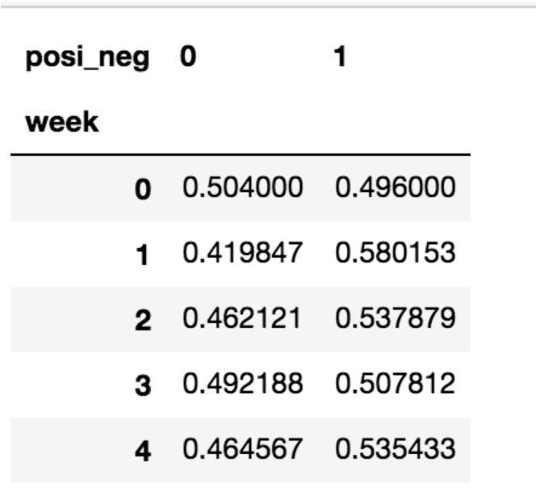
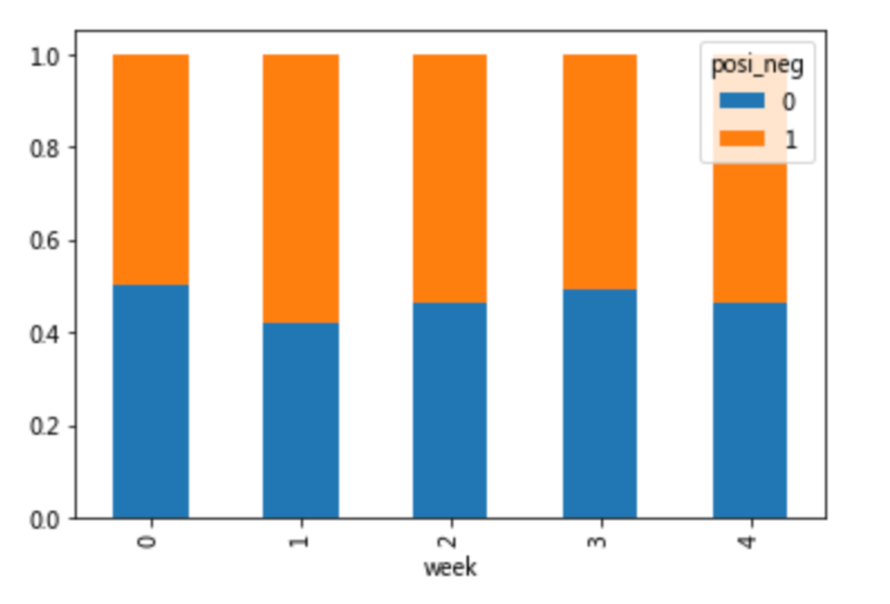

---
tags:
  - Python
  - Pandas
  - 数据分析
date: 2026-05-23
updated: 2026-07-31
---

# 十、高级处理-交叉表与透视表

## 学习目标

- 应用crosstab和pivot_table实现交叉表与透视表

## 1、交叉表与透视表有什么作用？

探究股票的涨跌与星期几有关？

以下图当中表示，week代表星期几，1,0代表这一天股票的涨跌幅是好还是坏，里面的数据代表比例

可以理解为所有时间为星期一等等的数据当中涨跌幅好坏的比例





- 交叉表：

  交叉表用于计算一列数据对于另外一列数据的分组个数(用于统计分组频率的特殊透视表)

  - pd.crosstab(value1, value2)

- 透视表：

  透视表是将原有的DataFrame的列分别作为行索引和列索引，然后对指定的列应用聚集函数

  - data.pivot_table(）
  - DataFrame.pivot_table([], index=[])

## 2、交叉表

```python
import pandas as pd

# 创建一个示例数据集
data = {
    '性别': ['男', '女', '男', '女', '男', '女', '女', '男'],
    '购买': ['是', '否', '是', '是', '否', '否', '是', '否']
}

df = pd.DataFrame(data)

# 创建交叉表
crosstab = pd.crosstab(df['性别'], df['购买'])
print(crosstab)
```

```text
购买  否  是
性别        
女    2   2
男    2   2
```

**margins 参数：显示合计行/列**

加上 `margins=True` 后，交叉表会自动在末尾添加一行"合计"和一列"合计"，方便看总数：

```python
pd.crosstab(df['性别'], df['购买'], margins=True)
```

```text
购买    否  是  All
性别              
女      2  2    4
男      2  2    4
All     4  4    8
```

默认合计列名叫 `All`，可以通过 `margins_name` 参数自定义：

```python
pd.crosstab(df['性别'], df['购买'], margins=True, margins_name='合计')
```

**normalize 参数：显示比例而非计数**

`normalize` 可以把频数转换为比例，接受以下值：

| 参数值 | 含义 |
|--------|------|
| `'all'` | 所有单元格除以总计数（整体占比） |
| `'index'` | 每行除以该行合计（行内占比） |
| `'columns'` | 每列除以该列合计（列内占比） |

```python
# 整体占比：每个单元格 / 总数 8
pd.crosstab(df['性别'], df['购买'], normalize='all')
# 购买     否     是
# 性别
# 女    0.25  0.25
# 男    0.25  0.25

# 行内占比：每行加起来 = 1
pd.crosstab(df['性别'], df['购买'], normalize='index')
# 购买     否     是
# 性别
# 女    0.50  0.50
# 男    0.50  0.50

# 列内占比：每列加起来 = 1
pd.crosstab(df['性别'], df['购买'], normalize='columns')
```

> 实际业务中，`normalize='index'` 最常用——比如"每个城市的客户中，男女比例各是多少"。案例分析中手动算比例的步骤，用 `normalize='index'` 一行就能搞定。

## 3、透视表

```python
import pandas as pd

data = {
    '性别': ['男', '女', '男', '女', '男', '女'],
    '购买': ['是', '否', '是', '是', '否', '否'],
    '金额': [100, 150, 200, 130, 160, 120]
}
df = pd.DataFrame(data)

# 创建透视表
pivot_table = pd.pivot_table(df, values='金额', index='性别', columns='购买', aggfunc='mean')
print(pivot_table)
```

```text
购买      否     是
性别             
女   135.0  130.0
男   180.0  150.0
```

**aggfunc 多函数：同时计算多个统计指标**

`aggfunc` 可以传入列表，同时计算多个聚合函数：

```python
pd.pivot_table(df, values='金额', index='性别', columns='购买', aggfunc=['mean', 'sum'])

# 结果会产生 MultiIndex 列：(mean, 否)、(mean, 是)、(sum, 否)、(sum, 是)
```

也可以对不同列使用不同的聚合函数，传入字典即可：

```python
pd.pivot_table(df, values=['金额', '数量'], index='性别',
               aggfunc={'金额': 'mean', '数量': 'sum'})
```

**fill_value 参数：填充缺失值**

透视表中某些组合可能没有数据，会显示为 `NaN`。用 `fill_value` 可以指定填充值：

```python
pd.pivot_table(df, values='金额', index='性别', columns='购买',
               aggfunc='mean', fill_value=0)
# 没有数据的单元格会显示 0 而不是 NaN
```

> 注意：`fill_value` 是在透视表计算完成后才填充的，不影响聚合结果本身。

**margins=True：添加合计行/列**

和交叉表一样，透视表也支持 `margins=True`，在末尾添加行/列的汇总：

```python
pd.pivot_table(df, values='金额', index='性别', columns='购买',
               aggfunc='mean', margins=True, margins_name='合计')

# 购买       否      是     合计
# 性别
# 女     135.0  130.0  132.5
# 男     180.0  150.0  160.0
# 合计   157.5  140.0  150.0
```

合计值是对所有数据（不受 index/columns 分组限制）重新计算的聚合结果。

## 4、案例分析

### 4.1 数据准备

- 准备两列数据，星期数据以及涨跌幅是好是坏数据
- 进行交叉表计算

```python
# 寻找星期几跟股票张得的关系
# 1、先把对应的日期找到星期几
# pd.to_datetime()：将字符串或数值转换为 datetime 类型
date = pd.to_datetime(data.index).weekday
data['week'] = date

# 2、假如把p_change按照大小去分个类0为界限
# np.where()：条件判断，满足条件返回第二个参数，否则返回第三个
data['posi_neg'] = np.where(data['p_change'] > 0, 1, 0)

# 通过交叉表找寻两列数据的关系
count = pd.crosstab(data['week'], data['posi_neg'])
```

但是我们看到count只是每个星期日子的好坏天数，并没有得到比例，该怎么去做？

- 方法一：手动计算（对每一行求和再相除）

```python
# 算数运算，先求和
sum = count.sum(axis=1).astype(np.float32)

# 进行相除操作，得出比例
pro = count.div(sum, axis=0)
```

- 方法二：直接用 `normalize='index'` 一步到位

```python
pro = pd.crosstab(data['week'], data['posi_neg'], normalize='index')
```

> 两种方法结果完全相同，`normalize='index'` 更简洁，推荐日常使用。

### 4.2 查看效果

使用plot画出这个比例，使用stacked的柱状图

```python
pro.plot(kind='bar', stacked=True)
plt.show()
```

### 4.3 使用pivot_table(透视表)实现

使用透视表，刚才的过程更加简单

```python
# 通过透视表，将整个过程变成更简单一些
data.pivot_table(['posi_neg'], index='week')
```

## 本章函数速查

| 函数名                | 语法                                                | 作用                 | 常用参数                                             |
| ------------------ | ------------------------------------------------- | ------------------ | ------------------------------------------------ |
| `pd.crosstab()`    | `pd.crosstab(index, columns)`                     | 计算两个因子的频数交叉表       | `margins`: 添加合计行列，`normalize`: 计算比例              |
| `df.pivot_table()` | `df.pivot_table(values, index, columns, aggfunc)` | 创建透视表，按行列分组聚合      | `values`: 聚合列，`aggfunc`: 聚合函数，`fill_value`: 填充缺失 |
| `pd.to_datetime()` | `pd.to_datetime(arg)`                             | 转换为 datetime 类型    | `arg`: 字符串或序列                                    |
| `np.where()`       | `np.where(condition, x, y)`                       | 条件判断，满足返回 x，否则返回 y | `condition`: 条件表达式                               |
| `.sum()`           | `df.sum(axis)`                                    | 求和                 | `axis`: 0=按列，1=按行                                |
| `.div()`           | `df.div(other, axis)`                             | 除法运算               | `other`: 除数，`axis`: 对齐方向                         |
| `.plot()`          | `df.plot(kind)`                                   | 绘制图表               | `kind`: 图表类型（bar/line/pie 等），`stacked`: 是否堆叠     |

## 小结

- 交叉表与透视表的作用【知道】
  - 交叉表：计算一列数据对于另外一列数据的分组个数
  - 透视表：指定某一列对另一列的关系
- 交叉表常用参数
  - `margins=True`：添加合计行/列
  - `normalize='index'`：按行计算比例（替代手动 div + sum）
  - `margins_name`：自定义合计行/列的名称
- 透视表常用参数
  - `aggfunc=['mean', 'sum']`：同时计算多个聚合函数
  - `fill_value=0`：用指定值填充缺失数据
  - `margins=True`：添加合计行/列
- 交叉表 vs 透视表
  - 交叉表 `pd.crosstab()`：侧重计数/频率统计，输入是原始列
  - 透视表 `df.pivot_table()`：侧重数值聚合，支持多种 aggfunc

---
[上一步：09.数据分组](09.数据分组.md) [返回总索引](关于Pandas.md)
