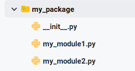

---
tags:
  - Python
  - 基础知识
date: 2026-06-18
updated: 2026-08-03
---

# 05. 文件、异常与模块

> 把文件持久化、异常处理和模块化组织连成一套小型程序的工程基础。

## 文件操作


##### 13.文件操作-读

```python
"""
文件 介绍:
    概述:
        无论是 windows, Linux, Mac系统, 都是采用 文件 来管理数据的, 它们都是 文件管理系统.
        之所以用文件来管理数据, 原因是因为: 内存中的数据是临时存储的, 电脑管理了, 数据就丢失了.
        文件: 可以实现 永久 存储数据.
    文件的类型:
        文本文档, 图片类型, 视频类型, 音频类型......
    文件的操作步骤:
        1. 打开文件.
        2. 读写操作.
        3. 关闭文件.

    打开文件 涉及到的API(Application Programming Interface, 应用程序编程接口), 就是: 别人写的 函数.
        文件对象名 = open('文件路径', '打开模式', 码表)        # 参3为可选项, 针对于 中文有效.
    读取文件信息:
        read(num)       文本模式读取至多 num 个字符，二进制模式读取至多 num 个字节；不传参数会读取到文件末尾.
        readline()      一次读取一行.
        readlines()     一次性读取读完所有行, 且会把每行数据封装到 1个列表中.
    关闭文件:
        文件对象名.close()

细节:
    1. Windows 路径可使用原始字符串 r'C:\\data\\a.txt'、转义反斜杠或正斜杠；原始字符串不能以单个反斜杠结尾.
    2. 相对路径相对于进程的当前工作目录（current working directory），不一定等于脚本目录或项目根目录.
"""

# 1. 打开文件(file).
# 场景1: 绝对路径.
# f = open(r'D:\workspace\ai_28_basic_bj\pythonProject\day06\data\a.txt', 'r')           # r'' 取消 \的 转义函数.
# f = open('D:\\workspace\\ai_28_basic_bj\\pythonProject\\day06\\data\\a.txt', 'r')      # \\ 代表 1个 \
# f = open('D:/workspace/ai_28_basic_bj/pythonProject/day06/data/a.txt', 'r')              # 或者可以写成 /


# 场景2: 相对路径写法.  默认是相对于当前项目的路径来讲的
f = open('./data/a.txt', 'r')           # ./ 代表当前目录
# print(f'文件对象名: {f}')

# 2. 读写操作.
# read(num)       文本模式按字符计数，二进制模式按字节计数；不传参数会读取到文件末尾.
# print(f.read())      # 一次性读取所有的数据.
# print(f.read(3))     # 文本模式读取至多 3 个字符，换行符也算 1 个字符
# print(f.read(5))     # 文本模式读取至多 5 个字符

# readline()      一次读取一行.
# print(f.readline())     # 'abc\n'
# print(f.readline())     # 'defg\n'
# print(f.readline())     # 'xyz'
# print(f.readline())     # 空

# readlines()     一次性读取读完所有行, 且会把每行数据封装到 1个列表中.
print(f.readlines())    # ['abc\n', 'defg\n', 'xyz']

# 3. 关闭文件.
f.close()

```


##### 14.文件操作-读-中文

```python
"""
中文 解释:
    计算机底层存储, 操作, 运算数据, 都是采用数据的 二进制(补码)形式, 所以中文, 特殊符号, 数字, 英文字母底层都是要转成二进制的.
    后来科学家就提出了 码表的概念, 用来描述 字符 及其 对应的数字的关系.  例如: 'a' => 97,  'A' => 65, '0' => 48...
    最早的码表 ASCII码表记录的就是: 英文字母, 数字, 特殊符号及其对应的 数字的关系.
    后来出现了 GBK 等区域编码。Unicode 为字符分配统一码点，UTF-8、UTF-16、UTF-32 是 Unicode 的不同编码方式.

    总结:
        现代跨平台文本通常优先使用 UTF-8；常用汉字在 UTF-8 中通常占 3 个字节，但字符数不能简单等同于字节数.
        不同编码对同一字符使用的字节数可能不同，例如 UTF-16 中 ASCII 字符通常也不只占 1 个字节.
        乱码最常见的原因是读写编码不一致，也可能来自文件损坏、错误的解码错误处理或终端字体/显示问题.
"""

# 1. 打开文件.
# f = open('./data/a.txt', 'r')                 # 默认编码取决于 Python 配置和操作系统区域设置，不应假定为 GBK.
# f = open('./data/a.txt', 'r', encoding='gbk') # 仅在确认文件确实采用 GBK 编码时使用.
f = open('./data/a.txt', 'r', encoding='utf-8')   # 按照 utf-8 码表解析

# 以二进制形式来读
# f = open('./data/a.txt', 'rb')

# 2. 读取文件内容.
print(f.read())

# 3. 关闭文件.
f.close()
```


##### 15.文件操作-写

```python
"""
往文件中写信息:
    write(数据)       往文件中写数据.
    writelines()     一次写多行.

细节:
    1. 注意写数据的模式,  w: write,覆盖写入.  a: append,追加写入.
    2. 读的时候, 如果 数据源文件不存在, 会报错.  No Such File Or Directory...
    3. 写的时候, 如果 目的地文件不存在, 会自动创建.
"""

# 需求1: 演示 写数据到文件.
# # 1. 打开文件.
# # f = open('./data/b.txt', 'w', encoding='utf-8')     # 覆盖写入
# f = open('./data/b.txt', 'a', encoding='utf-8')     # 追加写入
#
# # 2. 往文件中写数据.
# f.write('hello world!\n')
# f.write('好好学习, 天天向上!')
#
# # 3. 关闭文件.
# f.close()


# 需求2: 演示 拷贝 a.txt文件数据 到 b.txt
# 1. 封装数据源文件, 用于: 读取它的数据.
src_f = open('./data/a.txt', 'r', encoding='utf-8')
# src_f = open('./data/a.txt', 'rb')      # 字节形式 读写的时候, 不能指定码表.

# 2. 封装目的地文件, 用于: 往其中写数据.
dest_f = open('./data/b.txt', 'w', encoding='utf-8')
# dest_f = open('./data/b.txt', 'wb')

# 方式1: 一次性读取所有, 并一次性写入所有.
# data = src_f.read()
# dest_f.write(data)

# 方式2: 一次性读取所有(行), 并一次性写入所有行.
# data = src_f.readlines()    # [行, 行, 行...]
# dest_f.writelines(data)

# 方式3: 循环读取, 读一行, 写一行.  或者 一次性读写指定的字节数, 一般是: 1024的整数倍.
while True:
    # 一次性读取 8192个字节, 8 * 1024 = 8192个字节 = 8KB
    data = src_f.read(8192)
    # 核心细节: 如果读不到数据了, 即读取到文件末尾了, 结束读取.
    # if len(data) == 0:        # 可以判断长度
    if data == '':              # 也可以判断是否为空
        break
    # 把读取到的数据, 写到目的地文件.
    dest_f.write(data)

# 3. 关闭文件.
src_f.close()
dest_f.close()

```


##### 16.综合案例-文件备份

```python
# 需求: 键盘录入 当前目录下任意的1个文件名, 然后对该文件进行备份, 备份文件名格式为: 原文件名[备份].原后缀名, 例如:  test.txt => test[备份].txt

# 1. 提示用户录入要备份的 文件名, 并接收.       绕口令.txt,  abc.mp3.txt,   .txt
old_name = input('请录入要备份的文件名: ')

# 2. 找到 最后1个 . 的索引.
index = old_name.rfind('.')

# 3. 判断文件名是否合法.
# 3.1 如果合法, 就拷贝.
if index > 0:
    # 4. 根据原文件名, 拼接 新文件名.           绕口令.txt  => 绕口令[备份].txt
    new_name = old_name[:index] + '[备份]' + old_name[index:]
    # print(new_name)

    # 5. 正常的读写操作.
    # 5.1 打开 数据源文件.
    # old_f = open(old_name, 'r', encoding='utf-8')   # 码表性质只能拷贝 纯文本文件.
    old_f = open(old_name, 'rb')        # 二进制形式读写, 无需指定码表, 通用版读写.
    # 5.2 打开 目的地文件.
    # new_f = open(new_name, 'w', encoding='utf-8')
    new_f = open(new_name, 'wb')
    # 5.3 循环 拷贝.
    while True:
        # 5.4 每次读取 8192个 字节的数据, 存储到 data变量中.
        data = old_f.read(8192)
        # 5.5 判断, 如果没有读取到内容, 说明文件内容读取完毕, 结束拷贝.
        if len(data) <= 0:
            break
        # 5.6 走到这里, 说明读取到内容, 将读取到的数据写出到 目的地文件中.
        new_f.write(data)
    # 5.7 释放资源.
    old_f.close()
    new_f.close()
    print('备份成功!')

else:
    # 3.2 如果不合法, 就提示, 然后程序结束.
    print('您录入的路径有误, 程序结束!')
```


##### 17.扩展-with-open语法

```python
"""
扩展: with-open语句:
    它主要是针对于 文件操作的, 即: 你再也不用手动 close()释放资源了, 该语句会在 语句体执行完毕后, 自动释放资源.

    格式:
        with open('路径', '模式', '码表') as 别名,  open('路径', '模式', '码表') as 别名:
            语句体

    特点:
        语句体执行结束后, with后边定义的变量, 会自动被释放.
"""

# 1. 打开 数据源 和 目的地文件.
with open('./data/a.txt', 'rb') as src_f, open('./data/b.txt', 'wb') as dest_f:
    # 2. 具体的 拷贝动作.
    # 2.1 循环拷贝.
    while True:
        # 2.2 一次读取8192个字节.
        data = src_f.read(8192)
        # 2.3 读完了, 就不读了.
        if len(data) <= 0:
        # if data == '':
            break
        # 2.4 走到这里, 说明读到了, 把读取到的数据写出到目的地文件.
        dest_f.write(data)


# 先了解, 明儿详解.
import os
print(os.getcwd())      # current work directory, 当前的工作空间.  我们写的 相对路径的 ./ 就是它的执行结果.
```

## 异常处理


##### 1.异常演示

```python
"""
异常介绍:
    概述:
        异常是程序运行时用于报告错误或特殊情况的机制。异常可能由程序缺陷、无效输入或外部环境问题引起，不能简单等同于 Bug.
    常见的异常:
        FileNotFoundError
        除零错误
        ......
    异常的默认处理方式:
        程序会将异常的 类型, 产生原因, 异常出现的位置 打印到控制台上.
        并终止程序的执行.

"""

# 1. 读取了1个不存在的文件.
# src_f = open('1.txt', 'r')      # FileNotFoundError

# 2. 除零异常.
print(10 // 0)                    # ZeroDivisionError
print('看看我执行了吗?')
```


##### 2.捕获异常-入门

```python
"""
捕获异常:
    概述:
        捕获异常这种方式处理完异常之后, 程序会 自动往下 继续执行.
    (基本)格式:
        try:
            可能出问题的代码
        except 具体异常类型:
            针对该异常的处理逻辑
    执行流程:
        1. 先执行 try 中的内容；出现与 except 匹配的异常时，跳转到对应处理分支.
        2. 如果try中内容无问题, 程序会跳过 except, 继续向下执行.
"""

# 需求: 演示 try.except写法.
try:
    print("try 1")
    # 1. 读取了1个不存在的文件.
    src_f = open('1.txt', 'r')      # FileNotFoundError
    print("try 2")
except FileNotFoundError:
    print('文件不存在, 请校验后重新操作!')

# 2. 除零异常.
# print(10 // 0)                    # ZeroDivisionError
print('看看我执行了吗?')
```


##### 3.捕获异常-Exception

```python
"""
至此, 我们已经初始了 try.except的语法, 接下来我们来看看 它是如何 精准的捕获某个 指定异常的.

格式:
    try:
        可能出问题的代码
    except Exception as e:
        出问题后的解决方案

格式解释:
    Exception   大多数应用级异常的公共基类；它不包括 KeyboardInterrupt、SystemExit 等直接继承 BaseException 的控制类异常.
    e           类似于我们以前写的变量名, 这里它是: 异常对象名.

细节:
    还可以写成 except (异常1, 异常2) as e    这种写法是捕获多种异常.
    应优先捕获能够处理的具体异常。裸 except 会连退出和键盘中断信号一起捕获，通常不应使用.
"""

# 1. 读取了1个不存在的文件.
# src_f = open('1.txt', 'r')      # FileNotFoundError

# 2. 除零异常.
# print(10 // 0)                    # ZeroDivisionError

# 3. 变量未定义异常.
# print(name)                 # NameError


# 4. 演示 try.except 捕获指定异常.
# 场景1: 捕获 单个异常.
# try:
#     # print(name)   # NameError
#     src_f = open('1.txt', 'r')
# except NameError as e:              # 只能捕获 NameError 异常.
#     print('哎呀, 程序出问题了!')
#     # e就是异常对象, 代表着: 异常信息.  可以直接把它输出到控制台.
#     # print(e)


# 场景2: 捕获 多种异常.
# try:
#     # print(name)                      # NameError
#     # src_f = open('1.txt', 'r')       # FileNotFoundError
#     print(10 // 0)
# except (NameError, FileNotFoundError) as e:
#     # print('哎呀, 程序出问题了!')
#     # e就是异常对象, 代表着: 异常信息.  可以直接把它输出到控制台.
#     print(e)

# 场景3: 通用的 捕获异常的 方案.
try:
    print(name)                      # NameError
    # src_f = open('1.txt', 'r')       # FileNotFoundError
    # print(10 // 0)
except Exception as e:
    # print('哎呀, 程序出问题了!')
    # e就是异常对象, 代表着: 异常信息.  可以直接把它输出到控制台.
    print(e)

print('看看我执行了吗?')

```


##### 4.捕获异常-完整格式

```python
"""
捕获异常, 完整格式如下:
    try:
        里边写的是可能出问题的代码
    except [Exception as e]:
        出现问题后的 解决方案
    else:
        只要try中内容无问题, 就会执行这里的内容.
        只要try中有问题, 就会跳过这里的代码.
    finally:
        无论try是否有问题, 都会走这里的内容, 一般用于释放资源.
"""

# 演示 捕获异常 完整格式.
try:
    print('try 1')
    print(10 // 2)
    print('try 2')
except Exception as e:
    print(f'程序出问题了, {e}')
else:
    print('我是else, 看看我执行了吗?')
finally:
    print('我是finally, 看看我执行了吗?')

print('-' * 28)

# 案例: 拷贝文件, 加入异常处理.
try:
    src_f = open('1.txt', 'rb')
    dest_f = open('aa/bb/cc/2.txt', 'wb')
except Exception as e:
    print(e)
else:
    while True:
        data = src_f.read(1024)
        if len(data) <= 0:
            break
        dest_f.write(data)
finally:
    try:
        src_f.close()
    except Exception as e:
        print(e)

    try:
        dest_f.close()
    except Exception as e:
        print(e)

print('-' * 28)

try:
    with open('1.txt', 'rb') as src_f, open('aa/bb/cc/2.txt', 'wb') as dest_f:
        while True:
            data = src_f.read(1024)
            if len(data) <= 0:
                break
            dest_f.write(data)
except Exception as e:
    print(e)
```


##### 5.异常的传递性

```python
"""
异常是具有传递性的, 函数内的异常 会传递给该函数的 调用者, 逐级传递, 直至这个异常被处理, 或者传递到main还不处理, 程序就会报错.
"""


# 案例: 演示异常的传递性.
def fun01():
    print('----- fun01 start-----')
    print(10 // 0)
    print('----- fun01 end-----')


def fun02():
    print('----- fun02 start-----')

    # 调用 fun01()
    fun01()
    # try:
    #     fun01()
    # except ZeroDivisionError:
    #     print('除数不能为0')

    print('----- fun02 end-----')


def fun03():
    print('----- fun03 start-----')
    # 调用 fun02()
    fun02()
    print('----- fun03 end-----')


if __name__ == '__main__':
    try:
        fun03()
    except ZeroDivisionError:
        print('除数不能为0')


```

## 模块与包


##### 6.模块-导入方式详解

```python
"""
模块介绍:
    概述:
        模块指的是 Module, 在Python中, 1个.py文件 = 1个模块.
        你可以把 模块理解为 工具包, 工具包中有很多的工具.  其实就是: 每个.py文件中都有很多的 函数, 这些函数都有不同的功能.
    大白话:
        学模块, 就是记忆一些 .py文件, 以及其中的一些 函数.
        例如: 随机数相关 用 random模块,   日期相关用 time模块,  文件路径相关用 os模块...

    模块的 导入方式:
        方式1: import 模块名                         后续通过  模块名.函数名() 的方式调用.   模块下所有函数 均可使用
        方式2: import 模块名 as 别名                 后续通过  别名.函数名() 的方式调用.     模块下所有函数 均可使用
        方式3: from 模块名 import 函数名            后续通过  函数名() 的方式直接调用.       只能使用该模块下 导入的函数.
        方式4: from 模块名 import 函数名 as 别名    后续通过  别名() 的方式直接调用.         只能使用该模块下 导入的函数.
        方式5: from 模块名 import *               后续通过  函数名() 的方式直接调用.       模块下所有函数 均可使用
"""

# 案例: 演示 导入模块的几种方式的 用法.
# 测试用例.   time模块下的 time()函数, sleep()函数.


# 演示 方式1: import 模块名                         后续通过  模块名.函数名() 的方式调用.   模块下所有函数 均可使用
# import time
#
# print('--- start ---')
# time.sleep(2)               # 让程序休眠 2秒.
# print(time.localtime())     # 获取系统的的本地时间
# print(time.time())          # 1719113316.0237932,  从时间原点(1970年1月1日 00:00:00 ~ 至今)的秒值.
# print('--- end ---')

# 演示 方式2: import 模块名 as 别名                 后续通过  别名.函数名() 的方式调用.     模块下所有函数 均可使用
# import time as t
#
# print('--- start ---')
# t.sleep(2)               # 让程序休眠 2秒.
# print(t.localtime())     # 获取系统的的本地时间
# print(t.time())          # 1719113316.0237932,  从时间原点(1970年1月1日 00:00:00 ~ 至今)的秒值.
# print('--- end ---')


# 演示 方式3: from 模块名 import 函数名            后续通过  函数名() 的方式直接调用.       只能使用该模块下 导入的函数.
# from time import sleep, localtime

# print('--- start ---')
# sleep(2)               # 让程序休眠 2秒.
# print(localtime())     # 获取系统的的本地时间
# # print(time())          # 报错, 因为没有导入, 所以使用不了.
# print('--- end ---')

# 演示 方式4: from 模块名 import 函数名 as 别名    后续通过  别名() 的方式直接调用.         只能使用该模块下 导入的函数.
# from time import sleep as sl, localtime as lt
#
# print('--- start ---')
# sl(2)               # 让程序休眠 2秒.
# print(lt())     # 获取系统的的本地时间
# # print(time())          # 报错, 因为没有导入, 所以使用不了.
# print('--- end ---')


# 演示 方式5: from 模块名 import *               后续通过  函数名() 的方式直接调用.       模块下所有函数 均可使用
from time import *

print('--- start ---')
sleep(2)               # 让程序休眠 2秒.
print(localtime())     # 获取系统的的本地时间
print(time())
print('--- end ---')


```


##### 7.测试调用自定义模块

* my_module1 模块的代码

  ```python
  # 这个是我们自定义的第 1个 模块.

  # 如果不写all属性, 表示: 导入模块中 所有的函数.
  __all__ = ['fun01', 'fun02']

  # 函数 = 模块的功能, 相当于: 工具包中的工具
  def get_sum(a, b):
      print('我是 my_module1 模块的 函数')
      print(__name__)
      return a + b


  def fun01():
      print('我是 my_module1 模块的 函数')
      print('----- fun01 函数 -----')
      print(__name__)


  def fun02():
      print('我是 my_module1 模块的 函数')
      print('----- fun02 函数 -----')
      print(__name__)


  # 实际开发中, 定义好模块后, 一般会对模块的功能(函数)做测试.
  # 如下的测试代码, 在 调用者中 也会被执行. 但真实的业务场景, 测试代码 在 调用者中是不能被执行的.
  # 那, 如何解决这个问题呢?
  # 答案: __name__ 属性 即可解决这个事儿, 它在当前模块中打印的结果是 __main__,
  #      在调用者模块中打印的是 当前的模块名.

  # # 测试代码
  # print(get_sum(10, 20))
  # fun01()
  # fun02()

  # 如果条件成立, 说明是在 当前模块中执行的.
  if __name__ == '__main__':
      # 测试代码
      print(get_sum(10, 20))
      fun01()
      fun02()
  ```

* my_module2模块的代码

  ```python
  # 这个是我们自定义的第 2个 模块.

  # 函数 = 模块的功能, 相当于: 工具包中的工具
  def get_sum(a, b):
      print('我是 my_module2 模块的 函数')
      print(__name__)
      return a + b


  def fun01():
      print('我是 my_module2 模块的 函数')
      print('----- fun01 函数 -----')
      print(__name__)


  def fun02():
      print('我是 my_module2 模块的 函数')
      print('----- fun02 函数 -----')
      print(__name__)


  # 如果条件成立, 说明是在 当前模块中执行的.
  if __name__ == '__main__':
      # 测试代码
      print(get_sum(11, 22))
      fun01()
      fun02()
  ```

* 测试模块的代码

  ```python
  """
  案例: 演示如何调用 自定义模块.

  细节:
      1.  1个.py文件就可以看做是1个模块, 文件名 = 模块名, 所以: 文件名也要符合标识符的命名规范.
      2.  __name__属性, 当前模块中打印的结果是 __main__, 在调用者中打印的结果是: 调用的模块名
      3. 如果导入的多个模块中, 有同名函数, 默认会使用 最后导入的 模块的函数.
      4. __all__ 属性只针对于 from 模块名 import * 这种写法有效, 它只会导入 __all__记录的内容
  """

  # 需求: 自定义 my_module1模块, 然后再其中定义一些函数.  在当前模块中 调用 my_module1模块的内容.
  # import my_module1 as m1
  # import my_module1 as m2
  #
  # # print(m1.get_sum(10, 20))
  # # m1.fun01()
  # # m1.fun02()
  #
  # m1.fun01()
  # m2.fun01()


  # 如果导入的多个模块中, 有同名函数, 默认会使用 最后导入的 模块的函数.
  # from my_module1 import fun01
  # from my_module2 import fun01
  #
  # fun01()


  # __all__ 属性只针对于 from 模块名 import * 这种写法有效, 它只会导入 __all__记录的内容
  from my_module1 import *

  # print(get_sum(10, 20))  # 报错, 因为 __all__ 属性没有记录它.
  fun01()
  fun02()

  ```


##### 8.测试-包

* 结构图

  

* init文件的代码

  ```python

  # all属性 如果不写, 默认是: 包中所有的 模块, 都不能通过 from 包名 import * 的方式导入.
  __all__ = ['my_module1']
  ```

* my_module1 和 my_module2模块代码同上.

* 测试代码

  ```python
  """
  包 解释:
      概述:
          包 = 文件夹 = 一堆的.py文件(模块) +  __init__.py 初始化文件.

      背景:
          当我们的模块(.py文件)越来越多的时候, 就要分包来管理它们了(模块).

      导包方式:
          方式1: import 包名.模块名
              必须通过 包名.模块名.函数名() 的方式, 来调用 函数.
          方式2: from 包名 import 模块名
              必须通过 模块名.包名()的形式, 来调用函数.
  """

  # 演示 导入包的 方式1: import 包名.模块名
  # import my_package.my_module1
  #
  # # 包名        模块       函数名
  # my_package.my_module1.fun01()
  # my_package.my_module1.fun02()
  # print('-' * 28)


  # 演示 导入包的 方式2: from 包名 import 模块名
  # from my_package import my_module1
  #
  # my_module1.fun01()
  # my_module1.fun02()


  from my_package import *        # 会去 init.py文件 初始化文件中, 只加载 all属性的信息.
  my_module1.fun01()

  # my_module2.fun01()      # 报错, 因为 from 包名 import * 的时候, 只会到 __init__.py文件中 all属性的内容.

  ```


---

[上一步：04.函数](04.函数.md) [下一步：06.学生管理系统](06.学生管理系统.md) [返回总索引](关于Python基础.md)
