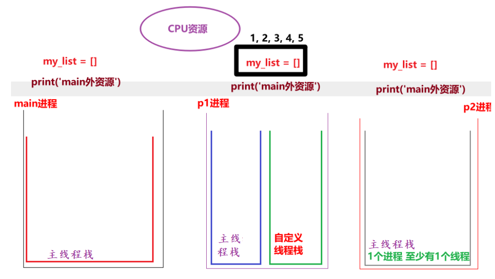
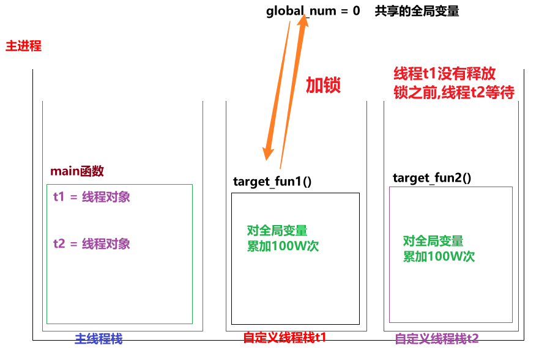

---
tags:
  - Python
  - 基础知识
date: 2026-06-18
updated: 2026-08-03
---

# 06. 并发编程

> 按“进程与线程 → 共享数据安全 → asyncio 协程”的顺序理解 Python 并发模型。

## 多进程与多线程


### 多任务简介

* 概述

  > 让多个任务"同时"执行, 目的是: 充分利用CPU资源, 提高程序的执行效率.

* 方式

  * 并发: 针对于单核CPU来讲, 多个任务同时请求执行时, CPU做高效切换即可.
  * 并行:针对于多核CPU来讲, 多个任务同时执行.

* 图解

  


### 单任务代码演示

```python
"""
案例: 演示单任务, 前边不执行完毕, 后边绝对无法执行.
"""

# 1.定义函数A, 输出10次 hello world
def func_a():
    for i in range(1000000):
        print("hello world")

# 2. 定义函数B, 输出10次 hello python
def func_b():
    for i in range(2):
        print("hello python")


func_a()
print('-' * 23)
func_b()

```

### 多进程入门案例

* 入门案例

  ```python
  """
  案例: 演示多进程入门案例.
  
  多进程目的:
      它属于多任务的一种实现方式, 目的是充分利用CPU资源, 提高程序执行效率.
  
  实现方式:
      1. 导包.
      2. 创建进程对象, 关联目标函数.
      3. 启动进程.
  """
  
  # 导包
  import multiprocessing
  import time
  
  # 1. 定义函数 表示 编写代码.
  def coding():
      for i in range(1, 11):
          time.sleep(0.1) # 可以模拟耗时操作, 更好的查看多任务的执行效果.
          print(f'正在敲第 {i} 遍代码!')
  
  
  # 2. 定义函数 表示 听音乐。
  def music():
      for i in range(1, 11):
          time.sleep(0.1)
          print(f'正在听第 {i} 遍音乐......')
  
  
  # 3. 创建两个进程对象, 分别关联上述的两个 目标函数.
  # 细节: 通过main进程(主进程)来创建子进程.
  if __name__ == '__main__':
      # 单任务
      # coding()
      # music()
      # 进程p1关联 coding函数, p1进程抢到(CPU资源了), 就会执行这个函数.
      p1 = multiprocessing.Process(target=coding)
      p2 = multiprocessing.Process(target=music)
  
      # 4. 启动进程. 大白话: 表示进程启动了, 就可以开始抢CPU资源了.
      p1.start()
      p2.start()
  ```

* 带参数的多进程代码

  ```python
  """
  案例: 演示带参数的多进程.
  
  进程传参有两种方式:
      方式1: args方式, 接受所有的 位置参数.
      方式2: kwargs方式, 接受所有的 关键字参数.
  """
  # 导包
  import multiprocessing, time
  
  # 需求: 小明一边敲代码, 一边听音乐.
  # 1. 定义函数, 表示敲代码.
  def coding(name, num):
      for i in range(1, num + 1):
          time.sleep(0.1)
          print(f'{name} 正在敲第 {i} 行代码...')
  
  # 2. 定义函数, 表示听音乐.
  def music(name, count):
      for i in range(1, count + 1):
          time.sleep(0.1)
          print(f'{name} 正在听第 {i} 首歌...........')
  
  # 3.创建主进程(主线程)
  if __name__ == '__main__':
      # 4. 创建两个子进程, 分别关联上述的目标函数.
      p1 = multiprocessing.Process(target=coding, args=('虚竹', 10))
      p2 = multiprocessing.Process(target=music, kwargs={'count': 20, 'name': '刘备'})
  
      # 5. 开启子进程.
      p1.start()
      p2.start()
  ```

### 获取进程编号

```python
"""
案例: 演示获取进程的编号.

进程的编号解释:
    概述:
        在设备中, 每个程序(进程)都有自己的唯一进程id, 当程序释放的时候, 该进程id也会释放. 即: 进程id是可以重复使用的.
    目的:
        1. 查看子进程和父进程的关系, 方便 管理.
        2. 例如: 杀死指定进程, 创建子进程...
    格式:
        查看当前进程的pid:
            os模块(operating, 系统模块) 的 getpid()        get Process id
            multiprocessing#current_process()的pid属性

        查看当前进程的ppid:        parent process id(父进程id)
            os#getppid()
细节:
    main中创建的进程, 如果没有特殊指定, 它的父进程都是main进程,
    而main进程的父进程是 PyCharm程序的pid
"""

# 导包
import multiprocessing, time
import os


# 需求: 小明一边敲代码, 一边听音乐.
# 1. 定义函数, 表示敲代码.
def coding(name, num):
    for i in range(1, num + 1):
        time.sleep(0.1)
        print(f'{name} 正在敲第 {i} 行代码...')
    print(f'p1进程的pid: {os.getpid()}, {multiprocessing.current_process().pid}, 父进程id(ppid为) : {os.getppid()}')


# 2. 定义函数, 表示听音乐.
def music(name, count):
    for i in range(1, count + 1):
        time.sleep(0.1)
        print(f'{name} 正在听第 {i} 首歌...........')
    print(f'p2进程的pid: {os.getpid()}, {multiprocessing.current_process().pid}, 父进程id(ppid为) : {os.getppid()}')


# 3.创建主进程(主线程)
if __name__ == '__main__':
    # 4. 创建两个子进程, 分别关联上述的目标函数.
    p1 = multiprocessing.Process(target=coding, args=('虚竹', 10))
    p2 = multiprocessing.Process(target=music, kwargs={'count': 20, 'name': '刘备'})

    # 5. 开启子进程.
    p1.start()
    p2.start()

    # 6. 查看主进程的信息.
    print(f'main进程的pid: {os.getpid()}, {multiprocessing.current_process().pid}, 父进程id(ppid为) : {os.getppid()}')
```

### 进程特点：数据隔离

* 图解

  

* 代码

  ```python
  """
  案例: 演示进程的特点.
  
  进程的特点:
      1. 进程之间数据是相互隔离的.
          因为子进程相当于是父进程的"副本", 会将父进程的"main外资源"拷贝一份, 即: 各是各的.
      2. 默认情况下, 主进程会等待子进程执行结束再结束.
  """
  import multiprocessing
  import time
  
  # 需求: 定义1个公共的容器 my_list = [], 一个进程往里边写数据, 另一个进程从里边读数据, 看是否能读取到.
  
  # 1. 定义1个公共的容器 my_list = []
  my_list = []
  
  # 2. 定义函数, 往容器中添加数据.
  def write_data():
      for i in range(1, 6):
          my_list.append(i)
          print(f'添加数据: {i}')
  
      # 走到这里, 说明添加完毕, 打印即可.
      print(f'write_data函数: {my_list}')   # [1, 2, 3, 4, 5]
  
  
  # 3. 定义函数, 从容器中读取数据.
  def read_data():
      time.sleep(3)
      print(f'read_data函数: {my_list}')   # []
  
  
  print('我是main外资源, 看我执行了几次')
  
  # 4. 测试
  if __name__ == '__main__':
      # 5. 创建两个子进程, 分别关联上述的两个函数.
      p1 = multiprocessing.Process(target=write_data)
      p2 = multiprocessing.Process(target=read_data)
  
      # 6. 启动进程.
      p1.start()
      p2.start()
      # print('我是main内资源, 看我执行了几次')
  ```

### 进程特点：守护进程

```python
"""
案例: 演示进程特点之 默认情况下, 主进程会等待子进程执行结束再结束.

进程的特点:
    1. 进程之间数据是相互隔离的.
        因为子进程相当于是父进程的"副本", 会将父进程的"main外资源"拷贝一份, 即: 各是各的.
    2. 默认情况下, 主进程会等待子进程执行结束再结束.
       如果要设置主进程结束, 子进程同步结束, 方式如下:
        思路1: 设置子进程为 守护进程.
        思路2: 强制关闭子进程.   可能会导致子进程变成僵尸进程, 交由Python 解释器自动回收(底层有 init初始化进程来管理维护).

"""
import multiprocessing
import time


# 导包


# 1.定义函数, 表示: 子进程的目标函数.
def work():
    for i in range(10):
        print('正在努力工作中...')
        time.sleep(0.2)


# 2.测试
if __name__ == '__main__':
    # 3. 创建子进程, 关联目标函数.
    # 细节: 进程的默认命名规则是: Process-编号, 编号是从1开始的.
    # p1 = multiprocessing.Process(target=work, name='刘亦菲')
    # print(f'p1进程的名字: {p1.name}')

    p1 = multiprocessing.Process(target=work)
    # 思路1: 设置p1为: 守护进程.
    p1.daemon = True    # 设置p1为: 守护进程.

    # 4.启动进程.
    p1.start()

    # 5.主进程(main)休眠1秒后, 结束.
    time.sleep(1)

    # 思路2: 强制关闭子进程.
    # p1.terminate()
    print('main进程结束了.')
```

### 线程入门

* 无参数

  ```python
  """
  案例: 线程入门案例, 一边听音乐, 一边写代码.
  
  
  线程的使用步骤:
      1. 导包
      2. 创建线程对象.
      3. 启动线程.
  
  
  线程和进程的关系:
      1. 进程是CPU分配资源的基本单位, 线程是CPU调度资源的最小单位.
      2. 线程是依附于进程的, 每个进程至少有1个线程(主线程栈)
      3. 进程间数据相互隔离, (同一个进程的)线程间数据可以共享.
  """
  
  # 导包
  import threading, time
  
  # 1. 定义函数, 表示: 敲代码.
  def coding():
      for i in range(1, 11):
          time.sleep(0.1)
          print(f'正在敲第 {i} 遍代码...')
  
  
  # 2. 定义函数, 表示: 听音乐.
  def music():
      for i in range(1, 11):
          time.sleep(0.1)
          print(f'正在听第 {i} 首音乐...')
  
  # 3. 测试
  if __name__ == '__main__':
      # 4. 创建两个线程对象, 分别关联上述的两个目标函数.
      t1 = threading.Thread(target=coding)
      t2 = threading.Thread(target=music)
  
  
      # 5. 启动线程.
      t1.start()
      t2.start()
  
  ```

* 带参数

  ```python
  """
  案例: 线程入门案例, 一边听音乐, 一边写代码.
  
  
  线程的使用步骤:
      1. 导包
      2. 创建线程对象.
      3. 启动线程.
  
  
  线程和进程的关系:
      1. 进程是CPU分配资源的基本单位, 线程是CPU调度资源的最小单位.
      2. 线程是依附于进程的, 每个进程至少有1个线程(主线程栈)
      3. 进程间数据相互隔离, (同一个进程的)线程间数据可以共享.
  """
  
  # 导包
  import threading, time
  
  # 1. 定义函数, 表示: 敲代码.
  def coding(name, num):
      for i in range(1, num + 1):
          time.sleep(0.1)
          print(f' {name} 正在敲第 {i} 遍代码...')
  
  
  # 2. 定义函数, 表示: 听音乐.
  def music(name, count):
      for i in range(1, count + 1):
          time.sleep(0.1)
          print(f' {name} 正在听第 {i} 首音乐*********')
  
  # 3. 测试
  if __name__ == '__main__':
      # 4. 创建两个线程对象, 分别关联上述的两个目标函数.
      t1 = threading.Thread(target=coding, args=('李想', 100))
      t2 = threading.Thread(target=music, kwargs={'count':50, 'name':'周力'})
  
      # 5. 启动线程.
      t1.start()
      t2.start()
  ```

## 线程安全与同步


### 多线程特点：执行顺序不确定

```python
"""
案例: 演示多线程特点.

多线程特点:
    1. 线程执行具有随机性, 原因是因为CPU在做着高效的切换.
    2. 默认情况下, 主线程会等待子线程结束再结束.
    3. (同一个进程的)线程间 数据共享。
    4. 多线程操作共享数据， 可能会出现安全问题， 可以用 互斥锁解决。

CPU调度资源的策略：
    1.均分时间片
    2.抢占式调度
"""
# 需求: 创建多个线程, 多次运行, 观察结果.

# 导包
import threading
import time


# 1.定义多线程的目标函数.
def print_info():
    # 1.1 休眠
    time.sleep(0.2)
    # 1.2 获取当前线程对象.
    current_thread = threading.current_thread()
    # 1.3 打印当前线程的名字.
    print(current_thread.name)

# 2. 测试
if __name__ == '__main__':
    # 2.1 创建10个线程, 观察其运行效果.
    for i in range(10):
        t = threading.Thread(target=print_info)
        t.start()
```

### 多线程特点：守护线程

```python
"""
案例: 演示多线程特点之 守护线程.

多线程特点:
    1. 线程执行具有随机性, 原因是因为CPU在做着高效的切换.
    2. 默认情况下, 主线程会等待子线程结束再结束.
    3. (同一个进程的)线程间 数据共享。
    4. 多线程操作共享数据， 可能会出现安全问题， 可以用 互斥锁解决。

"""
# 导包
import threading, time

# 1.定义目标函数.
def work():
    for i in range(10):
        time.sleep(0.2)
        print('工作中...')


# 2. 测试.
if __name__ == '__main__':
    # 2.1 创建(子)线程对象.
    # (守护线程)写法1: daemon属性
    # t = threading.Thread(target=work, daemon=True)

    # (守护线程)写法2: setDaemon()函数, 已过时(暂时还支持, 以后的新版本中可能会被移除掉).
    # t = threading.Thread(target=work)
    # t.setDaemon(True)

    # (守护线程)写法3: daemon属性
    t = threading.Thread(target=work)
    t.daemon = True

    # 2.2 启动线程.
    t.start()

    # 2.3 设置主线程休眠时间1秒
    time.sleep(1)
    # 2.4 设置主线程的结束标记.
    print('主线程结束了!')

```

### 多线程特点：共享数据

```python
"""
案例: 演示多线程特点之 数据共享.

多线程特点:
    1. 线程执行具有随机性, 原因是因为CPU在做着高效的切换.
    2. 默认情况下, 主线程会等待子线程结束再结束.
    3. (同一个进程的)线程间 数据共享。
    4. 多线程操作共享数据， 可能会出现安全问题， 可以用 互斥锁解决。

"""

# 需求: 定义全局变量my_list = [], 定义两个目标函数分别实现添加, 查看数据. 最后创建两个线程, 分别执行对应的任务, 观察结果.

# 导包
import threading, time

# 1.定义全局变量
my_list = []

# 2. 定义目标函数, 添加数据.
def write_data():
    for i in range(1, 6):
        my_list.append(i)
        print("写入数据: ", i)
    print(f'write_data函数: {my_list}')

# 3. 定义目标函数, 查看数据.
def read_data():
    # 休眠, 即: 等待write_data()执行结束在结束.
    time.sleep(2)
    print(f'read_data函数: {my_list}')

# 4. 测试
if __name__ == '__main__':
    # 4.1 创建线程对象, 并且启动线程.
    t1 = threading.Thread(target=write_data)
    t2 = threading.Thread(target=read_data)

    # 4.2 启动线程.
    t1.start()
    t2.start()

```

### 多线程特点：互斥锁

* 图解

  

* 代码

  ```python
  """
  案例: 演示多线程共享全局变量, 可能出现的问题.
  
  多线程共享全局变量, 出现问题的问题:
      累加次数不够.
  产生原因:
      线程1还没有来记得执行完(一个完整的动作)前, 被线程2抢走了资源, 就可能出问题.
  解决方案:
      加锁思想, 即: 互斥锁.
  
  细节:
      使用互斥锁的时候, 要在合适的时机释放所, 否则可能出现 死锁 或者 锁不住的情况.
  """
  
  # 需求: 定义两个函数, 分别对全局变量累加100W次, 创建两个线程, 关联这两个函数, 执行看效果.
  # 导包
  import threading
  
  # 1.定义全局变量.
  global_num = 0
  
  # 创建线程锁.
  mutex = threading.Lock()
  # mutex2 = threading.Lock()
  
  # 2.定义目标函数1, 对全局变量累加100W次.
  def target_fun1():
      mutex.acquire()     # 加锁
      # 2.1 声明为全局变量
      global global_num
      # 2.2 遍历100W次, 对全局变量进行累加.
      for i in range(1000000):
          # 2.3 具体的累加动作
          global_num += 1
      # 2.4 累加完毕后, 打印结果.
      print(f'target_fun1函数结果: {global_num}')
      mutex.release()     # 释放锁
  
  # 3.定义目标函数2, 对全局变量累加100W次.
  def target_fun2():
      mutex.acquire()  # 加锁
      global global_num
      for i in range(1000000):
          global_num += 1
      print(f'target_fun2函数结果: {global_num}')
      mutex.release() # 释放锁
  
  # 4.测试.
  if __name__ == '__main__':
      # 4.1 创建两个线程, 分别关联上述的两个目标函数.
      t1 = threading.Thread(target=target_fun1)
      t2 = threading.Thread(target=target_fun2)
  
      # 4.2 开启线程.
      t1.start()
      t2.start()
  ```

### 进程和线程对比

> ```python
> 进程和线程的区别:
>     1. 进程拥有独立地址空间；线程是进程内的执行单元，同一进程的线程共享大部分内存和资源.
>     2. 不同进程的普通全局变量彼此独立，但仍可通过队列、管道、共享内存等 IPC 机制交换数据.
>     3. 线程创建和切换通常更轻量，但共享可变状态会带来竞态条件，需要锁或其他同步手段.
>     4. 默认 CPython 中，纯 Python 的 CPU 密集计算通常受 GIL 限制；多线程更常用于阻塞 I/O.
> ```

## asyncio 异步编程


> Python 标准库中的异步编程框架，用单线程实现高并发

### 1. 什么是异步编程？

#### 1.1 同步 vs 异步

```python
# 同步：一件事做完再做下一件
print("任务1")    # 等10秒
print("任务2")    # 等10秒
print("任务3")    # 等10秒
# 总耗时：30秒

# 异步：三件事同时进行
# 任务1、2、3同时启动，谁先完成谁先输出
# 总耗时：10秒
```

#### 1.2 通俗比喻

| 概念 | 比喻 |
|------|------|
| 同步 | 你一个人去超市，买完菜再买肉再买水果 |
| 多线程 | 你派3个人同时去超市，每人买一样 |
| 异步 | 你一个人去超市，买菜的时候顺手拿肉，不用等买完菜再去买肉 |

**核心区别：**
- **多线程**：多个"人"（线程）同时干活
- **异步**：一个人在等待时去做别的事（不浪费等待时间）

### 2. 基础语法：async 和 await

#### 2.1 定义协程函数

```python
import asyncio

# 普通函数
def normal_func():
    return "hello"

# 协程函数：用 async 修饰
async def coroutine_func():
    return "hello"

# 调用方式不同
normal_func()                    # 直接调用
coroutine_func()                 # ❌ 这样不会执行！返回协程对象
await coroutine_func()           # ✅ 必须用 await 才能执行
asyncio.run(coroutine_func())    # ✅ 或者用 asyncio.run() 启动
```

#### 2.2 await 的含义

`await` 的意思是：**"这个操作需要等待，我先让出控制权，等它好了再回来继续。"**

```python
async def fetch_data():
    print("开始获取数据...")
    await asyncio.sleep(2)    # 等待2秒，但不阻塞其他协程
    print("数据获取完成")
    return {"name": "三体"}
```

#### 2.3 关键区别：await vs time.sleep

```python
import asyncio
import time

async def task(name, seconds):
    print(f"{name} 开始")
    await asyncio.sleep(seconds)    # ✅ 异步等待，不阻塞
    # time.sleep(seconds)          # ❌ 同步等待，会阻塞！
    print(f"{name} 完成")

async def main():
    start = time.time()
    await task("任务A", 2)
    await task("任务B", 2)
    await task("任务C", 2)
    print(f"总耗时: {time.time() - start:.1f}秒")

asyncio.run(main())
# 输出：总耗时: 6.0秒（顺序执行，因为没有并发）
```

### 3. 并发执行：asyncio.gather

#### 3.1 基本用法

```python
import asyncio
import time

async def task(name, seconds):
    print(f"{name} 开始")
    await asyncio.sleep(seconds)
    print(f"{name} 完成")
    return f"{name}的结果"

async def main():
    start = time.time()
    # gather：同时执行多个协程
    results = await asyncio.gather(
        task("任务A", 2),
        task("任务B", 2),
        task("任务C", 2),
    )
    print(f"总耗时: {time.time() - start:.1f}秒")
    print(f"结果: {results}")

asyncio.run(main())
# 输出：
# 任务A 开始
# 任务B 开始
# 任务C 开始
# 任务A 完成
# 任务B 完成
# 任务C 完成
# 总耗时: 2.0秒（并发执行，只花了2秒！）
# 结果: ['任务A的结果', '任务B的结果', '任务C的结果']
```

#### 3.2 gather vs create_task

```python
async def main():
    # 方式1：gather（推荐，简单直接）
    results = await asyncio.gather(
        task("A", 2),
        task("B", 2),
    )

    # 方式2：create_task（更灵活，可以单独控制）
    task_a = asyncio.create_task(task("A", 2))
    task_b = asyncio.create_task(task("B", 2))
    # 可以在这里做其他事情...
    results = await asyncio.gather(task_a, task_b)
```

### 4. 事件循环（Event Loop）

#### 4.1 什么是事件循环？

事件循环是 asyncio 的"心脏"，它负责：
1. **调度**：决定下一个运行哪个协程
2. **执行**：运行协程代码
3. **等待**：在 I/O 等待时切换到其他协程

```python
import asyncio

# 方式1：asyncio.run()（推荐，自动管理事件循环）
async def main():
    print("Hello")
    await asyncio.sleep(1)
    print("World")

asyncio.run(main())

# 方式2：需要多次运行顶层协程时，可显式使用 Runner（Python 3.11+）
with asyncio.Runner() as runner:
    runner.run(main())
```

#### 4.2 执行流程图

```text
asyncio.run(main())
         ↓
    ┌─────────────────┐
    │   事件循环启动   │
    └─────────────────┘
         ↓
    ┌─────────────────┐
    │  执行 main()    │
    └─────────────────┘
         ↓
    ┌─────────────────┐
    │  await sleep()  │ ← 遇到等待，让出控制权
    └─────────────────┘
         ↓
    ┌─────────────────┐
    │  执行其他协程    │ ← 事件循环调度其他任务
    └─────────────────┘
         ↓
    ┌─────────────────┐
    │  sleep() 完成   │ ← 回来继续执行
    └─────────────────┘
         ↓
    ┌─────────────────┐
    │   事件循环结束   │
    └─────────────────┘
```

### 5. 异步上下文管理器：async with

```python
import asyncio

# 自定义异步上下文管理器
class AsyncDatabase:
    async def __aenter__(self):
        print("打开数据库连接")
        await asyncio.sleep(0.5)  # 模拟连接耗时
        return self

    async def __aexit__(self, exc_type, exc_val, exc_tb):
        print("关闭数据库连接")
        await asyncio.sleep(0.5)  # 模拟关闭耗时

    async def query(self, sql):
        await asyncio.sleep(0.1)  # 模拟查询耗时
        return f"结果: {sql}"

async def main():
    async with AsyncDatabase() as db:
        result = await db.query("SELECT * FROM users")
        print(result)

asyncio.run(main())
# 输出：
# 打开数据库连接
# 结果: SELECT * FROM users
# 关闭数据库连接
```

### 6. 异步迭代器：async for

```python
import asyncio

# 异步生成器
async def async_range(n):
    for i in range(n):
        await asyncio.sleep(0.1)  # 模拟异步操作
        yield i

async def main():
    async for num in async_range(5):
        print(num)

asyncio.run(main())
# 输出：0, 1, 2, 3, 4（每个间隔0.1秒）
```

### 7. 实际应用场景

#### 7.1 并发请求多个网页

```python
import asyncio
import aiohttp  # 需要安装：pip install aiohttp

async def fetch_url(url):
    async with aiohttp.ClientSession() as session:
        async with session.get(url) as response:
            return await response.text()

async def main():
    urls = [
        "https://example.com",
        "https://example.org",
        "https://example.net",
    ]
    # 并发请求三个网页
    tasks = [fetch_url(url) for url in urls]
    results = await asyncio.gather(*tasks)
    print(f"获取了 {len(results)} 个网页")

asyncio.run(main())
```

#### 7.2 并发处理数据库查询

```python
import asyncio

async def get_user(user_id):
    await asyncio.sleep(0.5)  # 模拟数据库查询
    return {"id": user_id, "name": f"用户{user_id}"}

async def main():
    # 并发查询多个用户
    user_ids = [1, 2, 3, 4, 5]
    tasks = [get_user(uid) for uid in user_ids]
    users = await asyncio.gather(*tasks)
    for user in users:
        print(user)

asyncio.run(main())
# 5个查询同时进行，总耗时约0.5秒（而不是2.5秒）
```

#### 7.3 生产者-消费者模型

```python
import asyncio
import random

async def producer(queue):
    """生产者：往队列里放数据"""
    for i in range(10):
        await asyncio.sleep(random.uniform(0.1, 0.5))
        item = f"产品{i}"
        await queue.put(item)
        print(f"生产: {item}")

async def consumer(queue, name):
    """消费者：从队列里取数据"""
    while True:
        item = await queue.get()
        try:
            if item is None:
                return
            print(f"{name} 消费: {item}")
            await asyncio.sleep(random.uniform(0.1, 0.3))  # 模拟处理
        finally:
            queue.task_done()

async def main():
    queue = asyncio.Queue()
    consumers = [
        asyncio.create_task(consumer(queue, "消费者A")),
        asyncio.create_task(consumer(queue, "消费者B")),
    ]

    await producer(queue)
    await queue.join()  # 等待 10 个产品处理完毕

    # 每个消费者都需要一个结束信号，否则会有消费者永久等待。
    for _ in consumers:
        await queue.put(None)
    await asyncio.gather(*consumers)

asyncio.run(main())
```

### 8. asyncio vs 多线程

| 特性        | asyncio            | 多线程                  |
| --------- | ------------------ | -------------------- |
| **原理**    | 常见模式是单线程事件循环上的协作式任务切换 | 操作系统线程抢占式调度 |
| **适用场景**  | 大量可异步等待的 I/O | 阻塞 I/O、需要调用同步库的并发任务 |
| **CPU 密集任务** | 会阻塞事件循环，应交给进程池、线程池或原生扩展 | 默认 CPython 受 GIL 影响，纯 Python 计算通常不能靠多线程获得多核加速 |
| **资源消耗**  | 单个任务通常较轻，但仍有调度和对象开销 | 每个线程需要线程栈，并产生调度开销 |
| **编程模型** | 需要 async/await，依赖库也必须支持异步 | 可复用同步函数，但共享状态需要同步机制 |
| **数据安全**  | 协程也可能在 await 处交错，仍会出现逻辑竞态 | 多线程访问共享可变状态时通常需要锁 |

> Python 3.14 仍以带 GIL 的 CPython 构建为常见默认；可选的 free-threaded 构建会改变部分多线程性能特征。选型应以实际解释器、依赖库和基准测试为准。

#### 什么时候用 asyncio？

```python
# ✅ 适合 asyncio：I/O 密集型
async def fetch_data():
    async with aiohttp.ClientSession() as session:
        async with session.get(url) as resp:
            return await resp.json()

# ❌ 不适合 asyncio：CPU 密集型
def heavy_computation():
    # 这种计算密集型任务，asyncio 帮不上忙
    return sum(i * i for i in range(1000000))
```

### 9. 常见错误

#### 9.1 忘记 await

```python
async def main():
    result = fetch_data()    # ❌ 忘记 await，result 是协程对象
    result = await fetch_data()  # ✅ 正确
```

#### 9.2 在同步代码中使用 await

```python
def normal_func():
    await asyncio.sleep(1)  # ❌ 普通函数里不能用 await

async def async_func():
    await asyncio.sleep(1)  # ✅ 只有 async 函数里才能用 await
```

#### 9.3 阻塞事件循环

```python
async def main():
    time.sleep(5)            # ❌ 这会阻塞整个事件循环！
    await asyncio.sleep(5)   # ✅ 异步等待，不阻塞
```

### 10. 总结

| 语法 | 作用 |
|------|------|
| `async def` | 定义协程函数 |
| `await` | 等待异步操作完成，让出控制权 |
| `asyncio.run()` | 启动事件循环，运行协程 |
| `asyncio.gather()` | 并发执行多个协程 |
| `asyncio.create_task()` | 创建异步任务 |
| `async with` | 异步上下文管理器 |
| `async for` | 异步迭代器 |

**一句话记住：**
**asyncio 就是让程序在"等待"的时候去做别的事，而不是傻等。**


---

[上一步：05.闭包与装饰器](05.闭包与装饰器.md) [下一步：07.Socket网络编程](07.Socket网络编程.md) [返回总索引](关于Python进阶.md)
