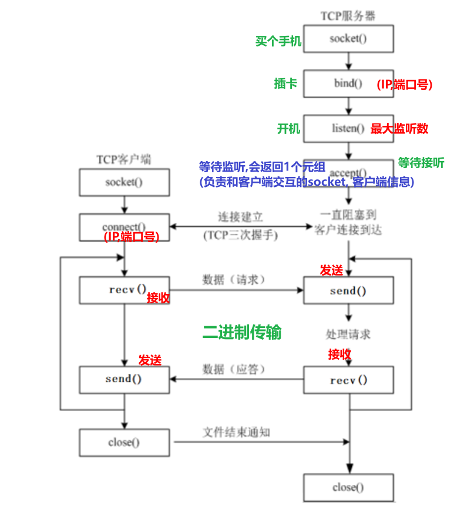

---
tags:
  - Python
  - 基础知识
date: 2026-06-18
updated: 2026-08-03
---

# 07. Socket 网络编程

## 网络编程介绍

* 概述

  > 就是用来实现网络互联的    不同计算机上 运行的程序间  可以进行数据交互.

* 三要素：IP地址、端口号、协议

  * IP 地址：标识网络接口在某个网络中的地址；私有地址可能在不同局域网重复，经过 NAT 后也不等同于设备的永久唯一标识

    > 分类:
    >
    > IPv4：4 字节（32 位），通常写成点分十进制，例如 `192.168.88.100`
    >
    > IPv6：16 字节（128 位），通常写成冒号分隔的十六进制
    >
    > 两个DOS命令:
    >
    > ​	查看IP: 
    >
    > ​		windows: ipconfig
    >
    > Linux：`ip addr`（`ifconfig` 属于较旧工具）；macOS：`ifconfig`
    >
    > ​	测试网络连接:
    >
    > ​		ping ip地址 或者 域名

  * 端口号：与 IP 地址和传输层协议共同定位网络端点；它不是程序的全局唯一标识.

    > 范围为 0～65535。端口 0 通常用于让系统自动分配；1～1023 是知名端口，在类 Unix 系统监听这些端口通常需要额外权限。示例应选择未被占用的高位端口.

  * 协议: 传输规则, 规范.

    > 常用的协议:
    >
    > ​	TCP(这个用的最多) 和 UDP
    >
    > TCP特点:
    >
    > 1. 面向连接.
    >
    > 2. 提供有序、可靠的字节流，但没有消息边界；一次 `send` 不一定对应一次 `recv`.
    >
    > 3. “可靠”不等于“安全”：TCP 本身不提供加密、身份认证或防篡改，需要 TLS 等上层协议.
    >
    > 4. 相比 UDP 有连接建立、确认、重传和拥塞控制等额外开销.
    >
    > 5. 通常由服务端监听，客户端主动发起连接；连接建立后双方都能收发数据.

> 下面的例子用于理解 Socket API。真实协议必须设计消息边界（固定长度、分隔符或“长度头 + 数据”），并考虑超时、认证、加密、限流和最大消息尺寸。

## 入门创建Socket对象

```python
"""
案例: 演示socket对象的创建.

网络编程介绍:
    概述:
        网络编程也叫网络通信, Socket通信, 即: 通信双方都独有自己的Socket对象,
        数据在Socket之间通过 数据报包(UDP协议) 或者 字节流(TCP协议) 的形式进行传输.
    大白话举例:
        你和你遥远的朋友在聊天, 看看这你们两个人在交互, 其实是通过 两部手机(双方各自的手机)来交互的.
"""

# 导包
import socket

# 创建Socket对象
# 参1: Address Family, 地址族, 即: Ipv4 还是 IpV6, 默认值: AF_INET(ipv4)    AF_INET6(ipv6)
# 参2: Socket Type, Socket类型, 即: TCP 还是 UDP, 默认值: SOCK_STREAM(TCP)   SOCK_DGRAM(UDP)
socket_obj = socket.socket(socket.AF_INET, socket.SOCK_STREAM)
print(socket_obj)
```

## 网络案例：收发一条消息

* 图解

  

* 服务器端代码

  ```python
  """
  案例: 网编入门案例, 服务器端给客户端发送消息, 客户端给出回执信息.
  
  服务器端开发流程:
      1. 创建服务器端Socket对象.
      2. 绑定IP地址和端口号.
      3. 设置最大监听数.
      4. 等待客户端申请建立连接.
      5. 给客户端发送消息.
      6. 接收客户端的信息并打印.
      7. 释放资源.
  
  细节:
      客户端和服务器端是通过 字节流(bytes) 的形式实现的.
  """
  import socket

  HOST = "127.0.0.1"  # 仅允许本机连接；对外服务可按需使用 0.0.0.0
  PORT = 10086

  with socket.socket(socket.AF_INET, socket.SOCK_STREAM) as server_socket:
      server_socket.setsockopt(socket.SOL_SOCKET, socket.SO_REUSEADDR, 1)
      server_socket.bind((HOST, PORT))
      server_socket.listen(5)

      accept_socket, client_info = server_socket.accept()
      with accept_socket:
          accept_socket.sendall(b"Welcome To Socket!")
          data = accept_socket.recv(1024)
          print(f"服务器端收到来自 {client_info} 的信息: {data.decode('utf-8')}")
  ```

* 客户端代码

  ```python
  """
  案例: 网编入门案例, 服务器端给客户端发送消息, 客户端给出回执信息.
  
  客户端开发流程:
      1. 创建客户端Socket对象.
      2. 连接服务器端, 指定: 服务器端IP, 端口号.
      3. 接收服务器端的信息并打印.
      4. 给服务器端发送消息.
      5. 释放资源.
  
  细节:
      客户端和服务器端是通过 字节流(bytes) 的形式实现的.
  """
  import socket

  HOST = "127.0.0.1"
  PORT = 10086

  with socket.create_connection((HOST, PORT), timeout=5) as client_socket:
      data = client_socket.recv(1024)
      print(f"客户端收到: {data.decode('utf-8')}")
      client_socket.sendall("Socket 很好玩，也很有趣！".encode("utf-8"))
  ```

## 网络案例：模拟并发服务端

```python
"""
案例: 网编入门案例, 服务器端给客户端发送消息, 客户端给出回执信息.

服务器端开发流程:
    1. 创建服务器端Socket对象.
    2. 绑定IP地址和端口号.
    3. 设置最大监听数.
    4. 等待客户端申请建立连接.
    5. 给客户端发送消息.
    6. 接收客户端的信息并打印.
    7. 释放资源.

细节:
    客户端和服务器端是通过 字节流(bytes) 的形式实现的.
"""
import socket
from concurrent.futures import ThreadPoolExecutor

HOST = "127.0.0.1"
PORT = 10086

def handle_client(client_socket, client_info):
    """处理一个连接；协议仍是教学用的一问一答。"""
    with client_socket:
        try:
            client_socket.sendall(b"Welcome To Socket!")
            data = client_socket.recv(1024)
            if data:
                print(f"服务器端收到来自 {client_info} 的信息: {data.decode('utf-8')}")
        except (OSError, UnicodeDecodeError) as exc:
            print(f"处理 {client_info} 失败: {exc}")

with socket.socket(socket.AF_INET, socket.SOCK_STREAM) as server_socket:
    # 必须在 bind() 前设置端口复用。
    server_socket.setsockopt(socket.SOL_SOCKET, socket.SO_REUSEADDR, 1)
    server_socket.bind((HOST, PORT))
    server_socket.listen(20)

    with ThreadPoolExecutor(max_workers=20) as pool:
        while True:
            client_socket, client_info = server_socket.accept()
            pool.submit(handle_client, client_socket, client_info)
```

## 扩展：编解码

```python
"""
案例: 演示编解码.

细节:
    1. 编码：按照指定字符编码把 str 转换为 bytes，例如 '文本'.encode('utf-8').
    2. 解码：按照指定字符编码把 bytes 转换为 str，例如 data.decode('utf-8').
    3. 读写双方必须约定同一种编码；乱码也可能与数据损坏、错误处理策略或显示环境有关.
    4. 字符数不等于字节数。UTF-8 中 ASCII 字符占 1 字节，常用汉字通常占 3 字节；其他编码规则不同.
    5. bytes 字面量只能直接包含 ASCII 字符；中文应先写成 str 再调用 encode().
"""

# 需求1: 编码.
# s1 = '黑马'
s1 = '黑马123abCD!@#'

print(s1.encode())          # b'\xe9\xbb\x91\xe9\xa9\xac123abCD!@#'
print(s1.encode('utf-8'))   # b'\xe9\xbb\x91\xe9\xa9\xac123abCD!@#'
print(s1.encode('gbk'))     # b'\xba\xda\xc2\xed123abCD!@#'
print('-' * 23)

# 需求2: 解码
bys = b'\xe9\xbb\x91\xe9\xa9\xac123abCD!@#'
print(type(bys))    # <class 'bytes'>

s2 = bys.decode()
s3 = bys.decode('utf-8')
print(s2)
print(s3)
print('-' * 23)

wrong_text = bys.decode('gbk', errors='replace')
print(wrong_text)  # 使用错误编码可能得到乱码，也可能直接抛出 UnicodeDecodeError.
```

## 网络案例：文件上传

* 图解

  

* 服务器端代码

  ```python
  """
  案例: 文件上传案例, 服务器端代码.
  
  回顾: 网编服务器端实现流程.
      1. 创建服务器端Socket对象.
      2. 绑定ip 和 端口号.
      3. 设置最大监听数.
      4. 等待客户端申请建立连接
      5. 读取客户端上传的(文件)数据, 写到目的地文件
      6. 释放资源.
  """
  
  import socket

  HOST = "127.0.0.1"
  PORT = 6666

  with socket.socket(socket.AF_INET, socket.SOCK_STREAM) as server_socket:
      server_socket.setsockopt(socket.SOL_SOCKET, socket.SO_REUSEADDR, 1)
      server_socket.bind((HOST, PORT))
      server_socket.listen(5)

      accept_socket, client_info = server_socket.accept()
      with accept_socket, open("./data/upload.bin", "wb") as dest_f:
          while chunk := accept_socket.recv(8192):
              dest_f.write(chunk)

      print(f"已接收来自 {client_info} 的文件")
  ```

* 客户端

  ```python
  """
  案例: 文件上传客户端。读取本地文件并把字节流发送到服务器.
  
  客户端开发流程:
      1. 创建客户端Socket对象.
      2. 连接服务器端, 指定: 服务器端IP, 端口号.
      3. 分块读取并发送文件.
      4. 关闭写方向，通知服务端数据发送完毕.
  
  细节:
      客户端和服务器端是通过 字节流(bytes) 的形式实现的.
  """
  import socket

  HOST = "127.0.0.1"
  PORT = 6666  # 必须与上传服务端一致

  with socket.create_connection((HOST, PORT), timeout=5) as client_socket:
      with open("./data/source.bin", "rb") as source_f:
          while chunk := source_f.read(8192):
              client_socket.sendall(chunk)
      client_socket.shutdown(socket.SHUT_WR)
  ```

## 扩展：并发文件上传服务端

```python
import socket
from concurrent.futures import ThreadPoolExecutor
from pathlib import Path
from uuid import uuid4

HOST = "127.0.0.1"
PORT = 6666
MAX_FILE_SIZE = 100 * 1024 * 1024  # 100 MiB
UPLOAD_DIR = Path("uploads")
UPLOAD_DIR.mkdir(parents=True, exist_ok=True)

def receive_file(client_socket, client_info):
    # 服务端生成文件名，避免客户端路径造成目录穿越。
    destination = UPLOAD_DIR / f"upload-{uuid4().hex}.bin"
    received = 0

    try:
        with client_socket, destination.open("xb") as dest_f:
            while chunk := client_socket.recv(8192):
                received += len(chunk)
                if received > MAX_FILE_SIZE:
                    raise ValueError("文件超过大小限制")
                dest_f.write(chunk)
        print(f"{client_info} 上传完成: {destination} ({received} bytes)")
    except (OSError, ValueError) as exc:
        destination.unlink(missing_ok=True)  # 只清理本次未完成的随机命名文件
        print(f"{client_info} 上传失败: {exc}")

with socket.socket(socket.AF_INET, socket.SOCK_STREAM) as server_socket:
    server_socket.setsockopt(socket.SOL_SOCKET, socket.SO_REUSEADDR, 1)
    server_socket.bind((HOST, PORT))
    server_socket.listen(20)

    with ThreadPoolExecutor(max_workers=8) as pool:
        while True:
            client_socket, client_info = server_socket.accept()
            pool.submit(receive_file, client_socket, client_info)
```

> 这仍是教学协议：它没有传输文件名、长度、哈希、认证或加密。生产系统应优先使用 HTTPS 对象存储/上传接口；如果自定义 TCP 协议，必须加入明确的消息格式、超时、完整性校验、访问控制与 TLS。

---

[上一步：06.并发编程](06.并发编程.md) [下一步：08.正则表达式](08.正则表达式.md) [返回总索引](关于Python进阶.md)
