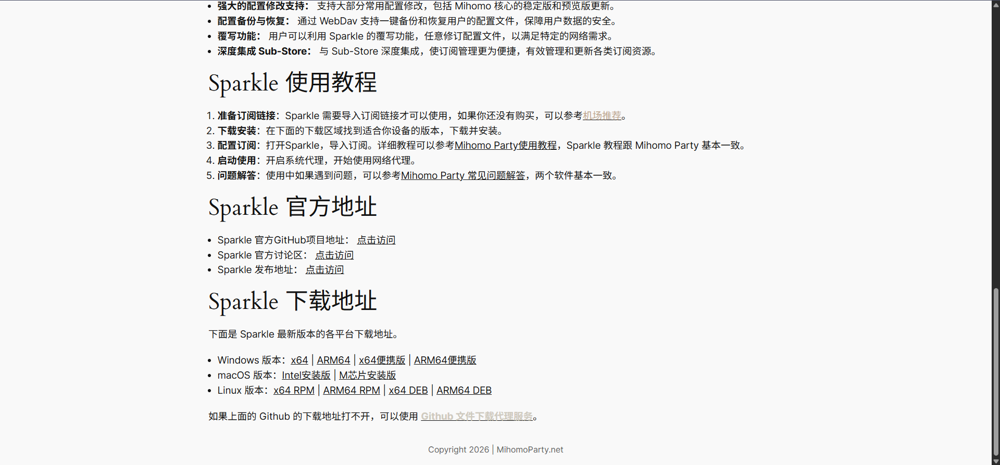
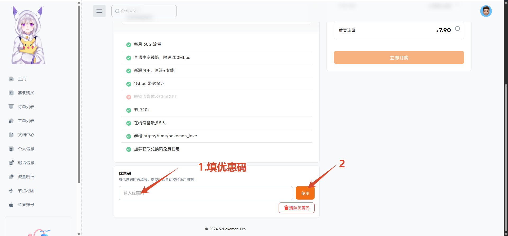
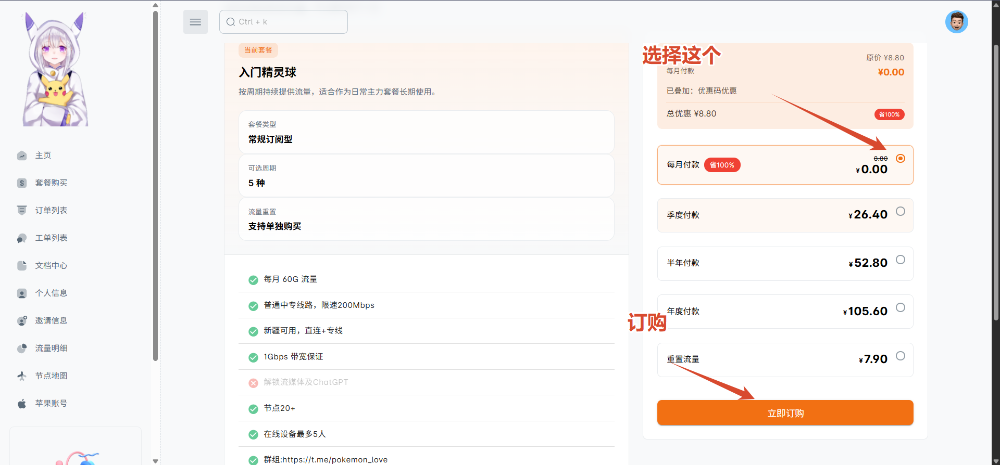
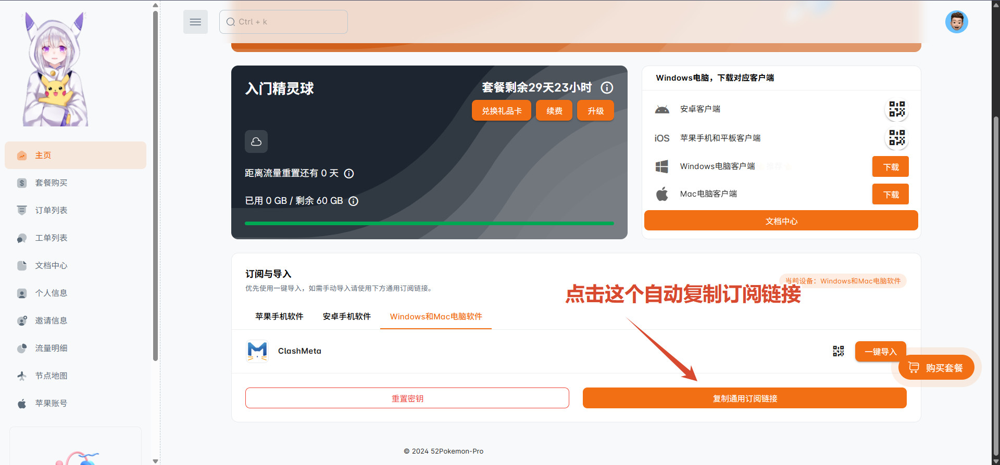
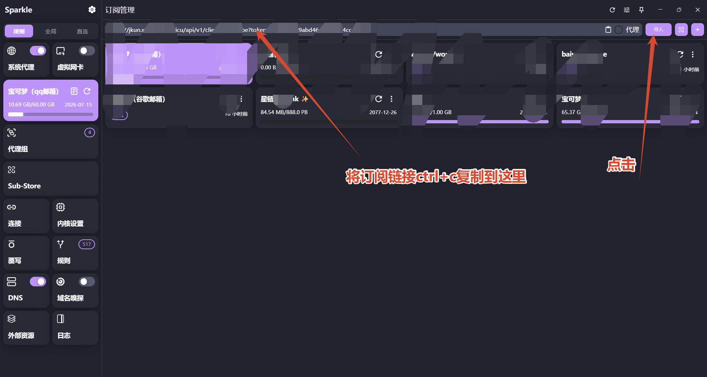
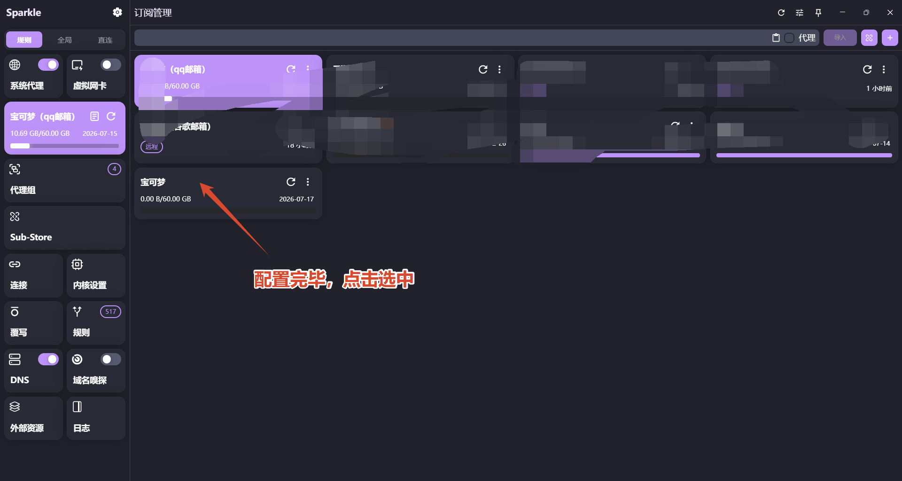
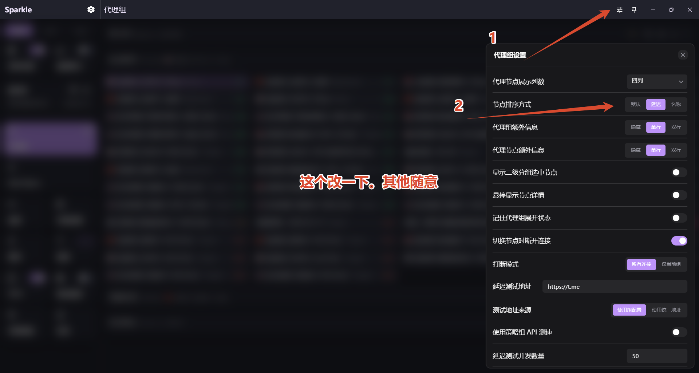
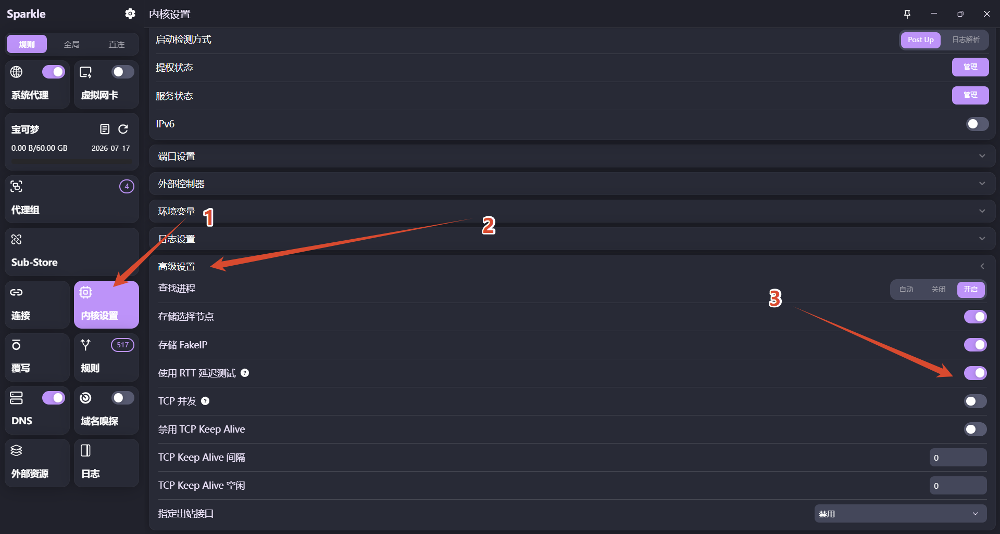
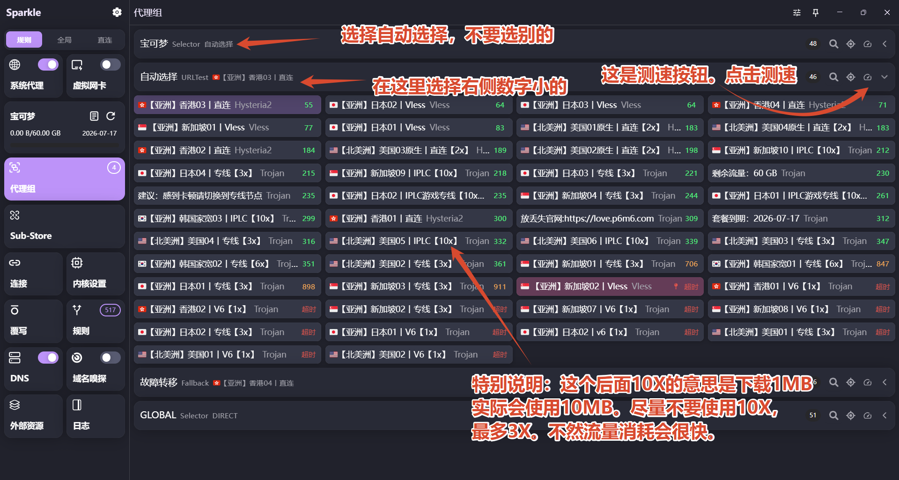

# 博主在这里交流一下现在使用的翻墙工具，翻墙节点和翻墙网址

## 前言
博主使用的是[Sparkle](https://mihomoparty.net/sparkle/)这个软件。该软件有Windows 版本，macOS 版本，Linux 版本。各位按需使用。

博主的电脑是win。所以只使用过win版。另外两个版本没用过就不提了（如果有其他系统用户使用过觉得好用欢迎使用邮箱联系博主谈谈使用感受）。

博主之前用过[Clash Verge](https://github.com/clash-verge-rev/clash-verge-rev/releases)，现在转用Sparkle了。因为有人说Clash Verge曾存在严重 bug（会导致启动菜单丢失）。推荐我换掉。因此我换成了Sparkle。

## 安装
如图下图所示。点击上方链接进入Sparkle官网。寻找符合你电脑的可用版本

下载安装包并成功安装后，需要去机场购买节点。上图中有机场推荐。没用过不推荐。博主在这里推荐一个免费的机场[宝可梦](https://web2.52pokemon.cc/login)

## 宝可梦
点击上方宝可梦链接进入宝可梦注册，使用邮箱注册一个账号。密码别忘了，每个月都要上一次。

## Sparkle配置
按照上图所示得到订阅链接后，打开Sparkle。

按照以上操作即可。最后打开Sparkle左上角系统代理。左边那几个方块可以拖动调换位置。按照你的喜好来摆放即可。

网速说明：

## 结尾
这是针对小白的教程.希望可以帮到大家！
