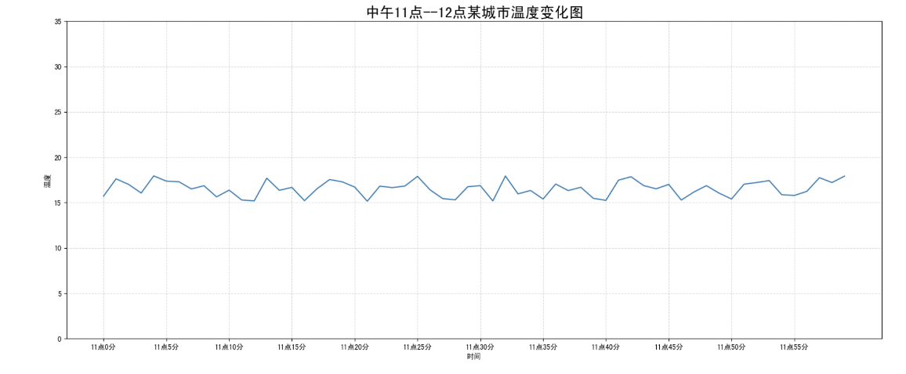
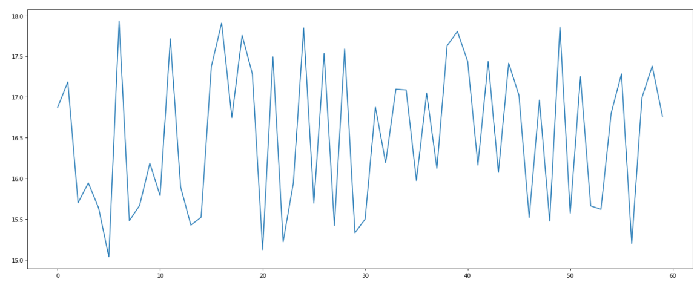
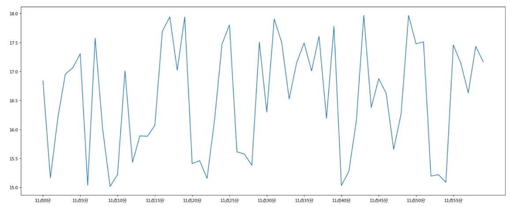
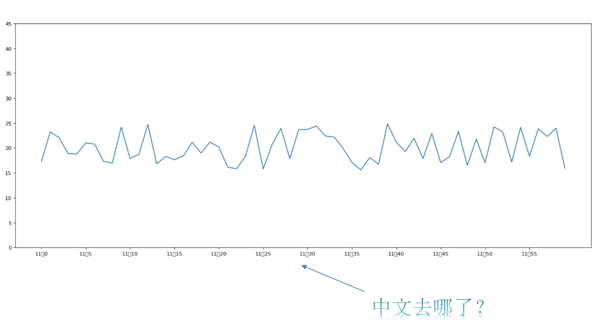
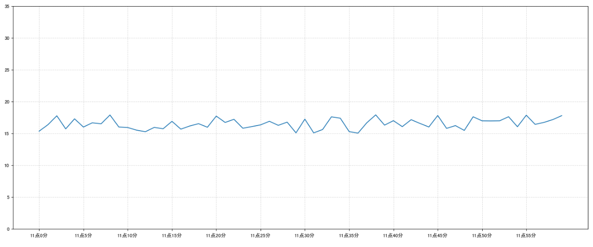
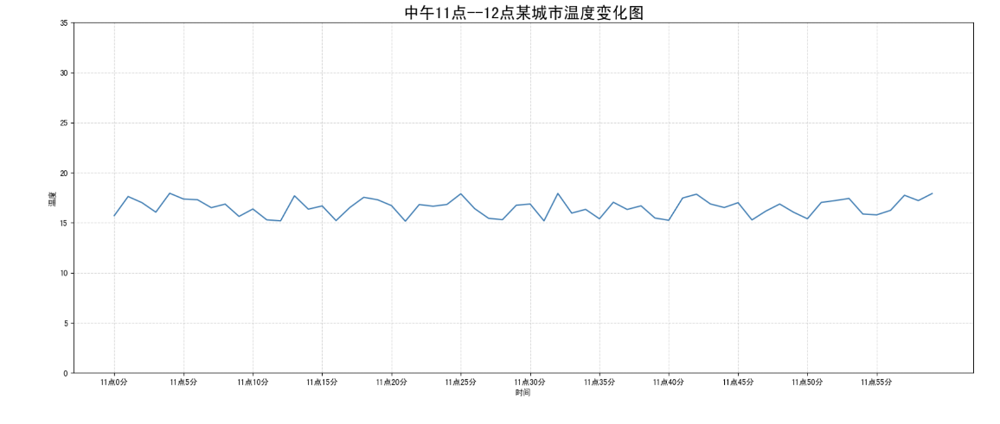
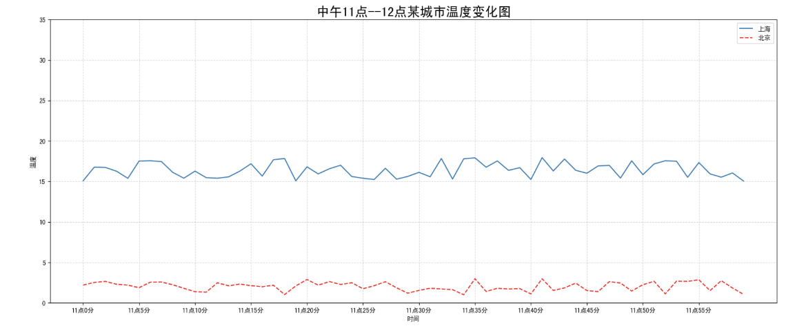
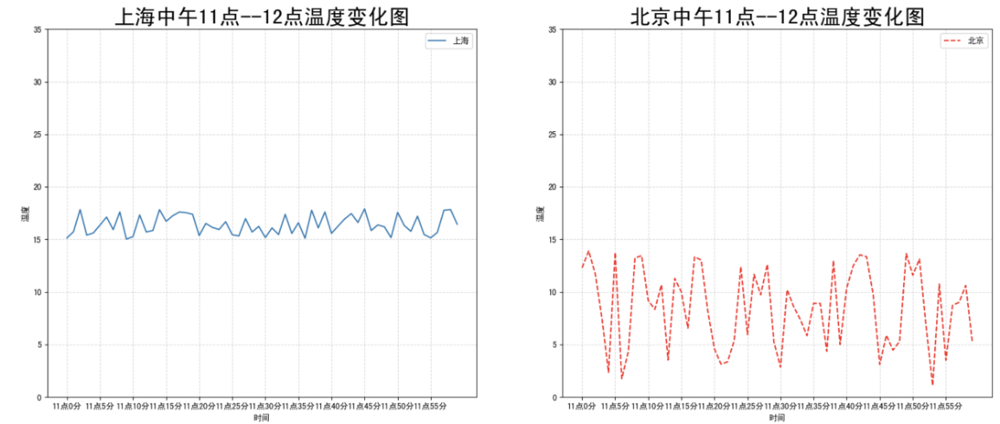
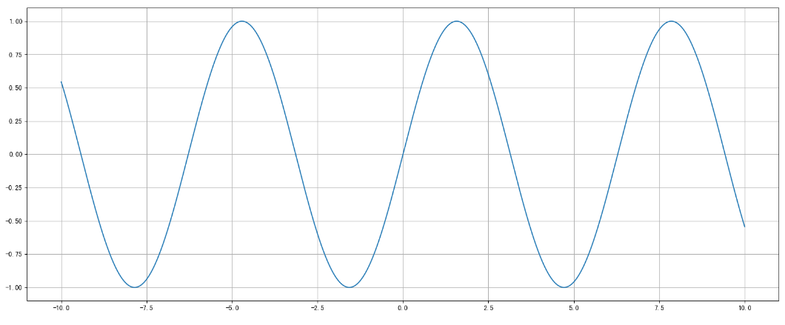

---
tags:
  - Python
  - Matplotlib
  - 数据可视化
date: 2024-09-02
updated: 2026-07-31
---

# 二、Matplotlib基础绘图功能

## 学习目标

* 掌握给图形添加辅助功能(如：标注、x,y轴名称、标题等)

- 知道图形的保存
- 知道如何多次plot绘制图形
- 知道如何多个坐标系显示图形
- 知道折线图的应用场景

## 1、完善原始折线图 — 给图形添加辅助功能

为了更好地理解所有基础绘图功能，我们通过天气温度变化的绘图来融合所有的基础API使用

**需求：画出某城市11点到12点1小时内每分钟的温度变化折线图，温度范围在15度~18度**

效果：



### 1.1 准备数据并画出初始折线图

```python
import matplotlib.pyplot as plt
import random

# 画出温度变化图

# 0.准备x, y坐标的数据
x = range(60)
y_shanghai = [random.uniform(15, 18) for i in x]

# 1.创建画布
plt.figure(figsize=(20, 8), dpi=80)

# 2.绘制折线图
plt.plot(x, y_shanghai)

# 3.显示图像
plt.show()
```

> **作用**：返回一个 **随机的浮点数**，其值在区间 `[a, b]` 之间（包括 `a` 和 `b`）。
>
> **分布**：数值在指定区间内是 **均匀分布** 的，这意味着每个数值出现的概率是相等的。



### 1.2 添加自定义x,y刻度

- plt.xticks(x, **kwargs)

  x:要显示的刻度值

- plt.yticks(y, **kwargs)

  y:要显示的刻度值

```python
# 增加以下两行代码

# 构造x轴刻度标签
x_ticks_label = ["11点{}分".format(i) for i in x]
# 构造y轴刻度
y_ticks = range(40)

# 修改x,y轴坐标的刻度显示
plt.xticks(x[::5], x_ticks_label[::5])
plt.yticks(y_ticks[::5])
```



如果没有解决过中文问题的话，会显示这个样子：



### 1.3 中文显示问题解决

**解决方案一：**

下载中文字体（黑体，看准系统版本）

- 步骤一：从可信来源安装支持中文的字体（如 Noto Sans CJK、Microsoft YaHei 或 SimHei）。仓库未附带字体文件，不要依赖失效的本地链接。

- 步骤二：安装字体

  - linux下：拷贝字体到 usr/share/fonts 下：

    ```
    sudo cp ~/SimHei.ttf /usr/share/fonts/SimHei.ttf
    ```

  - windows和mac下：双击安装

- 步骤三：删除~/.matplotlib中的缓存文件

  ```sh
  cd ~/.matplotlib
  rm -r *
  ```

- 步骤四：修改配置文件matplotlibrc

  ```sh
  vi ~/.matplotlib/matplotlibrc
  ```

  将文件内容修改为：

  ```
  font.family         : sans-serif
  font.sans-serif         : SimHei
  axes.unicode_minus  : False
  ```

**解决方案二：**

在Python脚本中动态设置matplotlibrc,这样也可以避免由于更改配置文件而造成的麻烦，具体代码如下：

```python
from pylab import mpl
# 设置显示中文字体
mpl.rcParams["font.sans-serif"] = ["SimHei"]
```

有时候，字体更改后，会导致坐标轴中的部分字符无法正常显示，此时需要更改axes.unicode_minus参数：

```python
# 设置正常显示符号
mpl.rcParams["axes.unicode_minus"] = False
```

### 1.4 添加网格显示

为了更加清楚地观察图形对应的值

```python
plt.grid(True, linestyle='--', alpha=0.5)
```



### 1.5 添加描述信息

添加x轴、y轴描述信息及标题

> 通过fontsize参数可以修改图像中字体的大小

```python
plt.xlabel("时间")
plt.ylabel("温度")
plt.title("中午11点0分到12点之间的温度变化图示", fontsize=20)
```



### 1.6 图片保存

```python
# 保存图片到指定路径
plt.savefig("test.png")
```

- 注意：在脚本中，阻塞式 `plt.show()` 返回后 pyplot 可能已注销并关闭图窗，因此随后调用 `plt.savefig()` 可能保存为空图。稳妥做法是保留 `Figure` 引用并在显示前执行 `fig.savefig()`；Jupyter 和非阻塞后端的行为可能不同。

### 1.7 完整代码

```python
import matplotlib.pyplot as plt
import random
from pylab import mpl

# 设置显示中文字体
mpl.rcParams["font.sans-serif"] = ["SimHei"]
# 设置正常显示符号
mpl.rcParams["axes.unicode_minus"] = False

# 0.准备数据
x = range(60)
y_shanghai = [random.uniform(15, 18) for i in x]

# 1.创建画布
plt.figure(figsize=(20, 8), dpi=100)

# 2.绘制图像
plt.plot(x, y_shanghai)

# 2.1 添加x,y轴刻度
# 构造x,y轴刻度标签
x_ticks_label = ["11点{}分".format(i) for i in x]
y_ticks = range(40)

# 刻度显示
plt.xticks(x[::5], x_ticks_label[::5])
plt.yticks(y_ticks[::5])

# 2.2 添加网格显示
plt.grid(True, linestyle="--", alpha=0.5)

# 2.3 添加描述信息
plt.xlabel("时间")
plt.ylabel("温度")
plt.title("中午11点--12点某城市温度变化图", fontsize=20)

# 2.4 图像保存
plt.savefig("./test.png")

# 3.图像显示
plt.show()
```

## 2、在一个坐标系中绘制多个图像

### 2.1 多次plot

需求：再添加一个城市的温度变化

收集到北京当天温度变化情况，温度在1度到3度。怎么去添加另一个在同一坐标系当中的不同图形，**其实很简单只需要再次plot即可**，但是需要区分线条，如下显示



```python
# 增加北京的温度数据
y_beijing = [random.uniform(1, 3) for i in x]

# 绘制折线图
plt.plot(x, y_shanghai)
# 使用多次plot可以画多个折线
plt.plot(x, y_beijing, color='r', linestyle='--')
```

我们仔细观察，用到了两个新的地方，一个是对于不同的折线展示效果，一个是添加图例。

### 2.2 设置图形风格

| 颜色字符 |    风格字符    |
| :------: | :------------: |
|  r 红色  |     - 实线     |
|  g 绿色  |    - - 虚线    |
|  b 蓝色  |   -. 点划线    |
|  w 白色  |    : 点虚线    |
|  c 青色  | ' ' 留空、空格 |
|  m 洋红  |                |
|  y 黄色  |                |
|  k 黑色  |                |

### **2.3 显示图例**

- 注意：如果只在plt.plot()中设置label还不能最终显示出图例，还需要通过plt.legend()将图例显示出来。

```python
# 绘制折线图
plt.plot(x, y_shanghai, label="上海")
# 使用多次plot可以画多个折线
plt.plot(x, y_beijing, color='r', linestyle='--', label="北京")

# 显示图例
plt.legend(loc="best")
```

| Location String | Location Code |
| --------------- | ------------- |
| 'best'          | 0             |
| 'upper right'   | 1             |
| 'upper left'    | 2             |
| 'lower left'    | 3             |
| 'lower right'   | 4             |
| 'right'         | 5             |
| 'center left'   | 6             |
| 'center right'  | 7             |
| 'lower center'  | 8             |
| 'upper center'  | 9             |
| 'center'        | 10            |

### 2.4 完整代码

```python
# 0.准备数据
x = range(60)
y_shanghai = [random.uniform(15, 18) for i in x]
y_beijing = [random.uniform(1,3) for i in x]

# 1.创建画布
plt.figure(figsize=(20, 8), dpi=100)

# 2.绘制图像
plt.plot(x, y_shanghai, label="上海")
plt.plot(x, y_beijing, color="r", linestyle="--", label="北京")

# 2.1 添加x,y轴刻度
# 构造x,y轴刻度标签
x_ticks_label = ["11点{}分".format(i) for i in x]
y_ticks = range(40)

# 刻度显示
plt.xticks(x[::5], x_ticks_label[::5])
plt.yticks(y_ticks[::5])

# 2.2 添加网格显示
plt.grid(True, linestyle="--", alpha=0.5)

# 2.3 添加描述信息
plt.xlabel("时间")
plt.ylabel("温度")
plt.title("中午11点--12点某城市温度变化图", fontsize=20)

# 2.4 图像保存
plt.savefig("./test.png")

# 2.5 添加图例
plt.legend(loc=0)


# 3.图像显示
plt.show()
```

## 3、多个坐标系显示— plt.subplots(面向对象的画图方法)

如果我们想要将上海和北京的天气图显示在同一个图的不同坐标系当中，效果如下：



可以通过subplots函数实现(旧的版本中有subplot，使用起来不方便)，推荐subplots函数

- matplotlib.pyplot.subplots(nrows=1, ncols=1, **fig_kw) 创建一个带有多个axes(坐标系/绘图区)的图

  ```
  Parameters:    
  
  nrows, ncols : 设置有几行几列坐标系
      int, optional, default: 1, Number of rows/columns of the subplot grid.
  
  Returns:    
  fig : 图对象
  axes : 返回相应数量的坐标系
  
  设置标题等方法不同：
      set_xticks
      set_yticks
      set_xlabel
      set_ylabel
  ```

  关于axes子坐标系的更多方法：参考https://matplotlib.org/api/axes_api.html#matplotlib.axes.Axes

- 注意：**plt.函数名()**相当于面向过程的画图方法，**axes.set_方法名()**相当于面向对象的画图方法。

```python
    # 0.准备数据
    x = range(60)
    y_shanghai = [random.uniform(15, 18) for i in x]
    y_beijing = [random.uniform(1, 5) for i in x]

    # 1.创建画布
    # plt.figure(figsize=(20, 8), dpi=100)
    fig, axes = plt.subplots(nrows=1, ncols=2, figsize=(20, 8), dpi=100)


    # 2.绘制图像
    # plt.plot(x, y_shanghai, label="上海")
    # plt.plot(x, y_beijing, color="r", linestyle="--", label="北京")
    axes[0].plot(x, y_shanghai, label="上海")
    axes[1].plot(x, y_beijing, color="r", linestyle="--", label="北京")

    # 2.1 添加x,y轴刻度
    # 构造x,y轴刻度标签
    x_ticks_label = ["11点{}分".format(i) for i in x]
    y_ticks = range(40)

    # 刻度显示
    # plt.xticks(x[::5], x_ticks_label[::5])
    # plt.yticks(y_ticks[::5])
    axes[0].set_xticks(x[::5])
    axes[0].set_yticks(y_ticks[::5])
    axes[0].set_xticklabels(x_ticks_label[::5])
    axes[1].set_xticks(x[::5])
    axes[1].set_yticks(y_ticks[::5])
    axes[1].set_xticklabels(x_ticks_label[::5])

    # 2.2 添加网格显示
    # plt.grid(True, linestyle="--", alpha=0.5)
    axes[0].grid(True, linestyle="--", alpha=0.5)
    axes[1].grid(True, linestyle="--", alpha=0.5)

    # 2.3 添加描述信息
    # plt.xlabel("时间")
    # plt.ylabel("温度")
    # plt.title("中午11点--12点某城市温度变化图", fontsize=20)
    axes[0].set_xlabel("时间")
    axes[0].set_ylabel("温度")
    axes[0].set_title("中午11点--12点某城市温度变化图", fontsize=20)
    axes[1].set_xlabel("时间")
    axes[1].set_ylabel("温度")
    axes[1].set_title("中午11点--12点某城市温度变化图", fontsize=20)

    # # 2.4 图像保存
    plt.savefig("./test.png")

    # # 2.5 添加图例
    # plt.legend(loc=0)
    axes[0].legend(loc=0)
    axes[1].legend(loc=0)


    # 3.图像显示
    plt.show()
```

## 4、折线图的应用场景

- 呈现公司产品(不同区域)每天活跃用户数

- 呈现app每天下载数量

- 呈现产品新功能上线后,用户点击次数随时间的变化

- 拓展：**画各种数学函数图像**

  - 注意：plt.plot()除了可以画折线图，也可以用于画各种数学函数图像

   

代码：

```python
import numpy as np
# 0.准备数据
x = np.linspace(-10, 10, 1000)
y = np.sin(x)

# 1.创建画布
plt.figure(figsize=(20, 8), dpi=100)

# 2.绘制函数图像
plt.plot(x, y)
# 2.1 添加网格显示
plt.grid()

# 3.显示图像
plt.show()
```

[上一步：01.Matplotlib快速入门](01.Matplotlib快速入门.md) [下一步：03.常见图形绘制](03.常见图形绘制.md) [返回总索引](关于Matplotlib.md)
