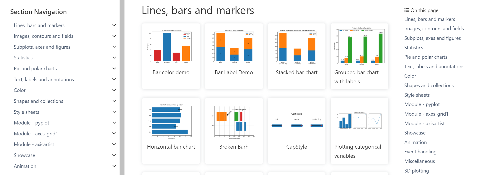
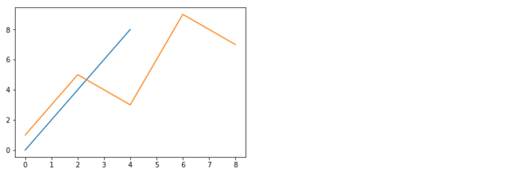
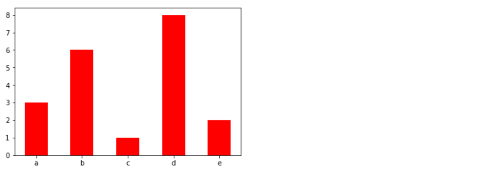
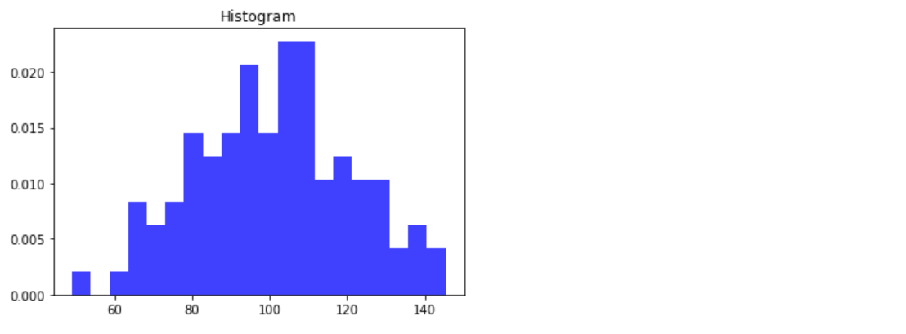
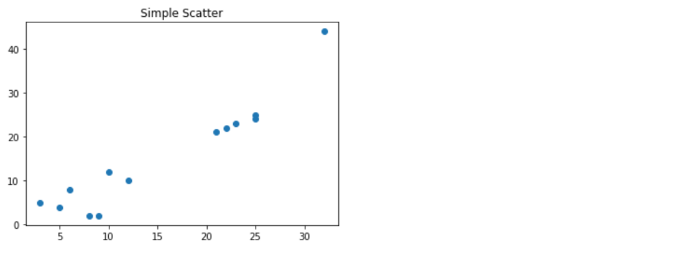

---
tags:
  - Python
  - Matplotlib
  - 数据可视化
date: 2024-09-02
updated: 2026-07-31
---

# 三、常见图形绘制

## 1、官方案例库

https://matplotlib.org/stable/gallery/index.html



## 2、常见图形种类及意义

### 2.1 折线图

- **折线图**：以折线的上升或下降来表示统计数量的增减变化的统计图

  **特点：能够显示数据的变化趋势，反映事物的变化情况。(变化)**

  api：plt.plot(x, y)



### 2.2 柱形图

**柱状图：**排列在工作表的列或行中的数据可以绘制到柱状图中。

**特点：绘制连离散的数据,能够一眼看出各个数据的大小,比较数据之间的差别。(统计/对比)**

api：plt.bar(x, width, align='center', **kwargs)

```
Parameters:    
x : 需要传递的数据

width : 柱状图的宽度

align : 每个柱状图的位置对齐方式
    {'center', 'edge'}, optional, default: 'center'

**kwargs :
color:选择柱状图的颜色
```



### 2.3 直方图

由一系列高度不等的纵向条纹或线段表示数据分布的情况。 一般用横轴表示数据范围，纵轴表示分布情况。

**特点：绘制连续性的数据展示一组或者多组数据的分布状况(统计)**

api：matplotlib.pyplot.hist(x, bins=None)

```
Parameters:    
x : 需要传递的数据
bins : 组距
```



### 2.4 饼图

- **饼图：**用于表示不同分类的占比情况，通过弧度大小来对比各种分类。

  **特点：分类数据的占比情况(占比)**

  api：plt.pie(x, labels=,autopct=,colors)

  ```
  Parameters:  
  x:数量，自动算百分比
  labels:每部分名称
  autopct:占比显示指定%1.2f%%
  colors:每部分颜色
  ```


### 2.5 散点图

**散点图：**用两组数据构成多个坐标点，考察坐标点的分布,判断两变量之间是否存在某种关联或总结坐标点的分布模式。

**特点：判断变量之间是否存在数量关联趋势,展示离群点(分布规律)**

api：plt.scatter(x, y)



## 3、柱形图绘制

```python
categories = ['A', 'B', 'C', 'D']
values = [3, 7, 5, 4]

plt.bar(categories, values, color='blue')  # 绘制蓝色柱状图
plt.title("Simple Bar Chart")  # 设置图表标题
plt.xlabel("Categories")  # 设置X轴标签
plt.ylabel("Values")  # 设置Y轴标签
plt.show()  # 显示图表
```

## 4、直方图

```python
# 1. 生成数据
data = np.random.randn(500)  # 生成500个服从标准正态分布的随机数

# 2. 创建画布
plt.figure(figsize=(10, 6))

# 3. 绘制直方图
plt.hist(data, bins=30, color='blue', alpha=0.7, rwidth=0.85)

# 4. 添加标题和标签
plt.title("Histogram of Normally Distributed Data")
plt.xlabel("Value")
plt.ylabel("Frequency")

# 5. 显示图像
plt.grid(True)
plt.show()
```

参数说明：`bins=30` 将数据分成 30 个等宽区间；`color='blue'` 设置颜色；`alpha=0.7` 设置透明度；`rwidth=0.85` 让条形占区间宽度的 85%。

## 5、饼图

```python
sizes = [25, 35, 25, 15]
labels = ['Category A', 'Category B', 'Category C', 'Category D']

plt.pie(sizes, labels=labels, autopct='%1.1f%%')  # 绘制饼图，显示百分比
plt.title("Simple Pie Chart")  # 设置图表标题
plt.show()  # 显示图表
```

## 6、散点图绘制

```python
x = [1, 2, 3, 4, 5]
y = [2, 3, 5, 7, 11]

plt.scatter(x, y, color='red')  # 绘制红色散点图
plt.title("Simple Scatter Plot")  # 设置图表标题
plt.xlabel("X-axis")  # 设置X轴标签
plt.ylabel("Y-axis")  # 设置Y轴标签
plt.show()  # 显示图表
```


---
[上一步：02.Matplotlib基础绘图](02.Matplotlib基础绘图.md) [返回总索引](关于Matplotlib.md)
