---
tags:
  - MySQL
  - 基础
  - 数据库
date: 2024-12-15
updated: 2026-08-11
---

# MySQL 基础

> [!note] 版本与使用说明
> 本篇以原有随堂笔记为实践补充，并吸收指定课件的系统讲解。课件演示环境主要是 MySQL 8.0.26；本知识库仍以 MySQL 8.4 LTS 为当前参考。安装界面、默认配置和账号命令可能随版本变化，执行前应核对当前环境。

## 1. MySQL概述

在这一章节，我们主要介绍两个部分，数据库相关概念及MySQL数据库的介绍、下载、安装、启动及连接。

### 1.1 数据库相关概念

在这一部分，我们先来讲解三个概念：数据库、数据库管理系统、SQL。

| 名称 | 全称 | 简称 |
| --- | --- | --- |
| 数据库 | 存储数据的仓库，数据是有组织的进行存储 | DataBase（DB） |
| 数据库管理系统 | 操纵和管理数据库的大型软件 | DataBase Management System (DBMS) |
| SQL | 操作关系型数据库的编程语言，定义了一套操作关系型数据库统一标准 | Structured Query Language (SQL) |

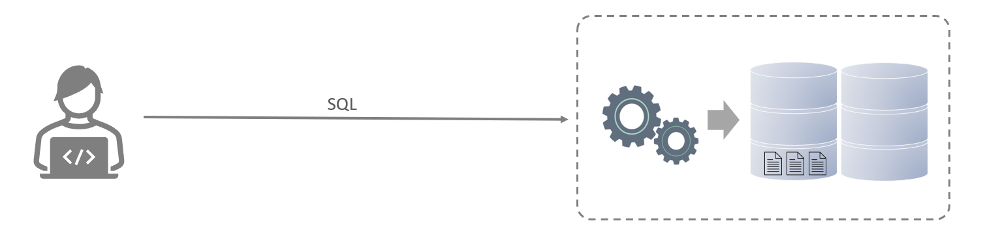

而目前主流的关系型数据库管理系统的市场占有率排名如下：

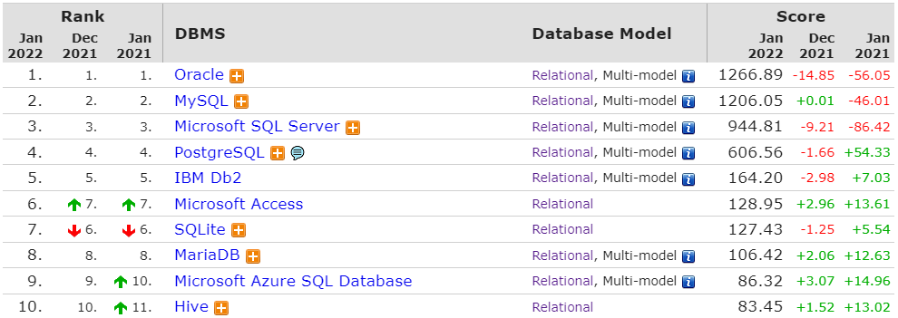

Oracle：大型的收费数据库，Oracle公司产品，价格昂贵。

MySQL：开源免费的中小型数据库，后来Sun公司收购了MySQL，而Oracle又收购了Sun公司。

目前Oracle推出了收费版本的MySQL，也提供了免费的社区版本。

SQL Server：Microsoft 公司推出的收费的中型数据库，C#、.net等语言常用。

PostgreSQL：开源免费的中小型数据库。

DB2：IBM公司的大型收费数据库产品。

SQLLite：嵌入式的微型数据库。Android内置的数据库采用的就是该数据库。

MariaDB：开源免费的中小型数据库。是MySQL数据库的另外一个分支、另外一个衍生产品，与MySQL数据库有很好的兼容性。

而不论我们使用的是上面的哪一个关系型数据库，最终在操作时，都是使用SQL语言来进行统一操作，因为我们前面讲到SQL语言，是操作关系型数据库的统一标准。所以即使我们现在学习的是MySQL，假如我们以后到了公司，使用的是别的关系型数据库，如：Oracle、DB2、SQLServer，也完全不用担心，因为操作的方式都是一致的。

#### 实践补充：数据库相关概述


* 问题1: 你知道的存储数据的方式有哪些?

  > 变量, 列表, 字典: 只能对数据**临时存储**, 程序执行结束, 数据就丢失了.
  >
  > 文件: 可以对数据**永久存储**, 但是不方便用户进行精细化管理. 
  >
  > **数据库管理系统（DBMS）：** 用于持久化、组织、查询和管理数据的软件。底层通常会使用文件，但还提供事务、并发控制、权限、索引与恢复等能力。常用操作简称 CRUD：Create（增）、Read（查）、Update（改）、Delete（删）。
  >
  > **实际开发中, 数据库才是真正存储数据的地方.**

* 问题2: 数据库的划分?

  > 关系型数据库:     采用**数据表**来存储数据, 表与表之间有关系, 例如: **多对多, 一对多, 一对一.**
  >
  > 非关系型数据库: 一般采用**Key-Value**的形式存储数据.

* 问题3: 常见的数据库有哪些?

  > 关系型数据库:
  >
  > ​	MySQL, Oracle, SQLServer, DB2, SQLite...
  >
  > 非关系型数据库:
  >
  > ​	Redis, HBase, MongoDB(文档型数据库)

### 1.2 MySQL数据库

#### 1.2.1 版本


官方： https://www.mysql.com/

MySQL官方提供了两种不同的版本：

社区版本（MySQL Community Server）

免费， MySQL不提供任何技术支持

商业版本（MySQL Enterprise Edition）

收费，可以使用30天，官方提供技术支持

本课程采用的是MySQL最新的社区版-MySQL Community Server 8.0.26

#### 1.2.2 下载

下载地址：https://downloads.mysql.com/archives/installer/

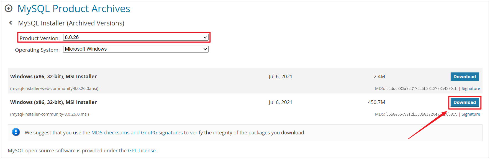

也可以使用课程资料中提供的MySQL的安装包：

#### 1.2.3 安装

要想使用MySQL，我们首先先得将MySQL安装好，我们可以根据下面的步骤，一步一步的完成MySQL的安装。

1). 双击官方下来的安装包文件

2). 根据安装提示进行安装

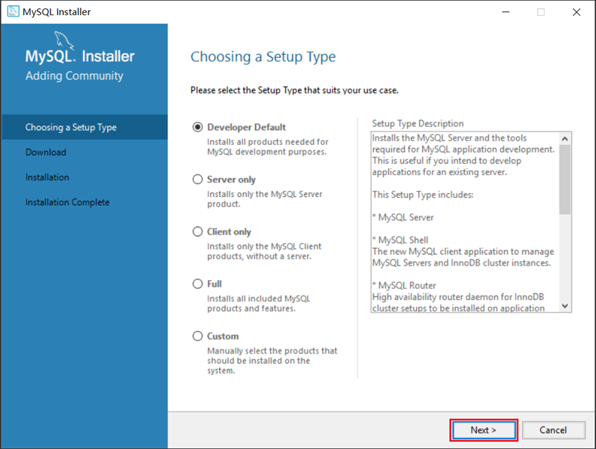

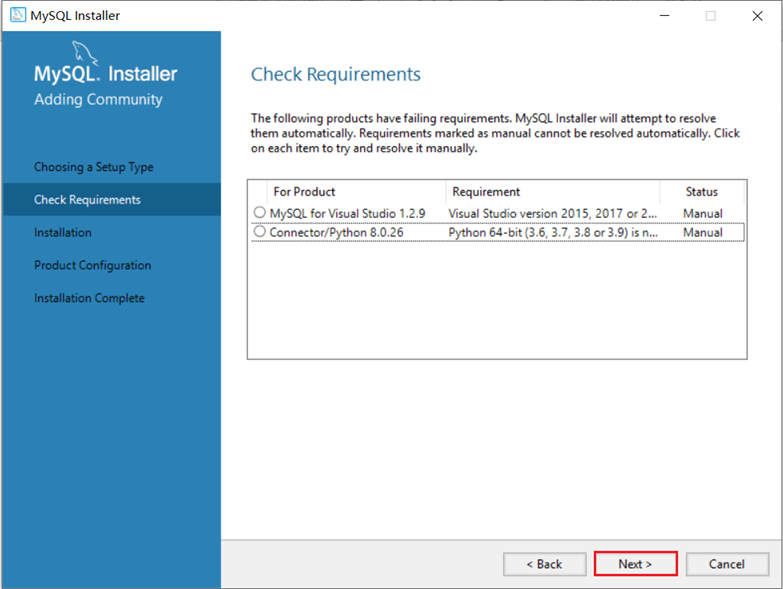

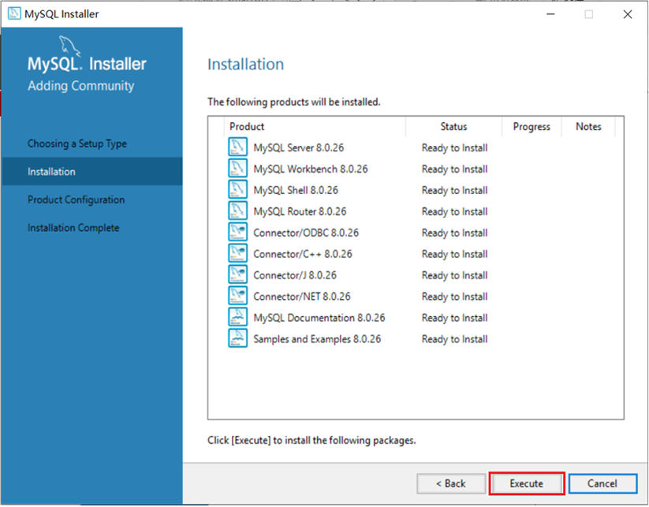

安装MySQL的相关组件，这个过程可能需要耗时几分钟，耐心等待。

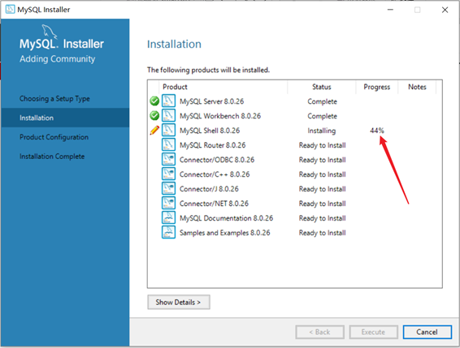

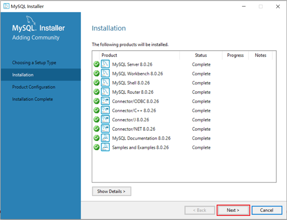

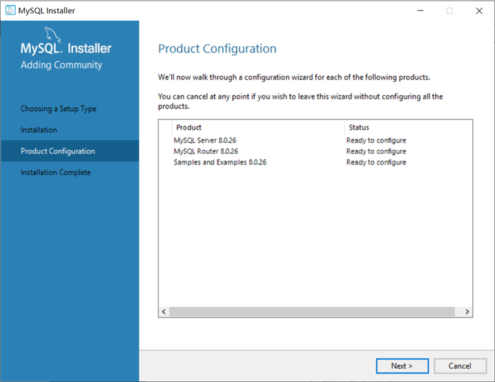

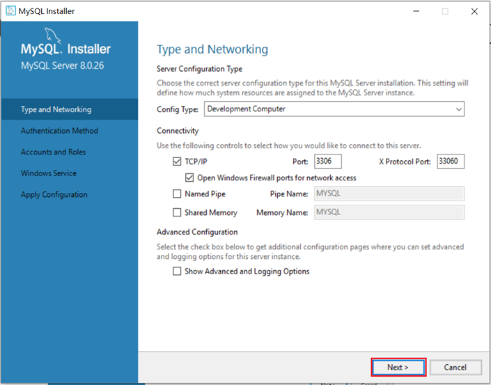

输入MySQL中root用户的密码,一定记得记住该密码

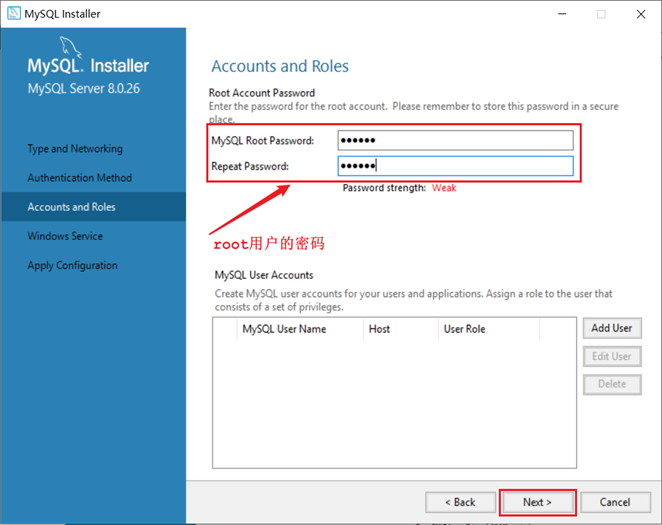

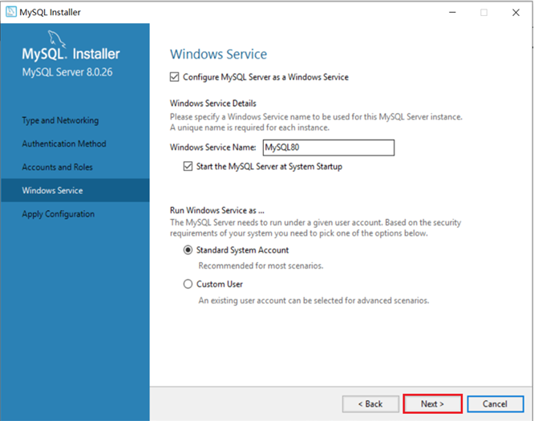

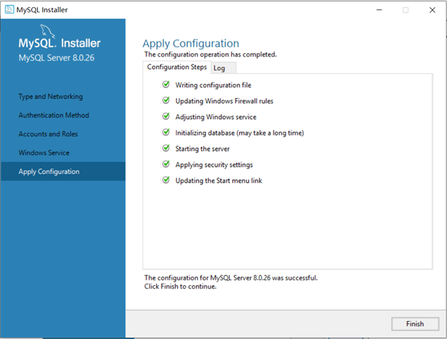

3). 配置

安装好MySQL之后，还需要配置环境变量，这样才可以在任何目录下连接MySQL。

A. 在此电脑上，右键选择属性

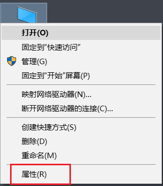

B. 点击左侧的"高级系统设置"，选择环境变量

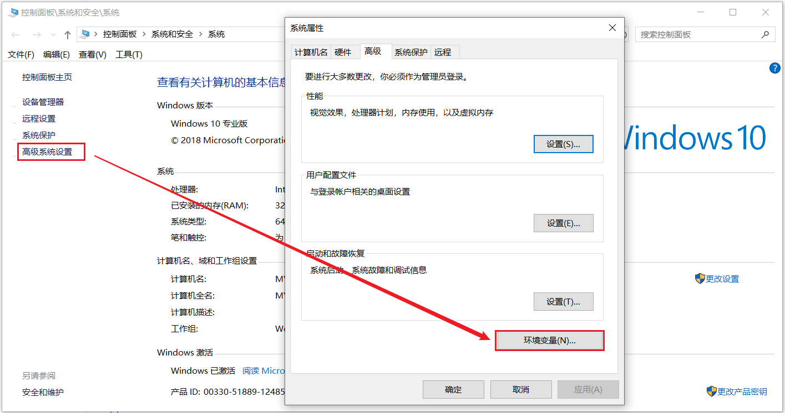

C. 找到 Path 系统变量, 点击"编辑"

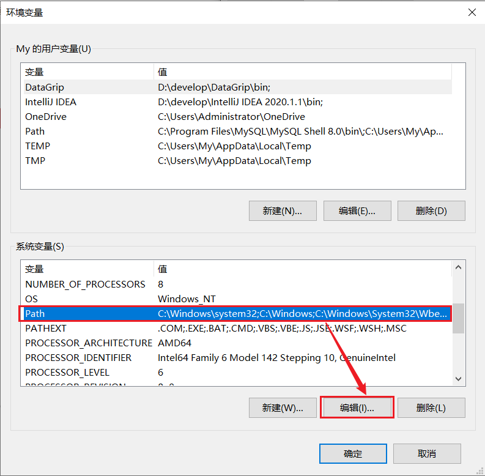

D. 选择"新建" , 将MySQL Server的安装目录下的bin目录添加到环境变量

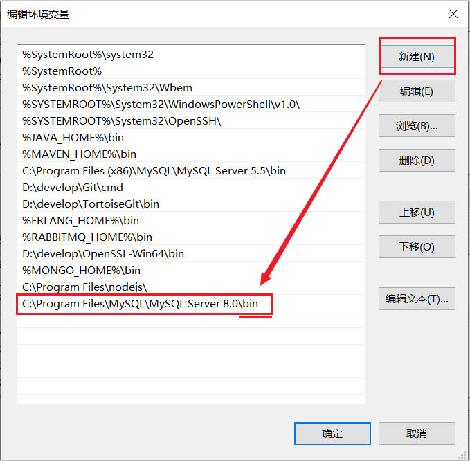

##### 实践补充：MySQL环境搭建


> 本笔记以 **MySQL 8.4 LTS** 为主要参考。旧课程环境可用于复现实验，但 MySQL 5.x、弱密码和停止维护的操作系统不应直接用于新项目。

* 安装MySQL数据库

  * 方式1: 直接使用我给的虚拟机中的MySQL数据库即可, 已经搭建完毕, 无需手动安装.

    > 账号: root（仅限本地课程环境）
    >
    > 密码: 
    >
    > ​	旧镜像可能预设课程密码。首次使用应立即改为独立强密码，不要把示例密码用于真实数据或联网环境。

  * 方式2: 手动去MySQL官网下载安装包, 手动安装到本机(windows系统, Mac系统即可).

    > 官网: www.mysql.com
    >
    > 直接下载网址: https://downloads.mysql.com/archives/community/

  * 方式3: 使用小皮工具进行安装.

    > 小皮 -> PhpStudy软件, 专门为了部署各种服务级软件而生. 
    >
    > 官网: https://old.xp.cn/
    >
    > #具体的步骤
    >
    > 1. 安装小皮软件, 此处略, 下一步下一步即可, 安装路径要合法, 不要出现中文, 空格等.
    > 2. 通过工具安装仍受支持的 MySQL 8.x 版本；生产环境优先使用官方软件源、容器镜像或受控的数据库服务。
    > 3. 启动 MySQL 服务，并确认版本、监听地址和防火墙配置。
    > 4. 新建业务账号并按最小权限授权。MySQL 8.x 默认存储引擎通常是 InnoDB；应按表或实例配置核实，而不是把 MyISAM 全局“改成” InnoDB。
    > 5. 为管理员和业务账号分别设置强密码，禁止使用 `root`、`123456` 等弱密码。

    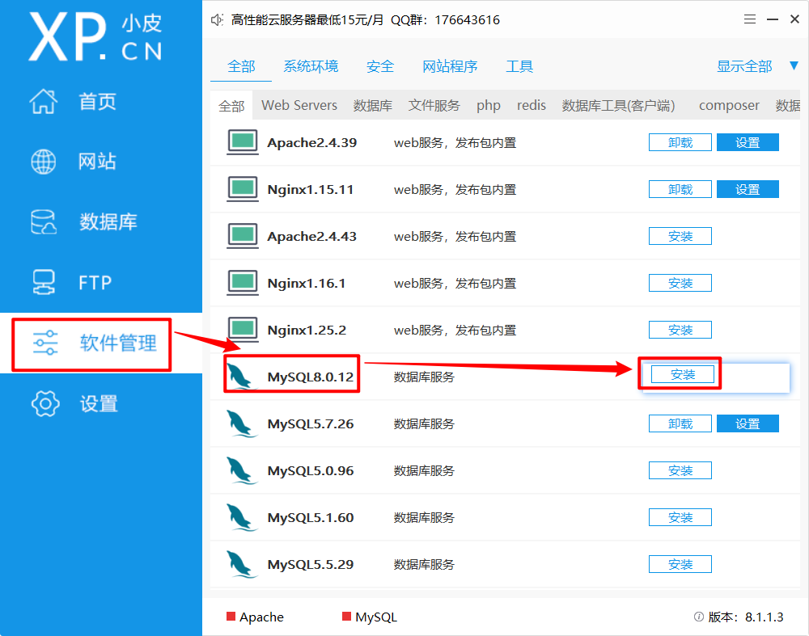

    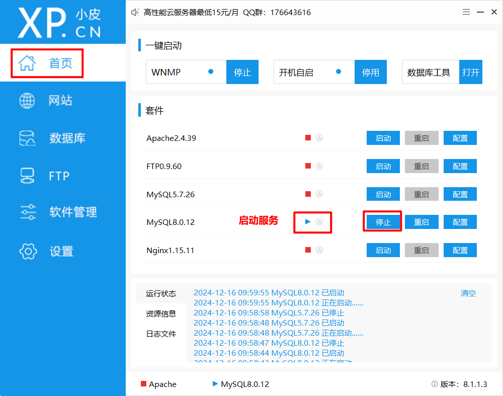

    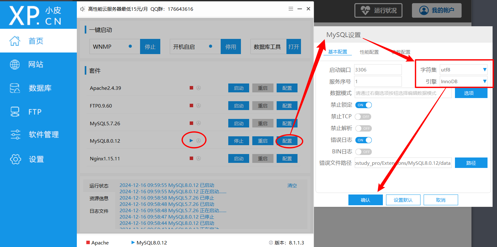

    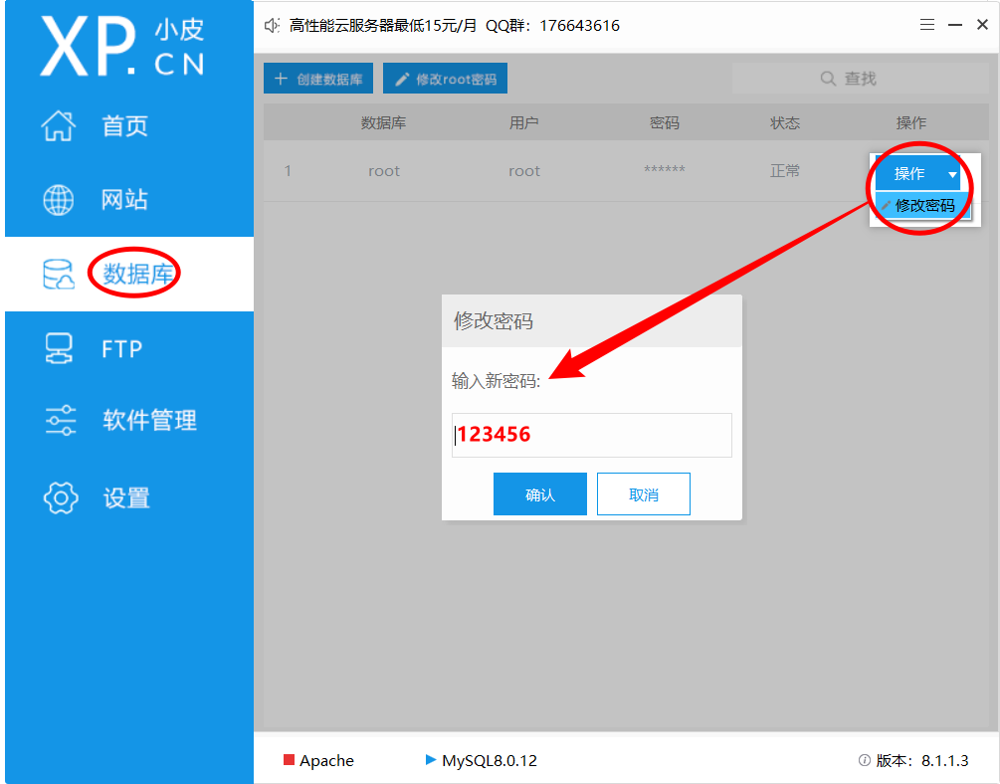

#### 1.2.4 启动停止

MySQL安装完成之后，在系统启动时，会自动启动MySQL服务，我们无需手动启动了。

当然，也可以手动的通过指令启动停止，以管理员身份运行cmd，进入命令行执行如下指令：

```
net start mysql80
net stop mysql80
```

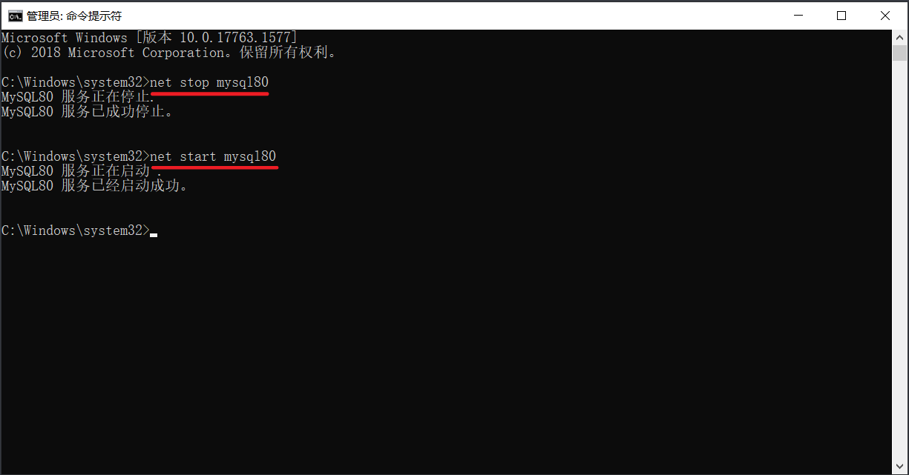

注意：上述的 mysql80 是我们在安装MySQL时，默认指定的mysql的系统服务名，不是固定的，如果未改动，默认就是mysql80。

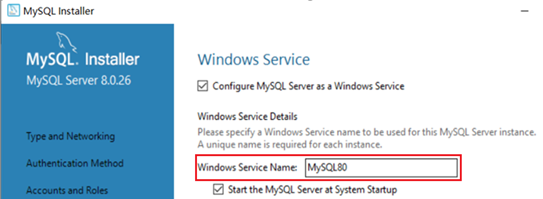

#### 1.2.5 客户端连接

1). 方式一：使用MySQL提供的客户端命令行工具

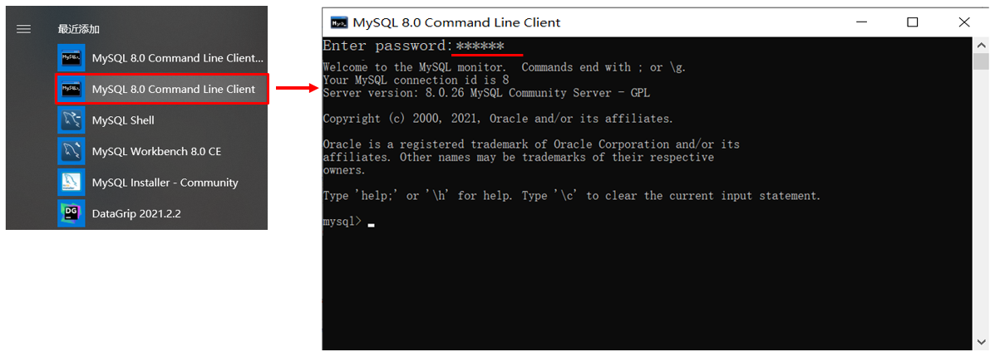

2). 方式二：使用系统自带的命令行工具执行指令

```
mysql [-h 127.0.0.1] [-P 3306] -u root -p

参数：
    -h : MySQL服务所在的主机IP
    -P : MySQL服务端口号，默认3306
    -u : MySQL数据库用户名
    -p ： MySQL数据库用户名对应的密码
```

[]内为可选参数，如果需要连接远程的MySQL，需要加上这两个参数来指定远程主机IP、端口，如果连接本地的MySQL，则无需指定这两个参数。

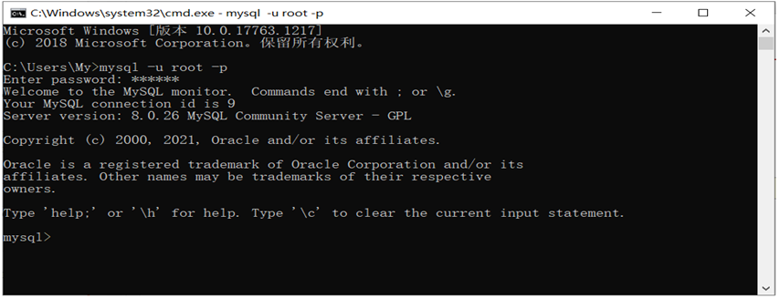

注意：使用这种方式进行连接时，需要安装完毕后配置PATH环境变量。

##### 实践补充：MySQL的登陆和登出


* 登录

  * 不推荐：在命令行参数中直接写密码

    > `mysql -u账号 -p密码` 可能将密码暴露在 shell 历史、进程信息或日志中。

    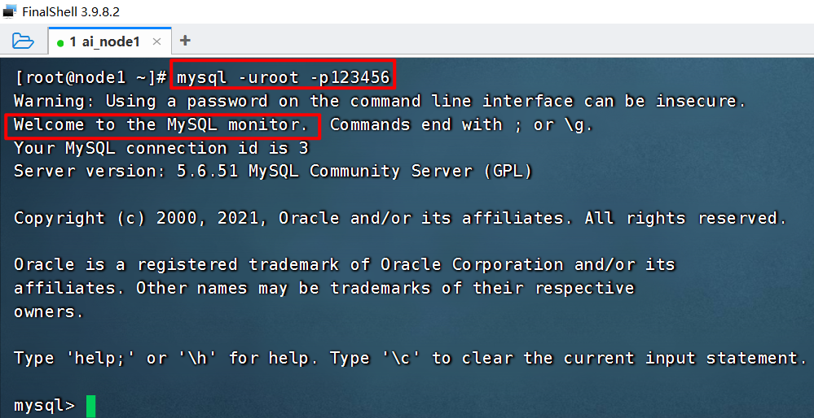

  * 推荐：让客户端交互式读取密码

    > mysql -u root -p			# 敲回车
    >
    > 输入密码				# 敲回车

    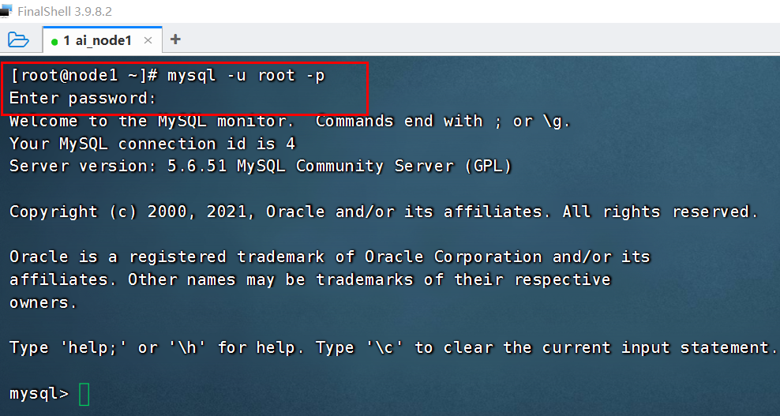

  * 远程访问

    > `mysql --host=主机名 --user=数据库账号 -p`
    >
    > 生产环境还应配置 TLS、限制来源地址，并避免使用 `root` 远程登录。

    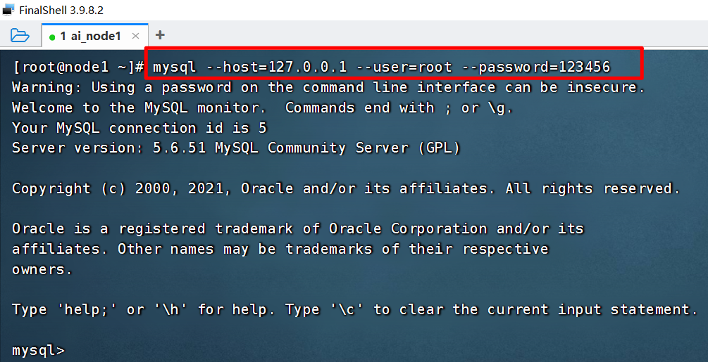

* 登出

  > 方式1: exit
  >
  > 方式2: quit
  >
  > 方式3: ctrl + d

* 扩展: 如果你想用本机的小皮, 需要**给小皮配置环境变量**才可以实现: 在任意的路径下都能访问小皮.

  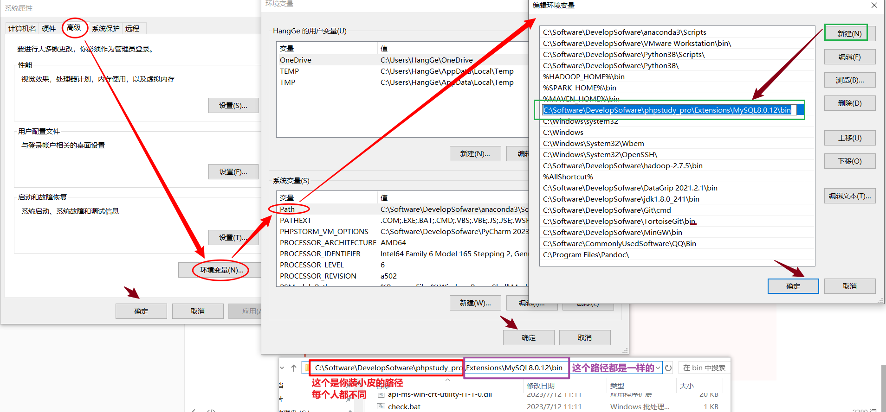

  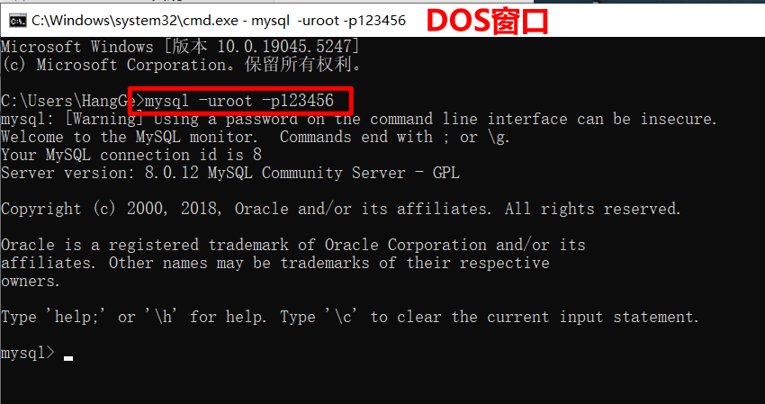

#### 1.2.6 数据模型

1). 关系型数据库（RDBMS）

概念：建立在关系模型基础上，由多张相互连接的二维表组成的数据库。

而所谓二维表，指的是由行和列组成的表，如下图（就类似于Excel表格数据，有表头、有列、有行，还可以通过一列关联另外一个表格中的某一列数据）。我们之前提到的MySQL、Oracle、DB2、SQLServer这些都是属于关系型数据库，里面都是基于二维表存储数据的。简单说，基于二维表存储数据的数据库就成为关系型数据库，不是基于二维表存储数据的数据库，就是非关系型数据库。

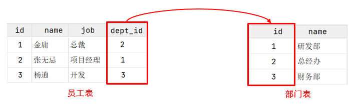

特点：

A. 使用表存储数据，格式统一，便于维护。

B. 使用SQL语言操作，标准统一，使用方便。

2). 数据模型

MySQL是关系型数据库，是基于二维表进行数据存储的，具体的结构图下:

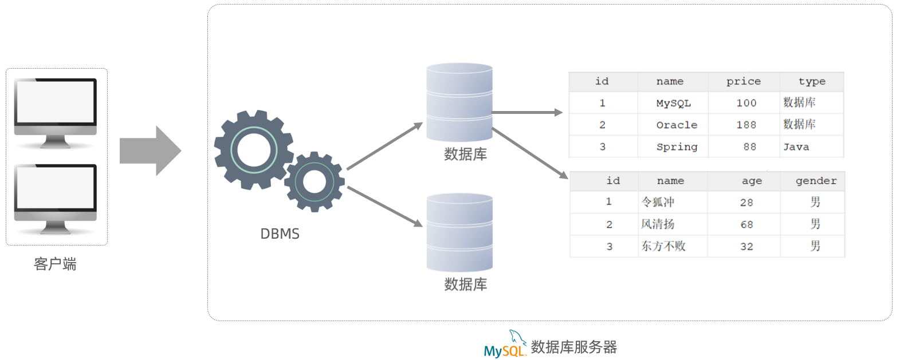

我们可以通过MySQL客户端连接数据库管理系统DBMS，然后通过DBMS操作数据库。

可以使用SQL语句，通过数据库管理系统操作数据库，以及操作数据库中的表结构及数据。

一个数据库服务器中可以创建多个数据库，一个数据库中也可以包含多张表，而一张表中又可以包含多行记录。

## 2. SQL

全称 Structured Query Language，结构化查询语言。操作关系型数据库的编程语言，定义了一套操作关系型数据库统一标准 。

### 2.1 SQL通用语法

在学习具体的SQL语句之前，先来了解一下SQL语言的同于语法。

1). SQL语句可以单行或多行书写，以分号结尾。

2). SQL语句可以使用空格/缩进来增强语句的可读性。

3). MySQL数据库的SQL语句不区分大小写，关键字建议使用大写。

4). 注释：

单行注释：-- 注释内容 或 # 注释内容多行注释：/* 注释内容 */

### 2.2 SQL分类

SQL语句，根据其功能，主要分为四类：DDL、DML、DQL、DCL。

分

| 类   | 全称                         | 说明                          |
| --- | -------------------------- | --------------------------- |
| DDL | Data Definition Language   | 数据定义语言，用来定义数据库对象(数据库，表，字段)  |
| DML | Data Manipulation Language | 数据操作语言，用来对数据库表中的数据进行增删改     |
| DQL | Data Query Language        | 数据查询语言，用来查询数据库中表的记录         |
| DCL | Data Control Language      | 数据控制语言，用来创建数据库用户、控制数据库的访问权限 |

#### 实践补充：SQL语句介绍


* 图解

  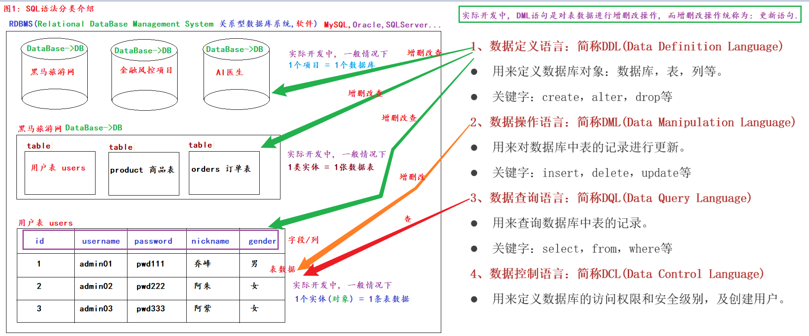

* 特点

  1. SQL语句可以写成一行, 也可以写成多行. 

  2. 如果SQL语句写了多行, 为了阅读方便, 可以增加缩进, 空格等, 方便查看格式. 

  3. SQL不区分大小写, 建议关键字大写, 其它小写.

  4. SQL语句中注释的写法.

     > /*
     >
     > ​	多行
     >
     > ​	注释
     >
     > */
     >
     > #单行注释
     >
     > -- 单行注释			# --后边必须跟空格.

     ```sql
     /*
      多行
      注释
     */
     
     # 单行注释, 为了阅读方便, 可以多加1个空格(也可以不加)
     
     -- 单行注释, --后边必须加空格.
     select * from student;
     ```

* 常用的数据类型

  * 数值型: int, float, double, decimal
  * 字符串型: varchar(n): 不定长, char(n): 定长
  * 日期类型: date, datetime

### 2.3 DDL

Data Definition Language，数据定义语言，用来定义数据库对象(数据库，表，字段) 。

#### 2.3.1 数据库操作

1). 查询所有数据库

```sql
show databases ;
```

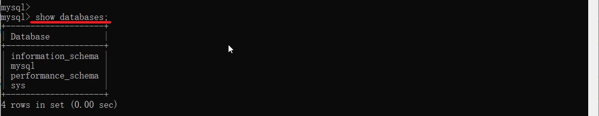

2). 查询当前数据库

```sql
select database() ;
```

3). 创建数据库

```sql
create database [ if not exists ] 数据库名 [ default charset 字符集 ] [ collate 排序 规则 ] ;
```

案例：

A. 创建一个itcast数据库, 使用数据库默认的字符集。

```sql
create database itcast;
```

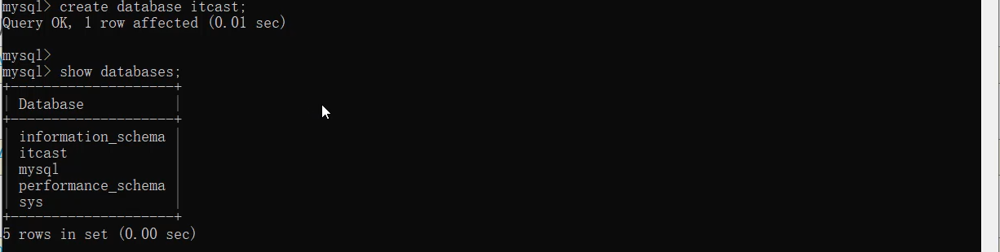

在同一个数据库服务器中，不能创建两个名称相同的数据库，否则将会报错。

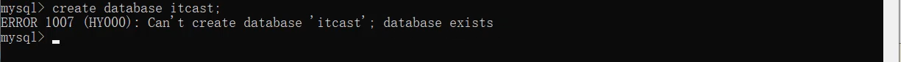

可以通过if not exists 参数来解决这个问题，数据库不存在, 则创建该数据库，如果存在，则不创建。

```sql
create database if not extists itcast;
```

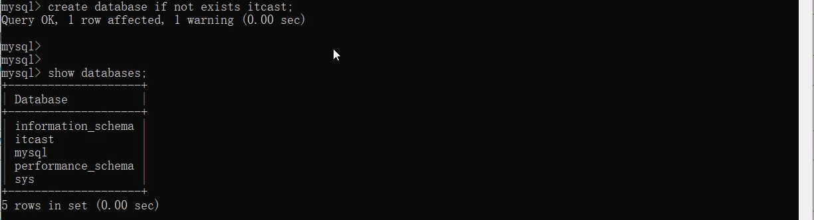

B. 创建一个itheima数据库，并且指定字符集

```sql
create database itheima default charset utf8mb4;
```

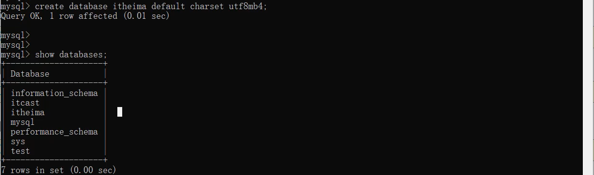

4). 删除数据库

```sql
drop database [ if exists ] 数据库名;
```

如果删除一个不存在的数据库，将会报错。此时，可以加上参数 if exists ，如果数据库存在，再执行删除，否则不执行删除。

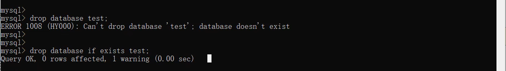

5). 切换数据库

```
use 数据库名;
```

我们要操作某一个数据库下的表时，就需要通过该指令，切换到对应的数据库下，否则是不能操作的。

比如，切换到itcast数据，执行如下SQL：

```sql
use itcast;
```

##### 实践补充：DDL语句_操作数据库


```sql
# ------------------- 案例1: DDL语句操作 数据库 -------------------
# 1. 查看当前所有的数据库.
show databases ;

# 2. 删除数据库.
drop database day10;

# 3. 创建数据库.
# 方式1: 数据库存在时, 报错.
create database day01 character set utf8mb4;
# 方式2: 数据库存在时, 什么都不做.
create database if not exists day01 character set utf8mb4;
# 方式3: 创建数据库, 指定码表.
create database if not exists day02  charset 'gbk';

# 4. 查看两个数据库的详细信息(码表信息)
show create database day01;
show create database day02;

# 5. 修改数据库的码表.
alter database day02 character set utf8mb4;

# 6. 切换数据库.
use day01;

# 7. 查看当前使用的是哪个数据库.
select database();      # day01
```

#### 2.3.2 表操作

##### 2.3.2.1 表操作-查询创建

1). 查询当前数据库所有表

```sql
show tables;
```

比如,我们可以切换到sys这个系统数据库,并查看系统数据库中的所有表结构。

```sql
use sys;
show tables;
```

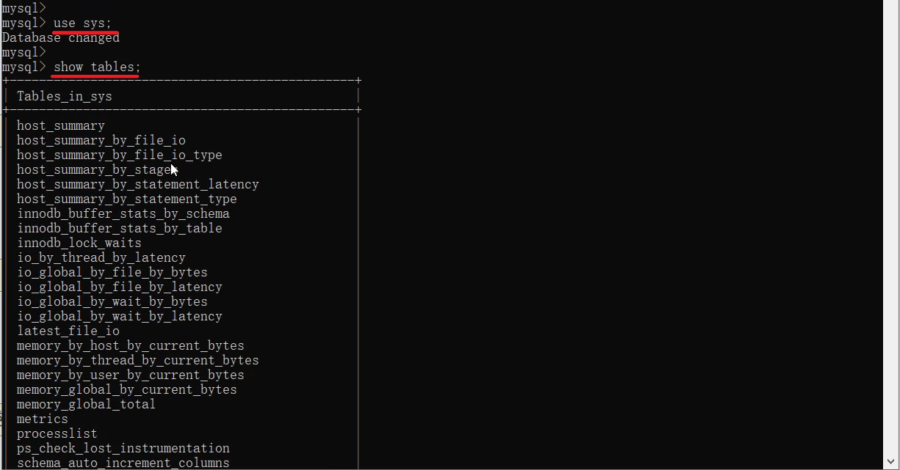

2). 查看指定表结构

```sql
desc 表名;
```

通过这条指令，我们可以查看到指定表的字段，字段的类型、是否可以为NULL，是否存在默认值等信息。

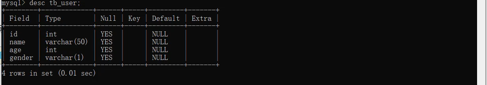

3). 查询指定表的建表语句

```sql
show create table 表名;
```

通过这条指令，主要是用来查看建表语句的，而有部分参数我们在创建表的时候，并未指定也会查询到，因为这部分是数据库的默认值，如：存储引擎、字符集等。

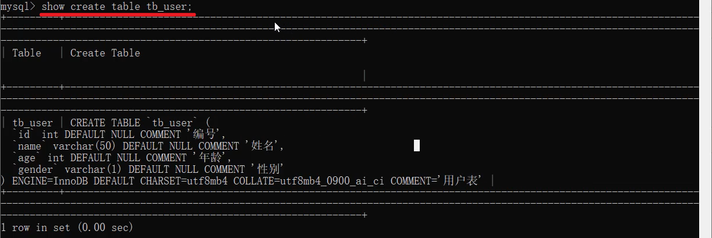

4). 创建表结构

```sql
CREATE TABLE 表名(
    字段1 字段1类型 [ COMMENT 字段1注释 ],
    字段2 字段2类型 [COMMENT 字段2注释 ],
    字段3 字段3类型 [COMMENT 字段3注释 ],
    ......
    字段n 字段n类型 [COMMENT 字段n注释 ]
) [ COMMENT 表注释 ] ;
```

注意: [...] 内为可选参数，最后一个字段后面没有逗号

比如，我们创建一张表 tb_user ，对应的结构如下，那么建表语句为：

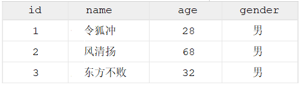

```sql
create table tb_user(
    id int comment '编号',
    name varchar(50) comment '姓名',
    age int comment '年龄',
    gender varchar(1) comment '性别'
) comment '用户表';
```

##### 2.3.2.2 表操作-数据类型

在上述的建表语句中，我们在指定字段的数据类型时，用到了int ，varchar，那么在MySQL中除了以上的数据类型，还有哪些常见的数据类型呢？接下来,我们就来详细介绍一下MySQL的数据类型。

MySQL中的数据类型有很多，主要分为三类：数值类型、字符串类型、日期时间类型。

1). 数值类型

| 类型 | 大小 有符号(SIGNED)范围 | 无符号(UNSIGNED)范围 | 描述 |
| --- | --- | --- | --- |
| TINYINT | 1byte (-128，127) | (0，255) | 小整数值 |
| SMALLINT | 2bytes (-32768，32767) | (0，65535) | 大整数值 |
| MEDIUMINT | 3bytes (-8388608，8388607) | (0，16777215) | 大整数值 |
| INT/INTEGER | 4bytes (-2147483648，2147483647) | (0，4294967295) | 大整数值 |
| BIGINT | 8bytes (-2^63，2^63-1) | (0，2^64-1) | 极大整数值 |
| FLOAT | 4bytes (-3.402823466 E+38，3.402823466351 E+38) | 0 和 (1.175494351 E-38，3.402823466 E+38) | 单精度浮点数值 |
| DOUBLE | 8bytes (-1.7976931348623157 E+308，1.7976931348623157 E+308) | 0 和 (-2.2250738585072014 E-308，1.7976931348623157 E+308) | 双精度浮点数值 |
| DECIMAL | 依赖于M(精度)和D(标度)的值 | 依赖于M(精度)和D(标度)的值 | 小数值(精确定点数) |

```
如:
    1). 年龄字段 -- 不会出现负数, 而且人的年龄不会太大
    age tinyint unsigned

    2). 分数 -- 总分100分, 最多出现一位小数
    score double(4,1)
```

2). 字符串类型

| 类型 | 大小 | 描述 |
| --- | --- | --- |
| CHAR | 0-255 bytes | 定长字符串(需要指定长度) |
| VARCHAR | 0-65535 bytes | 变长字符串(需要指定长度) |
| TINYBLOB | 0-255 bytes | 不超过255个字符的二进制数据 |
| TINYTEXT | 0-255 bytes | 短文本字符串 |
| BLOB | 0-65 535 bytes | 二进制形式的长文本数据 |
| TEXT | 0-65 535 bytes | 长文本数据 |
| MEDIUMBLOB | 0-16 777 215 bytes | 二进制形式的中等长度文本数据 |
| MEDIUMTEXT | 0-16 777 215 bytes | 中等长度文本数据 |
| LONGBLOB | 0-4 294 967 295 bytes | 二进制形式的极大文本数据 |
| LONGTEXT | 0-4 294 967 295 bytes | 极大文本数据 |

char 与 varchar 都可以描述字符串，char是定长字符串，指定长度多长，就占用多少个字符，和字段值的长度无关。而varchar是变长字符串，指定的长度为最大占用长度。相对来说，char的性能会更高些。

```
如：
    1). 用户名 username ------> 长度不定, 最长不会超过50
    username varchar(50)

    2). 性别 gender ---------> 存储值, 不是男,就是女
    gender char(1)

    3). 手机号 phone --------> 固定长度为11
    phone char(11)
```

3). 日期时间类型

| 类型 | 大小 | 范围 | 格式 | 描述 |
| --- | --- | --- | --- | --- |
| DATE | 3 | 1000-01-01 至 9999-12-31 | YYYY-MM-DD | 日期值 |
| TIME | 3 | -838:59:59 至 838:59:59 | HH:MM:SS | 时间值或持续时间 |
| YEAR | 1 | 1901 至 2155 | YYYY | 年份值 |
| DATETIME | 8 | 1000-01-01 00:00:00 至9999-12-31 23:59:59 | YYYY-MM-DD HH:MM:SS | 混合日期和时间值 |
| TIMESTAMP | 4 | 1970-01-01 00:00:01 至2038-01-19 03:14:07 | YYYY-MM-DD HH:MM:SS | 混合日期和时间值，时间戳 |

```
如:
    1). 生日字段 birthday
    birthday date

    2). 创建时间 createtime
    createtime datetime
```

##### 2.3.2.3 表操作-案例

设计一张员工信息表，要求如下：

1. 编号（纯数字） 2. 员工工号 (字符串类型，长度不超过10位) 3. 员工姓名（字符串类型，长度不超过10位） 4. 性别（男/女，存储一个汉字） 5. 年龄（正常人年龄，不可能存储负数） 6. 身份证号（二代身份证号均为18位，身份证中有X这样的字符） 7. 入职时间（取值年月日即可）

对应的建表语句如下:

```sql
create table emp(
    id int comment '编号',
    workno varchar(10) comment '工号',
    name varchar(10) comment '姓名',
    gender char(1) comment '性别',
    age tinyint unsigned comment '年龄',
    idcard char(18) comment '身份证号',
    entrydate date comment '入职时间'
) comment '员工表';
```

SQL语句编写完毕之后，就可以在MySQL的命令行中执行SQL，然后也可以通过 desc 指令查询表结构信息：

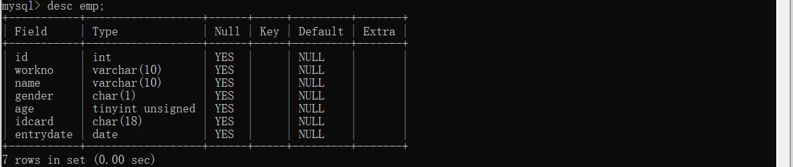

表结构创建好了，里面的name字段是varchar类型，最大长度为10，也就意味着如果超过10将会报错，如果我们想修改这个字段的类型或修改字段的长度该如何操作呢？接下来再来讲解DDL语句中，如何操作表字段。

##### 2.3.2.4 表操作-修改

1). 添加字段

```sql
ALTER TABLE 表名 ADD 字段名 类型 (长度) [ COMMENT 注释 ] [ 约束 ];
```

案例:

为emp表增加一个新的字段”昵称”为nickname，类型为varchar(20)

```sql
ALTER TABLE emp ADD nickname varchar(20) COMMENT '昵称';
```

2). 修改数据类型

```sql
ALTER TABLE 表名 MODIFY 字段名 新数据类型 (长度);
```

3). 修改字段名和字段类型

```sql
ALTER TABLE 表名 CHANGE 旧字段名 新字段名 类型 (长度) [ COMMENT 注释 ] [ 约束 ];
```

案例:

将emp表的nickname字段修改为username，类型为varchar(30)

```sql
ALTER TABLE emp CHANGE nickname username varchar(30) COMMENT '昵称';
```

4). 删除字段

```sql
ALTER TABLE 表名 DROP 字段名;
```

案例:

将emp表的字段username删除

```sql
ALTER TABLE emp DROP username;
```

5). 修改表名

```sql
ALTER TABLE 表名 RENAME TO 新表名;
```

案例:

将emp表的表名修改为 employee

```sql
ALTER TABLE emp RENAME TO employee;
```

###### 实践补充：DDL语句_操作字段


```sql
# ------------------- 案例3: DDL语句操作 字段 -------------------
# 1. 查看某表的结构信息(字段信息)
desc users;

# 2. 给表新增字段: address, int, 非空(约束)
# 格式: alter table 表名 add 字段名 数据类型 [约束];
alter table users add address int not null;

# 3. 修改表的字段信息.
# 场景1: 只修改 数据类型 和 约束, 例如: address,int,非空 -> address, varchar(10), 非空
# 格式: alter table 表名 modify 字段名 新的数据类型 [新的约束];
alter table users modify address varchar(10);           # 如果没加约束, 则之前的非空约束就没了.
alter table users modify address varchar(10) not null;  # 这个才是符合题设的SQL语句.

# 场景2: 修改列名, 数据类型, 约束.  address,varchar(10),非空 -> addr,varchar(20), 非空
# 格式: alter table 表名 change 旧字段名 新字段名 新的数据类型 [新的约束];
alter table users change address addr varchar(20) not null;

# 4. 删除addr字段.   需求: 删除addr字段.
# 格式: alter table 表名 drop 旧字段名;
alter table users drop addr;
```

##### 2.3.2.5 表操作-删除

1). 删除表

```sql
DROP TABLE [ IF EXISTS ] 表名;
```

可选项 IF EXISTS 代表，只有表名存在时才会删除该表，表名不存在，则不执行删除操作(如果不加该参数项，删除一张不存在的表，执行将会报错)。

案例:

如果tb_user表存在，则删除tb_user表

```sql
DROP TABLE IF EXISTS tb_user;
```

2). 删除指定表, 并重新创建表

```
TRUNCATE TABLE 表名;
```

注意: 在删除表的时候，表中的全部数据也都会被删除。

##### 实践补充：DDL语句_操作数据表


```sqlite
# ------------------- 案例2: DDL语句操作 数据表 -------------------
# 0. 务必先切库, 即: 之后的表, 都是在这个库中玩儿的.
use day01;

# 1. 查看(当前数据库中)所有的数据表.
show tables;
# 核心: 查看某张表的结构信息(字段名, 数据类型, 约束等...)
desc users;
# 2. 创建数据表.
/*
格式:
    create table [if not exists] 数据表名(
        字段名 数据类型 [约束],
        字段名 数据类型 [约束],
        ......
        字段名 数据类型 [约束]
    );
细节:
    上述的中括号中的部分, 表示可选项, 写不写都行.
*/
# 需求: 创建用户表users, 字段为: id, username, password
create table if not exists users(
    id int,                 # id列, 整型.
    username varchar(20),   # 账号, 字符串类型
    password varchar(20)    # 密码, 字符串类型
);

# 3. 修改表名.
# 格式1: alter table 旧表名 rename 新表名;
alter table users rename user_tmp;
# 格式2: rename table 旧表名 to 新表名;
rename table user_tmp to users;

# 4. 删除数据表.
drop table users;
```

### 2.4 图形化界面工具

上述，我们已经讲解了通过DDL语句，如何操作数据库、操作表、操作表中的字段，而通过DDL语句执行在命令进行操作，主要存在以下两点问题：

1).会影响开发效率;

2). 使用起来，并不直观，并不方便；

所以呢，我们在日常的开发中，会借助于MySQL的图形化界面，来简化开发，提高开发效率。而目前mysql主流的图形化界面工具，有以下几种：


而本次课程中，选择最后一种DataGrip，这种图形化界面工具，功能更加强大，界面提示更加友好，是我们使用MySQL的不二之选。接下来，我们来介绍一下DataGrip该如何安装、使用。

#### 2.4.1 安装

1). 找到资料中准备好的安装包，双击开始安装


2). 点击next，一步一步的完成安装

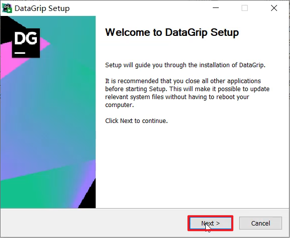

选择DataGrip的安装目录，然后选择下一步

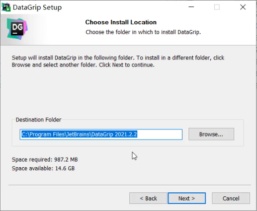

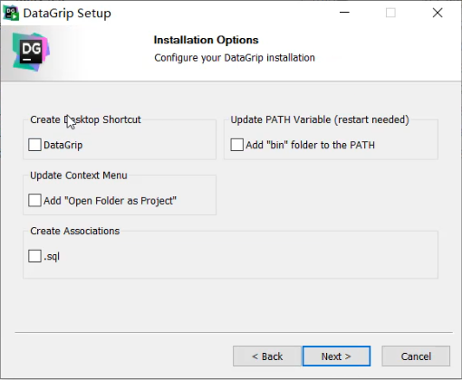

下一步，执行安装

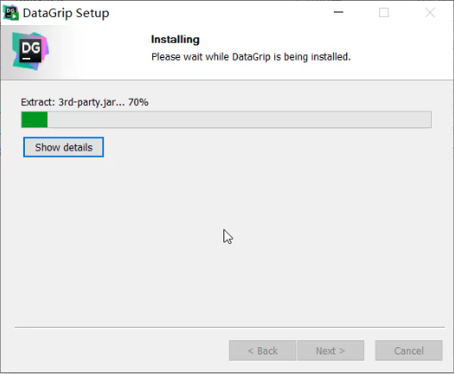

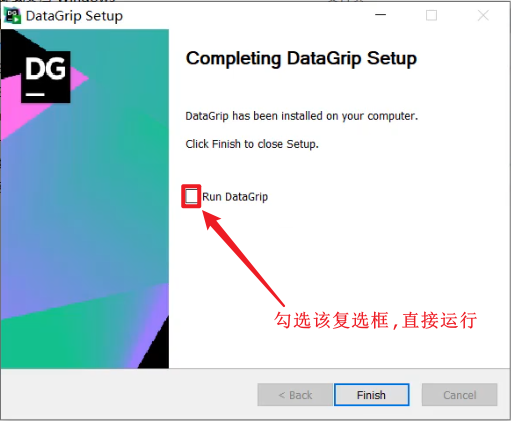

#### 2.4.2 使用

1). 添加数据源

参考图示, 一步步操作即可

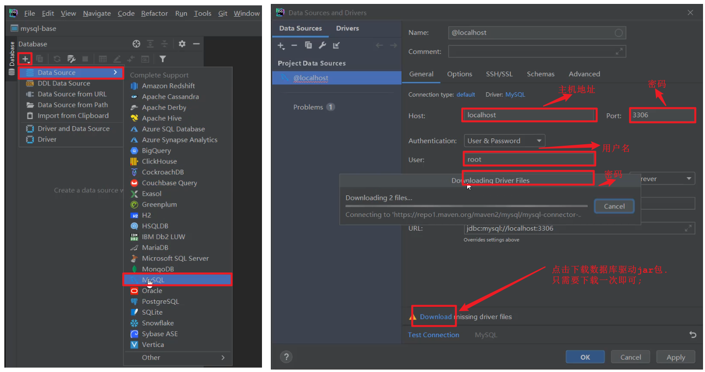

配置以及驱动jar包下载完毕之后，就可以点击"Test Connection" 就可以测试，是否可以连接MySQL，如果出现"Successed"，就表名连接成功了。


2). 展示所有数据库

连接上了MySQL服务之后，并未展示出所有的数据库，此时，我们需要设置，展示所有的数据库，具体操作如下：


3). 创建数据库


注意:

以下两种方式都可以创建数据库：

A. create database db01;

B. create schema db01;

4). 创建表

在指定的数据库上面右键，选择new --> Table


5). 修改表结构

在需要修改的表上，右键选择"Modify Table..."


如果想增加字段，直接点击+号，录入字段信息，然后点击Execute即可。

如果想删除字段，直接点击-号，就可以删除字段，然后点击Execute即可。

如果想修改字段，双击对应的字段，修改字段信息，然后点击Execute即可。

如果要修改表名，或表的注释，直接在输入框修改，然后点击Execute即可。

6). 在DataGrip中执行SQL语句

在指定的数据库上，右键，选择 New --> Query Console


然后就可以在打开的Query Console控制台，并在控制台中编写SQL，执行SQL。


##### 实践补充：DataGrip连接MySQL


* 安装DataGrip软件

  > 此处略, 详见讲义, 因为它和PyCharm都是属于JetBrains公司的产品, 所以安装, 激活, 常见设置都是一样的操作. 
  >
  > 下载网址: https://www.jetbrains.com/datagrip/download/other.html

* 配置DataGrip连接MySQL

  1. 新建工程

     

  2. 选择新工程的打开方式.

     

  3. 选择要连接到的数据库

     

  4. 配置连接信息即可.

     

     

     

* 扩展

  1. DataGrip连接小皮(windows本地, Mac本地)的MySQL.

     

     

  2. PyCharm(必须是专业版)连接 Linux 或者 本机(Windows, Mac)的数据库.

     

     

     

* 图解

  

##### 实践补充：DataGrip的基本设置


* 基本配置

  

* 常用的插件推荐

  

### 2.5 DML

DML英文全称是Data Manipulation Language(数据操作语言)，用来对数据库中表的数据记录进行增、删、改操作。

添加数据（INSERT）

修改数据（UPDATE）

删除数据（DELETE）

#### 2.5.1 添加数据

1). 给指定字段添加数据

```sql
INSERT INTO 表名 (字段名1, 字段名2, ...) VALUES (值1, 值2, ...);
```

案例: 给employee表所有的字段添加数据；

```sql
insert into employee(id,workno,name,gender,age,idcard,entrydate) values(1,'1','Itcast','男',10,'123456789012345678','2000-01-01');
```

插入数据完成之后，我们有两种方式，查询数据库的数据：

A. 方式一

在左侧的表名上双击，就可以查看这张表的数据。


B. 方式二

可以直接一条查询数据的SQL语句, 语句如下:

```sql
select * from employee;
```

案例: 给employee表所有的字段添加数据

执行如下SQL，添加的年龄字段值为-1。

```sql
insert into employee(id,workno,name,gender,age,idcard,entrydate) values(1,'1','Itcast','男',-1,'123456789012345678','2000-01-01');
```

执行上述的SQL语句时，报错了，具体的错误信息如下：

因为 employee 表的age字段类型为 tinyint，而且还是无符号的 unsigned ，所以取值只能在0-255 之间。


2). 给全部字段添加数据

```sql
INSERT INTO 表名 VALUES (值1, 值2, ...);
```

案例：插入数据到employee表，具体的SQL如下：

```sql
insert into employee values(2,'2','张无忌','男',18,'123456789012345670','2005-01- 01');
```

3). 批量添加数据

```sql
INSERT INTO 表名 (字段名1, 字段名2, ...) VALUES (值1, 值2, ...), (值1, 值2, ...), (值 1, 值2, ...) ;
```

```sql
INSERT INTO 表名 VALUES (值1, 值2, ...), (值1, 值2, ...), (值1, 值2, ...) ;
```

案例：批量插入数据到employee表，具体的SQL如下：

```sql
insert into employee values(3,'3','韦一笑','男',38,'123456789012345670','2005-01- 01'),(4,'4','赵敏','女',18,'123456789012345670','2005-01-01');
```

注意事项:

- 插入数据时，指定的字段顺序需要与值的顺序是一一对应的。

- 字符串和日期型数据应该包含在引号中。

- 插入的数据大小，应该在字段的规定范围内。

##### 实践补充：DML语句_增


```sql
# ------------------- 案例1: DML语句操作 表数据 -> 增 -------------------
/*
DML语句主要操作的是: 表数据. 对表数据进行增, 删, 改的操作.

SQL中, 给表添加数据的格式:
    # 格式1: 普通写法.
    insert into 表名(列名1, 列名2...) values(值1, 值2...);      # 列的个数和类型 要和后续 值的个数和类型完全一致.

    # 格式2: 省略列名
    insert into 表名 values(值1, 值2...);       # 如果不写列名, 则默认表示: 全列名.

    # 格式3: 如果有了主键约束, 则添加表数据的动作可以简写为:
    insert into 表名 values(null, 值1, 值2...);

    # 格式4: 如果要同时添加多条数据, 写法如下:
    insert into 表名 values(值1, 值2, 值3), (值4, 值5, 值6).......;
*/
# 1. 切库
use day01;
# 2. 查表
show tables;
# 3. 查看表数据, 目前先了解, 稍后讲.
select * from users;

# 4. 往 用户表中添加数据.
# 格式1: 普通写法.
insert into users(id, username, password) values(1, 'admin01', 'pwd111');
insert into users(username) values('admin01');

# 格式2: 省略列名, 默认 = 全列名
insert into users values(1, 'admin01', 'pwd111');

# 格式3: 同时添加多个用户信息.
insert into users values(2, 'admin01', 'pwd222'), (3, 'admin03', 'pwd333');
```

#### 2.5.2 修改数据

修改数据的具体语法为:

```sql
UPDATE 表名 SET 字段名1 = 值1 , 字段名2 = 值2 , .... [ WHERE 条件 ] ;
```

案例:

A. 修改id为1的数据，将name修改为itheima

```sql
update employee set name = 'itheima' where id = 1;
```

B. 修改id为1的数据, 将name修改为小昭, gender修改为女

```sql
update employee set name = '小昭' , gender = '女' where id = 1;
```

C. 将所有的员工入职日期修改为 2008-01-01

```sql
update employee set entrydate = '2008-01-01';
```

注意事项:

修改语句的条件可以有，也可以没有，如果没有条件，则会修改整张表的所有数据。

##### 实践补充：DML语句_改


```sql
# ------------------- 案例3: DML语句操作 表数据 -> 改 -------------------
# UPDATE/DELETE 在没有 WHERE 时会影响所有行。执行前先用同条件 SELECT 核对范围，并在重要操作中使用事务与备份。
# 格式: update 表名 set 字段名=值, 字段名=值 where 条件;
# 1. 查看表数据.
select * from stu;

# 2. 修改id为2的学生信息为: 杨过, 男
update stu set name='杨过', gender='男' where id = 2;
# 危险示例（不要直接执行）: update stu set name='杨过', gender='男';  -- 会更新所有行

# 3. 修改id为3的学生信息: 小龙女, 777, 女
update stu set name='小龙女', tel='777', gender='女' where id = 3;
```

#### 2.5.3 删除数据

删除数据的具体语法为：

```sql
DELETE FROM 表名 [ WHERE 条件 ] ;
```

案例:

A. 删除gender为女的员工

```sql
delete from employee where gender = '女';
```

B. 删除所有员工

```sql
delete from employee;
```

注意事项:

- DELETE 语句的条件可以有，也可以没有，如果没有条件，则会删除整张表的所有数据。

- DELETE 语句不能删除某一个字段的值(可以使用UPDATE，将该字段值置为NULL即可)。

- 当进行删除全部数据操作时，datagrip会提示我们，询问是否确认删除，我们直接点击Execute即可。

##### 实践补充：DML语句_删


```sql
# ------------------- 案例4: DML语句操作 表数据 -> 删 -------------------
# 删除: delete from 表名 where 条件;
# 0. 删除数据表.
drop table if exists stu;

# 1. 创建数据表, 学生表student, 字段: 学号(唯一), 姓名(非空), 手机号(唯一), 性别(默认: 男)
create table stu(
    id int primary key auto_increment,             # 主键约束(非空, 唯一), 自增
    name varchar(10) not null,      # 非空约束
    tel varchar(11) unique ,        # 唯一约束
    gender varchar(1) default '男'   # 默认约束
);
# 2. 添加表数据.
insert into stu values(null, '乔峰', '111', '男'), (null, '虚竹', '222', '男'), (null, '段誉', '333', '男');
select * from stu;

# 3. 按条件删除一行.
delete from stu where id = 2;       # 删除1条

# 4. 面试题: truncate table 和 delete from的区别.
# DELETE FROM 属于 DML，可带 WHERE；对 InnoDB 表可在事务中回滚。删除全部行通常不会重置 AUTO_INCREMENT 计数器。
# TRUNCATE TABLE 属于 DDL，快速清空整表并通常重置 AUTO_INCREMENT；它会隐式提交，不能用 ROLLBACK 撤销。
delete from stu;        # 删除全部行；生产环境执行前务必确认并做好恢复准备

truncate table stu;     # 清空整表；只能使用完整的 TRUNCATE TABLE 语法
```

### 2.6 DQL

DQL英文全称是Data Query Language(数据查询语言)，数据查询语言，用来查询数据库中表的记录。

查询关键字: SELECT

在一个正常的业务系统中，查询操作的频次是要远高于增删改的，当我们去访问企业官网、电商网站，在这些网站中我们所看到的数据，实际都是需要从数据库中查询并展示的。而且在查询的过程中，可能还会涉及到条件、排序、分页等操作。


那么，本小节我们主要学习的就是如何进行数据的查询操作。我们先来完成如下数据准备工作:

```sql
drop table if exists employee;

create table emp(
    id int comment '编号',
    workno varchar(10) comment '工号',
    name varchar(10) comment '姓名',
    gender char(1) comment '性别',
    age tinyint unsigned comment '年龄',
    idcard char(18) comment '身份证号',
    workaddress varchar(50) comment '工作地址',
    entrydate date comment '入职时间'
)comment '员工表';

INSERT INTO emp (id, workno, name, gender, age, idcard, workaddress, entrydate) VALUES (1, '00001', '柳岩666', '女', 20, '123456789012345678', '北京', '2000-01- 01');
INSERT INTO emp (id, workno, name, gender, age, idcard, workaddress, entrydate) VALUES (2, '00002', '张无忌', '男', 18, '123456789012345670', '北京', '2005-09- 01');
INSERT INTO emp (id, workno, name, gender, age, idcard, workaddress, entrydate) VALUES (3, '00003', '韦一笑', '男', 38, '123456789712345670', '上海', '2005-08- 01');
INSERT INTO emp (id, workno, name, gender, age, idcard, workaddress, entrydate) VALUES (4, '00004', '赵敏', '女', 18, '123456757123845670', '北京', '2009-12-01');
INSERT INTO emp (id, workno, name, gender, age, idcard, workaddress, entrydate) VALUES (5, '00005', '小昭', '女', 16, '123456769012345678', '上海', '2007-07-01');
INSERT INTO emp (id, workno, name, gender, age, idcard, workaddress, entrydate) VALUES (6, '00006', '杨逍', '男', 28, '12345678931234567X', '北京', '2006-01-01');
INSERT INTO emp (id, workno, name, gender, age, idcard, workaddress, entrydate) VALUES (7, '00007', '范瑶', '男', 40, '123456789212345670', '北京', '2005-05-01');
INSERT INTO emp (id, workno, name, gender, age, idcard, workaddress, entrydate) VALUES (8, '00008', '黛绮丝', '女', 38, '123456157123645670', '天津', '2015-05- 01');
INSERT INTO emp (id, workno, name, gender, age, idcard, workaddress, entrydate) VALUES (9, '00009', '范凉凉', '女', 45, '123156789012345678', '北京', '2010-04- 01');
INSERT INTO emp (id, workno, name, gender, age, idcard, workaddress, entrydate) VALUES (10, '00010', '陈友谅', '男', 53, '123456789012345670', '上海', '2011-01- 01');
INSERT INTO emp (id, workno, name, gender, age, idcard, workaddress, entrydate) VALUES (11, '00011', '张士诚', '男', 55, '123567897123465670', '江苏', '2015-05- 01');
INSERT INTO emp (id, workno, name, gender, age, idcard, workaddress, entrydate) VALUES (12, '00012', '常遇春', '男', 32, '123446757152345670', '北京', '2004-02- 01');
INSERT INTO emp (id, workno, name, gender, age, idcard, workaddress, entrydate) VALUES (13, '00013', '张三丰', '男', 88, '123656789012345678', '江苏', '2020-11- 01');
INSERT INTO emp (id, workno, name, gender, age, idcard, workaddress, entrydate) VALUES (14, '00014', '灭绝', '女', 65, '123456719012345670', '西安', '2019-05- 01');
INSERT INTO emp (id, workno, name, gender, age, idcard, workaddress, entrydate) VALUES (15, '00015', '胡青牛', '男', 70, '12345674971234567X', '西安', '2018-04- 01');
INSERT INTO emp (id, workno, name, gender, age, idcard, workaddress, entrydate) VALUES (16, '00016', '周芷若', '女', 18, null, '北京', '2012-06-01');
```

准备完毕后，我们就可以看到emp表中准备的16条数据。接下来，我们再来完成DQL语法的学习。

#### 2.6.1 基本语法

DQL 查询语句，语法结构如下：

```sql
SELECT
    字段列表
FROM
    表名列表
WHERE
    条件列表
GROUP BY
    分组字段列表
HAVING
    分组后条件列表
ORDER BY
    排序字段列表
LIMIT
    分页参数
```

我们在讲解这部分内容的时候，会将上面的完整语法进行拆分，分为以下几个部分：

基本查询（不带任何条件）

条件查询（WHERE）

聚合函数（count、max、min、avg、sum）

分组查询（group by）

排序查询（order by）

分页查询（limit）

#### 2.6.2 基础查询

在基本查询的DQL语句中，不带任何的查询条件，查询的语法如下：

1). 查询多个字段

```sql
SELECT 字段1, 字段2, 字段3 ... FROM 表名;
```

```sql
SELECT * FROM 表名;
```

注意: * 号代表查询所有字段，在实际开发中尽量少用（不直观、影响效率）。

2). 字段设置别名

```sql
SELECT 字段1 [ AS 别名1 ] , 字段2 [ AS 别名2 ] ... FROM 表名;
```

```sql
SELECT 字段1 [ 别名1 ] , 字段2 [ 别名2 ] ... FROM 表名;
```

3). 去除重复记录

```sql
SELECT DISTINCT 字段列表 FROM 表名;
```

案例：

A. 查询指定字段 name, workno, age并返回

```sql
select name,workno,age from emp;
```

B. 查询返回所有字段

```sql
select id ,workno,name,gender,age,idcard,workaddress,entrydate from emp;
```

```sql
select * from emp;
```

C. 查询所有员工的工作地址,起别名

```sql
select workaddress as '工作地址' from emp;
```

```sql
-- as可以省略
select workaddress '工作地址' from emp;
```

D. 查询公司员工的上班地址有哪些(不要重复)

```sql
select distinct workaddress '工作地址' from emp;
```

##### 实践补充：单表查询_简单查询


```sql
# --------------------- 案例2: 演示单表查询 -> 简单查询 ---------------------
/*
单表查询, 完整查询格式如下:
    select
        [distinct] 列名1 as 别名, 列名2 as 别名, ...
    from
        数据表名
    where
        组前筛选
    group by
        分组字段
    having
        组后筛选
    order by
        排序字段 [asc | desc]
    limit
        起始索引, 数据条数;
*/
# 1. 创建商品表.
create table product
(
    pid         int primary key auto_increment, # 商品id, 主键
    pname       varchar(20),    # 商品名
    price       double,         # 商品单价
    category_id varchar(32)     # 商品的分类id
);

# 2. 添加表数据.
INSERT INTO product(pid,pname,price,category_id) VALUES(null,'联想',5000,'c001');
INSERT INTO product(pid,pname,price,category_id) VALUES(null,'海尔',3000,'c001');
INSERT INTO product(pid,pname,price,category_id) VALUES(null,'雷神',5000,'c001');
INSERT INTO product(pid,pname,price,category_id) VALUES(null,'杰克琼斯',800,'c002');
INSERT INTO product(pid,pname,price,category_id) VALUES(null,'真维斯',200, null);
INSERT INTO product(pid,pname,price,category_id) VALUES(null,'花花公子',440,'c002');
INSERT INTO product(pid,pname,price,category_id) VALUES(null,'劲霸',2000,'c002');
INSERT INTO product(pid,pname,price,category_id) VALUES(null,'香奈儿',800,'c003');
INSERT INTO product(pid,pname,price,category_id) VALUES(null,'相宜本草',200, null);
INSERT INTO product(pid,pname,price,category_id) VALUES(null,'面霸',5,'c003');
INSERT INTO product(pid,pname,price,category_id) VALUES(null,'好想你枣',56,'c004');
INSERT INTO product(pid,pname,price,category_id) VALUES(null,'香飘飘奶茶',1,'c005');
INSERT INTO product(pid,pname,price,category_id) VALUES(null,'海澜之家',1,'c002');

# 3. 查看表数据.
# 需求1: 查询所有的商品信息
select * from product;
select pid, pname, price, category_id from product; # 效果同上.

# 需求2: 查看商品名 和 商品价格.
select pname, price from product;
# 扩展: 起别名, 列名, 表名都可以起别名.
# 格式: 列名 as 别名  或者 表名 as 别名, 其中 as 可以省略不写.
select pname as 商品名, price 商品价格 from product as p;

# 需求3: 查看结果是表达式, 将所有的商品价格+10, 进行展示.
select pname, price + 10 from product;
select pname, price + 10 as price from product;
```

#### 2.6.3 条件查询

1). 语法

```sql
SELECT 字段列表 FROM 表名 WHERE 条件列表;
```

2). 条件

常用的比较运算符如下:

| 比较运算符 | 功能 |
| --- | --- |
| > | 大于 |
| >= | 大于等于 |
| < | 小于 |
| <= | 小于等于 |
| = | 等于 |
| <> 或!= | 不等于 |
| BETWEEN ... AND ... | 在某个范围之内(含最小、最大值) |
| IN(...) | 在in之后的列表中的值，多选一 |
| LIKE 占位符 | 模糊匹配(_匹配单个字符, %匹配任意个字符) |
| IS NULL | 是NULL |

常用的逻辑运算符如下:

| 逻辑运算符 | 功能 |
| --- | --- |
| AND 或 && | 并且(多个条件同时成立) |
| OR 或 \|\| | 或者(多个条件任意一个成立) |
| NOT 或! | 非, 不是 |

案例:

A. 查询年龄等于 88 的员工

```sql
select * from emp where age = 88;
```

B. 查询年龄小于 20 的员工信息

```sql
select * from emp where age < 20;
```

C. 查询年龄小于等于 20 的员工信息

```sql
select * from emp where age <= 20;
```

D. 查询没有身份证号的员工信息

```sql
select * from emp where idcard is null;
```

E. 查询有身份证号的员工信息

```sql
select * from emp where idcard is not null;
```

F. 查询年龄不等于 88 的员工信息

```sql
select * from emp where age != 88;
select * from emp where age <> 88;
```

G. 查询年龄在15岁(包含) 到 20岁(包含)之间的员工信息

```sql
select * from emp where age >= 15 && age <= 20;
select * from emp where age >= 15 and age <= 20;
select * from emp where age between 15 and 20;
```

H. 查询性别为女且年龄小于 25岁的员工信息

```sql
select * from emp where gender = '女' and age < 25;
```

I. 查询年龄等于18 或 20 或 40 的员工信息

```sql
select * from emp where age = 18 or age = 20 or age =40;
select * from emp where age in(18,20,40);
```

J. 查询姓名为两个字的员工信息 _ %

```sql
select * from emp where name like '__';
```

K. 查询身份证号最后一位是X的员工信息

```sql
select * from emp where idcard like '%X';
select * from emp where idcard like '_________________X';
```

##### 实践补充：条件查询_比较运算符


```sql
# --------------------- 案例3: 演示单表查询 -> 条件查询 ---------------------
# 格式: select 列名1, 列名2... from 数据表名 where 条件;
# 场景1: 比较运算符, >, >=, <, <=, =, !=, <>
# 需求1: 查询商品名称为“花花公子”的商品所有信息：
select * from product where pname ='花花公子';
# 需求2: 查询价格为800商品
select * from product where price=800;
# 需求3: 查询价格不是800的所有商品
select * from product where price!=800;
select * from product where price<>800;
# 需求4: 查询商品价格大于60元的所有商品信息
select * from product where price > 60;
# 需求5: 查询商品价格小于等于800元的所有商品信息
select * from product where price <= 800;
```

##### 实践补充：条件查询_逻辑运算符和范围查询


```sql
# 场景2: 范围查询.   between 值1 and 值2  -> 适用于连续的区间,   in (值1, 值2..)  -> 适用于 固定值的判断.
# 场景3: 逻辑运算符. and, or, not
# 需求6: 查询商品价格在200到800之间所有商品
select * from product where price between 200 and 800;  # 包左包右.
select * from product where price >= 200 and price <= 800;

# 需求7: 查询商品价格是200或800的所有商品
select * from product where price in (200, 800);
select * from product where price=200 or price=800;

# 需求8: 查询价格不是800的所有商品
select * from product where price != 800;
select * from product where not price = 800;
select * from product where price not in (800);
```

##### 实践补充：条件判断_模糊查询和非空判断


```sql
# 场景4: 模糊查询. 字段名 like '_内容%'     _ 代表任意的1个字符; %代表任意的多个字符, 至少0个, 至多无所谓.
# 需求9: 查询以'香'开头的所有商品
select * from product where pname like '香%';
# 需求10: 查询第二个字为'想'的所有商品
select * from product where pname like '_想%';
select * from product where pname like '_想';    # 只能查出 *想 两个字的, 不符合题设.

# 场景5: 非空查询.   is null,  is not null,   不能用=来判断空.
# 需求11: 查询没有分类的商品
select * from product where category_id=null;       # 不报错,但是没结果.
select * from product where category_id is null;    # 正确的, 判空操作.

# 需求12: 查询有分类的商品
select * from product where category_id is not null;   # 正确的, 非空判断操作.
```

#### 2.6.4 聚合函数

1). 介绍

将一列数据作为一个整体，进行纵向计算。

2). 常见的聚合函数

| 函数 | 功能 |
| --- | --- |
| count | 统计数量 |
| max | 最大值 |
| min | 最小值 |
| avg | 平均值 |
| sum | 求和 |

3). 语法

```sql
SELECT 聚合函数(字段列表) FROM 表名;
```

注意: NULL值是不参与所有聚合函数运算的。

案例：

A. 统计该企业员工数量

```sql
select count(*) from emp; -- 统计的是总记录数
select count(idcard) from emp; -- 统计的是idcard字段不为null的记录数
```

对于count聚合函数，统计符合条件的总记录数，还可以通过 count(数字/字符串)的形式进行统计查询，比如：

```sql
select count(1) from emp;
```

对于count(*) 、count(字段)、 count(1) 的具体原理，我们在进阶篇中SQL优化部分会详细讲解，此处大家只需要知道如何使用即可。

B. 统计该企业员工的平均年龄

```sql
select avg(age) from emp;
```

C. 统计该企业员工的最大年龄

```sql
select max(age) from emp;
```

D. 统计该企业员工的最小年龄

```sql
select min(age) from emp;
```

E. 统计西安地区员工的年龄之和

```sql
select sum(age) from emp where workaddress = '西安';
```

##### 实践补充：聚合查询


```sql
# --------------------- 案例5: 演示单表查询 -> 聚合查询 ---------------------
/*
聚合查询(多进一出)介绍:
    概述:
        聚合查询是对表中的某列数据做操作.
    常用的聚合函数:
        count()     统计某列值的个数, 只统计非空值. 一般用于统计 表中数据的总条数.
        sum()       求和
        max()       求最大值
        min()       求最小值
        avg()       求平均值
面试题: count(*), count(1), count(列)的区别是什么?
    区别1: 是否统计空值
        count(列): 只统计该列的非空值.
        count(1), count(*): 统计所有数据, 包括空值.
    区别2: 性能问题.
        不要背固定的性能排序。MySQL 优化器会根据存储引擎、索引与统计信息选择执行计划；统计行数通常优先写语义明确的 count(*)，实际性能用 EXPLAIN ANALYZE 和真实数据验证。
*/
# 需求1: 查询商品的总条数
select count(pid) as total_cnt from product;
select count(category_id) as total_cnt from product;
select count(*) as total_cnt from product;
select count(1) as total_cnt from product;

# 需求2: 查询价格大于200商品的总条数
select count(pid) as total_cnt from product where price > 200;

# 需求3: 查询分类为'c001'的所有商品价格的总和
select sum(price) as total_price from product where category_id='c001';

# 需求4: 查询分类为'c002'所有商品的平均价格
select avg(price) as avg_price from product where category_id='c002';

# 需求5: 查询商品的最大价格和最小价格     扩展: ctrl + alt + 字母L 代码格式化.
select
    max(price) as max_price,
    min(price) as min_price
from
    product;
```

#### 2.6.5 分组查询

1). 语法

```sql
SELECT 字段列表 FROM 表名 [ WHERE 条件 ] GROUP BY 分组字段名 [ HAVING 分组 后过滤条件 ];
```

2). where与having区别

执行时机不同：where是分组之前进行过滤，不满足where条件，不参与分组；而having是分组之后对结果进行过滤。

判断条件不同：where不能对聚合函数进行判断，而having可以。

注意事项:

- 分组之后，查询的字段一般为聚合函数和分组字段，查询其他字段无任何意义。

- 执行顺序: where > 聚合函数 > having 。

- 支持多字段分组, 具体语法为: group by columnA,columnB

案例:

A. 根据性别分组, 统计男性员工和女性员工的数量

```sql
select gender, count(*) from emp group by gender ;
```

B. 根据性别分组, 统计男性员工和女性员工的平均年龄

```sql
select gender, avg(age) from emp group by gender ;
```

C. 查询年龄小于45的员工, 并根据工作地址分组, 获取员工数量大于等于3的工作地址

```sql
select workaddress, count(*) address_count from emp where age < 45 group by workaddress having address_count >= 3;
```

D. 统计各个工作地址上班的男性及女性员工的数量

```sql
select workaddress, gender, count(*) '数量' from emp group by gender , workaddress ;
```

##### 实践补充：分组查询


```sql
# --------------------- 案例6: 演示单表查询 -> 分组查询 ---------------------
/*
分组查询介绍:
    概述:
        简单理解为, 根据分组字段, 把表数据 化整为零, 然后基于每个分组后的每个部分, 进行对应的聚合运算.
    格式:
        select 列1, 列2... from 数据表名 where 组前筛选 group by 分组字段 having 组后筛选;
    细节:
        1. 分组查询 一般要结合 聚合函数一起使用, 且根据谁分组, 就根据谁查询.
        2. WHERE 在分组/聚合前筛选行；HAVING 在分组后筛选组，通常用于聚合条件。能放在 WHERE 的非聚合条件尽量提前过滤。
        3. 面试题: where 和 having的区别是什么?
            where: 分组前筛选行，不能直接使用本层查询的聚合结果.
            having: 分组后筛选组，可以使用聚合函数.
        4. 开启 ONLY_FULL_GROUP_BY 时，SELECT 中的非聚合列必须出现在 GROUP BY 中，或能由分组列函数依赖确定。
        5. 如果目的只是对选中列去重，应优先使用 DISTINCT；GROUP BY 表达的是分组语义，不能一概替代 DISTINCT。
 */
# 需求1: 统计各个分类商品的个数.
select category_id, count(*) as total_cnt from product group by category_id;

# 需求2: 统计各个分类商品的个数, 且只显示个数大于1的信息.
select
    category_id,
    count(*) as total_cnt
from
    product
group by
    category_id     # 根据商品类别分组.
having
    total_cnt > 1;  # 组后筛选

# 需求3: 仅选择分组字段时结果看起来像去重，但表达“去重”应优先用 DISTINCT
select category_id from product group by category_id;
select category_id from product group by category_id;

# 还可以通过 distinct 关键字来实现去重.
select distinct category_id from product;

# 此时是: 按照category_id 和 price作为整体, 然后去重.
select distinct category_id, price from product;
select category_id, price from product group by category_id, price;  # 效果同上.
```

#### 2.6.6 排序查询

排序在日常开发中是非常常见的一个操作，有升序排序，也有降序排序。


1). 语法

```sql
SELECT 字段列表 FROM 表名 ORDER BY 字段1 排序方式1 , 字段2 排序方式2 ;
```

2). 排序方式

ASC : 升序(默认值)

DESC: 降序

注意事项：

- 如果是升序, 可以不指定排序方式ASC ;

- 如果是多字段排序，当第一个字段值相同时，才会根据第二个字段进行排序;

案例:

A. 根据年龄对公司的员工进行升序排序

```sql
select * from emp order by age asc;
select * from emp order by age;
```

B. 根据入职时间, 对员工进行降序排序

```sql
select * from emp order by entrydate desc;
```

C. 根据年龄对公司的员工进行升序排序, 年龄相同, 再按照入职时间进行降序排序

```sql
select * from emp order by age asc , entrydate desc;
```

##### 实践补充：排序查询


```sql
# --------------------- 案例4: 演示单表查询 -> 排序查询 ---------------------
# 格式: select * from 表名 order by 排序的字段1 [asc | desc], 排序的字段2 [asc | desc], ...;
# 解释1: ascending: 升序,  descending: 降序.
# 解释2: 默认是升序, 所以asc可以省略不写.
# 需求1: 根据价格降序排列.
select * from product order by price;       # 默认是: 升序.
select * from product order by price asc;   # 效果同上.
select * from product order by price desc;  # 价格降序排列.

# 需求2: 根据价格降序排列, 价格一样的情况下, 根据分类降序排列.
select * from product order by price desc, category_id desc;
```

#### 2.6.7 分页查询

分页操作在业务系统开发时，也是非常常见的一个功能，我们在网站中看到的各种各样的分页条，后台都需要借助于数据库的分页操作。

1). 语法

```sql
SELECT 字段列表 FROM 表名 LIMIT 起始索引, 查询记录数;
```

注意事项:

- 起始索引从0开始，起始索引 = （查询页码 - 1）* 每页显示记录数。

- 分页查询是数据库的方言，不同的数据库有不同的实现，MySQL中是LIMIT。

- 如果查询的是第一页数据，起始索引可以省略，直接简写为 limit 10。

案例:

A. 查询第1页员工数据, 每页展示10条记录

```sql
select * from emp limit 0,10;
select * from emp limit 10;
```

B. 查询第2页员工数据, 每页展示10条记录 --------> (页码-1)*页展示记录数

```sql
select * from emp limit 10,10;
```

##### 实践补充：分页查询


```sql
# --------------------- 案例7: 演示单表查询 -> 分页查询 ---------------------
/*
分页查询介绍:
    概述:
        分页查询 = 每次从数据表中查询出固定条数的数据, 一方面可以降低服务器的压力, 另一方面可以降低浏览器端的压力, 且可以提高用户体验.
        实际开发中非常常用.
    格式:
        limit 起始索引, 数据条数;
    细节:
        1. 表中每条数据都有自己的索引, 且索引是从0开始的.
        2. 如果是从索引0开始获取数据的, 则索引0可以省略不写.
    要学好分页, 掌握如下的几个参数计算规则即可:
        数据总条数:      count() 函数
        每页的数据条数:   产品经理, 项目经理, 你...
        每页的起始索引:   (当前的页数 - 1) * 每页的数据条数
        总页数:          (数据总条数 + 每页的数据条数 - 1) // 每页的数据条数
                        (13 + 5 - 1) // 5 = 17 // 5 = 3页
                        (14 + 5 - 1) // 5 = 18 // 5 = 3页
                        (15 + 5 - 1) // 5 = 19 // 5 = 3页
                        (16 + 5 - 1) // 5 = 20 // 5 = 4页
*/
# 需求1: 5条/页.
select * from product limit 5;      # 第1页, 从索引0开始, 获取5条.
select * from product limit 0, 5;   # 第1页, 从索引0开始, 获取5条, 效果同上.

select * from product limit 0, 5;   # 第1页, 从索引0开始, 获取5条.
select * from product limit 5, 5;   # 第2页, 从索引5开始, 获取5条.

# 需求2: 3条/页
select * from product limit 0, 3;  # 第1页, 从索引0开始, 获取3条.
select * from product limit 3, 3;  # 第2页, 从索引3开始, 获取3条.
select * from product limit 6, 3;  # 第3页, 从索引6开始, 获取3条.
select * from product limit 9, 3;  # 第4页, 从索引9开始, 获取3条.
select * from product limit 12, 3;  # 第5页, 从索引12开始, 获取3条.

# 总结, 回顾单表查询的格式
/*
select
    [distinct] 列1 as 别名, 列2
from
    数据表名
where
    组前筛选
group by
    分组字段
having
    组后筛选
order by
    排序字段 [asc | desc]
limit
    起始索引, 数据条数;
*/
# 需求: 统计商品表中, 每类商品的单价总和, 只统计单价在100以上的商品, 只查看单价总和在500以上的分类, 按照商品总价降序排列, 只获取商品总价高的前2条数信息.
select
    category_id,
    sum(price) total_price
from
    product
where               # 组前筛选
    price > 100
group by            # 分组
    category_id
having              # 组后筛选
    total_price > 500
order by            # 排序
    total_price desc
limit 0, 2;         # 分页
```

#### 2.6.8 案例

1). 查询年龄为20,21,22,23岁的员工信息。

```sql
select * from emp where gender = '女' and age in(20,21,22,23);
```

2). 查询性别为男，并且年龄在 20-40 岁(含)以内的姓名为三个字的员工。

```sql
select * from emp where gender = '男' and ( age between 20 and 40 ) and name like '___';
```

3). 统计员工表中, 年龄小于60岁的, 男性员工和女性员工的人数。

```sql
select gender, count(*) from emp where age < 60 group by gender;
```

4). 查询所有年龄小于等于35岁员工的姓名和年龄，并对查询结果按年龄升序排序，如果年龄相同按入职时间降序排序。

```sql
select name , age from emp where age <= 35 order by age asc , entrydate desc;
```

5). 查询性别为男，且年龄在20-40 岁(含)以内的前5个员工信息，对查询的结果按年龄升序排序，年龄相同按入职时间升序排序。

```sql
select * from emp where gender = '男' and age between 20 and 40 order by age asc , entrydate asc limit 5 ;
```

#### 2.6.9 执行顺序

在讲解DQL语句的具体语法之前，我们已经讲解了DQL语句的完整语法，及编写顺序，接下来，我们要来说明的是DQL语句在执行时的执行顺序，也就是先执行那一部分，后执行那一部分。


验证：

查询年龄大于15的员工姓名、年龄，并根据年龄进行升序排序。

```sql
select name , age from emp where age > 15 order by age asc;
```

在查询时，我们给emp表起一个别名 e，然后在select 及 where中使用该别名。

```sql
select e.name , e.age from emp e where e.age > 15 order by age asc;
```

执行上述SQL语句后，我们看到依然可以正常的查询到结果，此时就说明： from 先执行, 然后where 和 select 执行。那 where 和 select 到底哪个先执行呢?

此时，此时我们可以给select后面的字段起别名，然后在 where 中使用这个别名，然后看看是否可以执行成功。

```sql
select e.name ename , e.age eage from emp e where eage > 15 order by age asc;
```

执行上述SQL报错了:


由此我们可以得出结论: from 先执行，然后执行 where ，再执行select 。

接下来，我们再执行如下SQL语句，查看执行效果：

```sql
select e.name ename , e.age eage from emp e where e.age > 15 order by eage asc;
```

结果执行成功。那么也就验证了: order by 是在select 语句之后执行的。

综上所述，我们可以看到DQL语句的执行顺序为： from ... where ... group by ...having ... select ... order by ... limit ...

### 2.7 DCL

DCL英文全称是Data Control Language(数据控制语言)，用来管理数据库用户、控制数据库的访问权限。


#### 2.7.1 管理用户

1). 查询用户

```sql
select * from mysql.user;
```

查询的结果如下:


其中 Host代表当前用户访问的主机, 如果为localhost, 仅代表只能够在当前本机访问，是不可以远程访问的。 User代表的是访问该数据库的用户名。在MySQL中需要通过Host和User来唯一标识一个用户。

2). 创建用户

```sql
CREATE USER '用户名'@'主机名' IDENTIFIED BY '密码';
```

3). 修改用户密码

```sql
ALTER USER '用户名'@'主机名' IDENTIFIED WITH mysql_native_password BY '新密码' ;
```

4). 删除用户

```sql
DROP USER '用户名'@'主机名' ;
```

注意事项:

- 在MySQL中需要通过用户名@主机名的方式，来唯一标识一个用户。

- 主机名可以使用 % 通配。

- 这类SQL开发人员操作的比较少，主要是DBA（ Database Administrator 数据库管理员）使用。

案例：

A. 创建用户itcast, 只能够在当前主机localhost访问, 密码123456;

```sql
create user 'itcast'@'localhost' identified by '123456';
```

B. 创建用户heima, 可以在任意主机访问该数据库, 密码123456;

```sql
create user 'heima'@'%' identified by '123456';
```

C. 修改用户heima的访问密码为1234;

```sql
alter user 'heima'@'%' identified with mysql_native_password by '1234';
```

D. 删除 itcast@localhost 用户

```sql
drop user 'itcast'@'localhost';
```

#### 2.7.2 权限控制

MySQL中定义了很多种权限，但是常用的就以下几种：

| 权限 | 说明 |
| --- | --- |
| ALL, ALL PRIVILEGES | 所有权限 |
| SELECT | 查询数据 |
| INSERT | 插入数据 |
| UPDATE | 修改数据 |
| DELETE | 删除数据 |
| ALTER | 修改表 |
| DROP | 删除数据库/表/视图 |
| CREATE | 创建数据库/表 |

上述只是简单罗列了常见的几种权限描述，其他权限描述及含义，可以直接参考官方文档。

1). 查询权限

```sql
SHOW GRANTS FOR '用户名'@'主机名' ;
```

2). 授予权限

```sql
GRANT 权限列表 ON 数据库名.表名 TO '用户名'@'主机名';
```

3). 撤销权限

```
REVOKE 权限列表 ON 数据库名.表名 FROM '用户名'@'主机名';
```

注意事项：

- 多个权限之间，使用逗号分隔

- 授权时，数据库名和表名可以使用 * 进行通配，代表所有。

案例:

A. 查询'heima'@'%' 用户的权限

```sql
show grants for 'heima'@'%';
```

B. 授予'heima'@'%' 用户itcast数据库所有表的所有操作权限

```sql
grant all on itcast.* to 'heima'@'%';
```

C. 撤销'heima'@'%' 用户的itcast数据库的所有权限

```
revoke all on itcast.* from 'heima'@'%';
```

## 3. 函数

函数是指一段可以直接被另一段程序调用的程序或代码。也就意味着，这一段程序或代码在MySQL中已经给我们提供了，我们要做的就是在合适的业务场景调用对应的函数完成对应的业务需求即可。那么，函数到底在哪儿使用呢？

我们先来看两个场景：


1). 在企业的OA或其他的人力系统中，经常会提供的有这样一个功能，每一个员工登录上来之后都能够看到当前员工入职的天数。而在数据库中，存储的都是入职日期，如 2000-11-12，那如果快速计算出天数呢？

2). 在做报表这类的业务需求中,我们要展示出学员的分数等级分布。而在数据库中，存储的是学生的分数值，如98/75，如何快速判定分数的等级呢？

其实，上述的这一类的需求呢，我们通过MySQL中的函数都可以很方便的实现。

MySQL中的函数主要分为以下四类：字符串函数、数值函数、日期函数、流程函数。

### 3.1 字符串函数

MySQL中内置了很多字符串函数，常用的几个如下：

| 函数 | 功能 |
| --- | --- |
| CONCAT(S1,S2,...Sn) | 字符串拼接，将S1，S2，... Sn拼接成一个字符串 |
| LOWER(str) | 将字符串str全部转为小写 |
| UPPER(str) | 将字符串str全部转为大写 |
| LPAD(str,n,pad) | 左填充，用字符串pad对str的左边进行填充，达到n个字符串长度 |
| RPAD(str,n,pad) | 右填充，用字符串pad对str的右边进行填充，达到n个字符串长度 |
| TRIM(str) | 去掉字符串头部和尾部的空格 |
| SUBSTRING(str,start,len) | 返回从字符串str从start位置起的len个长度的字符串 |

演示如下：

A. concat : 字符串拼接

```sql
select concat('Hello' , ' MySQL');
```

B. lower : 全部转小写

```sql
select lower('Hello');
```

C. upper : 全部转大写

```sql
select upper('Hello');
```

D. lpad : 左填充

```sql
select lpad('01', 5, '-');
```

E. rpad : 右填充

```sql
select rpad('01', 5, '-');
```

F. trim : 去除空格

```sql
select trim(' Hello MySQL ');
```

G. substring : 截取子字符串

```sql
select substring('Hello MySQL',1,5);
```

案例:


由于业务需求变更，企业员工的工号，统一为5位数，目前不足5位数的全部在前面补0。比如： 1号员工的工号应该为00001。

```sql
update emp set workno = lpad(workno, 5, '0');
```

处理完毕后, 具体的数据为:


### 3.2 数值函数

常见的数值函数如下：

| 函数 | 功能 |
| --- | --- |
| CEIL(x) | 向上取整 |
| FLOOR(x) | 向下取整 |
| MOD(x,y) | 返回x/y的模 |
| RAND() | 返回0~1内的随机数 |
| ROUND(x,y) | 求参数x的四舍五入的值，保留y位小数 |

演示如下：

A. ceil：向上取整

```sql
select ceil(1.1);
```

B. floor：向下取整

```sql
select floor(1.9);
```

C. mod：取模

```sql
select mod(7,4);
```

D. rand：获取随机数

```sql
select rand();
```

E. round：四舍五入

```sql
select round(2.344,2);
```

案例：

通过数据库的函数，生成一个六位数的随机验证码。

思路：获取随机数可以通过rand()函数，但是获取出来的随机数是在0-1之间的，所以可以在其基础上乘以1000000，然后舍弃小数部分，如果长度不足6位，补0

```sql
select lpad(round(rand()*1000000 , 0), 6, '0');
```

### 3.3 日期函数

常见的日期函数如下：

| 函数 | 功能 |
| --- | --- |
| CURDATE() | 返回当前日期 |
| CURTIME() | 返回当前时间 |
| NOW() | 返回当前日期和时间 |
| YEAR(date) | 获取指定date的年份 |
| MONTH(date) | 获取指定date的月份 |
| DAY(date) | 获取指定date的日期 |
| DATE_ADD(date, INTERVAL expr | 返回一个日期/时间值加上一个时间间隔expr后的 |
| type) | 时间值 |
| DATEDIFF(date1,date2) | 返回起始时间date1 和结束时间date2之间的天数 |

演示如下：

A. curdate：当前日期

```sql
select curdate();
```

B. curtime：当前时间

```sql
select curtime();
```

C. now：当前日期和时间

```sql
select now();
```

D. YEAR , MONTH , DAY：当前年、月、日

```sql
select YEAR(now());
select MONTH(now());
select DAY(now());
```

E. date_add：增加指定的时间间隔

```sql
select date_add(now(), INTERVAL 70 YEAR );
```

F. datediff：获取两个日期相差的天数

```sql
select datediff('2021-10-01', '2021-12-01');
```

案例：

查询所有员工的入职天数，并根据入职天数倒序排序。

思路：入职天数，就是通过当前日期 - 入职日期，所以需要使用datediff函数来完成。

```sql
select name, datediff(curdate(), entrydate) as 'entrydays' from emp order by entrydays desc;
```

### 3.4 流程函数

流程函数也是很常用的一类函数，可以在SQL语句中实现条件筛选，从而提高语句的效率。

| 函数 | 功能 |
| --- | --- |
| IF(value , t , f) | 如果value为true，则返回t，否则返回f |
| IFNULL(value1 , value2) | 如果value1不为空，返回value1，否则返回value2 |
| CASE WHEN [ val1 ] THEN [res1] ... | 如果val1为true，返回res1，... 否 |
| ELSE [ default ] END | 则返回default默认值 |
| CASE [ expr ] WHEN [ val1 ] THEN | 如果expr的值等于val1，返回 |
| [res1] ... ELSE [ default ] END | res1，... 否则返回default默认值 |

演示如下：

A. if

```sql
select if(false, 'Ok', 'Error');
```

B. ifnull

```sql
select ifnull('Ok','Default');

select ifnull('','Default');

select ifnull(null,'Default');
```

C. case when then else end需求: 查询emp表的员工姓名和工作地址 (北京/上海 ----> 一线城市, 其他 ----> 二线城市)

```sql
select
    name,
    ( case workaddress when '北京' then '一线城市' when '上海' then '一线城市' else '二线城市' end ) as '工作地址'
from emp;
```

案例:

```sql
create table score(
    id int comment 'ID',
    name varchar(20) comment '姓名',
    math int comment '数学',
    english int comment '英语',
    chinese int comment '语文'
) comment '学员成绩表';
insert into score(id, name, math, english, chinese) VALUES (1, 'Tom', 67, 88, 95 ), (2, 'Rose' , 23, 66, 90),(3, 'Jack', 56, 98, 76);
```

具体的SQL语句如下:

```sql
select
    id,
    name,
    (case when math >= 85 then '优秀' when math >=60 then '及格' else '不及格' end ) '数学',
    (case when english >= 85 then '优秀' when english >=60 then '及格' else '不及格' end ) '英语',
    (case when chinese >= 85 then '优秀' when chinese >=60 then '及格' else '不及格' end ) '语文'
from score;
```

MySQL的常见函数我们学习完了，那接下来，我们就来分析一下，在前面讲到的两个函数的案例场景，思考一下需要用到什么样的函数来实现?

1). 数据库中，存储的是入职日期，如 2000-01-01，如何快速计算出入职天数呢？ -------->答案: datediff

2). 数据库中，存储的是学生的分数值，如98、75，如何快速判定分数的等级呢？ ---------->答案: case ... when ...

## 4. 约束

### 4.1 概述

概念：约束是作用于表中字段上的规则，用于限制存储在表中的数据。

目的：保证数据库中数据的正确、有效性和完整性。

分类:

| 约束 | 描述 | 关键字 |
| --- | --- | --- |
| 非空约束 | 限制该字段的数据不能为null | NOT NULL |
| 唯一约束 | 保证该字段的所有数据都是唯一、不重复的 | UNIQUE |
| 主键约束 | 主键是一行数据的唯一标识，要求非空且唯一 | PRIMARY KEY |
| 默认约束 | 保存数据时，如果未指定该字段的值，则采用默认值 | DEFAULT |
| 检查约束(8.0.16版本之后) | 保证字段值满足某一个条件 | CHECK |
| 外键约束 | 用来让两张表的数据之间建立连接，保证数据的一致性和完整性 | FOREIGN KEY |

注意：约束是作用于表中字段上的，可以在创建表/修改表的时候添加约束。

### 4.2 约束演示

上面我们介绍了数据库中常见的约束，以及约束涉及到的关键字，那这些约束我们到底如何在创建表、修改表的时候来指定呢，接下来我们就通过一个案例，来演示一下。

案例需求：根据需求，完成表结构的创建。需求如下：

| 字段名 | 字段含义 | 字段类型 | 约束条件 | 约束关键字 |
| --- | --- | --- | --- | --- |
| id | ID唯一标识 | int | 主键，并且自动增长 | PRIMARY KEY, AUTO_INCREMENT |
| name | 姓名 | varchar(10) | 不为空，并且唯一 | NOT NULL, UNIQUE |
| age | 年龄 | int | 大于0，并且小于等于120 | CHECK |
| status | 状态 | char(1) | 如果没有指定该值，默认为1 | DEFAULT |
| gender | 性别 | char(1) | 无 |   |

对应的建表语句为：

```sql
CREATE TABLE tb_user(
    id int AUTO_INCREMENT PRIMARY KEY COMMENT 'ID唯一标识',
    name varchar(10) NOT NULL UNIQUE COMMENT '姓名' ,
    age int check (age > 0 && age <= 120) COMMENT '年龄' ,
    status char(1) default '1' COMMENT '状态',
    gender char(1) COMMENT '性别'
);
```

在为字段添加约束时，我们只需要在字段之后加上约束的关键字即可，需要关注其语法。我们执行上面的SQL把表结构创建完成，然后接下来，就可以通过一组数据进行测试，从而验证一下，约束是否可以生效。

```sql
insert into tb_user(name,age,status,gender) values ('Tom1',19,'1','男'), ('Tom2',25,'0','男');
insert into tb_user(name,age,status,gender) values ('Tom3',19,'1','男');

insert into tb_user(name,age,status,gender) values (null,19,'1','男');
insert into tb_user(name,age,status,gender) values ('Tom3',19,'1','男');

insert into tb_user(name,age,status,gender) values ('Tom4',80,'1','男');
insert into tb_user(name,age,status,gender) values ('Tom5',-1,'1','男');
insert into tb_user(name,age,status,gender) values ('Tom5',121,'1','男');

insert into tb_user(name,age,gender) values ('Tom5',120,'男');
```

上面，我们是通过编写SQL语句的形式来完成约束的指定，那加入我们是通过图形化界面来创建表结构时，又该如何来指定约束呢？只需要在创建表的时候，根据我们的需要选择对应的约束即可。


#### 实践补充：单表约束_入门


```sql
# ------------------- 案例2: 扩展_约束入门 -------------------
/*
回顾: 建表格式
    create table 表名(
        字段1 数据类型 [约束],
        字段2 数据类型 [约束],
        ......
        字段3 数据类型 [约束]
    );
约束介绍:
    概述:
        用来保证数据完整性和一致性的.
    分类:
        单表约束:
            primary key     # 主键约束, 特点: 非空, 唯一, 且一张表中, 只能有1个主键
                            # 一般结合 auto_increment一起使用, 表示: 自动增长.
            not null        # 非空约束, 该列值不能为空.
            unique          # 唯一约束, 该列值不能重复.
            default         # 默认约束, 如果你不给值, 则用默认值.
        多表约束:
            foreign key     # 主外键
*/
# 0. 删除数据表.
drop table if exists stu;
# 1. 创建数据表, 学生表student, 字段: 学号(唯一), 姓名(非空), 手机号(唯一), 性别(默认: 男)
create table stu(
    id int primary key auto_increment,             # 主键约束(非空, 唯一), 自增
    name varchar(10) not null,      # 非空约束
    tel varchar(11) unique ,        # 唯一约束
    gender varchar(1) default '男'   # 默认约束
);

# 2. 查看上述的表数据.
select * from stu;

# 3. 往上述的表中添加数据.
insert into stu values(null, '乔峰', '111', '男');     # 报错, 主键不能为空.
insert into stu values(1, null, '111', '男');         # 报错, name列不能为空.
insert into stu values(1, '乔峰', '111');             # 报错, 传入值的个数 和 列的个数不匹配

insert into stu values(2, '乔峰', '222', '男');        # 成功
insert into stu values(1, '乔峰', '111', '男');        # 成功
insert into stu values(3, '梦姑', '333', '女');        # 成功

# 测试默认约束
insert into stu(id, name, tel) values(5, '阿朱', '555');

# 4. 写到这里, (单表)约束的基础功能就演示完了, 那: 主键在实际开发中如何用呢?
# 答: 配合自增一起使用.
select * from stu;

# AUTO_INCREMENT 会为未显式指定的主键生成新值。删除行或事务回滚后可能出现间隙，不能假设编号连续，也不应把它当作业务序号。
insert into stu values(null, '乔峰', '111', '男'); # 对的
insert into stu values(null, '乔峰', '222', '男'); # 对的
insert into stu values(null, '阿朱', '333', '女'); # 对的
```

#### 实践补充：单表约束_介绍


```sql
# --------------------- 案例1: 演示单表约束 ---------------------
/*
约束介绍:
    概述:
        约束可以理解为在数据类型的基础上, 继续对某列数据值 做限定, 例如: 不能重复, 不能为空等...
        专业版: 约束是用来保证数据的完整性 和 安全性的.
    分类:
        单表约束:
            主键约束: primary key
                特点: 非空, 唯一, 一般结合 auto_increment(自动增长) 一起使用.
            非空约束: not null
                特点: 该列值不能为空, 但是可以: 重复.
            唯一约束: unique
                特点: 该列值不能重复, 但是可以: 为空.
            默认约束: default 默认值
                特点: 如果添加数据的时候没有给值, 就用默认值填充. 类似于Python中的 缺省参数(默认参数)
        多表约束:
            主外键约束: foreign key
*/
-- 1. 创建数据库.
drop database day02;
create database day02 character set utf8mb4;
-- 2. 切库.
use day02;
-- 3. 查看数据表.
show tables;
-- 4. 创建数据表, 用于演示单表约束.
create table if not exists stu(
    id int primary key auto_increment,  # id列, 主键列(非空,唯一), 自增
    name varchar(10) not null,          # 姓名, 不能为空
    phone varchar(11) unique,           # 手机号, 唯一
    gender varchar(2),                  # 性别, 没有限定.
    address varchar(10) default '北京'   # 默认约束
);
# 5. 往表中添加数据, 用于测试: 约束.
# 正常添加结果
insert into stu values(null, '杨过', '111', '男', '上海');
insert into stu values(null, '郭靖', '222', '男', '广州');
insert into stu values(null, '黄蓉', '333', '女', '深圳');
# 测试 默认约束
insert into stu(id, name, phone, gender) values(null, '尹志平', '444', '男');
# 测试 非空约束.
insert into stu values(null, null, '555', '女', '深圳');   # 报错, Column 'name' cannot be null
# 测试 唯一约束
insert into stu values(null, '黄蓉', '555', '女', '深圳');
insert into stu values(null, '黄蓉', null, '女', '深圳');
insert into stu values(null, '黄蓉', '555', '女', '深圳');   # 报错, Duplicate entry '555' for key 'phone'
# 6. 查看表数据.
select * from stu;
# 7. 查看表结构
desc stu;
```

### 4.3 外键约束

#### 4.3.1 介绍

外键：用来让两张表的数据之间建立连接，从而保证数据的一致性和完整性。

我们来看一个例子：


左侧的emp表是员工表，里面存储员工的基本信息，包含员工的ID、姓名、年龄、职位、薪资、入职日期、上级主管ID、部门ID，在员工的信息中存储的是部门的ID dept_id，而这个部门的ID是关联的部门表dept的主键id，那emp表的dept_id就是外键,关联的是另一张表的主键。

注意：目前上述两张表，只是在逻辑上存在这样一层关系；在数据库层面，并未建立外键关联，所以是无法保证数据的一致性和完整性的。

没有数据库外键关联的情况下，能够保证一致性和完整性呢，我们来测试一下。

准备数据

```sql
create table dept(
    id int auto_increment comment 'ID' primary key,
    name varchar(50) not null comment '部门名称'
)comment '部门表';
INSERT INTO dept (id, name) VALUES (1, '研发部'), (2, '市场部'),(3, '财务部'), (4, '销售部'), (5, '总经办');

create table emp(
    id int auto_increment comment 'ID' primary key,
    name varchar(50) not null comment '姓名',
    age int comment '年龄',
    job varchar(20) comment '职位',
    salary int comment '薪资',
    entrydate date comment '入职时间',
    managerid int comment '直属领导ID',
    dept_id int comment '部门ID'
)comment '员工表';

INSERT INTO emp (id, name, age, job,salary, entrydate, managerid, dept_id) VALUES
            (1, '金庸', 66, '总裁',20000, '2000-01-01', null,5),(2, '张无忌', 20, '项目经理',12500, '2005-12-05', 1,1),
            (3, '杨逍', 33, '开发', 8400,'2000-11-03', 2,1),(4, '韦一笑', 48, '开 发',11000, '2002-02-05', 2,1),
            (5, '常遇春', 43, '开发',10500, '2004-09-07', 3,1),(6, '小昭', 19, '程 序员鼓励师',6600, '2004-10-12', 2,1);
```


接下来，我们可以做一个测试，删除id为1的部门信息。


结果，我们看到删除成功，而删除成功之后，部门表不存在id为1的部门，而在emp表中还有很多的员工，关联的为id为1的部门，此时就出现了数据的不完整性。而要想解决这个问题就得通过数据库的外键约束。

#### 4.3.2 语法

1). 添加外键

```sql
CREATE TABLE 表名(
    字段名 数据类型,
    ...
    [CONSTRAINT] [外键名称] FOREIGN KEY (外键字段名) REFERENCES 主表 (主表列名)
);
```

```sql
ALTER TABLE 表名 ADD CONSTRAINT 外键名称 FOREIGN KEY (外键字段名) REFERENCES 主表 (主表列名) ;
```

案例:

为emp表的dept_id字段添加外键约束,关联dept表的主键id。

```sql
alter table emp add constraint fk_emp_dept_id foreign key (dept_id) references dept(id);
```


添加了外键约束之后，我们再到dept表(父表)删除id为1的记录，然后看一下会发生什么现象。此时将会报错，不能删除或更新父表记录，因为存在外键约束。

2). 删除外键

```sql
ALTER TABLE 表名 DROP FOREIGN KEY 外键名称;
```

案例：

删除emp表的外键fk_emp_dept_id。

```sql
alter table emp drop foreign key fk_emp_dept_id;
```

#### 4.3.3 删除/更新行为

添加了外键之后，再删除父表数据时产生的约束行为，我们就称为删除/更新行为。具体的删除/更新行为有以下几种:

| 行为 | 说明 |
| --- | --- |
| NO ACTION | 当在父表中删除/更新对应记录时，首先检查该记录是否有对应外键，如果有则不允许删除/更新。 (与 RESTRICT 一致) 默认行为 |
| RESTRICT | 当在父表中删除/更新对应记录时，首先检查该记录是否有对应外键，如果有则不允许删除/更新。 (与 NO ACTION 一致) 默认行为 |
| CASCADE | 当在父表中删除/更新对应记录时，首先检查该记录是否有对应外键，如果有，则也删除/更新外键在子表中的记录。 |
| SET NULL | 当在父表中删除对应记录时，首先检查该记录是否有对应外键，如果有则设置子表中该外键值为null（这就要求该外键允许取null）。 |
| SET DEFAULT | 父表有变更时，子表将外键列设置成一个默认的值 (Innodb不支持) |

具体语法为:

```sql
ALTER TABLE 表名 ADD CONSTRAINT 外键名称 FOREIGN KEY (外键字段) REFERENCES 主表名 (主表字段名) ON UPDATE CASCADE ON DELETE CASCADE;
```

演示如下：

由于NO ACTION 是默认行为，我们前面语法演示的时候，已经测试过了，就不再演示了，这里我们再演示其他的两种行为：CASCADE、SET NULL。

1). CASCADE

```sql
alter table emp add constraint fk_emp_dept_id foreign key (dept_id) references dept(id) on update cascade on delete cascade ;
```

A. 修改父表id为1的记录，将id修改为6


我们发现，原来在子表中dept_id值为1的记录，现在也变为6了，这就是cascade级联的效果。

在一般的业务系统中，不会修改一张表的主键值。

B. 删除父表id为6的记录


我们发现，父表的数据删除成功了，但是子表中关联的记录也被级联删除了。

2). SET NULL

在进行测试之前，我们先需要删除上面建立的外键 fk_emp_dept_id。然后再通过数据脚本，将emp、dept表的数据恢复了。

```sql
alter table emp add constraint fk_emp_dept_id foreign key (dept_id) references dept(id) on update set null on delete set null ;
```

接下来，我们删除id为1的数据，看看会发生什么样的现象。


我们发现父表的记录是可以正常的删除的，父表的数据删除之后，再打开子表 emp，我们发现子表emp的dept_id字段，原来dept_id为1的数据，现在都被置为NULL了。


这就是SET NULL这种删除/更新行为的效果。

## 5. 多表查询

我们之前在讲解SQL语句的时候，讲解了DQL语句，也就是数据查询语句，但是之前讲解的查询都是单表查询，而本章节我们要学习的则是多表查询操作，主要从以下几个方面进行讲解。

### 5.1 多表关系

项目开发中，在进行数据库表结构设计时，会根据业务需求及业务模块之间的关系，分析并设计表结构，由于业务之间相互关联，所以各个表结构之间也存在着各种联系，基本上分为三种：

一对多(多对一)多对多一对一

#### 5.1.1 一对多

案例: 部门与员工的关系关系: 一个部门对应多个员工，一个员工对应一个部门实现: 在多的一方建立外键，指向一的一方的主键


##### 实践补充：多表建表_一对多


* 图解

  

* 代码

  ```sql
  # ---------------------- 案例1: 多表建表 一对多关系 ----------------------
  /*
  多表关系解释:
      概述:
          MySQL是一种关系型数据库, 采用 数据表 来存储数据, 且表与表之间是有关系的.
          例如: 一对多, 多对多, 一对一...
      举例:
          一对多: 部门表和员工表, 客户表和订单表, 分类表和商品表...
          多对多: 学生表和选修课表, 订单表和商品表, 学生表和老师表...
          一对一: 一个人有1个身份证号, 1家公司只有1个注册地址, 1个法人.
      建表原则:
          一对多: 通常在“多”的一方添加外键，引用“一”的一方的候选键（常见为主键）。
          多对多: 新建关联表，至少包含两边的外键；可将两个外键组成复合主键，也可按需要增加独立主键。
          一对一: 可合并到一张表，也可用外键 + UNIQUE 拆表，按生命周期、权限与访问模式决定。
  结论(记忆):
      1. 子表外键值必须为 NULL（若允许）或能在父表被引用键中找到，以保证引用完整性。
      2. 约束是用来保证数据的完整性和安全性的.
      3. 添加 和 删除外键约束的格式如下:
          添加外键约束: alter table 外表名 add [constraint 外键约束名] foreign key(外键列名) references 主表名(主键列名);
          删除外键约束: alter table 外表名 drop foreign key 外键约束名;
  */
  # 1. 切库, 查表.
  use day02;
  show tables;
  
  # 2. 新建部门表.
  drop table dept;
  create table dept(
      id int primary key auto_increment, # 部门id
      name varchar(10)        # 部门名字
  );
  
  # 3. 新建员工表, 指定外键列.
  drop table emp;
  create table emp(
      id int primary key auto_increment,  # 员工id
      name varchar(10),       # 员工姓名
      salary int,             # 员工工资
      dept_id int             # 员工所属的部门id
      # 方式1: 建表时, 直接添加外键.
      # , constraint fk_dept_emp foreign key(dept_id) references dept(id)
      , foreign key(dept_id) references dept(id)
  );
  
  # 方式2: 建表后, 添加外键.
  alter table emp add constraint fk_01 foreign key(dept_id) references dept(id);
  
  # 4. 添加数据.
  insert into dept values(null, '人事部'), (null, '研发部'), (null, '财务部');
  insert into emp values
      (null, '乔峰', 30000, 1),
      (null, '虚竹', 20000, 2),
      (null, '段誉', 3000, 3);
  # 尝试添加脏数据.
  insert into emp values(null, '喜哥', 66666, 10);
  # 5. 查看表数据.
  select * from dept;
  select * from emp;
  # 6. 删除外键约束.
  alter table emp drop foreign key emp_ibfk_1;
  ```

#### 5.1.2 多对多

案例: 学生与课程的关系关系: 一个学生可以选修多门课程，一门课程也可以供多个学生选择实现: 建立第三张中间表，中间表至少包含两个外键，分别关联两方主键


对应的SQL脚本:

```sql
create table student(
    id int auto_increment primary key comment '主键ID',
    name varchar(10) comment '姓名',
    no varchar(10) comment '学号'
) comment '学生表';
insert into student values (null, '黛绮丝', '2000100101'),(null, '谢逊', '2000100102'),(null, '殷天正', '2000100103'),(null, '韦一笑', '2000100104');


create table course(
    id int auto_increment primary key comment '主键ID',
    name varchar(10) comment '课程名称'
) comment '课程表';
insert into course values (null, 'Java'), (null, 'PHP'), (null , 'MySQL') , (null, 'Hadoop');


create table student_course(
    id int auto_increment comment '主键' primary key,
    studentid int not null comment '学生ID',
    courseid int not null comment '课程ID',
    constraint fk_courseid foreign key (courseid) references course (id),
    constraint fk_studentid foreign key (studentid) references student (id)
)comment '学生课程中间表';

insert into student_course values (null,1,1),(null,1,2),(null,1,3),(null,2,2), (null,2,3),(null,3,4);
```

#### 5.1.3 一对一

案例: 用户与用户详情的关系关系: 一对一关系，多用于单表拆分，将一张表的基础字段放在一张表中，其他详情字段放在另一张表中，以提升操作效率实现: 在任意一方加入外键，关联另外一方的主键，并且设置外键为唯一的(UNIQUE)


对应的SQL脚本:

```sql
create table tb_user(
    id int auto_increment primary key comment '主键ID',
    name varchar(10) comment '姓名',
    age int comment '年龄',
    gender char(1) comment '1: 男, 2: 女',
    phone char(11) comment '手机号'
) comment '用户基本信息表';

create table tb_user_edu(
    id int auto_increment primary key comment '主键ID',
    degree varchar(20) comment '学历',
    major varchar(50) comment '专业',
    primaryschool varchar(50) comment '小学',
    middleschool varchar(50) comment '中学',
    university varchar(50) comment '大学',
    userid int unique comment '用户ID',
    constraint fk_userid foreign key (userid) references tb_user(id)
) comment '用户教育信息表';


insert into tb_user(id, name, age, gender, phone) values
        (null,'黄渤',45,'1','18800001111'),
        (null,'冰冰',35,'2','18800002222'),
        (null,'码云',55,'1','18800008888'),
        (null,'李彦宏',50,'1','18800009999');

insert into tb_user_edu(id, degree, major, primaryschool, middleschool, university, userid) values
        (null,'本科','舞蹈','静安区第一小学','静安区第一中学','北京舞蹈学院',1),
        (null,'硕士','表演','朝阳区第一小学','朝阳区第一中学','北京电影学院',2),
        (null,'本科','英语','杭州市第一小学','杭州市第一中学','杭州师范大学',3),
        (null,'本科','应用数学','阳泉第一小学','阳泉区第一中学','清华大学',4);
```

### 5.2 多表查询概述

#### 5.2.1 数据准备

1). 删除之前 emp, dept表的测试数据

2). 执行如下脚本，创建emp表与dept表并插入测试数据

```sql
-- 创建dept表，并插入数据
create table dept(
    id int auto_increment comment 'ID' primary key,
    name varchar(50) not null comment '部门名称'
)comment '部门表';
INSERT INTO dept (id, name) VALUES (1, '研发部'), (2, '市场部'),(3, '财务部'), (4, '销售部'), (5, '总经办'), (6, '人事部');

-- 创建emp表，并插入数据
create table emp(
    id int auto_increment comment 'ID' primary key,
    name varchar(50) not null comment '姓名',
    age int comment '年龄',
    job varchar(20) comment '职位',
    salary int comment '薪资',
    entrydate date comment '入职时间',
    managerid int comment '直属领导ID',
    dept_id int comment '部门ID'
)comment '员工表';
-- 添加外键
alter table emp add constraint fk_emp_dept_id foreign key (dept_id) references dept(id);

INSERT INTO emp (id, name, age, job,salary, entrydate, managerid, dept_id) VALUES
            (1, '金庸', 66, '总裁',20000, '2000-01-01', null,5),
            (2, '张无忌', 20, '项目经理',12500, '2005-12-05', 1,1),
            (3, '杨逍', 33, '开发', 8400,'2000-11-03', 2,1),
            (4, '韦一笑', 48, '开发',11000, '2002-02-05', 2,1),
            (5, '常遇春', 43, '开发',10500, '2004-09-07', 3,1),
            (6, '小昭', 19, '程序员鼓励师',6600, '2004-10-12', 2,1),
            (7, '灭绝', 60, '财务总监',8500, '2002-09-12', 1,3),
            (8, '周芷若', 19, '会计',48000, '2006-06-02', 7,3),
            (9, '丁敏君', 23, '出纳',5250, '2009-05-13', 7,3),
            (10, '赵敏', 20, '市场部总监',12500, '2004-10-12', 1,2),
            (11, '鹿杖客', 56, '职员',3750, '2006-10-03', 10,2),
            (12, '鹤笔翁', 19, '职员',3750, '2007-05-09', 10,2),
            (13, '方东白', 19, '职员',5500, '2009-02-12', 10,2),
            (14, '张三丰', 88, '销售总监',14000, '2004-10-12', 1,4),
            (15, '俞莲舟', 38, '销售',4600, '2004-10-12', 14,4),
            (16, '宋远桥', 40, '销售',4600, '2004-10-12', 14,4),
            (17, '陈友谅', 42, null,2000, '2011-10-12', 1,null);
```

dept表共6条记录，emp表共17条记录。

#### 5.2.2 概述

多表查询就是指从多张表中查询数据。

原来查询单表数据，执行的SQL形式为：select * from emp;

那么我们要执行多表查询，就只需要使用逗号分隔多张表即可，如： select * from emp , dept; 具体的执行结果如下:


此时,我们看到查询结果中包含了大量的结果集，总共102条记录，而这其实就是员工表emp所有的记录(17) 与部门表dept所有记录(6) 的所有组合情况，这种现象称之为笛卡尔积。接下来，就来简单介绍下笛卡尔积。

笛卡尔积: 笛卡尔乘积是指在数学中，两个集合A集合和 B集合的所有组合情况。


而在多表查询中，我们是需要消除无效的笛卡尔积的，只保留两张表关联部分的数据。


在SQL语句中，如何来去除无效的笛卡尔积呢？我们可以给多表查询加上连接查询的条件即可。

select * from emp , dept where emp.dept_id = dept.id;


而由于id为17的员工，没有dept_id字段值，所以在多表查询时，根据连接查询的条件并没有查询到。

##### 实践补充：多表查询_交叉查询


```sql
# ---------------------- 案例2: 多表查询 准备数据 ----------------------
# 1. 创建hero表
create table hero (
    hid   int primary key auto_increment,   # 英雄id
    hname varchar(255),                     # 英雄名
    kongfu_id int                           # 功夫id
);
# 2. 创建kongfu表
create table kongfu (
    kid     int primary key auto_increment, # 功夫id
    kname   varchar(255)                    # 功夫名
);
# 3. 添加表数据.
# 插入hero数据
insert into hero values(1, '鸠摩智', 9),(3, '乔峰', 1),(4, '虚竹', 4),(5, '段誉', 12);

# 插入kongfu数据
insert into kongfu values(1, '降龙十八掌'),(2, '乾坤大挪移'),(3, '猴子偷桃'),(4, '天山折梅手');

# 4. 查看表数据.
select * from hero;
select * from kongfu;

# 多表查询的精髓是: 根据 关联条件 和 组合方式, 把多张表组成1张表, 然后进行 单表查询.
# ---------------------- 案例3: 多表查询 交叉查询 ----------------------
# 格式: select * from 表A, 表B;
# 结果: 表A的总条数 * 表B的总条数 -> 笛卡尔积, 一般不用.
select * from hero, kongfu;
```

#### 5.2.3 分类

连接查询

内连接：相当于查询A、B交集部分数据外连接：左外连接：查询左表所有数据，以及两张表交集部分数据右外连接：查询右表所有数据，以及两张表交集部分数据自连接：当前表与自身的连接查询，自连接必须使用表别名子查询


### 5.3 内连接


内连接查询的是两张表交集部分的数

据。(也就是绿色部分的数据)

内连接的语法分为两种: 隐式内连接、显式内连接。先来学习一下具体的语法结构。

1). 隐式内连接

```sql
SELECT 字段列表 FROM 表1 , 表2 WHERE 条件... ;
```

2). 显式内连接

```sql
SELECT 字段列表 FROM 表1 [ INNER ] JOIN 表2 ON 连接条件... ;
```

案例:

A. 查询每一个员工的姓名, 及关联的部门的名称 (隐式内连接实现)表结构: emp , dept连接条件: emp.dept_id = dept.id

```sql
select emp.name , dept.name from emp , dept where emp.dept_id = dept.id ;

-- 为每一张表起别名,简化SQL编写
select e.name,d.name from emp e , dept d where e.dept_id = d.id;
```

B. 查询每一个员工的姓名, 及关联的部门的名称 (显式内连接实现) --- INNER JOIN ...ON ...表结构: emp , dept连接条件: emp.dept_id = dept.id

```sql
select e.name, d.name from emp e inner join dept d on e.dept_id = d.id;

-- 为每一张表起别名,简化SQL编写
select e.name, d.name from emp e join dept d on e.dept_id = d.id;
```

表的别名:

①. tablea as 别名1 , tableb as 别名2 ;

②. tablea 别名1 , tableb 别名2 ;

注意事项:

一旦为表起了别名，就不能再使用表名来指定对应的字段了，此时只能够使用别名来指定字段。

#### 实践补充：多表查询_内连接


```sql
# ---------------------- 案例4: 多表查询 连接查询 ----------------------
# 场景1: 内连接, 查询结果 = 表的交集.
# 格式1: select * from 表A inner join 表B on 关联条件;    显式内连接(推荐)
select * from hero h inner join kongfu kf on h.kongfu_id = kf.kid;
select * from hero h join kongfu kf on h.kongfu_id = kf.kid;  # inner可以省略不写.
select * from hero h join kongfu kf on kongfu_id = kid;       # 如果两张表没有重名字段, 则: 可以省略 表名. 的方式.

# 格式2: select * from 表A, 表B where 关联条件;           隐式内连接
select * from hero h, kongfu kf where h.kongfu_id = kf.kid;
```

### 5.4 外连接


外连接分为两种，分别是：左外连接和右外连接。具体的语法结构为：

1). 左外连接

```sql
SELECT 字段列表 FROM 表1 LEFT [ OUTER ] JOIN 表2 ON 条件... ;
```

左外连接相当于查询表1(左表)的所有数据，当然也包含表1和表2交集部分的数据。

2). 右外连接

```sql
SELECT 字段列表 FROM 表1 RIGHT [ OUTER ] JOIN 表2 ON 条件... ;
```

右外连接相当于查询表2(右表)的所有数据，当然也包含表1和表2交集部分的数据。

案例:

A. 查询emp表的所有数据, 和对应的部门信息

由于需求中提到，要查询emp的所有数据，所以是不能内连接查询的，需要考虑使用外连接查询。

表结构: emp, dept

连接条件: emp.dept_id = dept.id

```sql
select e.*, d.name from emp e left outer join dept d on e.dept_id = d.id;

select e.*, d.name from emp e left join dept d on e.dept_id = d.id;
```

B. 查询dept表的所有数据, 和对应的员工信息(右外连接)

由于需求中提到，要查询dept表的所有数据，所以是不能内连接查询的，需要考虑使用外连接查询。

表结构: emp, dept

连接条件: emp.dept_id = dept.id

```sql
select d.*, e.* from emp e right outer join dept d on e.dept_id = d.id;

select d.*, e.* from dept d left outer join emp e on e.dept_id = d.id;
```

注意事项：

左外连接和右外连接是可以相互替换的，只需要调整在连接查询时SQL中，表结构的先后顺序就可以了。而我们在日常开发使用时，更偏向于左外连接。

#### 实践补充：多表查询_外连接


```sql
# 场景2: 外连接
# 格式1: 左外连接, 查询结果 = 左表的全集 + 表的交集.
# 格式: select * from 表A left outer join 表B on 关联条件;
select * from hero h left outer join kongfu kf on h.kongfu_id = kf.kid;
select * from hero left join kongfu on kongfu_id = kid;     # 简化版写法.

# 格式2: 右外连接, 查询结果 = 右表的全集 + 表的交集.
# 格式: select * from 表A right outer join 表B on 关联条件;
select * from hero h right outer join kongfu kf on h.kongfu_id = kf.kid;
select * from hero right join kongfu on kongfu_id = kid;     # 简化版写法.

# 结论: 如果交换了表的顺序, 则左外连接和右外连接, 查询结果可以是一样的. 掌握一种即可, 推荐: 左外连接.
# 左外连接.
select * from kongfu left join hero on kongfu_id = kid;
# 右外连接.
select * from hero right join kongfu on kongfu_id = kid;
```

### 5.5 自连接

#### 5.5.1 自连接查询

自连接查询，顾名思义，就是自己连接自己，也就是把一张表连接查询多次。我们先来学习一下自连接的查询语法：

```sql
SELECT 字段列表 FROM 表A 别名A JOIN 表A 别名B ON 条件... ;
```

而对于自连接查询，可以是内连接查询，也可以是外连接查询。

案例：

A. 查询员工及其所属领导的名字表结构: emp

```sql
select a.name , b.name from emp a , emp b where a.managerid = b.id;
```

B. 查询所有员工 emp 及其领导的名字 emp , 如果员工没有领导, 也需要查询出来表结构: emp a , emp b

```sql
select a.name '员工', b.name '领导' from emp a left join emp b on a.managerid = b.id;
```

注意事项:

在自连接查询中，必须要为表起别名，要不然我们不清楚所指定的条件、返回的字段，到底是哪一张表的字段。

#### 5.5.2 联合查询

对于union查询，就是把多次查询的结果合并起来，形成一个新的查询结果集。

```sql
SELECT 字段列表 FROM 表A ...
UNION [ ALL ]
SELECT 字段列表 FROM 表B ....;
```

对于联合查询的多张表的列数必须保持一致，字段类型也需要保持一致。

union all 会将全部的数据直接合并在一起，union 会对合并之后的数据去重。

案例:

A. 将薪资低于 5000 的员工, 和年龄大于 50 岁的员工全部查询出来.

当前对于这个需求，我们可以直接使用多条件查询，使用逻辑运算符 or 连接即可。那这里呢，我们也可以通过union/union all来联合查询.

```sql
select * from emp where salary < 5000
union all
select * from emp where age > 50;
```


union all查询出来的结果，仅仅进行简单的合并，并未去重。

```sql
select * from emp where salary < 5000
union
select * from emp where age > 50;
```


union 联合查询，会对查询出来的结果进行去重处理。

注意：

如果多条查询语句查询出来的结果，字段数量不一致，在进行union/union all联合查询时，将会报错。如：


#### 实践补充：多表查询_自关联查询


* 图解

  

* 代码

  ```sql
  # ---------------------- 案例6: 多表查询 自关联查询 ----------------------
  /*
  解释:
      表自己和自己做关联查询, 称之为: 自关联(自连接)查询.
  写法:
      可以是交叉查询, 内连接, 外连接...
  经典案例:
      行政区域表 -> 省市区.
  
  例如: 记录省市区的信息,
      复杂的写法: 搞三张表, 分别记录省, 市, 区的关系.
      简单的写法: 用1张表存储, 然后用的时候, 通过 自关联查询 实现即可.
          字段: 自身id    自身名字    父级id
              410000     河南省      0
  
              410100     郑州市      410000
              410200     开封市      410000
              410300     洛阳市      410000
              410700     新乡市      410000
  
              410101     二七区      410100
              410102     经开区      410100
              410701     红旗区      410700
              410702     卫滨区      410700
              410721     新乡县      410700
  */
  # 1. 查看区域表的信息.
  select * from areas;
  
  # 2. 查询河南省的信息.
  select * from areas where title='河南省';
  
  # 3. 查看河南省所有的市.
  select * from areas where pid=410000;
  
  # 4. 查看新乡市所有的县区.
  select * from areas where pid=410700;
  
  # 5. 查看河南省所有的市, 县区信息.
  select
      province.id, province.title,    # 省的id, 名字
      city.id, city.title,            # 市的id, 名字
      county.id, county.title         # 县区的id, 名字
  from
      areas as county     # 县区
  join
      areas as city on county.pid = city.id    # 市
  join
      areas as province on city.pid = province.id    # 省
  where
      province.title='河南省';
  
  # 6. 根据你的身份证号前6位, 查询你的家乡.
  select
      province.id, province.title,    # 省的id, 名字
      city.id, city.title,            # 市的id, 名字
      county.id, county.title         # 县区的id, 名字
  from
      areas as county     # 县区
  join
      areas as city on county.pid = city.id    # 市
  join
      areas as province on city.pid = province.id    # 省
  where
      county.id='142222';
  ```

### 5.6 子查询

#### 5.6.1 概述

1). 概念

SQL语句中嵌套SELECT语句，称为嵌套查询，又称子查询。

```sql
SELECT * FROM t1 WHERE column1 = ( SELECT column1 FROM t2 );
```

子查询外部的语句可以是INSERT / UPDATE / DELETE / SELECT 的任何一个。

2). 分类

根据子查询结果不同，分为：

A. 标量子查询（子查询结果为单个值）

B. 列子查询(子查询结果为一列)

C. 行子查询(子查询结果为一行)

D. 表子查询(子查询结果为多行多列)

根据子查询位置，分为：

A. WHERE之后

B. FROM之后

C. SELECT之后

#### 5.6.2 标量子查询

子查询返回的结果是单个值（数字、字符串、日期等），最简单的形式，这种子查询称为标量子查询。

常用的操作符：= <> > >= < <=

案例:

A. 查询"销售部" 的所有员工信息

完成这个需求时，我们可以将需求分解为两步：

①. 查询"销售部" 部门ID

```sql
select id from dept where name = '销售部';
```

②. 根据"销售部" 部门ID, 查询员工信息

```sql
select * from emp where dept_id = (select id from dept where name = '销售部');
```

B. 查询在"方东白" 入职之后的员工信息

完成这个需求时，我们可以将需求分解为两步：

①. 查询方东白的入职日期

```sql
select entrydate from emp where name = '方东白';
```

②. 查询指定入职日期之后入职的员工信息

```sql
select * from emp where entrydate > (select entrydate from emp where name = '方东 白');
```

#### 5.6.3 列子查询

子查询返回的结果是一列（可以是多行），这种子查询称为列子查询。

常用的操作符：IN 、NOT IN 、 ANY 、SOME 、 ALL

| 操作符 | 描述 |
| --- | --- |
| IN | 在指定的集合范围之内，多选一 |
| NOT IN | 不在指定的集合范围之内 |
| ANY | 子查询返回列表中，有任意一个满足即可 |
| SOME | 与ANY等同，使用SOME的地方都可以使用ANY |
| ALL | 子查询返回列表的所有值都必须满足 |

案例:

A. 查询"销售部" 和"市场部" 的所有员工信息

分解为以下两步:

①. 查询"销售部" 和"市场部" 的部门ID

```sql
select id from dept where name = '销售部' or name = '市场部';
```

②. 根据部门ID, 查询员工信息

```sql
select * from emp where dept_id in (select id from dept where name = '销售部' or name = '市场部');
```

B. 查询比财务部所有人工资都高的员工信息

分解为以下两步:

①. 查询所有财务部人员工资

```sql
select id from dept where name = '财务部';

select salary from emp where dept_id = (select id from dept where name = '财务部');
```

②. 比财务部所有人工资都高的员工信息

```sql
select * from emp where salary > all ( select salary from emp where dept_id = (select id from dept where name = '财务部') );
```

C. 查询比研发部其中任意一人工资高的员工信息

分解为以下两步:

①. 查询研发部所有人工资

```sql
select salary from emp where dept_id = (select id from dept where name = '研发部');
```

②. 比研发部其中任意一人工资高的员工信息

```sql
select * from emp where salary > any ( select salary from emp where dept_id = (select id from dept where name = '研发部') );
```

#### 5.6.4 行子查询

子查询返回的结果是一行（可以是多列），这种子查询称为行子查询。

常用的操作符：= 、<> 、IN 、NOT IN

案例:

A. 查询与"张无忌" 的薪资及直属领导相同的员工信息;

这个需求同样可以拆解为两步进行:

①. 查询"张无忌" 的薪资及直属领导

```sql
select salary, managerid from emp where name = '张无忌';
```

②. 查询与"张无忌" 的薪资及直属领导相同的员工信息;

```sql
select * from emp where (salary,managerid) = (select salary, managerid from emp where name = '张无忌');
```

#### 5.6.5 表子查询

子查询返回的结果是多行多列，这种子查询称为表子查询。

常用的操作符：IN

案例:

A. 查询与"鹿杖客" , "宋远桥" 的职位和薪资相同的员工信息

分解为两步执行:

①. 查询"鹿杖客" , "宋远桥" 的职位和薪资

```sql
select job, salary from emp where name = '鹿杖客' or name = '宋远桥';
```

②. 查询与"鹿杖客" , "宋远桥" 的职位和薪资相同的员工信息

```sql
select * from emp where (job,salary) in ( select job, salary from emp where name = '鹿杖客' or name = '宋远桥' );
```

B. 查询入职日期是"2006-01-01" 之后的员工信息, 及其部门信息

分解为两步执行:

①. 入职日期是"2006-01-01" 之后的员工信息

```sql
select * from emp where entrydate > '2006-01-01';
```

②. 查询这部分员工, 对应的部门信息;

```sql
select e.*, d.* from (select * from emp where entrydate > '2006-01-01') e left join dept d on e.dept_id = d.id ;
```

#### 实践补充：多表查询_子查询


```sql
# ---------------------- 案例5: 多表查询 子查询 ----------------------
/*
概述:
    如果1个查询语句的 查询条件 需要依赖另一个SQL语句的查询结果, 这种写法就称之为: 子查询.
叫法:
    里边的查询叫: 子查询.
    外边的查询叫: 父查询(主查询)
*/
# 1. 查看商品表的数据信息.
select * from product;

# 2. 需求: 查询商品表中所有单价在 均价之上的商品信息.
# 扩展: 四舍五入, 保留3位小数.
select round(1346.3846153846155, 3);

# 思路1: 分解版.
# step1: 查询所有商品的均价.
select round(avg(price), 3) avg_price from product;

# step2: 查询商品表中所有单价在 均价之上的商品信息.
select * from product where price > 1346.385;

# 思路2: 子查询.
#        主查询(父查询)                                          子查询
select * from product where price > (select round(avg(price), 3) avg_price from product);
```

### 5.7 多表查询案例

数据环境准备:

```sql
create table salgrade(
    grade int,
    losal int,
    hisal int
) comment '薪资等级表';

insert into salgrade values (1,0,3000);
insert into salgrade values (2,3001,5000);
insert into salgrade values (3,5001,8000);
insert into salgrade values (4,8001,10000);
insert into salgrade values (5,10001,15000);
insert into salgrade values (6,15001,20000);
insert into salgrade values (7,20001,25000);
insert into salgrade values (8,25001,30000);
```

在这个案例中，我们主要运用上面所讲解的多表查询的语法，完成以下的12个需求即可，而这里主要涉及到的表就三张：emp员工表、dept部门表、salgrade薪资等级表。

1). 查询员工的姓名、年龄、职位、部门信息（隐式内连接）表: emp , dept连接条件: emp.dept_id = dept.id

```sql
select e.name , e.age , e.job , d.name from emp e , dept d where e.dept_id = d.id;
```

2). 查询年龄小于30岁的员工的姓名、年龄、职位、部门信息（显式内连接）表: emp , dept连接条件: emp.dept_id = dept.id

```sql
select e.name , e.age , e.job , d.name from emp e inner join dept d on e.dept_id = d.id where e.age < 30;
```

3). 查询拥有员工的部门ID、部门名称表: emp , dept连接条件: emp.dept_id = dept.id

```sql
select distinct d.id , d.name from emp e , dept d where e.dept_id = d.id;
```

4). 查询所有年龄大于40岁的员工, 及其归属的部门名称; 如果员工没有分配部门, 也需要展示出来(外连接)表: emp , dept连接条件: emp.dept_id = dept.id

```sql
select e.*, d.name from emp e left join dept d on e.dept_id = d.id where e.age > 40 ;
```

5). 查询所有员工的工资等级表: emp , salgrade连接条件: emp.salary >= salgrade.losal and emp.salary <= salgrade.hisal

```sql
-- 方式一
select e.* , s.grade , s.losal, s.hisal from emp e , salgrade s where e.salary >= s.losal and e.salary <= s.hisal;
-- 方式二
select e.* , s.grade , s.losal, s.hisal from emp e , salgrade s where e.salary between s.losal and s.hisal;
```

6). 查询"研发部" 所有员工的信息及工资等级表: emp , salgrade , dept连接条件: emp.salary between salgrade.losal and salgrade.hisal ,emp.dept_id = dept.id查询条件: dept.name = '研发部'

```sql
select e.* , s.grade from emp e , dept d , salgrade s where e.dept_id = d.id and ( e.salary between s.losal and s.hisal ) and d.name = '研发部';
```

7). 查询"研发部" 员工的平均工资表: emp , dept连接条件: emp.dept_id = dept.id

```sql
select avg(e.salary) from emp e, dept d where e.dept_id = d.id and d.name = '研发 部';
```

8). 查询工资比"灭绝" 高的员工信息。

①. 查询"灭绝" 的薪资

```sql
select salary from emp where name = '灭绝';
```

②. 查询比她工资高的员工数据

```sql
select * from emp where salary > ( select salary from emp where name = '灭绝' );
```

9). 查询比平均薪资高的员工信息①. 查询员工的平均薪资

```sql
select avg(salary) from emp;
```

②. 查询比平均薪资高的员工信息

```sql
select * from emp where salary > ( select avg(salary) from emp );
```

10). 查询低于本部门平均工资的员工信息

①. 查询指定部门平均薪资

```sql
select avg(e1.salary) from emp e1 where e1.dept_id = 1;
select avg(e1.salary) from emp e1 where e1.dept_id = 2;
```

②. 查询低于本部门平均工资的员工信息

```sql
select * from emp e2 where e2.salary < ( select avg(e1.salary) from emp e1 where e1.dept_id = e2.dept_id );
```

11). 查询所有的部门信息, 并统计部门的员工人数

```sql
select d.id, d.name , ( select count(*) from emp e where e.dept_id = d.id ) '人数' from dept d;
```

12). 查询所有学生的选课情况, 展示出学生名称, 学号, 课程名称

表: student , course , student_course

连接条件: student.id = student_course.studentid , course.id =student_course.courseid

```sql
select s.name , s.no , c.name from student s , student_course sc , course c where s.id = sc.studentid and sc.courseid = c.id ;
```

备注: 以上需求的实现方式可能会很多, SQL写法也有很多，只要能满足我们的需求，查询出符合条件的记录即可。

## 6. 事务

### 6.1 事务简介

事务是一组操作的集合，它是一个不可分割的工作单位，事务会把所有的操作作为一个整体一起向系统提交或撤销操作请求，即这些操作要么同时成功，要么同时失败。

就比如: 张三给李四转账1000块钱，张三银行账户的钱减少1000，而李四银行账户的钱要增加1000。这一组操作就必须在一个事务的范围内，要么都成功，要么都失败。


正常情况: 转账这个操作, 需要分为以下这么三步来完成, 三步完成之后, 张三减少1000, 而李四增加1000, 转账成功:


异常情况: 转账这个操作, 也是分为以下这么三步来完成, 在执行第三步是报错了, 这样就导致张三减少1000块钱, 而李四的金额没变, 这样就造成了数据的不一致, 就出现问题了。


为了解决上述的问题，就需要通过数据的事务来完成，我们只需要在业务逻辑执行之前开启事务，执行完毕后提交事务。如果执行过程中报错，则回滚事务，把数据恢复到事务开始之前的状态。


注意：默认MySQL的事务是自动提交的，也就是说，当执行完一条DML语句时，MySQL会立即隐式的提交事务。

### 6.2 事务操作

数据准备：

```sql
drop table if exists account;

create table account(
  id int primary key AUTO_INCREMENT comment 'ID',
  name varchar(10) comment '姓名',
  money double(10,2) comment '余额'
) comment '账户表';

insert into account(name, money) VALUES ('张三',2000), ('李四',2000);
```

#### 6.2.1 未控制事务

1). 测试正常情况

```sql
-- 1. 查询张三余额
select * from account where name = '张三';
-- 2. 张三的余额减少1000
update account set money = money - 1000 where name = '张三';
-- 3. 李四的余额增加1000
update account set money = money + 1000 where name = '李四';
```

测试完毕之后检查数据的状态, 可以看到数据操作前后是一致的。


2). 测试异常情况

```sql
-- 1. 查询张三余额
select * from account where name = '张三';
-- 2. 张三的余额减少1000
update account set money = money - 1000 where name = '张三';
出错了....
-- 3. 李四的余额增加1000
update account set money = money + 1000 where name = '李四';
```

我们把数据都恢复到2000，然后再次一次性执行上述的SQL语句(出错了.... 这句话不符合SQL语法,执行就会报错)，检查最终的数据情况, 发现数据在操作前后不一致了。


#### 6.2.2 控制事务一

1). 查看/设置事务提交方式

```sql
SELECT @@autocommit ;
SET @@autocommit = 0 ;
```

2). 提交事务

```
COMMIT;
```

3). 回滚事务

```
ROLLBACK;
```

注意：上述的这种方式，我们是修改了事务的自动提交行为, 把默认的自动提交修改为了手动提交, 此时我们执行的DML语句都不会提交, 需要手动的执行commit进行提交。

#### 6.2.3 控制事务二

1). 开启事务

```
START TRANSACTION 或 BEGIN ;
```

2). 提交事务

```
COMMIT;
```

3). 回滚事务

```
ROLLBACK;
```

转账案例：

```sql
-- 开启事务
start transaction

-- 1. 查询张三余额
select * from account where name = '张三';

-- 2. 张三的余额减少1000
update account set money = money - 1000 where name = '张三';

-- 3. 李四的余额增加1000
update account set money = money + 1000 where name = '李四';

-- 如果正常执行完毕, 则提交事务
commit;
-- 如果执行过程中报错, 则回滚事务
-- rollback;
```

#### 实践补充：事务基础


事务把一组操作作为一个逻辑单元处理。InnoDB 支持事务；MyISAM 等非事务型存储引擎不能提供同样的提交与回滚语义。

##### ACID

- **原子性（Atomicity）**：事务内操作要么全部成功，要么全部回滚。
- **一致性（Consistency）**：事务前后数据应满足定义好的约束与业务规则；它需要数据库机制和应用逻辑共同保证。
- **隔离性（Isolation）**：并发事务的中间状态按隔离级别受到控制。
- **持久性（Durability）**：提交后的变更在故障恢复后仍应保留，具体保障还与持久化配置和基础设施有关。

##### 基本用法

```sql
start transaction;

update accounts set balance = balance - 100 where id = 1;
update accounts set balance = balance + 100 where id = 2;

-- 两条语句都成功并通过业务校验后提交
commit;

-- 任一步失败时应执行：
-- rollback;
```

应用代码应检查受影响行数和异常，并确保所有路径最终 `COMMIT` 或 `ROLLBACK`。生产中的转账还要考虑余额约束、并发锁、幂等和审计，不能只依赖两条 `UPDATE`。

##### 隔离级别速查

MySQL InnoDB 默认使用 `REPEATABLE READ`。可按业务一致性与并发需求选择 `READ UNCOMMITTED`、`READ COMMITTED`、`REPEATABLE READ` 或 `SERIALIZABLE`，不要仅凭名称假定所有并发现象；还要结合一致性读、当前读和锁定方式分析。

```sql
select @@transaction_isolation;
set transaction isolation level read committed;
start transaction;
```

##### DDL 与隐式提交

`CREATE TABLE`、`ALTER TABLE`、`DROP TABLE`、`TRUNCATE TABLE` 等多数 DDL 会在执行前隐式提交，通常还会在执行后再次提交，因此不能把它们当作普通 DML 用 `ROLLBACK` 撤销。事务中应避免混入这类语句，并在变更前准备迁移与恢复方案。

### 6.3 事务四大特性

原子性（Atomicity）：事务是不可分割的最小操作单元，要么全部成功，要么全部失败。

一致性（Consistency）：事务完成时，必须使所有的数据都保持一致状态。

隔离性（Isolation）：数据库系统提供的隔离机制，保证事务在不受外部并发操作影响的独立环境下运行。

持久性（Durability）：事务一旦提交或回滚，它对数据库中的数据的改变就是永久的。

上述就是事务的四大特性，简称ACID。


### 6.4 并发事务问题

1). 赃读：一个事务读到另外一个事务还没有提交的数据。


比如B读取到了A未提交的数据。

2). 不可重复读：一个事务先后读取同一条记录，但两次读取的数据不同，称之为不可重复读。


事务A两次读取同一条记录，但是读取到的数据却是不一样的。

3). 幻读：一个事务按照条件查询数据时，没有对应的数据行，但是在插入数据时，又发现这行数据已经存在，好像出现了"幻影"。


### 6.5 事务隔离级别

为了解决并发事务所引发的问题，在数据库中引入了事务隔离级别。主要有以下几种：

| 隔离级别 | 脏读 | 不可重复读 | 幻读 |
| --- | --- | --- | --- |
| Read uncommitted | √ | √ | √ |
| Read committed | × | √ | √ |
| Repeatable Read(默认) | × | × | √ |
| Serializable | × | × | × |

1). 查看事务隔离级别

```sql
SELECT @@TRANSACTION_ISOLATION;
```

2). 设置事务隔离级别

```
SET [ SESSION | GLOBAL ] TRANSACTION ISOLATION LEVEL { READ UNCOMMITTED | READ COMMITTED | REPEATABLE READ | SERIALIZABLE }
```

注意：事务隔离级别越高，数据越安全，但是性能越低。

---
[下一步：02.MySQL进阶](02.MySQL进阶.md) [返回总索引](关于MySQL.md)
