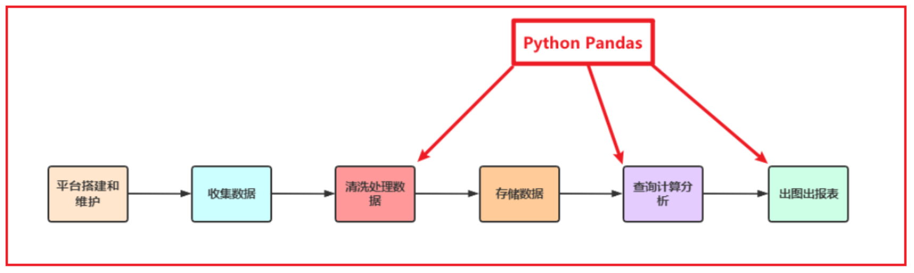

---
tags:
  - Python
  - Pandas
  - 数据分析
date: 2026-05-23
updated: 2026-08-02
---

# 一、Pandas框架概述

## 学习目标

- 知道Pandas的作用
- 能够搭建使用Pandas的开发环境

## 1、Pandas介绍

Python在数据处理上独步天下：代码灵活、开发快速；尤其是Python的Pandas包，无论是在数据分析领域、还是大数据开发场景中都具有显著的优势：

- Pandas是Python的一个第三方包，也是商业和工程领域最流行的**结构化数据**工具集，用于数据清洗、处理以及分析
- Pandas在数据处理上具有独特的优势：
  - 底层是基于Numpy构建的，所以运行速度特别的快
  - 有专门的处理缺失数据的API
  - 强大而灵活的分组、聚合、转换功能



适用场景:

- 数据量大到Excel严重卡顿，且又都是单机数据的时候，我们使用Pandas
  - Pandas用于处理单机数据(小数据集(相对于大数据来说))
- 在大数据ETL数据仓库中，对数据进行清洗及处理的环节使用Pandas

## 2、安装Pandas

打开cmd窗口，输入如下命令：

```sh
pip install -i https://pypi.tuna.tsinghua.edu.cn/simple/ pandas
```


> 注意：Anaconda默认已经安装了Pandas以及Numpy等内容

## 3、Pandas初体验

* 1- 使用已收录的 [1960—2019 全球 GDP 数据](dataset/1960-2019全球GDP数据.csv)


* 2- 创建python脚本, 导入pandas库

```python
import pandas as pd
```

* 3- 基于pandas加载数据

```python
# read_csv(path)：从 CSV 文件读取数据并返回 DataFrame 对象；encoding 指定文件编码
df = pd.read_csv('./dataset/1960-2019全球GDP数据.csv', encoding='gbk')
```

> \# set_option(key, value)：设置 Pandas 的全局显示选项，如最大行数、列数等
>
> pd.set_option('display.max_rows', None)
> pd.set_option('display.max_columns', None)

> \# reset_option(key)：将指定的全局显示选项恢复为默认值；reset_option('all') 恢复全部
>
> pd.reset_option('display.max_rows') # 恢复显示的最大列数到默认值 pd.reset_option('display.max_columns')

> \# 恢复所有选项到默认值 pd.reset_option('all')

* 4- 基于pandas完成相关查询:

```python
# 查询中国的GDP
china_gdp = df[df.country=='中国'] # df.country 选中名为country的列
# head(n)：返回前 n 行数据，默认前 5 行
china_gdp.head(10) # 显示前10条数据
```

运行结果：


* 5- 查询中国GDP

```python
china_gdp = df[df.country=='中国'] # df.country 选中名为country的列
china_gdp.head(10) # 显示前10条数据
```


* 6- 将year年份设置为索引

```python
# set_index(keys)：将指定列设置为行索引
china_gdp = china_gdp.set_index('year')
china_gdp.head() # 默认显示前5条
```


* 7- 画出GDP逐年变化的曲线图

```python
# plot()：基于 Matplotlib 绘制折线图等图表
china_gdp.GDP.plot()
```


使用同样的方法画出日本的GDP变化曲线，和中国的GDP变化曲线进行对比

```python
jp_gdp = df[df.country=='日本'].set_index('year') # 按条件选取数据后，重设索引
jp_gdp.GDP.plot() 
china_gdp.GDP.plot()
```


分别查询中国、美国、日本三国的GDP数据，并绘制GDP变化曲线、进行对比

```python
china_gdp = df[df.country=='中国'].set_index('year')
us_gdp = df[df.country=='美国'].set_index('year')
jp_gdp = df[df.country=='日本'].set_index('year')
jp_gdp.GDP.plot()
china_gdp.GDP.plot()
us_gdp.GDP.plot()
```


设置图例：

```python
# 按条件选取数据
china_gdp = df[df.country=='中国'].set_index('year')
us_gdp = df[df.country=='美国'].set_index('year')
jp_gdp = df[df.country=='日本'].set_index('year')
# 出图并添加图例
jp_gdp.GDP.plot(legend=True)
china_gdp.GDP.plot(legend=True)
us_gdp.GDP.plot(legend=True)
```


修改列名使图例显示为各国名称

```python
# 按条件选取数据
china_gdp = df[df.country=='中国'].set_index('year')
us_gdp = df[df.country=='美国'].set_index('year')
jp_gdp = df[df.country=='日本'].set_index('year')
# rename(columns=dict)：修改列名；inplace=True 表示直接在原对象上修改
jp_gdp.rename(columns={'GDP':'japan'}, inplace=True)
china_gdp.rename(columns={'GDP':'china'}, inplace=True)
us_gdp.rename(columns={'GDP':'usa'}, inplace=True)
# plot(legend=True)：绘制图表时显示图例
jp_gdp.japan.plot(legend=True)
china_gdp.china.plot(legend=True)
us_gdp.usa.plot(legend=True)
```


* 8- 解决中文不能在图表中正常显示的问题

将列名改为中文，使图例显示为各国名称

```python
# 按条件选取数据
china_gdp = df[df.country=='中国'].set_index('year')
us_gdp = df[df.country=='美国'].set_index('year')
jp_gdp = df[df.country=='日本'].set_index('year')
# 对指定的列修改列名
jp_gdp.rename(columns={'GDP':'日本'}, inplace=True)
china_gdp.rename(columns={'GDP':'中国'}, inplace=True)
us_gdp.rename(columns={'GDP':'美国'}, inplace=True)
# 画图
jp_gdp['日本'].plot(legend=True)
china_gdp['中国'].plot(legend=True)
us_gdp['美国'].plot(legend=True)

# 解决中文显示问题，下面的代码只需运行一次即可
import matplotlib.pyplot as plt
plt.rcParams['font.sans-serif'] = ['SimHei']
plt.rcParams['axes.unicode_minus'] = False
```

修改列名的两种方式：

```python
# 方式1：rename — 只改指定的列，其他列不动
df.rename(columns={'GDP': 'gdp'}, inplace=True)

# 方式2：直接赋值 — 必须列出所有列名，顺序要对应
df.columns = ['country', 'year', 'gdp']
```

运行结果：


## 本章函数速查

| 函数/方法 | 语法 | 作用 | 常用参数 |
|-----------|------|------|----------|
| `pd.read_csv()` | `pd.read_csv(path, encoding=None)` | 从 CSV 文件读取数据，返回 DataFrame | `filepath_or_buffer`：文件路径；`encoding`：编码格式 |
| `pd.set_option()` | `pd.set_option(key, value)` | 设置 Pandas 全局显示选项 | `display.max_rows`：最大行数；`display.max_columns`：最大列数 |
| `pd.reset_option()` | `pd.reset_option(key)` | 将全局选项恢复为默认值 | 传 `'all'` 恢复全部选项 |
| `.head()` | `df.head(n=5)` | 返回前 n 行数据 | `n`：行数，默认 5 |
| `.set_index()` | `df.set_index(keys, drop=True)` | 将指定列设为行索引 | `keys`：列名或列名列表；`drop`：是否删除原列 |
| `.plot()` | `df.col.plot()` | 绘制折线图等图表 | `legend`：是否显示图例；`kind`：图表类型 |
| `.rename()` | `df.rename(columns=dict, inplace=False)` | 修改指定列名 | `columns`：新旧列名映射字典；`inplace`：是否原地修改 |
| `df.columns` | `df.columns = [列表]` | 直接赋值修改所有列名 | 列表长度和顺序必须与原列一一对应 |
| `plt.rcParams` | `plt.rcParams['key'] = value` | 设置 Matplotlib 全局绘图参数 | `font.sans-serif`：字体；`axes.unicode_minus`：负号显示 |

## 小结

Python Pandas的作用：（清洗、处理、分析数据）

Pandas环境搭建：

- 安装Anaconda，默认自带Python以及其他相关三方包
- 使用默认的base虚拟环境启动`JupyterNotebook`


---
[下一步：02.Pandas数据结构](02.Pandas数据结构.md) [返回总索引](关于Pandas.md)
