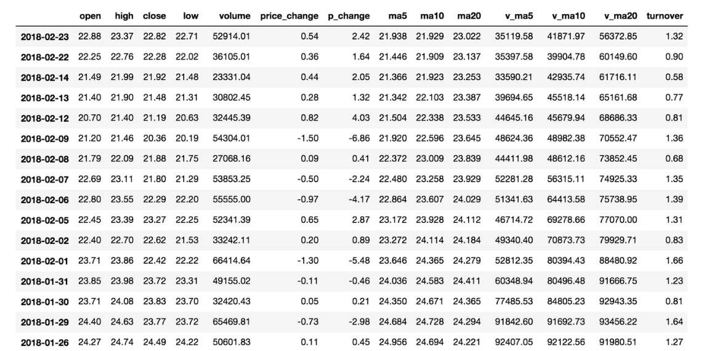
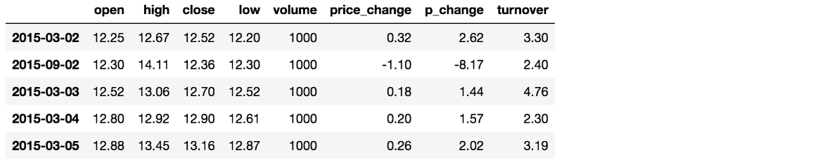
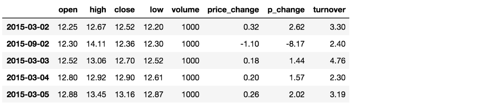
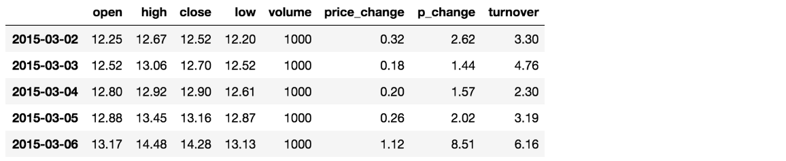

---
tags:
  - Python
  - Pandas
  - 数据分析
date: 2026-05-23
updated: 2026-08-02
---

# 三、Pandas基本数据操作

## 学习目标

- 记忆DataFrame的形状、行列索引名称获取等基本属性
- 应用Series和DataFrame的索引进行切片获取
- 应用sort_index和sort_values实现索引和值的排序

## 1、数据集

为了更好地理解这些基本操作，我们将读取 [股票日行情数据](dataset/stock_day.csv)。文件读写会在后文展开，这里先使用 `read_csv`：

```python
# read_csv(path)：从 CSV 文件读取数据，返回 DataFrame
data = pd.read_csv("./dataset/stock_day.csv")

# drop(labels, axis)：删除指定的行或列；axis=1 表示删除列，axis=0 表示删除行
data = data.drop(["ma5","ma10","ma20","v_ma5","v_ma10","v_ma20"], axis=1)
```



## 2、索引操作

### 2.1 直接使用行列索引(先列后行)

获取'2018-02-27'这天的'close'的结果

```python
# 直接使用行列索引名字的方式（先列后行）
data['open']['2018-02-27']
23.53

# 不支持的操作
# 错误
data['2018-02-27']['open']
# 错误
data[:1, :2]
```

### 2.2 结合loc或者iloc使用索引

获取从'2018-02-27':'2018-02-22'，'open'的结果

```python
# loc[行, 列]：基于标签（label）选取数据，切片包含结束值（闭区间）
data.loc['2018-02-27':'2018-02-22', 'open']
```

```text
2018-02-27    23.53
2018-02-26    22.80
2018-02-23    22.88
Name: open, dtype: float64
```

```python
# iloc[行, 列]：基于整数位置（position）选取数据，切片不包含结束值（半开区间）
# 获取前3天数据,前5列的结果
data.iloc[:3, :5]
```

```text
            open    high    close    low
2018-02-27    23.53    25.88    24.16    23.53
2018-02-26    22.80    23.78    23.53    22.80
2018-02-23    22.88    23.37    22.82    22.71
```

### 2.3 loc vs iloc 对比

| 对比项 | loc | iloc |
|--------|-----|------|
| 索引方式 | 基于**标签**（label） | 基于**位置**（integer position） |
| 切片行为 | 包含结束值（闭区间） | 不包含结束值（半开区间） |
| 接受参数 | 行/列的名称字符串 | 行/列的整数下标 |
| 典型场景 | 已知索引名称，按名称取数据 | 不关心索引名，按位置取前N行/列 |

```python
# loc 闭区间：包含结束标签 '2018-02-23'
data.loc['2018-02-27':'2018-02-23', 'open']
# 结果包含 2018-02-23 这一行

# iloc 半开区间：不包含下标 3
data.iloc[0:3, 0]
# 结果只包含下标 0, 1, 2 这三行
```

实际开发中，如果你用的是整数默认索引（0, 1, 2...），loc 和 iloc 的行为看起来可能一样，但一旦索引被重置为日期或字符串，两者的区别就会很明显。建议养成习惯：**按名称选数据用 loc，按位置选数据用 iloc**。

### 2.4 布尔索引

布尔索引是实际工作中最常用的数据筛选方式，本质是用一个布尔 Series 作为行选择条件。

```python
# 筛选开盘价大于 23 的所有行
data[data['open'] > 23]

# 筛选收盘价在 22 到 24 之间的行（注意括号）
data[(data['close'] >= 22) & (data['close'] <= 24)]

# 筛选开盘价大于 23 或者涨跌幅大于 5 的行
data[(data['open'] > 23) | (data['p_change'] > 5)]

# 取反：筛选开盘价不大于 23 的行
data[~(data['open'] > 23)]
```

几个容易踩坑的地方：

- 多个条件之间**必须用 `&`（且）和 `|`（或）**，不能用 `and` / `or`
- 每个条件**必须加括号**，否则会因为运算符优先级报错
- 布尔索引的结果是原 DataFrame 的一个视图（view），修改它可能会影响原数据，如果需要独立副本用 `.copy()`

### 2.5 at[] 和 iat[]：快速访问单个值

当你只需要读取或修改**某一个单元格**时，at/iat 比 loc/iloc 快得多，因为它们跳过了行列切片的开销，直接定位到标量值。

| 方法 | 定位方式 | 示例 |
|------|----------|------|
| `at` | 行标签 + 列标签 | `data.at['2018-02-27', 'open']` |
| `iat` | 行下标 + 列下标 | `data.iat[0, 0]` |

```python
# at[行标签, 列标签]：基于标签快速访问单个标量值，比 loc 更快
data.at['2018-02-27', 'open']   # 23.53
# iat[行下标, 列下标]：基于位置快速访问单个标量值，比 iloc 更快
data.iat[0, 0]                   # 23.53

# 修改单个值（比 loc 更快）
data.at['2018-02-27', 'open'] = 24.00
```

性能差异在循环中尤其明显。如果你需要遍历 DataFrame 逐行读写某个单元格，用 at/iat 能获得显著的速度提升。但要注意，at/iat **只能访问单个标量值**，不能用于切片。

## 3、赋值操作

对DataFrame当中的close列进行重新赋值为1

```python
# 直接修改原来的值
data['close'] = 1
# 或者
data.close = 1
```

## 4、排序操作

排序有两种形式，一种对于索引进行排序，一种对于内容进行排序

### 4.1 DataFrame排序

- 使用df.sort_values(by=, ascending=)
  - 单个键或者多个键进行排序,
  - 参数：
    - by：指定排序参考的键
    - ascending:默认升序
      - ascending=False:降序
      - ascending=True:升序
    - na_position:NaN值放在哪里
      - na_position='last'（默认）：NaN 排到最后
      - na_position='first'：NaN 排到最前

```python
# sort_values(by, ascending, na_position)：按指定列的值排序
# 将 NaN 值排到最前面，方便检查缺失数据
data.sort_values(by="open", ascending=True, na_position='first')
```

```python
# 按照开盘价大小进行排序 , 使用ascending指定按照大小排序
data.sort_values(by="open", ascending=True).head()
```



```python
# 按照多个键进行排序
data.sort_values(by=['open', 'high'])
```



- 使用df.sort_index给索引进行排序

这个股票的日期索引原来是从大到小，现在重新排序，从小到大

```python
# sort_index()：按索引排序，默认升序
data.sort_index()
```



### 4.2 Series排序

- 使用series.sort_values(ascending=True)进行排序

series排序时，只有一列，不需要参数

```python
data['p_change'].sort_values(ascending=True).head()
```

```text
2015-09-01   -10.03
2015-09-14   -10.02
2016-01-11   -10.02
2015-07-15   -10.02
2015-08-26   -10.01
Name: p_change, dtype: float64
```

- 使用series.sort_index()进行排序

与df一致

```python
# 对索引进行排序
data['p_change'].sort_index().head()
```

```text
2015-03-02    2.62
2015-03-03    1.44
2015-03-04    1.57
2015-03-05    2.02
2015-03-06    8.51
Name: p_change, dtype: float64
```

## 本章函数速查

| 函数/方法 | 语法 | 作用 | 常用参数 |
|-----------|------|------|----------|
| `pd.read_csv()` | `pd.read_csv(path)` | 从 CSV 文件读取数据，返回 DataFrame | `path`：文件路径 |
| `.drop()` | `df.drop(labels, axis=0)` | 删除指定的行或列 | `labels`：要删除的标签；`axis`：0=行，1=列 |
| `.loc[]` | `df.loc[行, 列]` | 基于标签选取数据（闭区间） | 行/列的标签名或切片 |
| `.iloc[]` | `df.iloc[行, 列]` | 基于整数位置选取数据（半开区间） | 行/列的整数下标或切片 |
| `.at[]` | `df.at[行标签, 列标签]` | 基于标签快速访问单个值 | 行标签、列标签 |
| `.iat[]` | `df.iat[行下标, 列下标]` | 基于位置快速访问单个值 | 行下标、列下标 |
| `.sort_values()` | `df.sort_values(by, ascending, na_position)` | 按指定列的值排序 | `by`：排序依据的列；`ascending`：升降序；`na_position`：NaN 位置 |
| `.sort_index()` | `df.sort_index()` | 按索引排序 | `ascending`：升降序，默认升序 |

## 小结

- 1.索引【掌握】
  - 直接索引 -- 先列后行,是需要通过索引的字符串进行获取
  - loc -- 先行后列,是需要通过索引的字符串进行获取
  - iloc -- 先行后列,是通过下标进行索引
  - 布尔索引 -- 用条件表达式筛选行，如 `df[df['col'] > value]`，多条件用 `&`/`|` 且必须加括号
  - at/iat -- 快速访问单个标量值，at 用标签，iat 用下标，性能优于 loc/iloc
- 2.赋值【知道】
  - data[""] = **
  - data. **=**
- 3.排序【知道】
  - dataframe
    - 对象.sort_values() -- 支持 by、ascending、na_position 参数
    - 对象.sort_index()
  - series
    - 对象.sort_values()
    - 对象.sort_index()


---
[上一步：02.Pandas数据结构](02.Pandas数据结构.md) [下一步：04.DataFrame运算](04.DataFrame运算.md) [返回总索引](关于Pandas.md)
