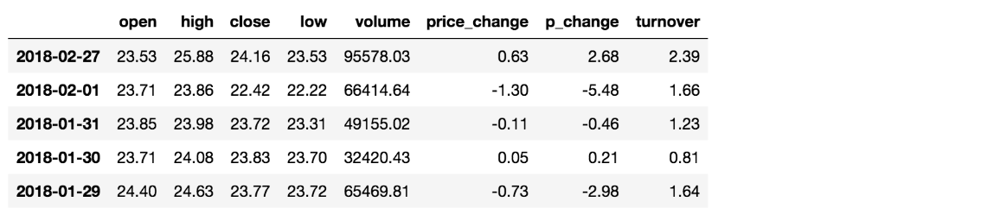
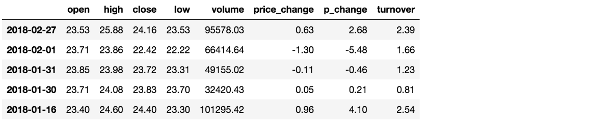
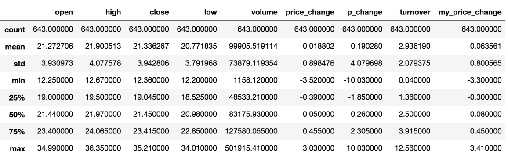
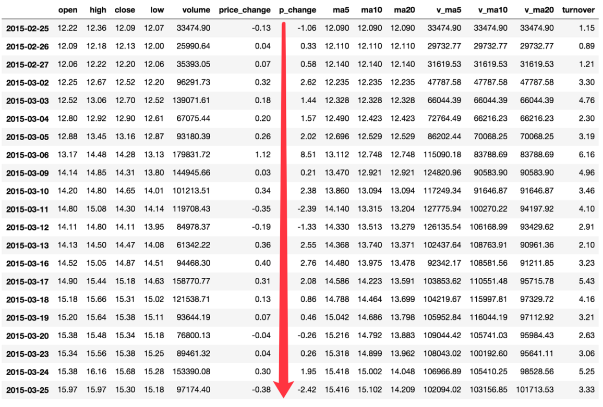
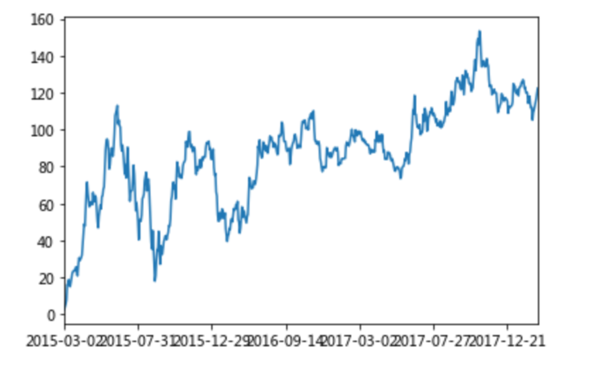

---
tags:
  - Python
  - Pandas
  - 数据分析
date: 2026-06-04
updated: 2026-07-31
---

# 四、DataFrame运算

## 学习目标

- 应用add等实现数据间的加、减法运算
- 应用逻辑运算符号实现数据的逻辑筛选
- 应用isin, query实现数据的筛选
- 使用describe完成综合统计
- 使用max, min, mean, std完成统计计算
- 使用idxmin、idxmax完成最大值最小值的索引
- 使用cumsum等实现累计分析
- 应用apply函数实现数据的自定义处理

## 1、算法运算

- add(other)

比如进行数学运算加上具体的一个数字

```python
data['open'].add(1)
```

```text
2018-02-27    24.53
2018-02-26    23.80
2018-02-23    23.88
2018-02-22    23.25
2018-02-14    22.49
```

- sub(other)

比如进行数学运算减去具体的一个数字

```python
data['open'].sub(1)
```

## 2、逻辑运算符

### 2.1 逻辑运算符号

- 例如筛选data["open"] > 23的日期数据
  - data["open"] > 23返回逻辑结果

```python
data["open"] > 23
```

```text
2018-02-27     True
2018-02-26    False
2018-02-23    False
2018-02-22    False
2018-02-14    False
```

```python
# 逻辑判断的结果可以作为筛选的依据
data[data["open"] > 23].head()
```



- 完成多个逻辑判断，

```python
data[(data["open"] > 23) & (data["open"] < 24)].head()
```



### 2.2 逻辑运算函数

- query(expr)
  - expr:查询字符串

通过query使得刚才的过程更加方便简单

```python
data.query("open<24 & open>23").head()
```

- isin(values)

例如判断'open'是否为23.53和23.85

```python
# 可以指定值进行一个判断，从而进行筛选操作
data[data["open"].isin([23.53, 23.85])]
```

## 3、统计运算

### 3.1 describe

综合分析: 能够直接得出很多统计结果,`count`, `mean`, `std`, `min`, `max` 等

```python
# 计算平均值、标准差、最大值、最小值
data.describe()
```



**输出结果各字段含义：**

| 字段 | 含义 | 说明 |
|------|------|------|
| `count` | 非空值数量 | 有多少条有效数据（不含 NaN） |
| `mean` | 平均值 | 所有数值的算术平均 |
| `std` | 标准差 | 数据的离散程度，值越大说明数据越分散 |
| `min` | 最小值 | 该列的最小数值 |
| `25%` | 第一四分位数（Q1） | 有 25% 的数据小于等于这个值，也叫"下四分位数" |
| `50%` | 中位数（Q2） | 数据排序后正中间的值，不受极端值影响 |
| `75%` | 第三四分位数（Q3） | 有 75% 的数据小于等于这个值，也叫"上四分位数" |
| `max` | 最大值 | 该列的最大数值 |

> **分位数的理解**：把数据从小到大排列，25% 分位数就是排在 25% 位置的那个数。比如 100 个数据排序后，第 25 个数就是 25% 分位数。50% 分位数就是中位数。75% 分位数就是第 75 个数。四分位距（IQR = Q3 - Q1）常用来判断数据是否有异常值。

**percentiles 参数**：默认输出 25%、50%、75%，可以通过 `percentiles` 参数自定义：

```python
# 自定义分位数，比如增加 10% 和 90%
data.describe(percentiles=[0.1, 0.25, 0.5, 0.75, 0.9])

# 也可以只看极端分位数
data.describe(percentiles=[0.05, 0.95])
```

> 注意：`percentiles` 参数中 0.5（中位数）无论是否指定都会自动包含。

### 3.2 统计函数

Numpy当中已经详细介绍，在这里我们演示min(最小值), max(最大值), mean(平均值), median(中位数), var(方差), std(标准差),mode(众数)结果:

| `count`  | 非空值计数                       |
| -------- | ------------------------------- |
| `sum`    | **求和**                        |
| `mean`   | **平均值**                      |
| `median` | 中位数                          |
| `min`    | **最小值**                      |
| `max`    | **最大值**                      |
| `mode`   | 众数                            |
| `abs`    | 绝对值                          |
| `prod`   | 乘积                            |
| `std`    | **标准差**                      |
| `var`    | **方差**                        |
| `idxmax` | 最大值所在的索引标签             |
| `idxmin` | 最小值所在的索引标签             |

> 对于单个函数去进行统计的时候，坐标轴还是按照默认列”columns” (axis=0, default)，如果要对行”index” 需要指定(axis=1)

**常用统计函数的使用场景：**

| 场景 | 推荐函数 | 示例 |
|------|----------|------|
| 了解数据整体水平 | `mean`、`median` | 看平均工资用 mean，看中位数工资用 median（median 不受极端高薪影响） |
| 衡量数据波动大小 | `std`、`var` | 股票价格是否稳定、产品质量是否一致 |
| 找到极值及其位置 | `max`/`min` + `idxmax`/`idxmin` | 找到历史最高价及其发生的日期 |
| 数据有效性检查 | `count` | 对比 count 和 DataFrame 长度，快速发现缺失值 |
| 快速数据概况 | `describe` | 接手新数据集的第一步，先跑一次 describe 看看数据分布 |
| 求累计收益 | `cumsum` | 计算股票从买入日起的累计涨跌幅 |
| 求累计最大回撤 | `cummax` + `cummin` | 配合计算最大回撤：`(cummax - cummin) / cummax` |

- max()、min()
  - max()：返回每列（或每行）的最大值
  - min()：返回每列（或每行）的最小值

```python
# 使用统计函数：0 代表列求结果， 1 代表行求统计结果
data.max(0)
```

```text
open                   34.99
high                   36.35
close                  35.21
low                    34.01
volume             501915.41
price_change            3.03
p_change               10.03
turnover               12.56
my_price_change         3.41
dtype: float64
```

* std()、var()
  - std()：计算标准差，衡量数据的离散程度
  - var()：计算方差，标准差的平方

```python
# 方差
data.var(0)
```

```text
open               1.545255e+01
high               1.662665e+01
close              1.554572e+01
low                1.437902e+01
volume             5.458124e+09
price_change       8.072595e-01
p_change           1.664394e+01
turnover           4.323800e+00
my_price_change    6.409037e-01
dtype: float64
```

```python
# 标准差
data.std(0)
```

```text
open                   3.930973
high                   4.077578
close                  3.942806
low                    3.791968
volume             73879.119354
price_change           0.898476
p_change               4.079698
turnover               2.079375
my_price_change        0.800565
dtype: float64
```

* median()：中位数

中位数为将数据从小到大排列，在最中间的那个数为中位数。如果没有中间数，取中间两个数的平均值。

```python
df = pd.DataFrame({'COL1' : [2,3,4,5,4,2], 'COL2' : [0,1,2,3,4,2]})

df.median()
```

```text
COL1    3.5
COL2    2.0
dtype: float64
```

* idxmax()、idxmin()
  - idxmax()：返回最大值所在的索引标签
  - idxmin()：返回最小值所在的索引标签

```python
# 求出最大值的位置
data.idxmax(axis=0)
```

```text
open               2015-06-15
high               2015-06-10
close              2015-06-12
low                2015-06-12
volume             2017-10-26
price_change       2015-06-09
p_change           2015-08-28
turnover           2017-10-26
my_price_change    2015-07-10
dtype: object
```

```python
# 求出最小值的位置
data.idxmin(axis=0)
```

```text
open               2015-03-02
high               2015-03-02
close              2015-09-02
low                2015-03-02
volume             2016-07-06
price_change       2015-06-15
p_change           2015-09-01
turnover           2016-07-06
my_price_change    2015-06-15
dtype: object
```

### 3.3 累计统计函数

| 函数      | 作用                        |
| --------- | --------------------------- |
| `cumsum`  | **计算前1/2/3/…/n个数的和** |
| `cummax`  | 计算前1/2/3/…/n个数的最大值 |
| `cummin`  | 计算前1/2/3/…/n个数的最小值 |
| `cumprod` | 计算前1/2/3/…/n个数的积     |

那么这些累计统计函数怎么用？



以上这些函数可以对series和dataframe操作

这里我们按照时间的从前往后来进行累计

* 排序
  - sort_index()：按索引标签排序

```python
# 排序之后，进行累计求和
data = data.sort_index()
```

- 对p_change进行求和
  - cumsum()：计算累计和（前1/2/3/.../n个数的累加）

```python
stock_rise = data['p_change']
# plot方法集成了前面直方图、条形图、饼图、折线图
stock_rise.cumsum()
```

```text
2015-03-02      2.62
2015-03-03      4.06
2015-03-04      5.63
2015-03-05      7.65
2015-03-06     16.16
2015-03-09     16.37
2015-03-10     18.75
2015-03-11     16.36
2015-03-12     15.03
2015-03-13     17.58
2015-03-16     20.34
2015-03-17     22.42
2015-03-18     23.28
2015-03-19     23.74
2015-03-20     23.48
2015-03-23     23.74
```

那么如何让这个连续求和的结果更好的显示呢？



如果要使用plot函数，需要导入matplotlib.
  - plot()：绘制图表（折线图、柱状图等）
  - plt.show()：显示图形

```python
import matplotlib.pyplot as plt
# plot显示图形
stock_rise.cumsum().plot()
# 需要调用show，才能显示出结果
plt.show()
```

### 3.4 apply 自定义运算

`apply()` 函数可以对 DataFrame 的行或列应用自定义函数，是进行复杂运算的利器。

**语法：**
```python
DataFrame.apply(func, axis=0)
```

**参数说明：**
- `func`：自定义函数（可以是 lambda 表达式或普通函数）
- `axis`：运算方向
  - `axis=0`（默认）：按列运算，函数接收每列数据作为参数
  - `axis=1`：按行运算，函数接收每行数据作为参数

**示例 1：计算每列的极差（最大值 - 最小值）**
```python
# 对 open 和 close 两列，计算每列的极差
data[['open', 'close']].apply(lambda x: x.max() - x.min(), axis=0)
```
输出：
```
open     22.74
close    22.85
dtype: float64
```

**示例 2：按行计算（axis=1）**
```python
# 对每一行，计算 open 和 close 的差值
data[['open', 'close']].apply(lambda x: x['close'] - x['open'], axis=1)
```

**示例 3：使用普通函数**
```python
def price_range(col):
    """计算价格波动范围"""
    return col.max() - col.min()

data[['open', 'close']].apply(price_range, axis=0)
```

**apply 的常见应用场景：**
| 场景 | 说明 |
|------|------|
| 数据标准化 | 对每列进行归一化处理 |
| 条件计算 | 根据多列数据计算新列 |
| 格式转换 | 统一数据格式或单位 |
| 自定义聚合 | 实现复杂的统计逻辑 |

**场景示例 1：数据标准化（Z-Score）**

Z-Score 标准化将数据转换为均值为 0、标准差为 1 的分布，公式为 `(x - mean) / std`。这在机器学习特征工程中非常常用：

```python
# 对数值列进行 Z-Score 标准化
data[['open', 'close', 'volume']].apply(lambda x: (x - x.mean()) / x.std(), axis=0)
```

如果只想对特定列做 Min-Max 归一化（缩放到 0~1 之间）：

```python
# Min-Max 归一化：(x - min) / (max - min)
data[['open', 'close']].apply(lambda x: (x - x.min()) / (x.max() - x.min()), axis=0)
```

**场景示例 2：根据条件标记新列**

按行运算，结合多列数据生成分类标签。例如根据涨跌幅标记"大涨/小涨/小跌/大跌"：

```python
def mark_change(row):
    if row['p_change'] >= 5:
        return '大涨'
    elif row['p_change'] >= 0:
        return '小涨'
    elif row['p_change'] >= -5:
        return '小跌'
    else:
        return '大跌'

data['change_label'] = data.apply(mark_change, axis=1)
```

> **注意**：对于简单的条件标记，优先使用 `np.where` 或 `np.select`，性能比 `apply` 好得多：
> ```python
> import numpy as np
> conditions = [data['p_change'] >= 5, data['p_change'] >= 0, data['p_change'] >= -5]
> choices = ['大涨', '小涨', '小跌']
> data['change_label'] = np.select(conditions, choices, default='大跌')
> ```
> `apply` 的优势在于处理更复杂的逻辑，比如需要同时参考多列、调用外部 API 等场景。

## 本章函数速查

| 函数名          | 语法                              | 作用          | 常用参数                          |
| ------------ | ------------------------------- | ----------- | ----------------------------- |
| `add`        | `Series.add(other)`             | 加法运算        | `other`: 被加数（标量或 Series）      |
| `sub`        | `Series.sub(other)`             | 减法运算        | `other`: 被减数                  |
| `mul`        | `Series.mul(other)`             | 乘法运算        | `other`: 乘数                   |
| `div`        | `Series.div(other)`             | 除法运算        | `other`: 除数                   |
| `query`      | `DataFrame.query(expr)`         | 用字符串表达式筛选数据 | `expr`: 查询表达式（如 `"age > 18"`） |
| `isin`       | `Series.isin(values)`           | 判断值是否在给定列表中 | `values`: 值列表                 |
| `describe`   | `DataFrame.describe()`          | 生成综合统计摘要    | `percentiles`: 自定义分位数列表       |
| `mean`       | `DataFrame.mean()`              | 计算平均值       | `axis`: 0 按列，1 按行             |
| `median`     | `DataFrame.median()`            | 计算中位数       | `axis`: 0 按列，1 按行             |
| `std`        | `DataFrame.std()`               | 计算标准差       | `axis`: 0 按列，1 按行             |
| `var`        | `DataFrame.var()`               | 计算方差        | `axis`: 0 按列，1 按行             |
| `max`        | `DataFrame.max()`               | 返回最大值       | `axis`: 0 按列，1 按行             |
| `min`        | `DataFrame.min()`               | 返回最小值       | `axis`: 0 按列，1 按行             |
| `idxmax`     | `DataFrame.idxmax()`            | 返回最大值的索引标签  | `axis`: 0 按列，1 按行             |
| `idxmin`     | `DataFrame.idxmin()`            | 返回最小值的索引标签  | `axis`: 0 按列，1 按行             |
| `cumsum`     | `Series.cumsum()`               | 计算累计和       | —                             |
| `cummax`     | `Series.cummax()`               | 计算累计最大值     | —                             |
| `cummin`     | `Series.cummin()`               | 计算累计最小值     | —                             |
| `cumprod`    | `Series.cumprod()`              | 计算累计乘积      | —                             |
| `sort_index` | `DataFrame.sort_index()`        | 按索引排序       | `ascending`: True 升序，False 降序 |
| `apply`      | `DataFrame.apply(func, axis=0)` | 对行或列应用自定义函数 | `func`: 函数；`axis`: 0 按列，1 按行  |
| `plot`       | `DataFrame.plot()`              | 绘制图表        | `kind`: 图表类型（line/bar/hist 等） |

## 小结

- 算术运算【知道】
  - add/sub/mul/div 实现加减乘除
  - 支持标量和 DataFrame 之间的运算
- 逻辑运算【知道】
  - 1.逻辑运算符号（`>`、`<`、`&`、`|`）进行条件筛选
  - 2.逻辑运算函数
    - 对象.query()：用字符串表达式筛选，代码更简洁
    - 对象.isin()：判断值是否在给定列表中
- 统计运算【知道】
  - 1.对象.describe()：一键查看 count/mean/std/min/分位数/max
    - 分位数（25%/50%/75%）反映数据分布，可通过 `percentiles` 参数自定义
  - 2.统计函数：mean/median/std/var/max/min/idxmax/idxmin 等
    - 根据场景选择：了解整体水平用 mean/median，衡量波动用 std/var
  - 3.累积统计函数：cumsum/cummax/cummin/cumprod
    - 常用于累计收益、最大回撤等时间序列分析
- 自定义运算【知道】
  - apply(func, axis=0)：灵活的行/列级自定义处理
  - axis=0 按列处理，axis=1 按行处理
  - 常见场景：Z-Score 标准化、条件标记新列、格式转换
  - 简单条件优先用 np.where/np.select，性能更好


---
[上一步：03.Pandas基本操作](03.Pandas基本操作.md) [下一步：05.文件读取与存储](05.文件读取与存储.md) [返回总索引](关于Pandas.md)
