---
tags:
  - Python
  - Pandas
  - 数据分析
date: 2026-05-23
updated: 2026-08-02
---

# 六、DataFrame数据的增删改查操作

* 导包并加载数据:
  - head()：默认取前 5 行数据

```python
import pandas as pd

df = pd.read_csv('./dataset/1960-2019全球GDP数据.csv', encoding='gbk')
df2 = df.head()
```

## 1、增加列

- 方式一: 通过直接赋值的方式添加新列
  - copy()：创建 DataFrame 的副本（深拷贝）

```python
# 拷贝一份df
df3 = df2.copy()

# 一列数据都是固定值
df3['new col 1'] = 33

# 新增列数据数量必须和行数相等
df3['new col 2'] = [1, 2, 3, 4, 5]
df3['new col 3'] = df3.year * 2

# 分别查看增加数据列之后的df和原df
df3 
df2
```

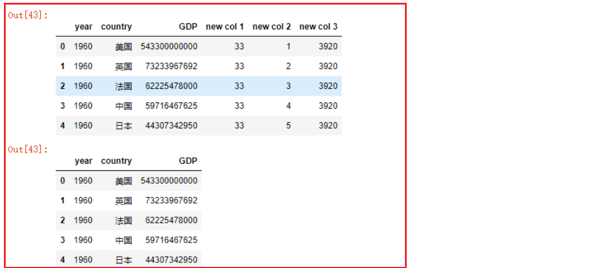


* 方式二: df.assign函数添加列
  - assign()：添加新列，返回新 DataFrame（不修改原对象）

```python
# 1. 新列名=单个数据或一组数据，一组数据的数量必须和df的行数相同
df2.assign(new0=66)
# df2.assign(new1=[1, 2, 3, 4]) # 报错
df2.assign(new1=[1, 2, 3, 4, 5])

# 2.1 新列名=Series对象，该s对象的索引和df索引一致
s = pd.Series([1, 2, 3, 4, 5]) 
df2.assign(new2=s)

# 2.2 新列名=Series对象
df2.assign(new3=df2.year+df2.GDP)

# 3. 新列名=自定义函数名
# 该自定义函数必须接收df作为参数
# 该自定义函数可以返回：
# 3.1.单个数据 
# 3.2.一组数量和df的行数相同的数据 
# 3.3.和df索引相同的Series对象
def foo(df):
    # 函数必须接收一个参数，该参数就是被传入的df对象
    print('='*10)
    print(df)
    print('='*5 + '上面输出的是传入的df')
    ret = df.index.values
    # 可以返回一个变量
    # return 'hahah'
    # 也可以返回一组变量
    return ret 
df2.assign(new4=foo)
```

解析：当使用函数为 `assign` 生成新列时，函数接收当前 DataFrame，并返回标量、等长数组或索引可对齐的 Series。

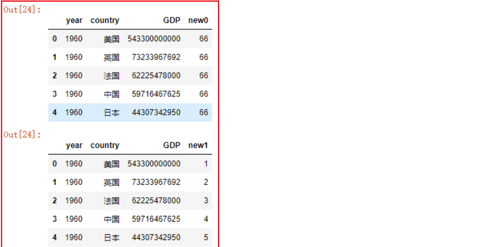

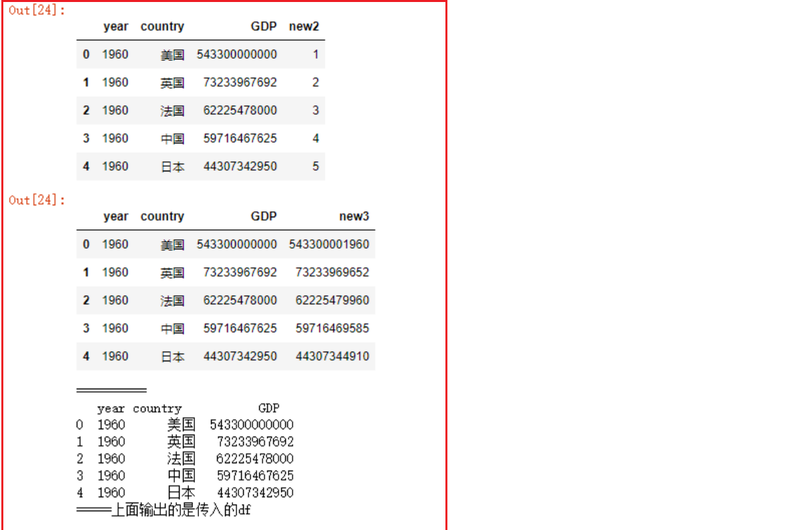

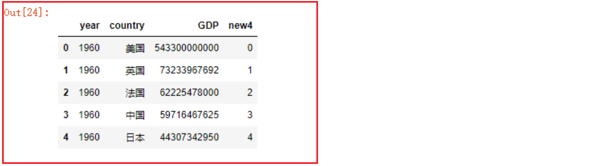

* df.assign函数可以同时添加多列

```python
df2

def foo(df):
    return 22

def bar(df):
    return df.year + 1


df2.assign(
    new0='hahaha',
    new1=[1, 2, 3, 4, 5],
    new2=pd.Series([1, 2, 3, 4, 5]),
    new3=df.year*2,
    new4=foo,
    new5=bar
)
```

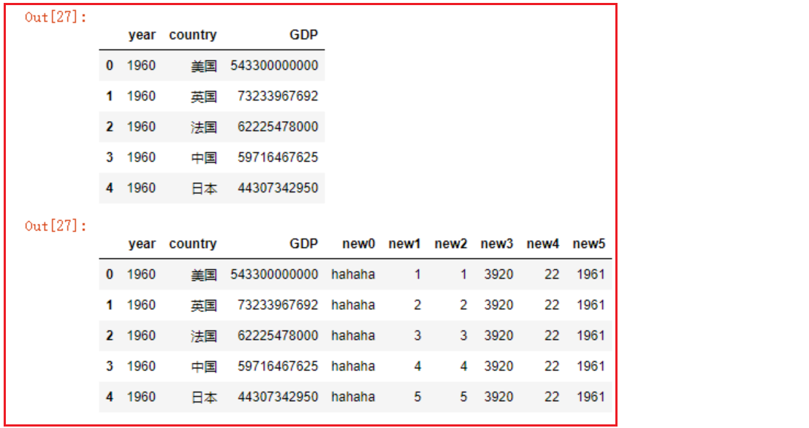

## 2、删除与去重

* 1- df.drop删除行数据
  - drop()：删除指定行或列，返回新对象（不修改原对象）

```python
df3.drop([0]) # 默认删除行
df3.drop([0, 2, 4]) # 可以删除多行
df3.GDP.drop([0, 2]) # 对series对象按索引删除
```

* 2- df.drop删除列数据
  - df.drop默认删除指定索引值的行；如果添加参数`axis=1`，则删除指定列名的列

```python
df3.drop(['new col 3'], axis=1)
```

* 3- 使用del删除指定的列
  - 注意区别：
    - del是直接永久删除原df中的列【慎重使用】
    - drop是返回删除后的df或seires，原df或seires没有被修改

```python
del df3['new col 3']
df3
# 重复运行本段代码将会报错，因为df3中的指定列在第一次运行时就被删除了
```

* 4- DataFrame 数据去重
  - `DataFrame.append()` 已在 pandas 2.0 移除，使用 `pd.concat()`
  - reset_index()：重置索引

```python
# 添加一部分重复的数据
df4 = pd.concat([df2, df2], ignore_index=True)

# 实施去重操作
df4.drop_duplicates()  # drop_duplicates()：去除重复行
```

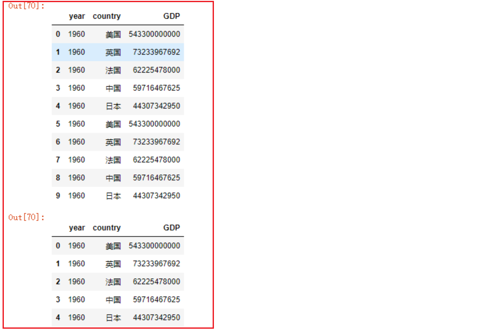

* 5- series去重

```python
# 方式一：返回去重后的 Series，并保留原索引
df4['country'].drop_duplicates()

# 方式二：返回按首次出现顺序排列的唯一值数组
df4['country'].unique()
```

## 3、修改DataFrame中的数据

* 1- df.assign替换列

```
df = pd.read_csv('./dataset/1960-2019全球GDP数据.csv', encoding='gbk')
df5 = df.head()
df5
df5 = df5.assign(GDP=66) # 可以接收单变量或列表、数组
df5
df # 此时原始的df不会发生改变
```

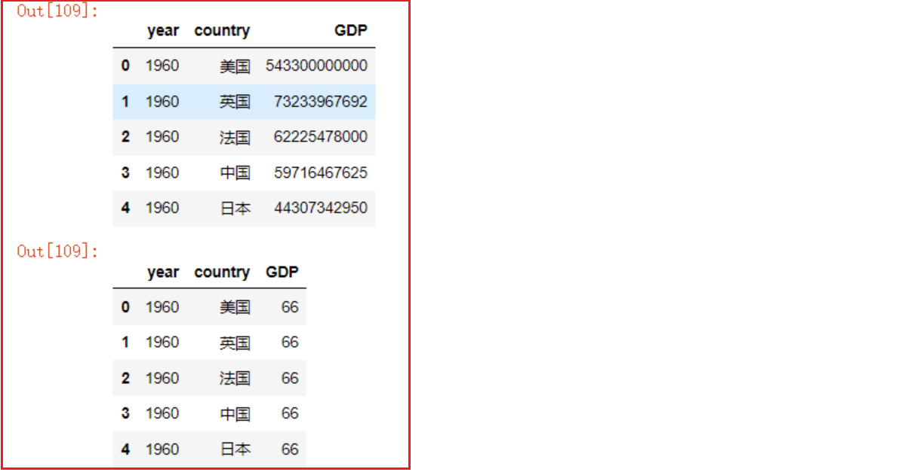

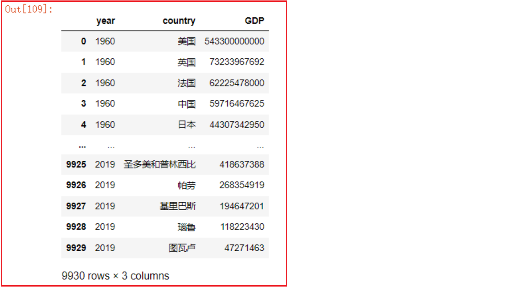

* 2- 直接对原始的DF进行赋值修改处理
  * 一般不建议直接修改操作

```python
df = pd.read_csv('./dataset/1960-2019全球GDP数据.csv', encoding='gbk')
df5 = df.head()
df5
df5['GDP'] = [5, 4, 3, 2, 1]
df5
df # 此时原始的df会发生改变
```

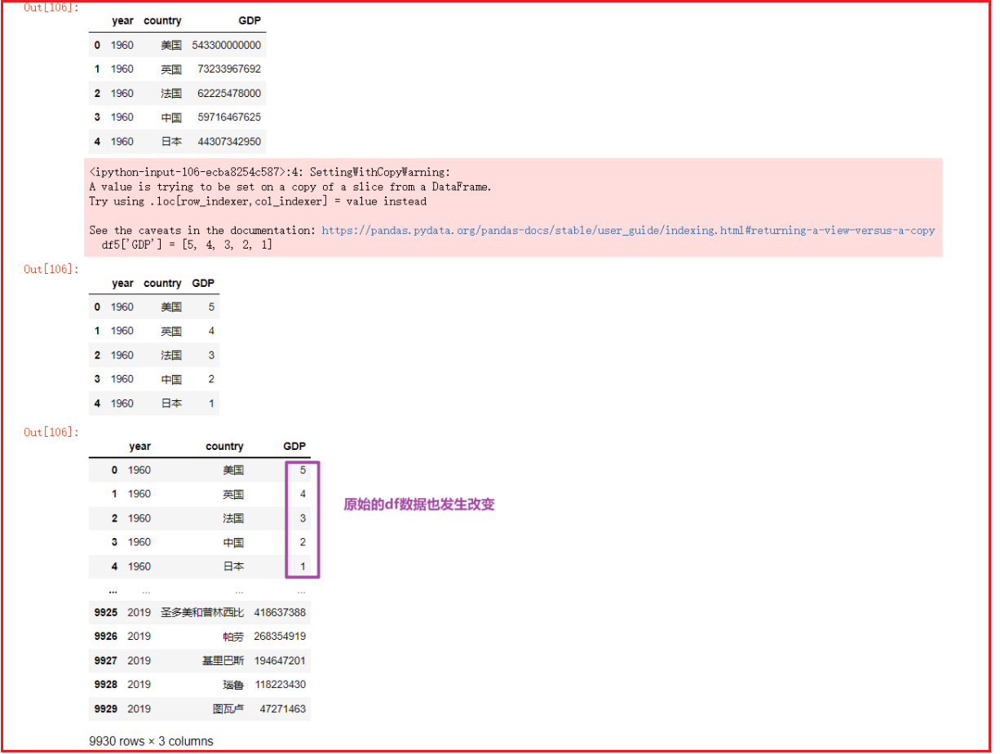

* 3- replace函数替换数据
  - replace()：按值匹配替换，返回新对象

```python
# 读取数据选取前5行作为一个新的df
df = pd.read_csv('./dataset/1960-2019全球GDP数据.csv', encoding='gbk')
df6 = df.head().copy()
df6
# Series 替换会返回新对象；显式赋回原 DataFrame，兼容 pandas 3.0 Copy-on-Write
df6['year'] = df6['year'].replace(1960, 19600)
df6['country'] = df6['country'].replace('日本', '扶桑')
df6
# df也可以直接调用replace函数，用法和s.replace用法一致，只是返回的是df对象
df6.replace(1960, 19600)
df6
```

备注：`replace()` 默认按完整单元格值匹配；要保留结果必须赋值给变量，或直接对 DataFrame 调用并接收返回值。

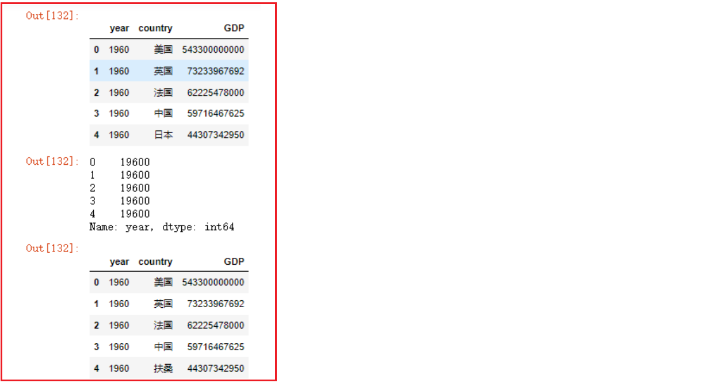

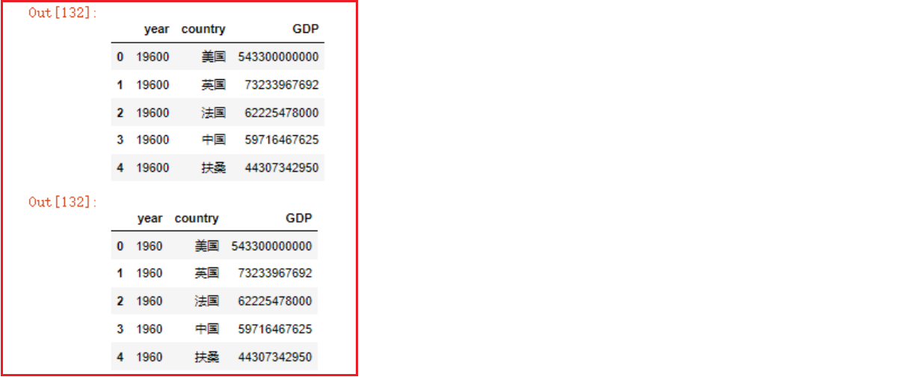


## 4、查询dataFrame中的数据

* 1- 从前从后取多行数据

  * head()

  ```python
  # 导包 
  import pandas as pd
  # 加载csv数据，指定gbk编码格式来读取文件，返回df
  df = pd.read_csv('./dataset/1960-2019全球GDP数据.csv', encoding='gbk')
  
  # 默认取前5行数据
  df.head()
  df.head(10) # 取前10行
  ```

  * tail()
    - tail()：默认取后 5 行数据

  ```python
  # 默认取后5行数据
  df.tail()
  df2 = df.tail(15) # 倒数15行
  df2
  ```

* 2- 获取一列或多列数据

  * 获取一列数据`df[col_name]`等同于`df.col_name`

  ```python
  df2['country']
  df2.country
  # 注意！如果列名字符串中间有空格的，只能使用df['country']这种形式
  ```

  * 获取多列数据`df[[col_name1,col_name2,...]]`

  ```python
  df2[['country', 'GDP']] # 返回新的df
  ```

* 3- 索引下标切片取行

  * `df[start:stop:step]`:

  >`df[start:stop:step]` == `df[起始行下标:结束行下标:步长]` ， 遵循`顾头不顾尾`原则（包含起始行，不包含结束行），`步长`默认为1

  ```python
  df4 = df.head(10) # 取原df前10行数据作为df4，默认自增索引由0到9
  df4[0:3] # 取前3行
  df4[:5:2] # 取前5行，步长为2
  df4[1::3] # 取第2行到最后所有行，步长为3
  ```

  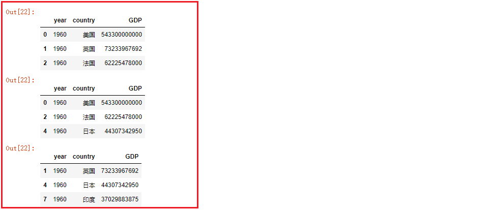

* 4- 查询函数获取子集: df.query()

  > - `df.query(判断表达式)`可以依据判断表达式返回的符合条件的df子集
  > - 与`df[布尔值向量]`效果相同
  > - 特别注意`df.query()`中传入的字符串格式

  * 示例:

  ```python
  df3.query('country=="帕劳"')
  df3[df3['country']=='帕劳']
  ```

  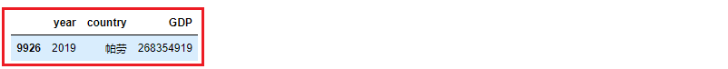

  * 查询中国, 美国  日本 三国 2015年至2019年的数据

  ```python
  df.query('country=="中国" or country=="日本" or country=="美国"').query('year in ["2015", "2016", "2017", "2018", "2019"]')
  df.query('(country=="中国" or country=="日本" or country=="美国") and year in ["2015", "2016", "2017", "2018", "2019"]')
  ```

  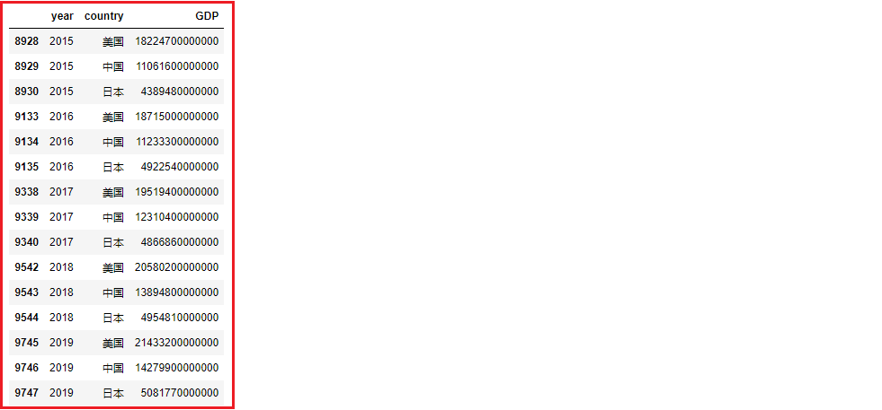

* 5- at[] 和 iat[] 快速访问单个值

  > 当你只需要读取或修改**一个单元格**的值时，用 `loc`/`iloc` 会返回 Series 或 DataFrame，存在额外开销。`at[]` 和 `iat[]` 则直接返回标量值，速度更快。

  * at[] —— 按标签访问

  ```python
  # 语法：df.at[行标签, 列名]
  df2.at[0, 'country']      # 返回 '美国'（字符串）
  df2.at[0, 'GDP']          # 返回该行的 GDP 数值

  # 也可以用来赋值修改
  df2.at[0, 'GDP'] = 99999
  ```

  * iat[] —— 按整数位置访问

  ```python
  # 语法：df.iat[行号, 列号]
  df2.iat[0, 0]    # 第0行第0列的值
  df2.iat[2, 3]    # 第2行第3列的值

  # 同样支持赋值
  df2.iat[0, 0] = '新值'
  ```

  * at/iat 与 loc/iloc 的区别

  | 对比项 | `at[]` / `iat[]` | `loc[]` / `iloc[]` |
  |--------|------------------|---------------------|
  | 返回值 | 标量（单个值） | Series / DataFrame |
  | 能否切片 | 不能 | 可以 |
  | 速度 | 更快（底层直接取值） | 稍慢（构造返回对象） |
  | 典型场景 | 循环中逐个读写单元格 | 批量筛选、切片 |

  ```python
  # 对比示例
  %timeit df2.at[0, 'GDP']       # 更快
  %timeit df2.loc[0, 'GDP']      # 稍慢，返回的是标量但有额外检查

  # loc 可以取多行多列，at 不行
  df2.loc[0:2, ['country', 'GDP']]   # 正常
  # df2.at[0:2, ['country', 'GDP']]  # 报错，at 只接受单个标签
  ```

  > 经验法则：需要批量操作用 `loc`/`iloc`，只取一个值用 `at`/`iat`。

* 6- 排序函数
  - sort_values()：按指定列的值排序
  - rank()：返回数据的排名

  * sort_values函数: 按照指定的一列或多列的值进行排序

  ```properties
  # 按GDP列的数值由小到大进行排序
  df2.sort_values(['GDP'])
  # 按GDP列的数值由大到小进行排序
  df2.sort_values(['GDP'], ascending=False) # 倒序， ascending默认为True
  # 先对year年份进行由小到大排序，再对GDP由小到大排序
  df2.sort_values(['year', 'GDP'])
  ```

  * rank函数:

  >- rank函数用法：`DataFrame.rank()` 或 `Series.rank()`
  >- rank函数返回值：以Series或者DataFrame的类型返回数据的排名（哪个类型调用返回哪个类型）
  >- rank函数包含有6个参数：
  > - **axis**：设置沿着哪个轴计算排名（0或者1)，默认为0按纵轴计算排名
  > - **numeric_only**：是否仅仅计算数字型的columns，默认为False
  > - na_option ：NaN值是否参与排序及如何排序，固定参数：keep  top  bottom
  >   - keep: NaN值保留原有位置
  >   - top: NaN值全部放在前边
  >   - bottom: NaN值全部放在最后
  > - **ascending**：设定升序排还是降序排，默认True升序
  > - **pct**：是否以排名的百分比显示排名（所有排名与最大排名的百分比），默认False
  > - method：排名评分的计算方式，固定值参数，常用固定值如下：
  >   - average : 默认值，排名评分不连续；数值相同的评分一致，都为平均值
  >   - min : 排名评分不连续；数值相同的评分一致，都为最小值
  >   - max : 排名评分不连续；数值相同的评分一致，都为最大值
  >   - dense : 排名评分是连续的；数值相同的评分一致

  ```properties
  df2
  df2.rank()
  df2.rank(axis=0)
  df2.rank(numeric_only=True) # 只对数值类型的列进行统计
  df2.rank(ascending=False) # 降序
  df2.rank(pct=True) # 以最高分作为1，放回百分数形式的评分，pct参数默认为False
  ```

  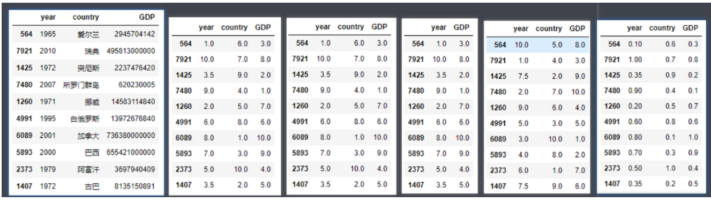

  ```properties
  df2.rank(method='average')
  df2.rank(method='min')
  df2.rank(method='max')
  df2.rank(method='dense')
  ```

  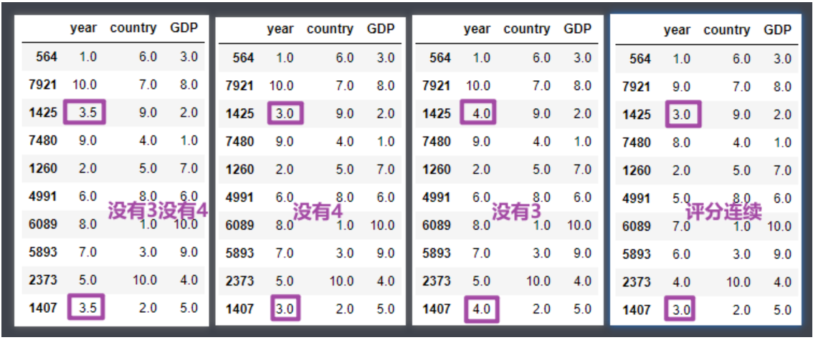

  rank使用详解

  ```python
  df7 = pd.DataFrame({
      '姓名':['小明', '小美', '小强', '小兰'],
      '成绩':[100, 90, 90, 80]
  })
  
  df7.rank()  # 等价于df7.rank(method='average', ascending=True)
  
  df7['成绩排名'] = df7.成绩.rank(method='min', ascending=False)
  df7
  
  df7['成绩排名'] = df7.成绩.rank(method='max', ascending=False)
  df7
  
  df7['成绩排名'] = df7.成绩.rank(method='dense', ascending=False)
  df7
  ```

`dense` 排名并列时不跳号，适合许多等级场景；选择 `average`、`min`、`max`、`first` 还是 `dense` 应由业务规则决定。

* 7- map() 函数 —— Series 级别的映射转换
  - map()：对 Series 每个元素做映射或变换

  > `map()` 是 Series 的方法，用于对列中每个元素做映射或变换。传入字典时做值替换，传入函数时做逐元素计算。

  * 用字典映射（最常用）：

  ```python
  # 将 country 列中的英文名映射为中文简称
  country_map = {'美国': 'US', '日本': 'JP', '中国': 'CN'}
  df2['country_code'] = df2['country'].map(country_map)
  # 字典中没有的键会变成 NaN
  ```

  * 用 lambda 或函数映射：

  ```python
  # GDP 数值统一除以 10000，转为"万"为单位
  df2['GDP_万'] = df2['GDP'].map(lambda x: x / 10000)

  # 对字符串列应用处理函数
  df2['country_upper'] = df2['country'].map(lambda x: x.strip())
  ```

  * map 与 replace 的区别

  | 对比项 | `map()` | `replace()` |
  |--------|---------|-------------|
  | 所属 | Series 方法 | Series / DataFrame 方法 |
  | 未匹配的值 | 变为 NaN | 保留原值 |
  | 适用场景 | 列转换、特征工程 | 简单值替换 |

  ```python
  # replace 未匹配的值保留原值
  df2['country'].replace({'美国': 'US'})  
  # 结果：只有"美国"被替换，其他值不变

  # map 未匹配的值变成 NaN
  df2['country'].map({'美国': 'US'})  
  # 结果：只有"美国"对应 US，其余全部为 NaN
  ```

* 8- np.where 条件赋值

  > `np.where` 是 NumPy 提供的向量化条件判断函数，语法类似 Excel 的 IF 函数。在 Pandas 中常用于根据条件快速生成新列。

  ```python
  import numpy as np

  # 语法：np.where(条件, 满足时的值, 不满足时的值)

  # 示例：GDP 大于 10000 标记为"高"，否则标记为"低"
  df2['GDP级别'] = np.where(df2['GDP'] > 10000, '高', '低')
  ```

  * 多条件嵌套：

  ```python
  # 三档分类：高、中、低
  df2['GDP级别'] = np.where(
      df2['GDP'] > 50000, '高',
      np.where(df2['GDP'] > 10000, '中', '低')
  )
  ```

  * np.where 与直接布尔索引赋值的对比

  ```python
  # 方式一：np.where（一行搞定，推荐）
  df2['tag'] = np.where(df2['year'] >= 2000, '21世纪', '20世纪')

  # 方式二：布尔索引分两步写
  df2['tag'] = '20世纪'
  df2.loc[df2['year'] >= 2000, 'tag'] = '21世纪'

  # 两种方式结果相同，np.where 写法更简洁
  ```

  > 经验法则：简单二选一用 `np.where`，多条件复杂分类用 `np.select` 或 `pd.cut`。

* 9- 聚合函数:

  >常用聚合函数有：
  >
  >- min 最小值
  >- max 最大值
  >- mean 平均值
  >- sum 求和
  >- count  求个数

  * min函数

  ```properties
  df2.min()
  
  df2['year'].min() 
  
  ```

  * max函数

  ```properties
  df2.max()
  df2['year'].max()
  ```

  * mean 平均值

  ```properties
  df2.mean()
  df2['year'].mean()
  df2['GDP'].mean()
  ```

  * sum 求和
  - groupby()：按指定列分组

  ```properties
  # 对整个 DataFrame 的数值列求和
  df2.sum()

  # 对单列求和
  df2['GDP'].sum()

  # 按某列分组后求和（groupby + sum 是最常用的组合之一）
  df.groupby('country')['GDP'].sum()         # 各国 GDP 总和
  df.groupby('year')['GDP'].sum()            # 每年全球 GDP 总和

  # 只对部分列求和
  df2[['year', 'GDP']].sum()
  ```

  * count 求个数

  ```properties
  # 统计每列非空值的个数
  df2.count()

  # 统计单列非空值个数
  df2['country'].count()

  # 注意：count() 不计算 NaN，而 len(df) 会把 NaN 也算进去
  # 常用场景：检查某列是否有缺失值
  total_rows = len(df2)
  non_null = df2['GDP'].count()
  print(f'GDP列缺失值数量: {total_rows - non_null}')

  # 分组计数
  df.groupby('country')['GDP'].count()       # 各国出现了多少条记录
  ```


## 本章函数速查

| 函数名 | 语法 | 作用 | 常用参数 |
|--------|------|------|----------|
| `head` | `DataFrame.head(n=5)` | 取前 n 行数据 | `n`: 行数，默认 5 |
| `tail` | `DataFrame.tail(n=5)` | 取后 n 行数据 | `n`: 行数，默认 5 |
| `copy` | `DataFrame.copy()` | 创建 DataFrame 副本 | `deep=True` 会复制索引与数据缓冲区，但不会递归复制 object 元素中的 Python 对象 |
| `assign` | `DataFrame.assign(**kwargs)` | 添加新列，返回新对象 | `列名=值`：支持标量、列表、函数 |
| `drop` | `DataFrame.drop(labels, axis=0)` | 删除行或列 | `labels`: 标签；`axis`: 0 行，1 列 |
| `del` | `del df[col]` | 原地删除列（不可恢复） | — |
| `concat` | `pd.concat(objs)` | 沿轴拼接 DataFrame（推荐） | `objs`: DataFrame 列表；`axis`: 0 纵向，1 横向 |
| `reset_index` | `DataFrame.reset_index()` | 重置索引 | `drop`: 是否丢弃原索引 |
| `drop_duplicates` | `DataFrame.drop_duplicates()` | 去除重复行 | `subset`: 指定列；`keep`: 保留哪个（first/last/False） |
| `unique` | `Series.unique()` | 返回唯一值数组 | — |
| `replace` | `DataFrame.replace(to_replace, value)` | 按值匹配替换 | `to_replace`: 被替换值；`value`: 新值 |
| `query` | `DataFrame.query(expr)` | 用字符串表达式筛选数据 | `expr`: 查询表达式 |
| `at` | `DataFrame.at[row, col]` | 按标签快速访问单个值 | 行标签、列名 |
| `iat` | `DataFrame.iat[row, col]` | 按位置快速访问单个值 | 行号、列号 |
| `sort_values` | `DataFrame.sort_values(by)` | 按值排序 | `by`: 列名；`ascending`: 升序/降序 |
| `rank` | `DataFrame.rank()` | 返回排名 | `method`: 排名方式（average/min/max/dense）；`ascending`: 升序/降序 |
| `map` | `Series.map(arg)` | Series 级别映射转换 | `arg`: 字典或函数 |
| `np.where` | `np.where(cond, x, y)` | 向量化条件赋值 | `cond`: 条件；`x`: 满足时的值；`y`: 不满足时的值 |
| `min` | `DataFrame.min()` | 返回最小值 | `axis`: 0 按列，1 按行 |
| `max` | `DataFrame.max()` | 返回最大值 | `axis`: 0 按列，1 按行 |
| `mean` | `DataFrame.mean()` | 计算平均值 | `axis`: 0 按列，1 按行 |
| `sum` | `DataFrame.sum()` | 求和 | `axis`: 0 按列，1 按行 |
| `count` | `DataFrame.count()` | 统计非空值个数 | `axis`: 0 按列，1 按行 |
| `groupby` | `DataFrame.groupby(by)` | 按列分组 | `by`: 分组列名 |

## 小结

本节覆盖了 DataFrame 增删改查的核心操作，按用途整理如下：

| 操作类别 | 方法 / 函数 | 说明 |
|----------|------------|------|
| 增加列 | `df['col'] = ...` / `df.assign()` | 直接赋值或函数式添加 |
| 删除 | `df.drop()` / `del` | `drop` 返回新对象，`del` 原地删除 |
| 去重 | `drop_duplicates()` / `unique()` | DataFrame 去重 vs Series 去重 |
| 修改 | `assign()` / `replace()` / 直接赋值 | `replace` 按值匹配替换 |
| 单值访问 | `at[]` / `iat[]` | 按标签/位置快速读写单个单元格 |
| 批量查询 | `loc[]` / `iloc[]` / `query()` | 按标签/位置/表达式筛选 |
| 排序 | `sort_values()` / `rank()` | 值排序 vs 排名计算 |
| 映射转换 | `map()` | Series 级别的字典映射或函数变换 |
| 条件赋值 | `np.where()` | 向量化 IF-ELSE，快速生成新列 |
| 聚合统计 | `min/max/mean/sum/count` | `count` 不计 NaN，`sum` 常配合 `groupby` |

---
[上一步：05.文件读取与存储](05.文件读取与存储.md) [下一步：07.缺失值处理](07.缺失值处理.md) [返回总索引](关于Pandas.md)
