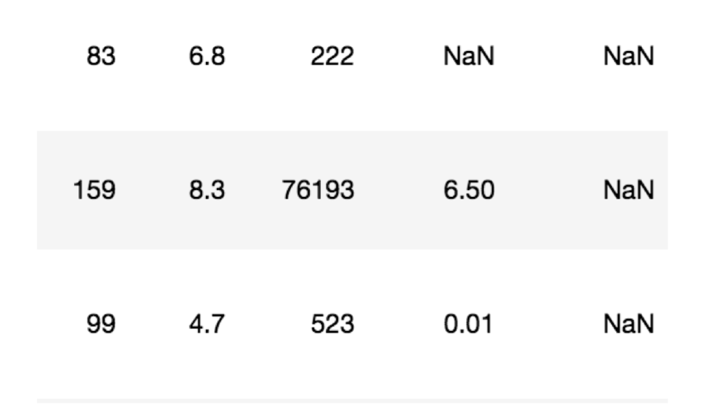
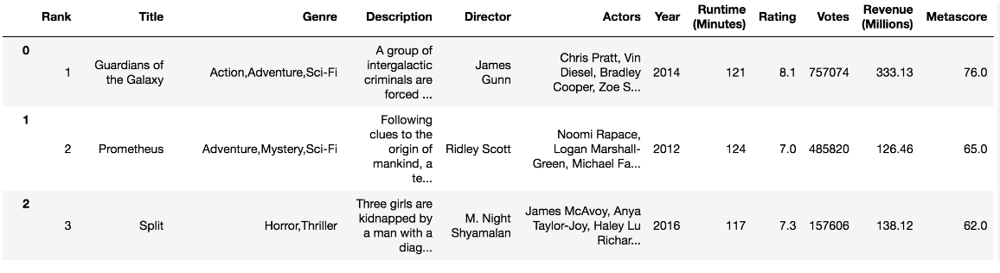
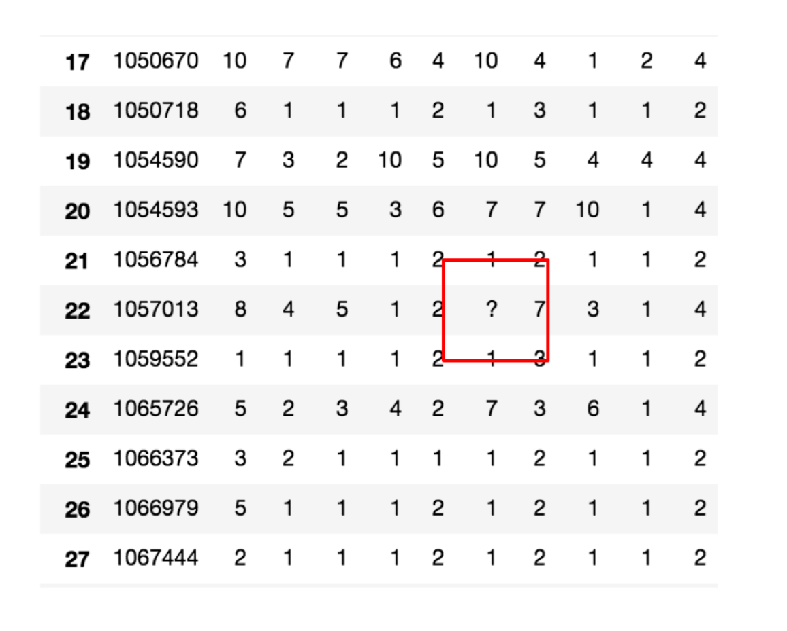

---
tags:
  - Python
  - Pandas
  - 数据分析
date: 2026-06-04
updated: 2026-08-02
---

# 七、高级处理-缺失值处理

## 学习目标

- 应用isnull判断是否有缺失数据NaN
- 应用fillna实现缺失值的填充
- 应用dropna实现缺失值的删除
- 应用replace实现数据的替换



## 1、如何处理NAN

- 获取缺失值的标记方式(NaN或者其他标记方式)
- 如果缺失值的标记方式是NaN
  - 判断数据中是否包含NaN：
    - pd.isnull(df),
    - pd.notnull(df)
  - 存在缺失值nan:
    - 1、删除存在缺失值的:dropna(axis='rows')
      - 注：不会修改原数据，需要接受返回值
      - `axis=0`（默认）删行，`axis=1` 删列
    - 2、替换缺失值：`fillna(value)`，将返回值赋回目标列或 DataFrame
      - value:替换成的值
      - pandas 3.0 启用 Copy-on-Write，避免对 `df[col]` 这样的中间对象做 `inplace=True` 链式修改
- 如果缺失值没有使用NaN标记，比如使用"？"
  - 先替换‘?’为np.nan，然后继续处理

## 2、电影数据的缺失值处理

- 配套文件：[电影数据 movie.csv](dataset/movie.csv)

```python
# 读取电影数据
# pd.read_csv()：从 CSV 文件读取数据并返回 DataFrame
movie = pd.read_csv("./dataset/movie.csv")
```



## 3、判断缺失值是否存在

### pd.notnull() — 非缺失返回 True

```python
pd.notnull(movie)
```

输出（逐元素布尔矩阵，`False` 表示该位置是缺失值）：

```
    Rank  Title  Genre  Description  Director  Actors  Year  Runtime  Rating  Votes  Revenue  Metascore
0   True   True   True         True      True    True  True     True    True   True     True       True
1   True   True   True         True      True    True  True     True    True   True     True       True
...
7   True   True   True         True      True    True  True     True    True   True     True      False
```

### pd.isnull() — 缺失返回 True

与 `notnull` 互补，缺失位置标记为 `True`：

```python
pd.isnull(movie)
```

```
    Rank  Title  Genre  Description  Director  Actors  Year  Runtime  Rating  Votes  Revenue  Metascore
0  False  False  False        False     False   False False    False   False  False    False      False
...
7  False  False  False        False     False   False False    False   False  False    False       True
```

### 配合 np.all / np.any 快速判断

单个元素的布尔矩阵无法一眼看出"有没有缺失"，配合 NumPy 聚合函数可以得到单一布尔结果：

```python
# 全部非空才返回 True，只要有一个缺失就返回 False
np.all(pd.notnull(movie))  # → False

# 只要有一个缺失就返回 True
np.any(pd.isnull(movie))   # → True
```

| 函数                       | 含义      | 无缺失时返回  |
| ------------------------ | ------- | ------- |
| `np.all(pd.notnull(df))` | 所有值都非空？ | `True`  |
| `np.any(pd.isnull(df))`  | 存在缺失值？  | `False` |

### 按列查看缺失情况

```python
# 每列是否存在缺失值
# .any()：沿轴方向检查是否有 True，返回布尔值
movie.isnull().any()
# 每列缺失值数量
movie.isnull().sum()
# 每列缺失值占比
movie.isnull().mean()
```

```
Rank                  0
Title                 0
...
Revenue (Millions)   12
Metascore            64
dtype: int64
```

## 4、存在缺失值nan,并且是np.nan

- 1- 删除

pandas删除缺失值，使用dropna的前提是，缺失值的类型必须是np.nan

- `axis=0`（默认）删行，`axis=1` 删列

```python
# 不修改原数据
movie.dropna()

# 可以定义新的变量接受或者用原来的变量名
data = movie.dropna()
```

> 获取空值行 => ① row_with_null = movie.isnull().any(axis=1) ② moive[row_with_null]

- 2- 替换缺失值

```python
# 替换存在缺失值的样本的两列
# 替换填充平均值，中位数
movie['Revenue (Millions)'] = movie['Revenue (Millions)'].fillna(
    movie['Revenue (Millions)'].mean()
)
```

替换所有缺失值：

```python
numeric_cols = movie.select_dtypes(include='number').columns
for column in numeric_cols:
    if movie[column].isna().any():
        print(column)
        movie[column] = movie[column].fillna(movie[column].mean())
```

## 5、不是缺失值nan，有默认标记的

数据是这样的：



```python
wis = pd.read_csv("https://archive.ics.uci.edu/ml/machine-learning-databases/breast-cancer-wisconsin/breast-cancer-wisconsin.data")
```

以上数据在读取时，可能会报如下错误：

```text
URLError: <urlopen error [SSL: CERTIFICATE_VERIFY_FAILED] certificate verify failed (_ssl.c:833)>
```

解决办法：

```python
# 全局取消证书验证
import ssl
ssl._create_default_https_context = ssl._create_unverified_context
```

**处理思路分析：**

- 1、先替换‘?’为np.nan
  - df.replace(to_replace=, value=)
    - to_replace:替换前的值
    - value:替换后的值

```python
# 把一些其它值标记的缺失值，替换成np.nan
wis = wis.replace(to_replace='?', value=np.nan)
```

- 2、在进行缺失值的处理

```python
# 删除
wis = wis.dropna()
```

## 本章函数速查

| 函数名             | 语法                              | 作用                   | 常用参数                           |
| --------------- | ------------------------------- | -------------------- | ------------------------------ |
| `pd.read_csv()` | `pd.read_csv(filepath)`         | 从 CSV 文件读取数据         | `filepath`: 文件路径               |
| `pd.isnull()`   | `pd.isnull(obj)`                | 判断缺失值，缺失返回 True      | `obj`: DataFrame 或 Series      |
| `pd.notnull()`  | `pd.notnull(obj)`               | 判断非缺失值，非缺失返回 True    | `obj`: DataFrame 或 Series      |
| `.isnull()`     | `df.isnull()`                   | DataFrame 方法，逐元素判断缺失 | 无                              |
| `.any()`        | `df.any(axis=0)`                | 沿轴检查是否有 True         | `axis`: 0=按列，1=按行              |
| `.sum()`        | `df.sum()`                      | 求和                   | `axis`: 求和方向                   |
| `.mean()`       | `df.mean()`                     | 求均值                  | `axis`: 计算方向                   |
| `.dropna()`     | `df.dropna(axis=0)`             | 删除包含缺失值的行或列          | `axis`: 0=删行，1=删列              |
| `.fillna()`     | `df.fillna(value)`              | 用指定值填充缺失值            | `value`: 填充值，`inplace`: 是否原地修改 |
| `.replace()`    | `df.replace(to_replace, value)` | 替换指定值                | `to_replace`: 被替换值，`value`: 新值 |

## 小结

- isnull、notnull判断是否存在缺失值【知道】
  - np.any(pd.isnull(movie)) # 里面如果有一个缺失值,就返回True
  - np.all(pd.notnull(movie)) # 里面如果有一个缺失值,就返回False
- dropna删除np.nan标记的缺失值【知道】
  - movie.dropna()
- fillna填充缺失值【知道】
  - `movie[col] = movie[col].fillna(movie[col].mean())`
- replace替换具体某些值【知道】
  - `wis = wis.replace(to_replace="?", value=np.nan)`


---
[上一步：06.DataFrame增删改查](06.DataFrame增删改查.md) [下一步：08.数据合并](08.数据合并.md) [返回总索引](关于Pandas.md)
