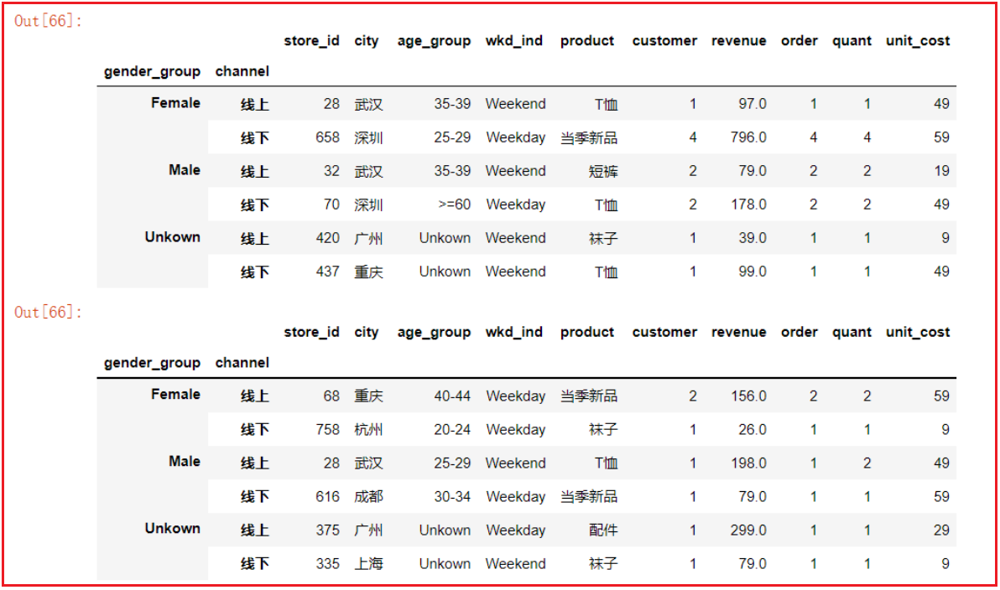
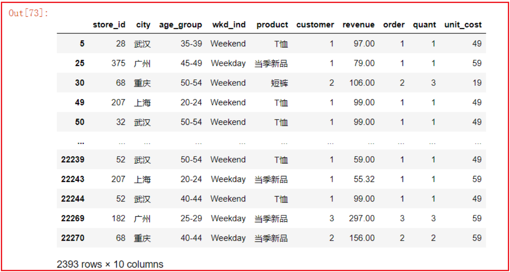
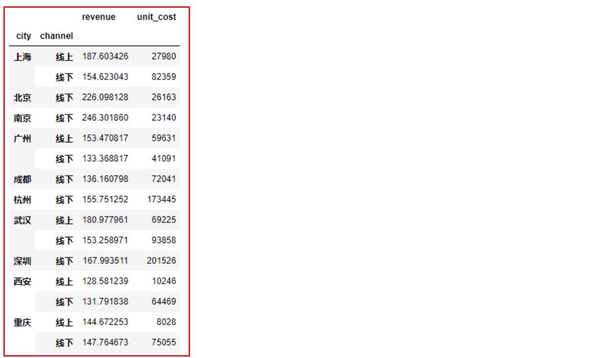

---
tags:
  - Python
  - Pandas
  - 数据分析
date: 2026-06-04
updated: 2026-08-02
---

# 九、高级处理-数据分组

## 1、数据准备

- 加载 [优衣库销售数据集](dataset/uniqlo.csv)，其中包含不同城市门店各产品类别的销售记录，字段说明如下：
  - store_id 门店随机id
  - city 城市
  - channel 销售渠道 网购自提 门店购买
  - gender_group 客户性别 男女
  - age_group 客户年龄段
  - wkd_ind 购买发生的时间（周末，周间）
  - product 产品类别
  - customer 客户数量
  - revenue 销售金额
  - order 订单数量
  - quant 购买产品的数量
  - unit_cost 成本（制作+运营）

```python
# 导包 加载数据集
import pandas as pd 
df = pd.read_csv('./dataset/uniqlo.csv')
```

## 2、groupby分组聚合

* 1- df.groupby分组函数返回分组对象

  【基于一列进行分组】

```python
# 基于顾客性别分组
gs = df.groupby(['gender_group'])
gs
gs['city']
```

这两行分别返回 `DataFrameGroupBy` 和 `SeriesGroupBy` 对象；内存地址每次运行都不同，不应写进预期结果。

​		【基于多列进行分组】

```python
# 基于顾客性别、不同城市分组
gs2 = df.groupby(['gender_group', 'city'])
gs2
```

返回 `DataFrameGroupBy` 对象。需要可读结果时继续调用 `.agg()`、`.size()` 或迭代各组。

* 1.5- `as_index=False`：分组后保留原列名

  默认情况下，`groupby` 会把分组列变成索引（index），后续再做 merge 或筛选时不太方便。加上 `as_index=False` 可以让分组列保持为普通列：

  ```python
  # 默认行为：city 变成了索引
  df.groupby('city')['revenue'].mean()
  # city
  # 上海    320.5
  # 北京    280.3

  # as_index=False：city 仍然是普通列
  df.groupby('city', as_index=False)['revenue'].mean()
  #    city  revenue
  # 0  上海    320.5
  # 1  北京    280.3
  ```

  多列分组时效果一样：

  ```python
  df.groupby(['city', 'channel'], as_index=False)['revenue'].sum()
  #    city channel  revenue
  # 0  上海      线上   12000
  # 1  上海      门店    8000
  # 2  北京      线上    9500
  ```

  > **什么时候用 `as_index=False`？** 当你希望分组聚合的结果可以直接用于后续的 `merge`、`to_csv` 或可视化时，保留普通列会省去 `reset_index()` 的步骤。

* 2- 分组后获取各个组内的数据

  * 2.1 取出每组第一条或最后一条数据

  ```properties
  gs2 = df.groupby(['gender_group', 'channel'])
  # .first()：取每组第一条数据
  gs2.first()
  # .last()：取每组最后一条数据
  gs2.last()
  ```

  

  * 2.2 - 按分组依据获取其中一组

  ```python
  # .get_group()：根据指定的分组键获取该组数据
  gs2.get_group(('Female', '线上'))
  ```

  

* 3- 分组聚合

  * 格式:分组后对多列分别使用不同的聚合函数

  ```python
  df.groupby(['列名1', '列名2']).agg({
      '指定列1':'聚合函数名', 
      '指定列2':'聚合函数名', 
      '指定列3':'聚合函数名'
  })
  ```

  - 按城市和线上线下划分，分别计算销售金额的平均值、成本的总和

  ```python
  df.groupby(['city', 'channel']).agg({
      'revenue': 'mean',
      'unit_cost': 'sum'
  })
  ```

  常用聚合函数（详见 [04.DataFrame运算](04.DataFrame运算.md#3.2 统计函数)）：

  ```python
  df.groupby(['city', 'channel']).agg({
      'revenue': ['mean', 'sum', 'max', 'min', 'std'],   # 平均、总和、最大、最小、标准差
      'unit_cost': 'sum',
  })
  ```

  **对同一列使用多个聚合函数**

  当你需要对同一列同时计算多个统计指标时，用列表传入多个函数即可：

  ```python
  df.groupby('city').agg({
      'revenue': ['mean', 'sum', 'count'],   # 同时计算均值、总和、计数
      'unit_cost': ['mean', 'sum']
  })
  ```

  结果会产生 MultiIndex 列名，如 `(revenue, mean)`、`(revenue, sum)`，可以用 `.droplevel(0, axis=1)` 或 `.columns = ['_'.join(col) for col in df.columns]` 来扁平化。

  **NamedAgg 写法（agg 后重命名列）**

  Pandas 提供了 `pd.NamedAgg` 语法，让你在聚合的同时直接指定结果列名，避免 MultiIndex 的麻烦：

  ```python
  df.groupby('city').agg(
      revenue_mean=('revenue', 'mean'),
      revenue_total=('revenue', 'sum'),
      cost_mean=('unit_cost', 'mean')
  )
  #       revenue_mean  revenue_total  cost_mean
  # city
  # 上海         320.5         120000       45.2
  # 北京         280.3          95000       42.1
  ```

  也可以用元组 `(列名, 函数)` 的形式，效果相同：

  ```python
  df.groupby('city').agg(
      revenue_mean=('revenue', 'mean'),
      revenue_total=('revenue', 'sum')
  )
  ```

  > **NamedAgg vs 普通 agg**：NamedAgg 的优势在于结果列名清晰、可读性好，适合写报告或做后续 merge；普通 agg 的列表写法更适合快速探索。

* 4- `transform()`：分组后保持原行数

  `agg` 是把每组压缩成一行，而 `transform` 是把组级别的统计值"广播"回每一行，结果的行数和原 DataFrame 一样。最常见的用途是**组内标准化**和**组内排名**。

  **基本用法**

  ```python
  # 每个城市内的平均销售额，赋值回每一行
  df['city_avg'] = df.groupby('city')['revenue'].transform('mean')
  # 每一行都会得到它所在城市的平均值
  ```

  **组内标准化（Z-Score）**

  ```python
  # 对每个城市内的销售额做 Z-Score 标准化
  df['revenue_zscore'] = df.groupby('city')['revenue'].transform(
      lambda x: (x - x.mean()) / x.std()
  )
  ```

  这样每行的 `revenue_zscore` 表示该笔订单在所在城市内的相对位置。

  **组内填充缺失值**

  ```python
  # 用各组的均值填充缺失值
  df['revenue_filled'] = df.groupby('city')['revenue'].transform(
      lambda x: x.fillna(x.mean())
  )
  ```

  **与 agg 的区别对比**

  ```python
  # agg：每组一行，行数 = 组数
  df.groupby('city')['revenue'].agg('mean')
  # city
  # 上海    320.5
  # 北京    280.3

  # transform：每行一个值，行数 = 原 DataFrame 行数
  df.groupby('city')['revenue'].transform('mean')
  # 0    320.5
  # 1    280.3
  # 2    320.5
  # ...
  ```

  

  ### 3、分组过滤操作

  `filter` 会根据**组级别的条件**来决定保留或丢弃整组数据。与 `agg` 不同，`filter` 返回的是原始 DataFrame 的子集，行数可以比原数据少，但列结构不变。

  * 格式:

  ```python
  df.groupby('列名').filter(lambda x: 条件表达式)
  # lambda 的 x 是每个分组的 DataFrame（或 Series）
  # 返回 True → 保留该组全部行；返回 False → 丢弃该组全部行
  ```

  **案例1：按城市分组，保留平均销售额大于200的城市的所有数据**

  ```python
  # 传入整个分组 DataFrame
  df.groupby('city').filter(lambda g: g['revenue'].mean() > 200)
  ```

  **案例2：先选列再过滤**

  ```python
  # 传入的是 Series，直接用 .mean() 等方法
  df.groupby('city')['revenue'].filter(lambda s: s.mean() > 200)
  ```

  两种写法的区别：第一种 `lambda` 收到的是分组后的 DataFrame，可以在内部对任意列做判断；第二种收到的是 Series，只针对单列。

  **案例3：保留订单数量大于阈值的分组**

  ```python
  # 保留订单总数超过 500 的城市
  df.groupby('city').filter(lambda g: g['order'].sum() > 500)
  ```

  **案例4：多列分组过滤**

  ```python
  # 按城市+渠道分组，只保留组内记录数大于 10 的组
  df.groupby(['city', 'channel']).filter(lambda g: len(g) > 10)
  ```

  > **filter vs 布尔索引**：如果条件是基于单行的（如 revenue > 200），用布尔索引更直接；如果条件是基于**组级别的统计量**（如组均值、组大小），就必须用 `filter`。

## 本章函数速查

| 函数名 | 语法 | 作用 | 常用参数 |
|--------|------|------|----------|
| `.groupby()` | `df.groupby(by)` | 按指定列分组，返回 GroupBy 对象 | `by`: 分组依据列，`as_index=False`: 保留原列名 |
| `.first()` | `gs.first()` | 取每组第一条数据 | 无 |
| `.last()` | `gs.last()` | 取每组最后一条数据 | 无 |
| `.get_group()` | `gs.get_group(key)` | 获取指定分组的数据 | `key`: 分组键值 |
| `.agg()` | `gs.agg(func)` | 分组后聚合，每组压缩成一行 | `func`: 聚合函数或字典 |
| `.transform()` | `gs.transform(func)` | 分组统计值广播回每行，保持原行数 | `func`: 聚合函数或 lambda |
| `.filter()` | `gs.filter(func)` | 按组级条件筛选，保留满足条件的组 | `func`: 返回布尔值的 lambda |

## 小结

| 方法 | 作用 | 返回行数 |
|------|------|----------|
| `groupby().agg()` | 分组后压缩成统计值 | = 组数 |
| `groupby().transform()` | 分组统计值广播回每行 | = 原行数 |
| `groupby().filter()` | 按组级条件筛选行 | ≤ 原行数 |

- `as_index=False` 让分组列保持为普通列，省去 `reset_index()`
- `agg` 支持对同一列传入多个函数（列表），也支持 NamedAgg 语法直接重命名结果列
- `transform` 常用于组内标准化、组内填充缺失值等场景
- `filter` 的 lambda 接收的是整个分组（DataFrame 或 Series），返回布尔值决定整组去留


---
[上一步：08.数据合并](08.数据合并.md) [下一步：10.交叉表与透视表](10.交叉表与透视表.md) [返回总索引](关于Pandas.md)
