---
tags:
  - Python
  - RFM
  - 数据分析
  - 案例
date: 2024-09-03
updated: 2026-08-02
---

# RFM案例

# 一、会员价值度模型

## 1、RFM模型介绍

- 会员价值度用来评估用户的价值情况，是区分会员价值的重要模型和参考依据，也是衡量不同营销效果的关键指标之一。

- 价值度模型一般基于交易行为产生，衡量的是有实体转化价值的行为。常用的价值度模型是RFM

- RFM模型是根据会员

  - 最近一次购买时间R（Recency）
  - 购买频率F（Frequency）
  - 购买金额M（Monetary）计算得出RFM得分
  - 通过这3个维度来评估客户的订单活跃价值，常用来做客户分群或价值区分

  * RFM模型基于一个固定时间点来做模型分析，不同时间计算的的RFM结果可能不一样

| R    | F    | M    | 用户类别     |
| ---- | ---- | ---- | ------------ |
| 高   | 高   | 高   | 重要价值用户 |
| 高   | 低   | 高   | 重要发展用户 |
| 低   | 高   | 高   | 重要保持用户 |
| 低   | 低   | 高   | 重要挽留用户 |
| 高   | 高   | 低   | 一般价值用户 |
| 高   | 低   | 低   | 一般发展用户 |
| 低   | 高   | 低   | 一般保持用户 |
| 低   | 低   | 低   | 一般挽留用户 |

## 2、RFM模型实现过程

**设置截止时间节点**：选择一个基准日期（如2024-05-01）作为计算Recency的参考点。

**获取原始数据集**：从会员数据库中提取过去一年内的订单数据，包括会员ID、订单时间和订单金额。

**数据预处理**：

- **Recency**：计算每个会员最近一次购买距分析基准日的天数；原始天数越小越活跃。
- **Frequency**：统计观察窗口内每个会员的独立订单数。
- **Monetary**：计算观察窗口内每个会员的有效消费总金额。

**R、F、M 分区**：

- 使用基于排名的五档评分（1～5 分）对 R、F、M 三个指标分区；并列值保持相同得分，某些数据分布下可能不会出现全部五档。
- Recency分数越小，得分越高（接近截止日期），Frequency和Monetary则相反。

**计算RFM得分**：

* **加权得分**：根据业务需求赋予R、F、M不同权重并计算总分。

- **组合得分**：将R、F、M得分拼接成一个字符串（如312、555）。

**导出结果**：将RFM得分保存为CSV文件，以便后续分析。

三大类：最优价值   中等价值   低质用户

## 3、源课件图解：用 Excel 理解 RFM

下面的截图来自配套课件，用一个小型表格演示 R、F、M 的人工计算过程。截图中的阈值只是业务规则示例，不是通用标准；实际项目应根据购买周期、客单价、复购定义和运营资源确定边界。

1. 设置统一的分析基准日，并计算最近交易距基准日的间隔天数：

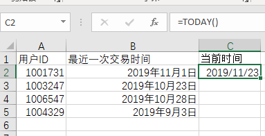

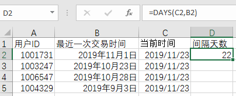

2. 间隔越短，R 得分越高：

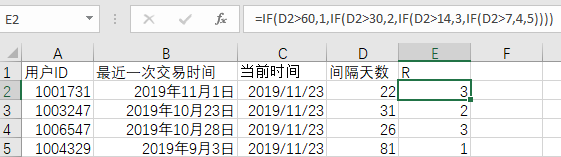

3. 购买次数越多，F 得分越高；消费总额越大，M 得分越高：

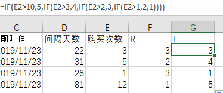

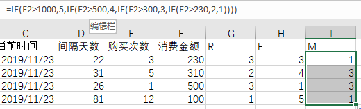

4. 将各维度与业务基准比较，可进一步形成高/低标签或组合分群：

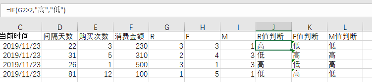

# 二、代码实现

## 1、导入所需的库

```python
import numpy as np
import pandas as pd
```

## 2、导入数据

配套文件：[RFM 小型示例数据 sales.xlsx](dataset/sales.xlsx)。该工作簿包含 9 条订单记录和 `USERID`、`ORDERDATE`、`ORDERID`、`AMOUNTINFO` 四个字段，与下面的代码直接匹配。

```python
df_raw = pd.read_excel('./dataset/sales.xlsx')

required_columns = {'USERID', 'ORDERDATE', 'AMOUNTINFO'}
missing_columns = required_columns - set(df_raw.columns)
if missing_columns:
    raise ValueError(f'缺少必要字段: {sorted(missing_columns)}')
```

## 3、缺失值处理

```python
sales_data = df_raw.copy()
sales_data['ORDERDATE'] = pd.to_datetime(sales_data['ORDERDATE'], errors='coerce')
sales_data['AMOUNTINFO'] = pd.to_numeric(sales_data['AMOUNTINFO'], errors='coerce')
sales_data = sales_data.dropna(subset=['USERID', 'ORDERDATE', 'AMOUNTINFO'])

# 金额过滤阈值必须来自业务规则；这里只沿用案例中的 > 1
sales_data = sales_data.loc[sales_data['AMOUNTINFO'] > 1].copy()
```

若退款以负数表示，应先明确是剔除、冲销到原订单，还是保留为净消费；不能无条件删除负数。还应限定观察窗口，并对重复记录、币种与时区做一致化处理。

## 4、数据转换 (按用户ID去重归总)

```python
# 为保证示例可运行，默认取数据中最后一个订单日的次日作为分析基准日。
# 正式报表应显式传入并记录固定的 analysis_date，才能跨批次复现和比较。
analysis_date = sales_data['ORDERDATE'].max().normalize() + pd.Timedelta(days=1)

customer = sales_data.groupby('USERID', as_index=True).agg(
    last_order=('ORDERDATE', 'max'),
    frequency=('ORDERDATE', 'size'),
    monetary=('AMOUNTINFO', 'sum'),
)
customer['recency'] = (analysis_date - customer['last_order']).dt.days
```

> 如果一张订单包含多条商品明细，`size` 统计的是明细行数，会高估 F。数据中有 `ORDERID` 时应改用 `frequency=('ORDERID', 'nunique')`。

## 5、分别计算 R, F, M 得分

```python
def percentile_score(series: pd.Series, *, higher_is_better: bool) -> pd.Series:
    """按百分位排名映射到 1～5；并列值使用相同的平均排名。"""
    percentile = series.rank(method='average', pct=True)
    score = np.ceil(percentile * 5).clip(1, 5).astype('int8')
    return score if higher_is_better else (6 - score).astype('int8')

r_score = percentile_score(customer['recency'], higher_is_better=False)
f_score = percentile_score(customer['frequency'], higher_is_better=True)
m_score = percentile_score(customer['monetary'], higher_is_better=True)
```

`pd.cut(x, 5)` 是把数值范围切成五个**等宽区间**，不是五分位。`pd.qcut()` 才按样本数量分位，但大量并列值可能产生重复边界；这里采用百分位排名，使并列值获得相同分数。

## 6、R, F, M 数据合并

```python
rfm_pd = customer[['recency', 'frequency', 'monetary']].assign(
    r_score=r_score,
    f_score=f_score,
    m_score=m_score,
)
```

这种写法依靠 pandas 按 `USERID` 索引对齐，无需先转成 NumPy 数组，因此不会因为顺序变化把某个用户的 R、F、M 分数错配。可用以下断言检查结果：

```python
assert rfm_pd.index.is_unique
assert rfm_pd[['r_score', 'f_score', 'm_score']].notna().all().all()
assert rfm_pd[['r_score', 'f_score', 'm_score']].isin(range(1, 6)).all().all()
```

## 7、策略1：加权得分定义用户价值

```python
# 策略1：加权得分 定义用户价值
rfm_pd['rfm_wscore'] = rfm_pd['r_score']*0.2 + rfm_pd['f_score']*0.2 + rfm_pd['m_score']*0.6
```

权重与阈值应由业务目标、历史响应率或实验结果确定，下面的 20% / 20% / 60% 只是演示，不是通用标准。

- **高价值客户**：`rfm_wscore` 高于某个阈值，例如 4.0 到 5.0。这类客户在最近购买、频率高、消费金额大，属于最重要的客户群体。
- **中等价值客户**：`rfm_wscore` 介于中间范围，例如 2.0 到 4.0。这类客户表现较好，但在某些维度（如频率或金额）可能稍有不足。
- **低价值客户**：`rfm_wscore` 较低，例如低于 2.0。这类客户可能消费金额不高，购买频率低或最近很少购买，通常不是业务的主要目标群体。

## 8、策略2：RFM组合 直接输出三维度值

```python
# 策略2：RFM组合 直接输出三维度值
rfm_pd['rfm_comb'] = (
    rfm_pd[['r_score', 'f_score', 'm_score']]
    .astype('string')
    .agg(''.join, axis=1)
)
```

后期划分客户类别

通过 `RFM` 组合得分，将客户划分为不同的群体。具体群体的划分取决于 `RFM` 组合得分的含义：

**高价值客户**：

- R 得分高：客户最近购买。
- F 得分高：客户购买频率高。
- M 得分高：客户消费金额高。
- 例如，RFM 组合是 "555"、"554"、"545" 等。

**中价值客户**：

- R 得分中等：客户购买时间适中，不是最近但也不是很久之前。
- F 得分中等：客户购买频率一般。
- M 得分中等或较高：客户消费金额中等。
- 例如，RFM 组合是 "343"、"442"、"453" 等。

**低价值客户**：

- R 得分低：客户很久没有购买。
- F 得分低：客户购买频率低。
- M 得分低或中等：客户消费金额较低。
- 例如，RFM 组合是 "111"、"221"、"132" 等。

## 9、导出数据

```python
# 导出数据
rfm_pd.to_csv('rfm_result.csv', index_label='USERID', encoding='utf-8-sig')
```

最终完整代码：

```python
import numpy as np
import pandas as pd

df_raw = pd.read_excel('./dataset/sales.xlsx')
required_columns = {'USERID', 'ORDERDATE', 'AMOUNTINFO'}
missing_columns = required_columns - set(df_raw.columns)
if missing_columns:
    raise ValueError(f'缺少必要字段: {sorted(missing_columns)}')

sales_data = df_raw.copy()
sales_data['ORDERDATE'] = pd.to_datetime(sales_data['ORDERDATE'], errors='coerce')
sales_data['AMOUNTINFO'] = pd.to_numeric(sales_data['AMOUNTINFO'], errors='coerce')
sales_data = sales_data.dropna(subset=['USERID', 'ORDERDATE', 'AMOUNTINFO'])
sales_data = sales_data.loc[sales_data['AMOUNTINFO'] > 1].copy()
if sales_data.empty:
    raise ValueError('清洗后没有可用于 RFM 的订单数据')

analysis_date = sales_data['ORDERDATE'].max().normalize() + pd.Timedelta(days=1)
customer = sales_data.groupby('USERID', as_index=True).agg(
    last_order=('ORDERDATE', 'max'),
    frequency=('ORDERDATE', 'size'),  # 有 ORDERID 时优先改为 nunique
    monetary=('AMOUNTINFO', 'sum'),
)
customer['recency'] = (analysis_date - customer['last_order']).dt.days

def percentile_score(series: pd.Series, *, higher_is_better: bool) -> pd.Series:
    """按百分位排名映射到 1～5；并列值使用相同的平均排名。"""
    percentile = series.rank(method='average', pct=True)
    score = np.ceil(percentile * 5).clip(1, 5).astype('int8')
    return score if higher_is_better else (6 - score).astype('int8')

rfm_pd = customer[['recency', 'frequency', 'monetary']].assign(
    r_score=percentile_score(customer['recency'], higher_is_better=False),
    f_score=percentile_score(customer['frequency'], higher_is_better=True),
    m_score=percentile_score(customer['monetary'], higher_is_better=True),
)

rfm_pd['rfm_wscore'] = (
    rfm_pd['r_score'] * 0.2
    + rfm_pd['f_score'] * 0.2
    + rfm_pd['m_score'] * 0.6
)
rfm_pd['rfm_comb'] = (
    rfm_pd[['r_score', 'f_score', 'm_score']]
    .astype('string')
    .agg(''.join, axis=1)
)

rfm_pd.to_csv('rfm_result.csv', index_label='USERID', encoding='utf-8-sig')
```

# 三、源课件多年度 RFM 案例

配套的 [2015—2018 多年度销售数据](dataset/sales-multiyear.xlsx) 包含 `2015`、`2016`、`2017`、`2018` 和 `会员等级` 五个工作表。前四张订单表使用 `会员ID`、`订单号`、`提交日期`、`订单金额` 四个字段，适合练习跨年度读取、合并、分组与对比。

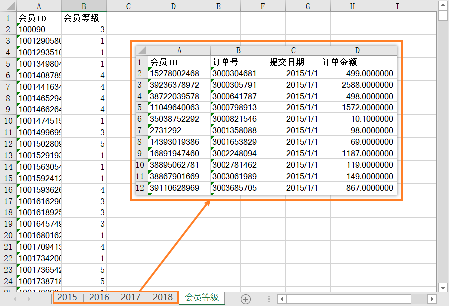

## 1、构造年度基准日与 Recency

源案例为每条订单增加 `year` 和当年年末基准日，再计算订单距当年年末的天数。这样能够在相同年度口径下比较 2015—2018 年的会员变化。

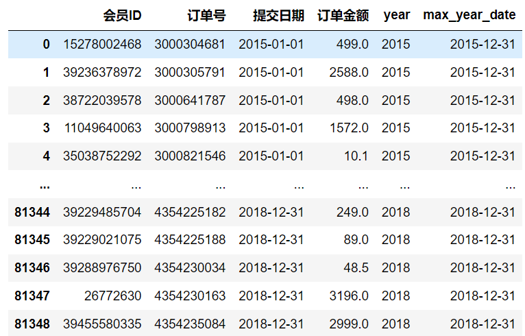

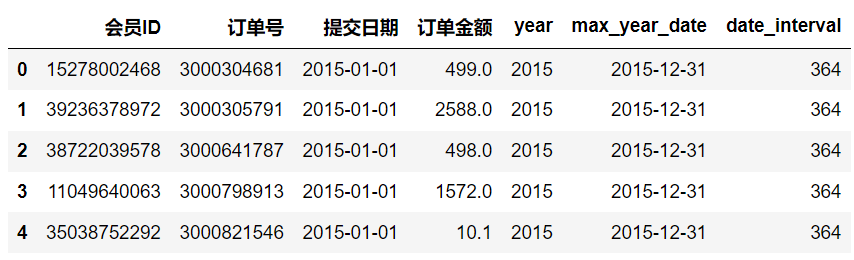

## 2、聚合 R、F、M 原始指标

按 `year` 和 `会员ID` 分组：Recency 取最小间隔天数，Frequency 统计独立订单数，Monetary 汇总订单金额。

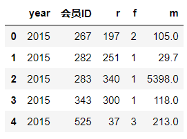

## 3、按业务阈值评分并组合分群

源案例采用三档业务阈值，因此最多形成 `3 × 3 × 3 = 27` 个组合。它与前文的百分位五档评分是两种不同策略：有稳定业务边界时可以使用 `pd.cut`；需要按当期样本相对位置评分时可使用百分位排名。

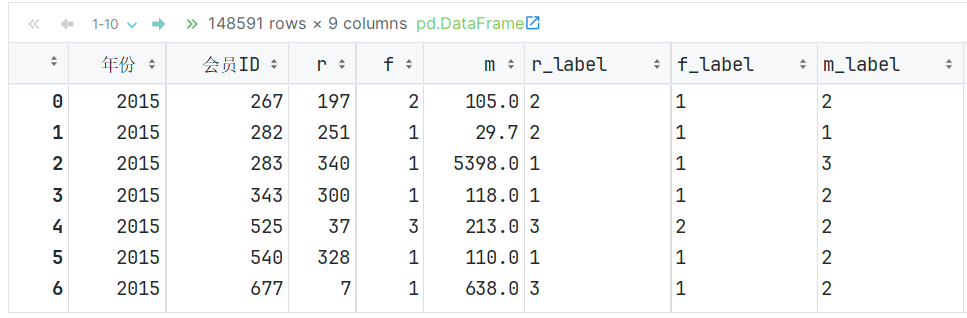

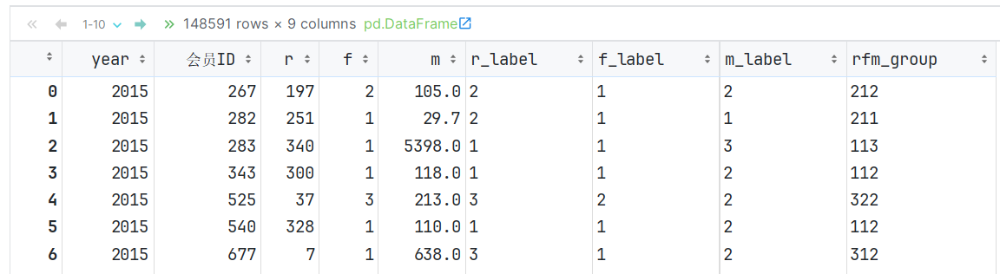

## 4、按年份观察分群人数

将 `rfm_group`、`year` 与会员数量汇总后，可以观察不同会员群体在各年度的规模变化。

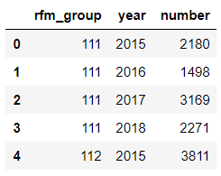

源课件使用 Pyecharts `Bar3D` 展示“分群 × 年份 × 会员数量”。静态截图如下；实际交互图可以旋转和缩放。

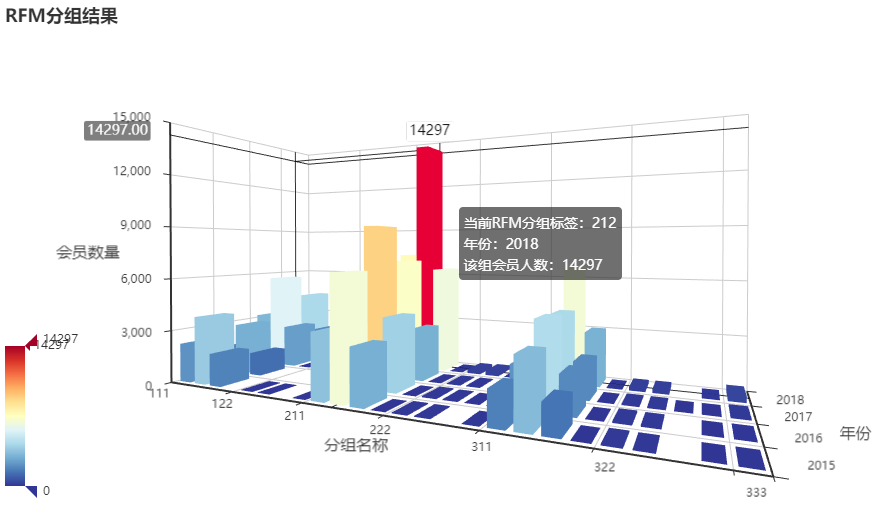

# 四、图形可视化

## 1、柱形图

```python
import matplotlib.pyplot as plt

# 根据加权得分划分客户群体
bins = [-np.inf, 2, 4, np.inf]  # 自定义分层阈值：<2、[2,4)、>=4
labels = ['Low', 'Medium', 'High']  # 分层标签
rfm_pd['Customer Segment'] = pd.cut(
    rfm_pd['rfm_wscore'], bins=bins, labels=labels, right=False
)

# 绘制柱状图
rfm_pd['Customer Segment'].value_counts().plot(kind='bar', color=['red', 'orange', 'green'])
plt.title('Customer Segments based on RFM Score')
plt.xlabel('Segment')
plt.ylabel('Number of Customers')
plt.show()
```

区间 `[-∞, 2)` 表示得分低于 `2`。

区间 `[2, 4)` 表示从 `2` 开始到 `4` 之前，`2` 包含在内，而 `4` 不包含在内。

区间 `[4, +∞)` 表示得分大于等于 `4`。

## 2、饼状图

```python
import matplotlib.pyplot as plt

# 根据加权得分划分客户群体
bins = [-np.inf, 2, 4, np.inf]  # 自定义分层阈值：<2、[2,4)、>=4
labels = ['Low', 'Medium', 'High']  # 分层标签
rfm_pd['Customer Segment'] = pd.cut(
    rfm_pd['rfm_wscore'], bins=bins, labels=labels, right=False
)

# 绘制饼状图
rfm_pd['Customer Segment'].value_counts().plot(kind='pie', 
                                               colors=['red', 'orange', 'green'],
                                               autopct='%1.1f%%',  # 显示百分比
                                               startangle=90,      # 旋转起始角度
                                               counterclock=False) # 顺时针方向
plt.title('Customer Segments based on RFM Score')
plt.ylabel('')  # 隐藏Y轴标签
plt.show()
```

---
[下一步：05.Pandas与Seaborn绘图扩展](05.Pandas与Seaborn绘图扩展.md) [返回总索引](关于Python数据分析.md)
