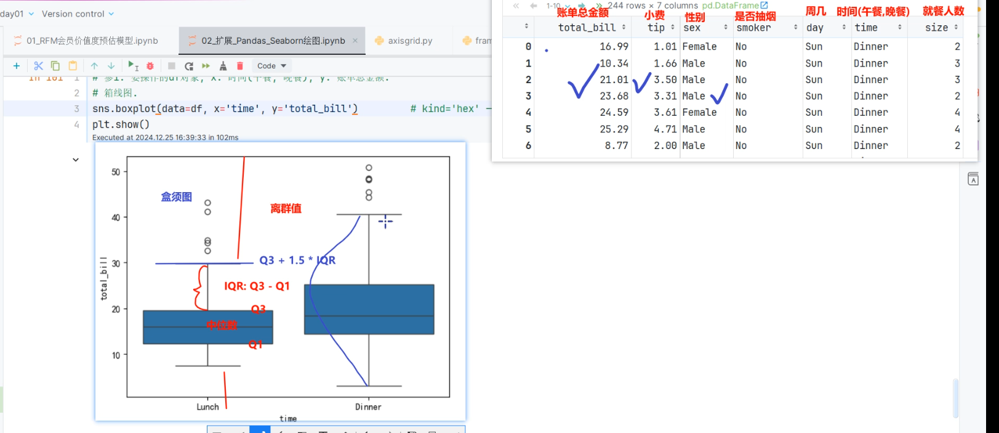

---
tags:
  - Python
  - Pandas
  - Seaborn
  - 数据可视化
date: 2026-08-02
updated: 2026-08-02
---

# Pandas 与 Seaborn 绘图扩展

> Pandas 的 `.plot()` 适合快速查看汇总结果；Seaborn 适合直接基于长表数据绘制带分组语义的统计图。两者底层都使用 Matplotlib，因此标题、坐标轴和保存图片仍可通过 Matplotlib 控制。

## 1、准备本地数据

配套文件：[tips.csv](dataset/tips.csv)。数据共有 244 条餐饮账单记录，字段如下：

| 字段 | 含义 |
|---|---|
| `total_bill` | 账单总金额 |
| `tip` | 小费金额 |
| `sex` | 顾客性别 |
| `smoker` | 是否吸烟 |
| `day` | 星期 |
| `time` | 午餐或晚餐 |
| `size` | 就餐人数 |

如本地尚未安装绘图库，可先执行：

```bash
python -m pip install pandas matplotlib seaborn
```

```python
import matplotlib.pyplot as plt
import pandas as pd
import seaborn as sns

tips = pd.read_csv('./dataset/tips.csv')
sns.set_theme(style='whitegrid')
```

使用本地 CSV 可以避免 `sns.load_dataset('tips')` 对网络和远程数据仓库的依赖。

## 2、Pandas 快速绘图

先用 `value_counts()` 汇总各天的账单记录数，再调用 Pandas 绘图接口：

```python
day_order = ['Thur', 'Fri', 'Sat', 'Sun']
day_counts = tips['day'].value_counts().reindex(day_order).dropna()

ax = day_counts.plot.bar(
    figsize=(8, 5),
    color=['#4C78A8', '#72B7B2', '#F58518', '#E45756'],
)
ax.set(title='各星期账单记录数', xlabel='星期', ylabel='记录数')
plt.tight_layout()
plt.show()
```

`.plot.bar()`、`.plot.line()`、`.plot.area()` 等方法适合已经聚合好的 Series 或 DataFrame；需要按多个变量分组、展示分布或统计关系时，Seaborn 通常更简洁。

## 3、直方图：查看账单分布

```python
fig, ax = plt.subplots(figsize=(9, 5))
sns.histplot(
    data=tips,
    x='total_bill',
    hue='sex',
    bins=20,
    element='step',
    common_norm=False,
    ax=ax,
)
ax.set(title='不同性别的账单金额分布', xlabel='账单总金额', ylabel='记录数')
plt.tight_layout()
plt.show()
```

`hue` 用于按类别着色；比较不同组的分布时，明确 `common_norm=False` 可以避免把各组共同归一化造成误读。

## 4、散点图与回归趋势

### 4.1 分组散点图

```python
fig, ax = plt.subplots(figsize=(9, 5))
sns.scatterplot(
    data=tips,
    x='total_bill',
    y='tip',
    hue='sex',
    style='time',
    ax=ax,
)
ax.set(title='账单金额与小费的关系', xlabel='账单总金额', ylabel='小费金额')
plt.tight_layout()
plt.show()
```

### 4.2 线性趋势图

```python
fig, ax = plt.subplots(figsize=(9, 5))
sns.regplot(
    data=tips,
    x='total_bill',
    y='tip',
    scatter_kws={'alpha': 0.6},
    ax=ax,
)
ax.set(title='账单金额与小费的线性趋势')
plt.tight_layout()
plt.show()
```

回归线用于描述样本中的整体趋势，不应直接解释为因果关系。还应检查异常值、非线性关系与分组差异。

### 4.3 联合分布图

```python
grid = sns.jointplot(
    data=tips,
    x='total_bill',
    y='tip',
    kind='hex',
    height=7,
)
grid.figure.suptitle('账单金额与小费的联合分布', y=1.02)
plt.show()
```

蜂巢图适合点较多、散点容易重叠的场景；颜色深浅表示局部样本密度。

## 5、箱线图：识别分布与离群值



箱体下边缘是第一四分位数 Q1，上边缘是第三四分位数 Q3，箱内横线是中位数；四分位距 `IQR = Q3 - Q1`。常见规则把低于 `Q1 - 1.5 × IQR` 或高于 `Q3 + 1.5 × IQR` 的点标记为离群值，但是否剔除仍取决于业务语义。

```python
fig, ax = plt.subplots(figsize=(8, 5))
sns.boxplot(data=tips, x='time', y='total_bill', ax=ax)
ax.set(title='午餐与晚餐账单金额分布', xlabel='用餐时段', ylabel='账单总金额')
plt.tight_layout()
plt.show()
```

## 6、小提琴图：同时观察密度与分位信息

```python
fig, ax = plt.subplots(figsize=(9, 5))
sns.violinplot(
    data=tips,
    x='time',
    y='total_bill',
    hue='sex',
    split=True,
    inner='quart',
    ax=ax,
)
ax.set(title='不同性别在午餐与晚餐中的账单分布')
plt.tight_layout()
plt.show()
```

`split=True` 适用于 `hue` 只有两个类别的情况。小提琴宽度表示概率密度，适合观察偏态、多峰等箱线图不容易展示的分布特征。

## 7、选择图形的简单规则

| 分析目标 | 推荐图形 |
|---|---|
| 查看单变量分布 | `histplot`、箱线图、小提琴图 |
| 比较分类计数 | Pandas 柱状图、`countplot` |
| 查看两个数值变量关系 | `scatterplot`、`regplot` |
| 点重叠严重的联合分布 | `jointplot(kind='hex')` |
| 同时比较类别、分布和分组 | 箱线图、小提琴图配合 `hue` |

---
[上一步：04.RFM案例](04.RFM案例.md) [返回总索引](关于Python数据分析.md)
