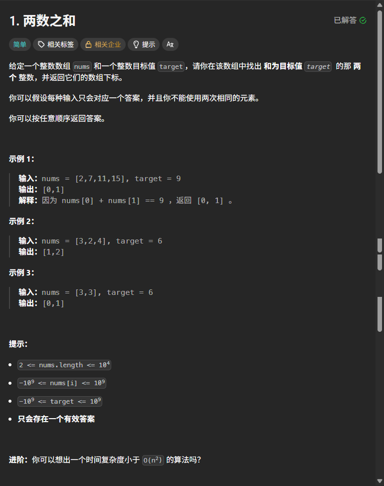
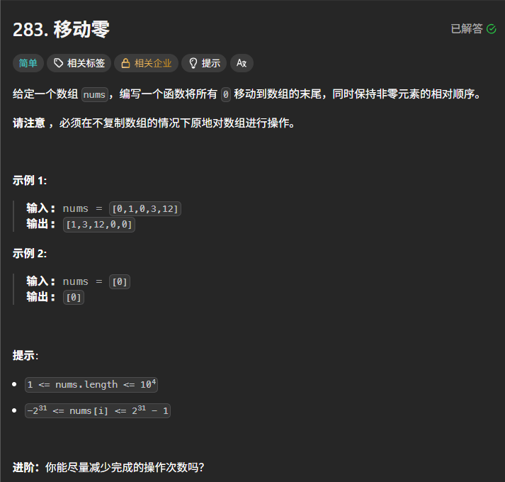
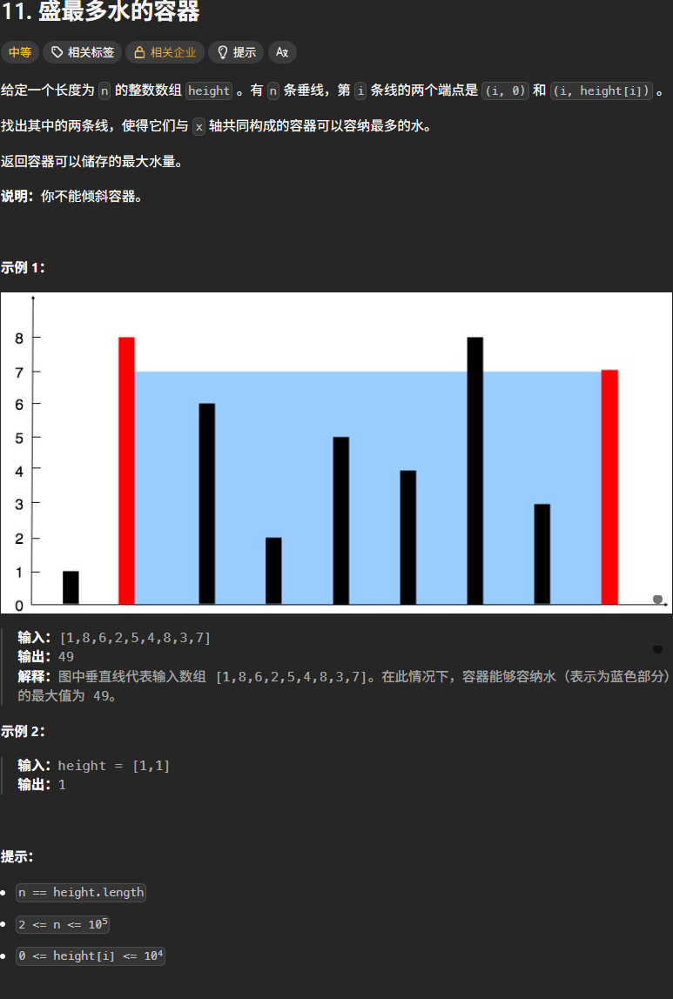

# LeetCode Hot 100 题

## 00 - [1.两数之和](https://leetcode.cn/problems/two-sum/description/?envType=study-plan-v2&envId=top-100-liked)

### 题目如下：



### 代码如下：

```python
class Solution:
    def twoSum(self, nums: List[int], target: int) -> List[int]:
        idx = {}
        for j, x in enumerate(nums):
            if target - x in idx:
                return [idx[target - x], j]
            idx[x] = j
```

### 本题解析：


## 01 - [49. 字母异位词分组](https://leetcode.cn/problems/group-anagrams/)

### 题目如下：


### 代码如下：

```python
class Solution:
    def groupAnagrams(self, strs: List[str]) -> List[List[str]]:
        d = {}              # 创建一个空的哈希表，来存储排序后的字符串key和排序前的字符串
        for s in strs:
            # sorted是python内置函数，接受字符串返回字符列表
            # ''.join(列表)的功能是将字符列表拼成字符串
            sorted_s = ''.join(sorted(s))
            # 如果首次碰到sorted_s,添加到d中
            if sorted_s not in d:
                d[sorted_s] = []
            d[sorted_s].append(s)
        return list(d.values())
```


### 本题解析：


## 02 - [128. 最长连续序列](https://leetcode.cn/problems/longest-consecutive-sequence/)

### 题目如下：


### 代码如下：

```python
class Solution:
    def longestConsecutive(self, nums: List[int]) -> int:
        set1 = set(nums)
        max_len = 0
        for i in set1:
            if i - 1 in set1:
                continue
            y = i + 1
            while y in set1:
                y += 1
            max_len = max(max_len, y - i)
        return max_len
```


### 本题解析：


## 03 - [283. 移动零](https://leetcode.cn/problems/move-zeroes/)

### 题目如下：



### 代码如下：

```python
class Solution:
    def moveZeroes(self, nums: List[int]) -> None:
        """
        Do not return anything, modify nums in-place instead.
        """
        start = 0
        for i in range(len(nums)):
            if nums[i] != 0:
                nums[i], nums[start] = nums[start], nums[i]
                start += 1
```

### 本地解析：

1. 使用使用双指针来解决问题。用 i 和 start 一右一左，将 0 控制在两个指针中间。
2. nums[i], nums[start] = nums[start], nums[i] 这一行是python语法中的语法糖。使用了python中的**元组解包交换**。可以查看 [官网](https://docs.python.org/3/tutorial/datastructures.html#tuples-and-sequences) 或者使用AI 来了解细节。这里不做过多介绍。

## 04 - [11. 盛最多水的容器](https://leetcode.cn/problems/container-with-most-water/)

### 题目如下：



### 代码如下：

```python
```

### 本题解析：
